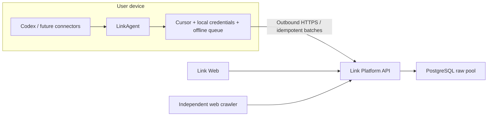

<div align="center">

# Link

**Bring the work history scattered across local AI tools back into a data foundation you control.**

Link is a local-first data intake platform. With explicit user permission, LinkAgent reads local sources such as Codex, preserves their raw context and provenance, and writes recoverable incremental batches into PostgreSQL.

[](https://github.com/Jo-Tsu/link/actions/workflows/ci.yml)
[](https://github.com/Jo-Tsu/link/releases)
[](LICENSE)
[](https://github.com/Jo-Tsu/link/releases)

[Download LinkAgent](https://github.com/Jo-Tsu/link/releases/tag/v0.2.1-developer-preview) · [Quick start](#quick-start) · [Product spec](docs/data-intake-prd.md) · [Changelog](CHANGELOG.md) · [简体中文](README.md)

</div>


> The screenshot uses synthetic demo data and contains no real user content.

## Preserve facts before deciding how to interpret them

AI conversations, CLI commands, tool calls, and project context are becoming some of the most valuable and most fragmented parts of personal work. They are often trapped in local directories, one-off sessions, or separate products. Summarizing them too early removes the evidence that made them useful.

Link does not start as another note-taking app. It starts with a dependable data foundation:

- **Connect locally**: LinkAgent reads only explicitly authorized sources on the user's device.
- **Keep the raw facts**: preserve inputs, outputs, CLI, tools, and skill references before transformation.
- **Trace every record**: navigate back to its connector, source container, original session, and timestamp.
- **Resume safely**: cursors, idempotent batches, and a durable offline queue make synchronization retryable.

## What makes Link different

| Principle | How Link applies it |
| --- | --- |
| Local-first instead of pretending every source lives in the cloud | LinkAgent owns local authorization and extraction and only makes outbound connections |
| Raw-first instead of immediately hiding data behind an AI summary | PostgreSQL `sensory_records` preserves facts and provenance metadata |
| One connector model instead of one concept per product | Codex, Feishu, local files, and future sources share containers, records, cursors, and sync results |
| Observable instead of a sync button with no explanation | The platform exposes connectors, source containers, raw records, timestamps, and sync state |

## What works today

- Read the complete local Codex history across projects in read-only mode.
- Extract user input, Codex output, CLI commands, tool calls, and skill references.
- Aggregate daily Codex token usage into a stable `usage` raw record.
- Pair LinkAgent devices, send heartbeats, sync incrementally, and retry from an offline queue.
- Browse data as connector -> source container -> raw record.
- Capture web sources through an independent crawler service.
- Run Link, PostgreSQL, and the crawler locally with Docker Compose.

The current release is `0.2.1 Developer Preview`. Feishu, local files, scheduled sync, multi-tenancy, governance, memory, and retrieval are not shipped yet. The roadmap below is intentionally not presented as finished functionality.

## How it works



The platform never mounts the user's `~/.codex` directory and does not require an inbound port on the user's machine. LinkAgent credentials stay in the local Keychain, while raw records are stored in a PostgreSQL instance controlled by the user.

## Quick start

### 1. Run the Link platform

Docker Desktop is required:

```bash
git clone https://github.com/Jo-Tsu/link.git
cd link
cp .env.example .env
docker compose up -d --build
```

Open [http://127.0.0.1:41737](http://127.0.0.1:41737). Ports bind to `127.0.0.1` by default.

### 2. Install LinkAgent

Download the latest Apple Silicon DMG from [GitHub Releases](https://github.com/Jo-Tsu/link/releases). The current preview uses an ad-hoc signature and has not been notarized by Apple.

### 3. Pair and sync

1. In Link, open Settings -> Agent -> LinkAgent and create a one-time pairing code.
2. Open LinkAgent and enter the platform URL and pairing code.
3. Authorize the Codex connector and run the first sync.
4. Return to Data and open the Codex card to browse source containers and raw records.

See [local stable operation](docs/local-stable-run.md) for the complete workflow.

## LinkAgent as a desktop companion

LinkAgent is more than a background script. It provides three levels of interaction:

- **Menu bar presence** for online, syncing, and attention-required states.
- **Quick panel** for recent syncs, today's token usage, offline queue, and one-click Codex sync.
- **Management window** for pairing, connector authorization, sync history, and local settings.

Permissions and credentials remain local. Failed batches stay in a durable queue and can continue after connectivity returns.

## Privacy and security boundaries

- Every connector requires explicit user authorization and an observable read scope.
- LinkAgent only makes outbound connections and opens no local service port.
- The platform receives normalized raw records, not Codex login credentials or API keys.
- Logs, screenshots, and issues must be scrubbed of tokens, private paths, and raw conversations.
- The current preview has no public user authentication or tenant isolation and **must not be exposed directly to the internet**.

For cloud testing, use the [private Alibaba Cloud deployment](docs/aliyun-private-deployment.md) through an SSH tunnel while keeping Link, PostgreSQL, and crawler ports closed.

## Roadmap

| Stage | Focus | Status |
| --- | --- | --- |
| `0.2.x` | Codex raw-data loop, LinkAgent, provenance browser, and web capture | In progress |
| Next | Configurable scheduled sync, usage scheduler, connector SDK, and agent upgrades | Planned |
| More connectors | Feishu, local files, and additional local tools | Planned |
| Data value layer | Governance, AI extraction, personal memory, and retrieval | After the intake foundation stabilizes |
| SaaS | Email login, tenant isolation, mobile, and production cloud deployment | Not in active development |

## Repository layout

| Path | Contents |
| --- | --- |
| `src/` | Link Web, platform API, and PostgreSQL access |
| `link-agent-client/` | Tauri + Rust + React LinkAgent client |
| `crawler_backend/` | Independent web crawler service |
| `docs/` | Product, technical, deployment, and operations documentation |
| `deploy/aliyun/` | Private ECS test deployment scripts |

Platform checks:

```bash
npm ci
npm run lint
npm run build
```

LinkAgent checks:

```bash
cd link-agent-client
npm ci
npm run build
cd src-tauri
cargo test
```

## Contributing

- Found a bug? Open a [bug report](https://github.com/Jo-Tsu/link/issues/new?template=bug_report.yml).
- Have a connector or product proposal? Open a [feature request](https://github.com/Jo-Tsu/link/issues/new?template=feature_request.yml).
- Want to discuss workflows or product direction? Join [GitHub Discussions](https://github.com/Jo-Tsu/link/discussions).
- Before contributing, read [CONTRIBUTING.md](CONTRIBUTING.md) and [CODE_OF_CONDUCT.md](CODE_OF_CONDUCT.md).
- Report vulnerabilities privately as described in [SECURITY.md](SECURITY.md); never post sensitive logs publicly.

A CLA is not enabled yet, so substantial external code contributions cannot be merged until that process exists. Reproducible issues, product discussion, design feedback, and documentation improvements are welcome today.

## License

Link is source available under the [Business Source License 1.1](LICENSE). Personal use, development, testing, and internal business use are allowed, but offering Link's primary functionality as a hosted or managed third-party service requires commercial permission. Version `0.2.1` is scheduled to change to Apache-2.0 on `2030-07-19`.

BSL is not an OSI-approved open-source license. We use the precise term `source available` instead of hiding the usage boundary behind ambiguous wording.
