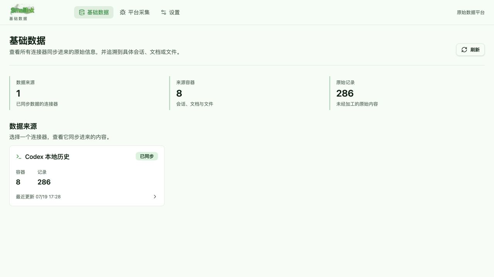
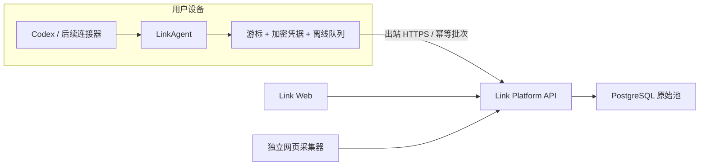

<div align="center">

# Link

**把散落在本机 AI 工具里的工作历史，接回到你自己的数据底座。**

Link 是一个本地优先的数据接入平台。LinkAgent 在用户明确授权后读取 Codex 等本地来源，保留原始上下文、工具调用与来源关系，并以可追溯的增量批次写入 PostgreSQL。

[](https://github.com/Jo-Tsu/link/actions/workflows/ci.yml)
[](https://github.com/Jo-Tsu/link/releases)
[](LICENSE)
[](https://github.com/Jo-Tsu/link/releases)

[下载 LinkAgent](https://github.com/Jo-Tsu/link/releases/tag/v0.2.1-developer-preview) · [三分钟启动](#三分钟启动) · [产品文档](docs/data-intake-prd.md) · [版本记录](CHANGELOG.md) · [English](README.en.md)

</div>



> 截图使用合成演示数据，不包含真实用户内容。

## 先保存事实，再决定如何理解它

AI 对话、CLI 命令、工具调用和项目上下文正在成为个人工作中最有价值、也最容易散落的一类数据。它们通常被锁在不同产品、本机目录或一次性会话中；直接总结又会丢掉来源和证据。

Link 不从“再做一个笔记应用”开始。它先建立一层稳定的数据底座：

- **连接本机**：LinkAgent 在设备侧读取获得授权的数据，平台不反向扫描用户电脑。
- **原始保真**：先保存输入、输出、CLI、工具和技能线索，再进行后续加工。
- **完整追溯**：每条记录都能回到连接器、来源容器、原始会话和发生时间。
- **增量可恢复**：游标、幂等批次和离线队列让同步可以重试，而不是每次重新导入。

## Link 的不同之处

| 设计原则 | Link 如何实现 |
| --- | --- |
| 本地优先，而不是假装所有数据都在云端 | LinkAgent 负责本地授权、读取和清洗，只建立出站连接 |
| 原始数据优先，而不是先交给 AI 黑盒总结 | PostgreSQL `sensory_records` 保存未经加工的事实与来源元数据 |
| 一个连接器模型，而不是为每个产品发明一套概念 | Codex、飞书、本地文件和未来来源统一输出容器、记录、游标与同步结果 |
| 可观察，而不是“点击同步后不知道发生了什么” | 平台展示连接器、来源容器、原始记录、时间和同步状态 |

## 当前可以做什么

- 只读接入完整 Codex 本地历史，而不局限于某个项目。
- 提取用户输入、Codex 输出、CLI、工具调用和技能线索。
- 按本机自然日汇总 Codex Token 用量，并写入稳定的 `usage` 原始记录。
- 通过 LinkAgent 完成设备配对、心跳、增量同步和离线重试。
- 在 Web 端按“连接器 -> 来源容器 -> 原始记录”浏览和追溯数据。
- 使用独立网页采集器保存网页来源。
- 通过 Docker Compose 在本机稳定运行 Link、PostgreSQL 与 Crawler。

当前版本是 `0.2.1 Developer Preview`。飞书、本地文件、自动定时同步、多租户、数据治理、记忆和检索尚未交付；路线图不会伪装成现成功能。

## 工作原理



平台不挂载用户的 `~/.codex`，也不要求在用户设备上开放入站端口。LinkAgent 凭据保存在本机 Keychain，原始数据进入用户自己控制的 PostgreSQL。

## 三分钟启动

### 1. 启动 Link 平台

需要 Docker Desktop：

```bash
git clone https://github.com/Jo-Tsu/link.git
cd link
cp .env.example .env
docker compose up -d --build
```

打开 [http://127.0.0.1:41737](http://127.0.0.1:41737)。默认端口只绑定到 `127.0.0.1`。

### 2. 安装 LinkAgent

从 [GitHub Releases](https://github.com/Jo-Tsu/link/releases) 下载最新的 Apple Silicon DMG。当前预览包使用 ad-hoc 签名，尚未进行 Apple 公证。

### 3. 连接并同步

1. 在 Link 的“设置 -> 智能体 -> LinkAgent”中创建一次性配对码。
2. 打开 LinkAgent，输入平台地址与配对码。
3. 授权 Codex 连接器并执行首次同步。
4. 回到“基础数据”，从 Codex 卡片进入来源容器和原始记录。

详细步骤见 [本地稳定运行](docs/local-stable-run.md)。

## LinkAgent 桌面伴生体验

LinkAgent 不是要求用户长期盯着的后台脚本。它提供三层交互：

- **菜单栏入口**：快速感知在线、同步中和需要处理的状态。
- **快捷浮层**：查看最近同步、今日 Token、离线队列并一键同步 Codex。
- **完整管理窗口**：管理设备配对、连接器授权、同步记录和本机设置。

权限和凭据只保存在本机；同步失败的批次进入持久队列，恢复连接后可以继续上传。

## 隐私与安全边界

- 连接器必须由用户显式授权，并展示实际读取范围。
- LinkAgent 只建立出站连接，不开放本机服务端口。
- 平台只接收标准化原始记录，不接收 Codex 登录凭据或 API Key。
- 日志、截图和 Issue 在提交前必须去除令牌、私有路径和原始对话。
- 当前版本没有公网用户认证和多租户隔离，**不得直接暴露到公网**。

需要云端测试时，请使用 [阿里云私有部署方案](docs/aliyun-private-deployment.md)，通过 SSH 隧道访问，保持 Link、PostgreSQL 与 Crawler 端口关闭。

## 版本路线

| 阶段 | 重点 | 状态 |
| --- | --- | --- |
| `0.2.x` | Codex 原始数据闭环、LinkAgent、来源浏览、网页采集 | 进行中 |
| 下一阶段 | 可配置的自动同步、Usage 调度器、连接器 SDK 与版本升级 | 规划中 |
| 后续连接器 | 飞书、本地文件与更多本机工具 | 规划中 |
| 数据价值层 | 治理、AI 提炼、个人记忆与检索 | 数据底座稳定后启动 |
| SaaS | 邮箱登录、租户隔离、移动端与正式云部署 | 暂不开发 |

## 项目结构

| 路径 | 内容 |
| --- | --- |
| `src/` | Link Web、平台 API 与 PostgreSQL 数据访问 |
| `link-agent-client/` | Tauri + Rust + React 的 LinkAgent 客户端 |
| `crawler_backend/` | 独立网页采集服务 |
| `docs/` | PRD、技术设计、部署和运行文档 |
| `deploy/aliyun/` | 阿里云 ECS 私有测试部署脚本 |

平台开发验证：

```bash
npm ci
npm run lint
npm run build
```

LinkAgent 开发验证：

```bash
cd link-agent-client
npm ci
npm run build
cd src-tauri
cargo test
```

## 参与 Link

- 发现问题：使用 [Bug report](https://github.com/Jo-Tsu/link/issues/new?template=bug_report.yml)。
- 提议连接器或产品能力：使用 [Feature request](https://github.com/Jo-Tsu/link/issues/new?template=feature_request.yml)。
- 交流用法与产品方向：进入 [GitHub Discussions](https://github.com/Jo-Tsu/link/discussions)。
- 准备贡献代码：先阅读 [CONTRIBUTING.md](CONTRIBUTING.md) 和 [CODE_OF_CONDUCT.md](CODE_OF_CONDUCT.md)。
- 报告安全问题：按照 [SECURITY.md](SECURITY.md) 私下联系，不要公开敏感日志。

当前尚未启用 CLA，在 CLA 生效前不会合并包含实质代码的外部贡献，但欢迎 Issue、设计讨论、文档建议与可复现的问题报告。

## 许可证

Link 采用 [Business Source License 1.1](LICENSE) 进行源代码开放。允许个人、开发测试和内部业务使用，但未经商业授权不得把 Link 的主要功能作为第三方托管或管理服务提供。`0.2.1` 计划在 `2030-07-19` 转为 Apache-2.0。

BSL 不是 OSI 认可的开源许可证，因此本项目对外使用“源代码开放”或 `source available`，不会用模糊表述隐藏使用边界。
