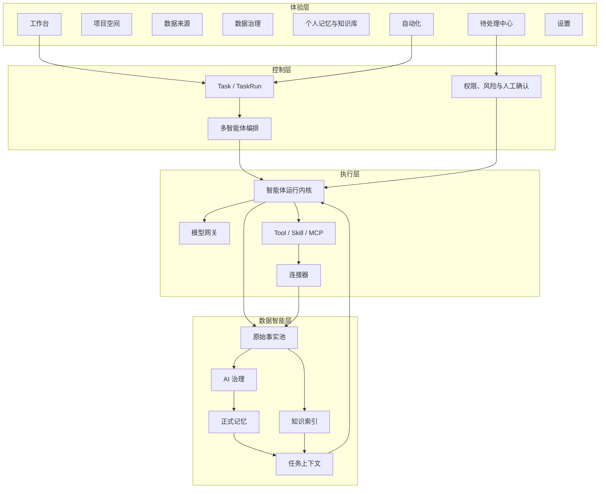

<div align="center">

# Smallink

**一个在个人电脑上运行、能连接数据、调用真实工具，并在用户控制下形成长期记忆的个人 AI 工作系统。**

Local-first personal AI work, data, knowledge, and memory system.

[](https://github.com/Jo-Tsu/link/actions/workflows/ci.yml)
[](LICENSE)
[](surfaces/gui)

[产品架构](docs/smallink-architecture-guide.md) · [产品需求](docs/link-product-prd.md) · [技术设计](docs/link-technical-design.md) · [当前记忆逻辑与结构](docs/current-memory-product-logic-and-structure.md) · [配置示例](docs/config.example.toml)

</div>

## Smallink 是什么

Smallink 不只是一个聊天客户端，也不只是一个知识库。它把三件事放进同一条本地优先的产品主线：

- **完成真实工作**：智能体使用模型、文件、终端、浏览器、Skill、MCP 和连接器交付代码、文档与其他产物。
- **保留原始事实**：会话、工具调用、文件和连接器数据先进入可追溯的原始数据层，AI 不能覆盖来源。
- **形成长期能力**：原始事实经 AI 治理与人工确认后形成记忆和知识，供未来任务按需检索。

产品当前首先服务单个用户和个人电脑。默认本地运行，关键操作需要确认；远程 Worker、多设备同步和协作是未来扩展方向，不以牺牲本地模式为前提。

## 产品架构



完整产品包含三条闭环：目标到产物的工作闭环、事实到记忆的数据学习闭环，以及定时或事件触发的自动化闭环。

## 当前能力

已经进入真实代码和数据链路的能力包括：

- Tauri + React 桌面客户端与浏览器开发界面；
- Python + FastAPI 本地核心服务；
- OpenAI、Anthropic、Gemini 等多模型 Provider；
- 多轮工具执行、流式事件和高风险操作人工审批；
- 文件、Shell、Git、网页、浏览器、PDF、Skill 与 MCP 能力；
- 会话、任务运行、产物、Inbox、自动化和基础子智能体；
- Slack、GitHub、Gmail、Google Calendar、HubSpot 等连接器基础；
- 本地状态、工作区信任、密钥和权限管理。

正在建设的正式主链包括项目空间、通用数据治理、带来源与版本的正式记忆、知识索引，以及向 Postgres + pgvector 的统一数据迁移。正式页面只展示真实能力，不使用 Mock 数据伪装完成状态。

## 技术架构

```text
Smallink Desktop (Tauri + React)
        |
        | HTTP + WebSocket / 每次启动独立令牌
        v
Smallink Core (Python + FastAPI)
        |
        +-- Agent Runtime / TaskRun / AgentRun
        +-- Model Providers / Tools / Skills / MCP
        +-- Permissions / Approvals / Inbox
        +-- Connectors / Sensory Records
        +-- Automations / Sessions / Artifacts
        +-- Memory / Knowledge（持续建设）
        |
        v
Postgres + pgvector（目标业务事实源）
```

迁移期间，部分运行历史和偏好仍使用 SQLite、JSONL 或 JSON。旧 `link` Python 导入、命令、Header、WebSocket 子协议和本机状态目录仅作为非破坏性兼容标识保留；所有新实现统一进入 `smallink` 包。

## 本地开发

需要 Python 3.10+、Node.js；运行桌面壳还需要 Rust 与 Cargo。

```bash
python3 -m venv .venv
.venv/bin/python -m pip install --upgrade pip
.venv/bin/python -m pip install -e ".[messaging,dev]"
```

启动本地核心服务：

```bash
.venv/bin/smallink-server --cwd /path/to/workspace --port 42871
```

启动浏览器开发界面：

```bash
cd surfaces/gui
npm install
npm run dev
```

启动桌面应用：

```bash
cd surfaces/gui
npm run tauri dev
```

常用命令：

- `smallink`：终端交互界面；
- `smallink-server`：本地 API 与 WebSocket 服务；
- `smallink-connectors`：连接器管理工具。

## 项目结构

| 路径 | 职责 |
| --- | --- |
| `smallink/` | 后端、智能体、任务、工具、连接器与数据能力的正式实现 |
| `surfaces/gui/` | Web 开发界面与 Tauri 桌面客户端 |
| `stt/` | 可复用的本地语音输入模块 |
| `tests/` | 后端测试与产品行为回归 |
| `docs/` | 产品事实源、技术设计与 UI 规范 |
| `packaging/` | macOS / Windows 构建与发布脚本 |
| `link/` | 只读兼容转发层，不承载新业务实现 |

## 隐私与安全

- 默认本地运行，不主动联系占位或继承的云端服务；
- 连接器必须由用户授权，密钥不进入仓库；
- 高风险工具调用进入权限检查与人工确认；
- 原始事实不可被 AI 结论覆盖；
- 智能体不能绕过候选与人工确认直接写入正式记忆。

## License

Smallink 第一方代码使用 [Business Source License 1.1](LICENSE)。继承代码与第三方许可证见 [THIRD_PARTY_NOTICES.md](THIRD_PARTY_NOTICES.md)。
