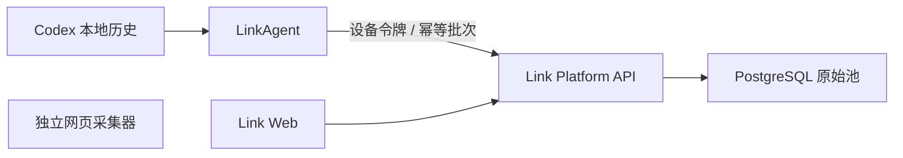

# Link

Link 是一个本地优先的原始数据接入平台。它通过 LinkAgent 在用户电脑上读取获得授权的数据，以增量批次写入 PostgreSQL 原始池，并在 Web 端按“连接器 → 来源容器 → 原始记录”完成浏览与追溯。

当前版本是 `0.2.0 Developer Preview`，目标是验证数据接入闭环，不包含多租户、邮箱登录、数据治理、记忆、知识库和检索。不要把当前版本直接部署到公网。

## 当前能力

- Codex 本地历史只读接入
- 用户输入、Codex 输出、CLI、工具和技能线索原始入池
- LinkAgent macOS 客户端配对、心跳、增量同步和离线队列
- 连接器、来源容器和原始记录浏览
- 独立网页采集器
- Docker Compose 本地运行

## 架构



LinkAgent 只建立出站连接，不要求平台访问用户电脑，也不开放本机入站端口。平台容器不直接挂载用户的 `~/.codex`。

## 本地启动

需要 Docker Desktop。默认端口只绑定到 `127.0.0.1`。

```bash
cp .env.example .env
docker compose up -d --build
```

打开 `http://127.0.0.1:41737/`。停止服务：

```bash
docker compose down
```

详细说明见 [本地运行文档](docs/local-stable-run.md)。

## LinkAgent 开发

LinkAgent 当前面向 macOS：

```bash
cd link-agent-client
npm ci
npm run build
cd src-tauri
cargo test
```

客户端产品边界见 [LinkAgent 客户端 PRD](docs/link-agent-client-prd.md)，同步协议见 [LinkAgent 技术设计](docs/link-agent-technical-design.md)。安装包不提交到源码仓库，正式构建应通过 Release 附件发布。

## 开发验证

```bash
npm ci
npm run lint
npm run build
```

## 项目状态

- 当前是单用户、单默认空间测试版。
- SaaS 多租户只在需求和技术设计中预留，暂不开发。
- 移动端只纳入长期设备和连接器模型，暂不开发。
- 当前管理接口没有面向公网的用户认证，只允许本机测试。

## 参与项目

请先阅读 [CONTRIBUTING.md](CONTRIBUTING.md) 和 [SECURITY.md](SECURITY.md)。当前尚未启用 CLA，在 CLA 生效前不会合并包含实质代码的外部贡献。

## 许可证

当前代码采用 [Business Source License 1.1](LICENSE) 进行源代码开放。允许个人、开发测试和内部业务使用，但未经商业授权不得将 Link 的主要功能作为第三方托管或管理服务提供。`0.2.0` 计划在 `2030-07-19` 转为 Apache-2.0。

BSL 不是 OSI 认可的开源许可证，因此本项目对外使用“源代码开放”或 `source available` 表述。
