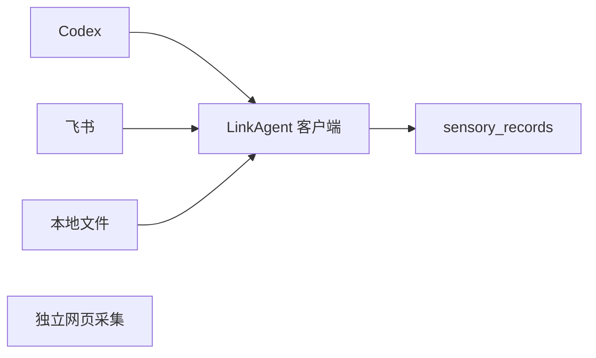

# link 数据接入产品需求文档

更新日期：2026-07-19

link 当前测试版是一个接入优先的单用户原始数据平台。一级菜单为基础数据、平台采集和设置。当前目标是先跑通授权、同步、原始入池和浏览链路，不开发注册、登录和多租户功能。

所有外部产品通过 LinkAgent 的连接器授权和同步，进入云端 `sensory_records` 原始池。云端不保存 Codex 登录态、飞书 Token 或本机文件权限。

第一版 LinkAgent 为可下载安装的 macOS 菜单栏客户端，`link-agent` CLI 和 Docker 仅作为开发诊断与可选封装。Agent 仅通过出站 HTTPS 主动连接平台，拉取白名单指令并上传增量数据；平台不反向访问用户电脑，也不需要开放本机端口。

## 一级菜单

- 基础数据：按“连接器 → 来源容器 → 原始记录”查看全部同步后的真实原始信息。首页不混合平铺不同来源；选择一个连接器后，分页查看其会话、文档或文件容器，点击后进入通用记录详情。
- 基础数据首页只显示来源数、容器数、记录数、连接状态与最近更新等用户字段；数据库表、文件 glob 和同步协议不在首页显示。容器使用紧凑行列表，原始记录默认显示摘要并支持展开原文与完整来源。
- 来源容器列表默认折叠；用户点击连接器卡片后才加载并展开对应列表，再次点击当前卡片可收起。
- 平台采集：保持独立网页采集能力，不自动写入原始池。
- 设置：智能体、连接器和模型三组配置；智能体置顶，其中 LinkAgent 客户端为首项；模型和后续智能体角色仅预配置，不执行任务。

## 已实现

- Codex 本地历史只读同步。
- 用户输入、Codex 输出、CLI、工具调用和技能线索原始入池。
- 原始记录去重、来源追溯、类型统计、来源容器聚合和分页浏览。
- 独立网页采集器，支持静态、动态、隐身采集、字段提取、结果预览和下载。
- LinkAgent macOS 客户端：设备配对、Keychain、菜单栏、心跳、Codex 只读授权与增量上传、本地队列、同步记录和平台同步指令。

## LinkAgent 客户端与升级

LinkAgent 是可下载安装的本机客户端，CLI 只保留为开发诊断入口。用户在平台调整同步范围、频率等配置时，客户端在下次拉取配置时生效，无需升级。只有新增或升级 Connector 代码、权限模型、数据协议或安全修复时，平台才会提示需要升级 LinkAgent；升级包必须经过签名校验，并支持健康检查与回滚。

## 第一批连接器

| 连接器   | 状态                        |
| -------- | --------------------------- |
| Codex    | 已实现                      |
| 飞书     | 待本机 Agent Connector 实现 |
| 本地文件 | 待本机 Agent Connector 实现 |

## 明确删除

数据治理、AI 执行、候选记忆、个人记忆库、记忆树、知识库、知识图谱、检索、项目空间和搜索中心均不属于当前产品，不保留产品入口、页面或运行逻辑。模型与智能体仅保留设置配置，不接入数据处理链路。

数据处理仅在 Codex、飞书和本地文件完成稳定增量接入后重新立项。

## SaaS 多租户后续规划

link 后续支持 SaaS 多租户，但该能力不进入当前测试版的页面、接口和验收范围，也不展示模拟登录、租户、组织、套餐或计费数据。

- SaaS 第一版只支持邮箱注册和登录，不包含手机号、第三方登录和企业 SSO。
- 每个完成邮箱验证的新用户自动获得一个个人租户，界面可称为“个人空间”。
- 第一版默认一名用户使用一个个人租户；组织、多成员、邀请和租户切换仅预留模型。
- 平台运营端与租户用户端分离，平台运营人员默认不能查看租户原始内容。
- LinkAgent 和未来 Link Mobile 绑定明确租户，租户身份由服务端会话或设备令牌确定。
- 后续所有设备、连接器、同步任务、来源容器和原始记录按 `tenant_id` 隔离，并使用 PostgreSQL RLS 作为数据库防线。

当前阶段不提前开发多租户，只要求新增设计保持“设备 → 连接器实例 → 同步任务 → 上传批次 → 来源容器 → 原始记录”的归属链，使用稳定 ID，并允许幂等键未来扩展为 `(tenant_id, source, source_record_hash)`。

## 多终端后续规划

未来用户端包括租户 Web 端、桌面 LinkAgent 和 Link Mobile。移动端用于查看状态、系统分享、照片、文件、扫描和录音接入；连接器协议预留云端、桌面、iOS、Android 和平台采集等运行环境。当前测试版只实现已经验证的桌面 LinkAgent，不开发移动端页面。

## 源代码开放策略

当前测试版以 `0.2.0 Developer Preview` 公开源码。平台、LinkAgent 和当前官方代码采用 Business Source License 1.1，允许个人、开发测试和企业内部使用，未经商业授权不得将 Link 的主要功能作为第三方托管或管理服务提供；该版本计划在 2030-07-19 转为 Apache-2.0。

BSL 不是 OSI 认可的开源许可证，因此发布页使用“源代码开放”或 `source available` 表述。数据库备份、用户数据、凭据、安装包和构建产物不进入源码仓库；当前版本没有公网认证和多租户隔离，不支持直接部署为公网 SaaS。

完整的 Agent 安装、设备配对、游标、离线队列、重试和凭据边界见项目内 `docs/link-agent-prd.md`。

LinkAgent macOS 客户端的产品形态、页面、安装流程与第一期验收标准见项目内 `docs/link-agent-client-prd.md`。
