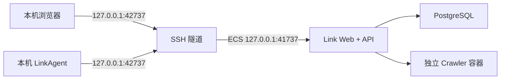

# Link 阿里云私有测试部署

更新日期：2026-07-19

## 1. 适用范围

当前 Link 是单用户测试版，没有邮箱登录、多租户隔离和公网管理端鉴权。本方案只用于受信任用户在阿里云 ECS 上验证“LinkAgent → Link API → PostgreSQL 原始池”的完整链路，不把 Web、API、PostgreSQL 或 Crawler 直接暴露到公网。



## 2. ECS 与安全组

测试规格建议：Ubuntu 24.04 LTS、x86_64、2 vCPU、4 GB 内存、40 GB ESSD。ECS 安全组只添加一条入方向规则：

| 端口 | 来源 | 用途 |
| --- | --- | --- |
| TCP 22 | 当前管理电脑的公网 IP `/32` | SSH 与端口转发 |

不要在安全组开放 `41737`、`55437` 或 `18744`，也不要将 SSH 来源设置为 `0.0.0.0/0`。如果管理电脑公网 IP 变化，需要先更新安全组中的 `/32` 地址。

## 3. 部署到已有 ECS

在本机仓库根目录执行：

```bash
chmod +x deploy/aliyun/*.sh
./deploy/aliyun/deploy-existing-ecs.sh ubuntu@<ECS_PUBLIC_IP> ~/.ssh/<PRIVATE_KEY>
```

脚本会在 ECS 上安装 Docker、拉取公开仓库、生成随机 PostgreSQL 密码并运行 `docker compose up -d --build`。默认安装目录是远端用户的 `~/link`，重复执行时只做 `main` 分支快进更新和容器重建。

云端 `.env` 权限为 `600`，不会写入 Git。测试版默认使用 ECS 数据盘中的 Docker Volume 保存 PostgreSQL；正式 SaaS 再迁移到 RDS PostgreSQL。

## 4. 本机访问与 LinkAgent

在本机保持以下命令运行：

```bash
./deploy/aliyun/open-tunnel.sh ubuntu@<ECS_PUBLIC_IP> ~/.ssh/<PRIVATE_KEY>
```

浏览器打开 `http://127.0.0.1:42737/`。LinkAgent 的平台地址也设置为 `http://127.0.0.1:42737`，然后在云端平台创建配对码并重新配对。隧道中断时，LinkAgent 会离线并保留本地队列；隧道恢复后继续心跳和上传。

本机已有 Link 占用 `41737` 时不受影响，因为云端入口使用较偏门的本机端口 `42737`。

## 5. 运维命令

登录 ECS 后：

```bash
cd ~/link
sudo docker compose ps
sudo docker compose logs -f --tail=200 link-app postgres
curl http://127.0.0.1:41737/api/health
```

更新代码：

```bash
cd ~/link
git pull --ff-only origin main
sudo docker compose up -d --build
```

停止服务但保留数据：

```bash
cd ~/link
sudo docker compose down
```

不要执行 `docker compose down -v`，它会删除 PostgreSQL 与 Crawler 的持久卷。

## 6. 正式公网化之前

完成邮箱注册与登录、租户隔离、设备令牌轮换、管理端权限审计、HTTPS 域名、备份恢复和限流后，才可以开放公网 HTTPS。届时只开放 `443`，应用与数据库仍保留在私网，并将 PostgreSQL 迁移到 RDS 或建立自动备份。
