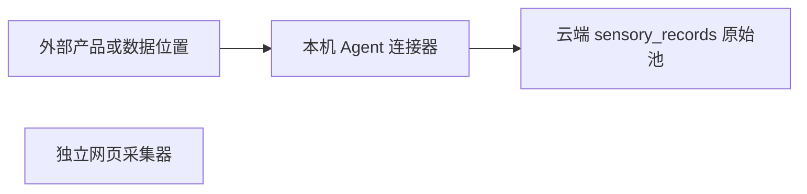

# link 数据接入产品需求文档

更新日期：2026-07-19

关联文档：[LinkAgent 产品需求文档](./link-agent-prd.md)、[LinkAgent 客户端产品需求文档](./link-agent-client-prd.md)。

## 1. 产品定位

link 当前测试版只做一件事：把用户授权的数据通过连接器接入云端原始池，并优先验证从授权、同步到原始数据浏览的完整链路。

当前以单用户、单默认空间运行，不开发邮箱注册、登录、租户管理、组织协作、套餐或计费。产品后续计划支持 SaaS 多租户和移动端，但这些能力只作为架构兼容目标，不进入当前测试版页面、接口和验收范围。

网页采集器作为独立工具保留，不参与 link 的原始池、连接器、治理或记忆流程。

本阶段明确不包含数据治理、AI 执行、候选记忆、个人记忆、知识库、图谱、检索和项目空间。模型与智能体仅提供预配置，不执行、不读取、不改写原始数据。

## 2. 核心原则

- 所有外部数据统一称为连接器；当前测试版不要求用户理解连接器的运行位置。
- 当前测试版的数据连接器在 LinkAgent 中运行；第一版正式形态为 macOS 菜单栏客户端，`link-agent` CLI 和 Docker 仅用于开发诊断与可选封装。未来 SaaS 可按连接器能力扩展云端和移动端运行时。
- Agent 只通过出站 HTTPS 主动连接平台、拉取指令并上传数据；平台绝不反向访问用户电脑，也不要求开放本机端口。
- 授权凭据和本地文件权限留在本机 Agent；云端不保存 Codex 登录态、飞书 Token 或本机文件访问权。
- 每条接入数据必须保留连接器、来源、外部记录 ID、时间、原文、摘要和元数据。
- 重复同步必须幂等；同步失败必须可观察、可重试。
- 原始数据只负责接入和追溯，当前不进行价值判断、压缩、分类或处理。

## 3. 连接器范围

### 3.1 第一批

| 连接器   | 本机 Agent 权限 | 接入内容                                  | 当前状态 |
| -------- | --------------- | ----------------------------------------- | -------- |
| Codex    | 只读 `~/.codex` | 用户输入、Codex 输出、CLI、工具、技能线索 | 已实现   |
| 飞书     | 用户 OAuth 授权 | 文档、妙记、会议纪要、知识库              | 待实现   |
| 本地文件 | 用户选择目录    | Markdown、PDF、Word、文本及元数据         | 待实现   |

### 3.2 后续扩展

任何新产品都通过统一连接器协议接入，例如邮箱、日历、Notion、Google Drive、Slack、浏览器书签和移动端数据。当前连接器由 LinkAgent 执行；未来可以由 SaaS 平台或 Link Mobile 执行。新连接器不得绕过原始池直接写入后续资产。

## 4. 用户流程

1. 用户打开“基础数据”。
2. 在“连接器 → 来源容器 → 原始记录”的层级中查看全部已同步数据。
3. 点击授权或同步后，云端 Link 向本机 Agent 下发动作。
4. Agent 在本机完成目录授权、OAuth 登录或本地读取。
5. Agent 以增量批次上传标准化原始记录。
6. 云端写入 `sensory_records`、去重并展示来源和同步结果。
7. 用户可浏览、筛选和查看原始数据，不在本阶段做处理。

当 Agent 离线时，平台保留同步指令；Agent 恢复心跳后只执行一次。同步失败的批次留在本地队列，平台确认后才推进同步游标。

## 5. 页面范围

### 5.1 一级导航

- 基础数据：同步后的原始数据观察与追溯台。
- 平台采集：独立网页采集工具，保留现有能力。
- 设置：连接器、模型和智能体的配置中心。

### 5.2 基础数据首页

- 首屏只展示数据来源数、来源容器数与原始记录数；不展示数据库名称、表名、文件 glob 等实现字段。
- 连接器卡片是数据浏览入口，不在首页混合平铺不同来源的容器和记录。
- 首页默认不展开任何来源。用户点击连接器卡片后才加载并显示对应容器列表；再次点击当前卡片可收起，点击其他卡片则切换来源。
- 连接器卡片展示连接状态、来源容器数、原始记录数和最近更新时间；授权范围、同步协议和存储位置属于技术详情字段。
- 用户选择一个连接器后，分页查看该来源的会话、文档或文件夹容器；搜索必须由回车或搜索按钮确认，不得逐字发送请求。
- 来源容器采用可扫描行列表，展示名称、简化后的项目或来源位置、前两类内容、记录数和最近更新时间；完整路径在需要时查看。
- 通用原始记录页支持连接器切换、原始类型、关键词和分页，不假定数据来自 Codex。
- 原始记录默认展示两行摘要，点击“查看原文与来源”后显示完整原文、发生时间、同步时间、完整来源位置和来源记录 ID。
- 类型筛选不显示与当前容器口径不一致的全局计数；页面总数始终以当前连接器、容器、类型和关键词过滤结果为准。

### 5.3 Codex 连接器详情

- 显示本机 Agent 的读取范围和落库位置。
- 手动同步按钮。
- 线程数、原始记录数、类型分布、最近同步结果。
- 原始记录列表，支持类型、关键词和分页。

### 5.4 设置

- 智能体：设置页第一组；最上方是 LinkAgent 客户端，下面是未来智能体角色。
- LinkAgent 客户端：设备配对、在线状态、同步操作、客户端版本与后续更新提示。
- 连接器：授权范围、同步方式、启用状态和配置摘要。
- 模型：Codex 默认、OpenAI 兼容服务、Ollama 等未来模型的连接配置。
- 模型和智能体不参与当前同步链路，不产生数据处理任务。
- Agent 状态、设备版本、最后心跳、授权与连接器同步错误属于连接器配置的一部分。

### 5.5 连接器扩展入口

- 飞书和本地文件仅在对应 Agent 插件完成后展示为可授权连接器。
- 未实现的连接器不展示模拟数据、不展示假授权状态。

### 5.6 独立网页采集

- 保留当前静态、动态、隐身采集模式、字段提取、任务记录、结果预览和下载。
- 不写入 `sensory_records`，不显示在连接器列表。

## 6. 验收标准

- Codex 可重复同步，重复记录不重复写入。
- 原始池能展示真实来源、线程/容器、时间、类型、项目路径和原文摘要。
- 数据源头可按连接器与关键词追溯。
- 同步结果记录新增、更新和失败情况。
- 产品导航只保留“基础数据”“平台采集”“设置”。
- 设置可保存连接器、模型和智能体配置；模型和智能体均不执行任务。
- Agent 不开放入站端口；设备配对、指令拉取、离线恢复、幂等批量上传和凭据本机保存满足 Link Agent 产品需求文档。
- 不存在治理、候选记忆、个人记忆、知识库、图谱或检索入口与 API。

## 7. 后续规划与设计约束

### 7.1 数据处理启动条件

数据处理能力只有在至少 Codex、飞书和本地文件三类连接器稳定增量接入后，才重新讨论。

### 7.2 SaaS 多租户规划

多租户属于原始数据接入流程稳定后的后续阶段，当前测试版不开发，也不展示模拟的注册、登录、租户、组织、成员、套餐和计费功能。

后续 SaaS 第一版采用以下最小范围：

- 只支持邮箱注册和登录，不包含手机号、第三方登录和企业 SSO。
- 邮箱全局唯一并完成邮箱验证；支持密码登录和邮件重置密码。
- 每个新用户自动获得一个个人租户，产品界面可称为“个人空间”，用户无需手动创建租户。
- 第一版默认一名用户使用一个个人租户；组织、多成员、邀请和租户切换只预留数据模型，不开放产品入口。
- 平台运营端与租户用户端分离。平台运营人员默认只能查看租户容量、同步状态和错误，不得直接查看租户原始内容。
- LinkAgent 和未来 Link Mobile 必须绑定到明确租户；平台根据登录会话或设备令牌确定租户，不信任客户端直接提交的 `tenant_id`。

当前测试版暂不执行多租户数据库迁移，但新增设计不得阻断后续改造：

- 保持“设备 → 连接器实例 → 同步任务 → 上传批次 → 来源容器 → 原始记录”的完整归属链。
- 设备、连接器、同步任务和原始记录均使用稳定全局 ID，不用本机路径、邮箱或显示名称作为业务主键。
- 原始记录幂等规则应允许未来从 `(source, source_record_hash)` 扩展为 `(tenant_id, source, source_record_hash)`。
- 鉴权上下文与业务查询保持可分离，后续可统一注入 `tenant_id` 并启用 PostgreSQL RLS。
- 不为当前测试版提前增加无实际作用的租户字段、登录页面和假数据。

在邮箱登录和租户隔离完成前，云端版本只支持单用户私有测试部署：平台端口只绑定 ECS 回环地址，用户通过受限 SSH 隧道访问；不得把管理页面、接入 API、数据库或 Crawler 端口直接开放到公网。

### 7.3 多终端兼容规划

后续用户端包括租户 Web 端、桌面 LinkAgent 和 Link Mobile。移动端主要用于查看同步状态、系统分享、照片、文件、扫描和录音接入，不假设其具备桌面端的任意文件扫描和持续后台运行能力。

连接器定义需要能够描述 `cloud`、`desktop_agent`、`mobile_ios`、`mobile_android` 和 `crawler` 等运行环境；当前测试版只实现已验证的桌面运行环境。桌面端、移动端和云端最终写入相同的原始数据模型，并保留设备、连接器和来源追溯信息。

### 7.4 源代码开放策略

当前测试版以 `0.2.1 Developer Preview` 公开源码，用于验证、审阅和社区讨论，不宣称已经支持公网 SaaS。平台、LinkAgent 和当前官方代码采用 Business Source License 1.1：允许个人、开发测试和企业内部使用，未经商业授权不得将 Link 的主要功能作为第三方托管或管理服务提供；该版本计划在 2030-07-19 转为 Apache-2.0。

由于 BSL 不是 OSI 认可的开源许可证，产品文档和发布页统一使用“源代码开放”或 `source available`，不使用“完全开源”表述。数据库备份、用户原始数据、凭据、安装包和本机构建产物不进入源码仓库。安装包通过 Release 附件独立发布。
