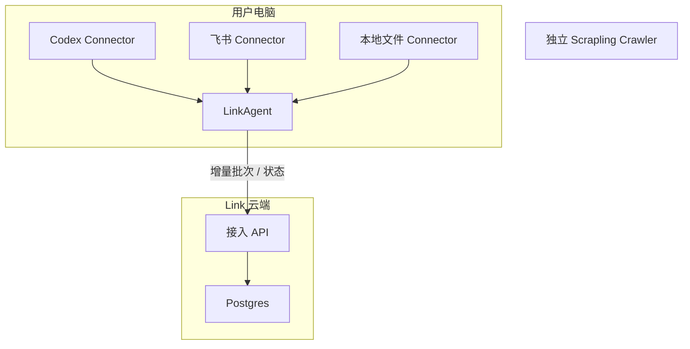

# link 数据接入技术设计

更新日期：2026-07-19

关联文档：[LinkAgent 技术设计](./link-agent-technical-design.md)。

## 1. 架构边界

Link 平台是控制面和原始数据事实源。当前测试版由 Tauri LinkAgent 运行数据连接器并只建立出站 HTTP/HTTPS 连接；CLI 只作为开发诊断入口。Crawler 独立运行，不接入 Link 数据库。未来 SaaS 和移动端可增加其他连接器运行环境，但不进入当前实现范围。

## 2. 保留组件

| 组件                                  | 职责                         |
| ------------------------------------- | ---------------------------- |
| `src/routes/index.tsx`                | 基础数据首页                 |
| `src/routes/data.tsx`                 | 通用原始记录浏览             |
| `src/routes/codex.tsx`                | Codex 连接器同步兼容页       |
| `src/routes/crawler.tsx`              | 独立网页采集器               |
| `src/routes/settings.tsx`             | 连接器、模型、智能体配置中心 |
| `src/lib/server-db.ts`                | 原始记录、来源和同步记录读写 |
| `scripts/import-codex-history.mjs`    | 本机 Codex 历史只读导入      |
| `sensory_records`                     | 原始数据事实源               |
| `connector_sync_runs`                 | 连接器同步运行记录           |
| `runtime_configs`                     | 连接器、模型、智能体配置     |
| `docs/link-agent-technical-design.md` | Agent 设备、协议、队列与安全 |

## 3. 删除组件

删除治理任务、候选记忆、AI 执行 Provider、Codex Worker、个人记忆、知识库、图谱和检索的路由、API、Worker、数据库初始化定义和产品入口。保留不执行的模型与智能体配置。

旧治理、候选、记忆、知识、图谱及其关联表会从当前数据库删除。当前平台保留 `sensory_records`、`connector_sync_runs` 与 `runtime_configs`；原始记录统一回归为 `ingested` 状态。

## 4. 原始数据模型

`sensory_records` 是唯一业务事实源：

| 字段                          | 用途                                           |
| ----------------------------- | ---------------------------------------------- |
| `source`                      | 连接器来源，如 `codex`、`feishu`、`local_file` |
| `source_container_id`         | 线程、文档、会议或文件夹                       |
| `source_record_id`            | 外部记录的稳定 ID                              |
| `source_record_hash`          | `(source, record id)` 去重依据                 |
| `raw_type`                    | 原始内容类型                                   |
| `raw_text` / `summary`        | 原文与列表摘要                                 |
| `occurred_at` / `synced_at`   | 发生时间与接入时间                             |
| `source_uri` / `project_path` | 来源追溯和归属                                 |
| `metadata`                    | 连接器专有元数据                               |

新记录状态统一为 `ingested`；本阶段没有治理状态机。

基础数据查询以 `source` 为第一层过滤条件，统一 `origin_key = COALESCE(source_container_id, source_thread_id, source_uri, 'unknown')` 为第二层过滤条件，`raw_type` 与关键词为第三层过滤条件。`/api/data-sources/origins` 返回按来源过滤、可分页的容器聚合；类型统计只查询当页 `origin_key`。`/api/sensory-records` 通过 `originKeys` 返回通用记录列表。前端不得将任意来源容器硬编码跳转至某一个 Connector 页面。

基础数据首页不在初始化时请求来源容器。只有 `selectedSource` 由用户点击连接器卡片后产生时，才请求 `/api/data-sources/origins`；再次点击当前来源会清空选择并收起列表。

连接器统计中的来源容器数必须按统一 `origin_key` 去重，不能只统计 Codex 的 `source_thread_id`。容器搜索仅匹配来源名称、标题、项目路径与来源 URI；原文关键词检索只在原始记录页执行。

容器搜索先确定命中的完整 `origin_key` 集合，再对这些容器的全部记录做聚合，不能把“命中字段的记录数”误当成容器总记录数。类型筛选若未提供当前查询范围内的 facet 统计，则只显示类型名称，不展示连接器全局计数。

## 5. Agent Connector 协议

每个 Agent Connector 实现相同能力：

1. `authorize`：在本机完成目录授权或 OAuth。
2. `discover`：读取可接入范围。
3. `sync`：根据游标读取新增或更新项。
4. `normalize`：转换为标准原始记录。
5. `upload`：幂等上传批次到云端。
6. `report`：回传新增数、重复数、失败和游标。

凭据存放在本机系统钥匙串或 Agent 加密存储。云端只保存连接器配置摘要、同步游标和运行状态。

## 6. 配置模型

`runtime_configs` 统一保存三类配置：`connector`、`model`、`agent`。它们只保存连接参数、启用状态与角色说明，不包含密钥，也不会触发模型调用或智能体任务。

## 7. API

| API                                  | 用途                          |
| ------------------------------------ | ----------------------------- |
| `GET /api/health`                    | 服务与数据库健康检查          |
| `GET /api/connectors/status`         | 连接器统计与状态              |
| `GET /api/data-sources/origins`      | 来源容器聚合与追溯            |
| `GET /api/sensory-records`           | 分页读取原始记录              |
| `GET /api/settings`                  | 读取连接器、模型、智能体配置  |
| `PUT /api/settings`                  | 更新单项配置                  |
| `POST /api/agents/pairing-codes`     | 创建一次性设备配对码          |
| `POST /api/agents/pair`              | 配对并发放 Agent 令牌         |
| `POST /api/agents/heartbeat`         | Agent 心跳并拉取指令          |
| `POST /api/agents/ingestion-batches` | Agent 幂等批量上传原始记录    |
| `POST /api/agents/commands`          | 创建白名单同步指令            |
| `POST /api/agents/commands/complete` | Agent 完成指令回执            |

当前已实现受 Token 保护的设备配对、心跳/指令和幂等批量上传 API。平台不再提供直接读取服务器文件系统的 `POST /api/codex/sync` 兼容端点；Codex 正式同步链路统一通过 LinkAgent。协议、队列、游标、指令白名单与待加固项详见 Link Agent 技术设计。

## 8. 部署

本地版使用 Docker Compose：Link 应用、Postgres、独立 Crawler。三个端口默认都只绑定 `127.0.0.1`，平台容器不挂载用户的 `~/.codex`；Postgres 使用 `.env` 中的本地开发凭据。

云端版使用 ECS 承载 Link API 与 Postgres/RDS；本机 Agent 通过 HTTPS 与云端交互。数据库和 Crawler 端口不开放公网。

当前测试版没有公网用户认证、多租户隔离或平台运营权限，因此云端部署只作为后续架构方向，不属于当前支持范围。

## 9. 源代码发布边界

- 源码仓库采用 BSL 1.1，许可证参数按发布版本固定；`0.2.0` 的 Change Date 为 2030-07-19，Change License 为 Apache-2.0。
- `.env`、数据库导出、Codex 数据、设备凭据、Agent 本地队列、DMG、Node 构建输出和 Rust `target` 必须由忽略规则排除。
- DMG 通过 Release 附件发布，不进入 Git 历史；正式 Release 需要 Developer ID 签名、公证与校验和。
- GitHub CI 分别验证平台 lint/build 与 macOS LinkAgent TypeScript/Rust 测试。
- 外部实质代码贡献在 CLA 启用前不合并，以保留未来双重授权和商业许可所需权利。
- 多租户只保留设计约束，当前源码不得出现模拟登录、假租户或无法生效的 RLS 配置。
