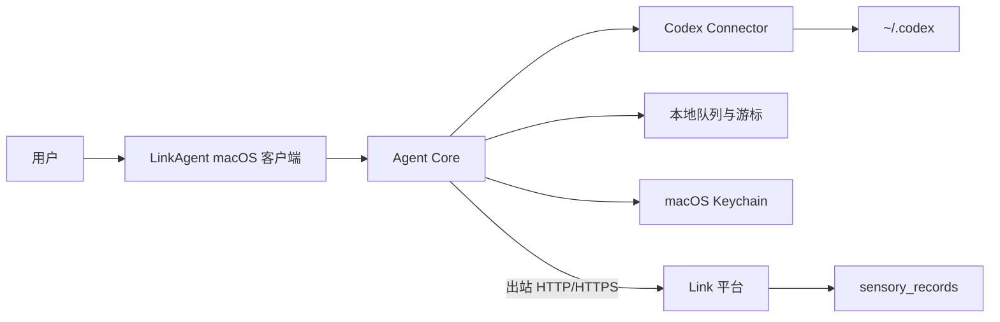
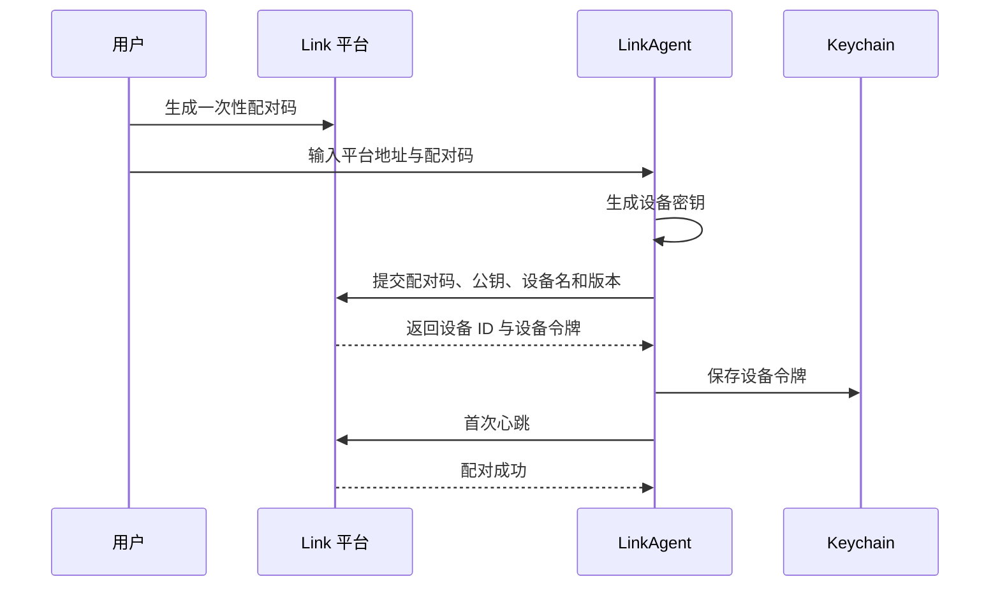

# LinkAgent 客户端产品需求文档

更新日期：2026-07-18
版本：V1.0
状态：第一期 P0 已实现并通过本机闭环验证

关联文档：[LinkAgent 产品需求文档](./link-agent-prd.md)、[LinkAgent 技术设计](./link-agent-technical-design.md)。

## 1. 产品定位

LinkAgent 是安装在用户电脑上的轻量客户端智能体，是 Link 平台访问本机及外部数据的唯一连接器运行环境。

它负责本机授权、增量读取、标准化、离线缓冲、任务执行和原始数据上传。LinkAgent 不进行数据治理、AI 总结、知识提取或记忆生成，也不会把本机凭据上传到平台。

第一期优先发布 macOS 客户端，形态为“菜单栏常驻应用 + 可打开的管理窗口”。用户不需要安装源码、Node.js 或使用终端命令。

## 2. 产品目标

第一期目标：用户在一台新的 Mac 上，通过下载安装包完成 LinkAgent 安装、Link 平台配对、Codex 授权和后台同步，并能在 Link 平台查看同步后的原始数据。

成功标准：

- 从下载到首次同步成功，不需要终端操作。
- LinkAgent 只通过出站 HTTP/HTTPS 主动连接平台，不开放本机入站端口。
- 客户端退出或电脑离线时不丢失待上传批次和同步游标。
- 重复同步不会在平台产生重复原始记录。
- 用户可以在客户端理解当前状态、同步结果和失败后的下一步动作。

## 3. 非目标

第一期不包含：

- 飞书 Connector 与本地文件 Connector 的正式实现。
- AI 数据治理、内容总结、分类、知识或记忆生成。
- 第三方 Connector 商店与未签名 Connector 安装。
- Windows、Linux 安装包。
- 云端反向控制本机、任意 Shell 命令或任意目录读取。
- 无感自动替换客户端可执行文件。

## 4. 产品架构

职责边界：

| 组件             | 职责                                                   |
| ---------------- | ------------------------------------------------------ |
| LinkAgent 客户端 | 安装、配对、授权、状态展示、手动同步、日志与更新入口   |
| Agent Core       | 心跳、白名单指令、Connector 调度、本地队列、游标和重试 |
| Codex Connector  | 只读发现并解析本机 Codex 历史，输出标准原始记录        |
| Link 平台        | 设备管理、同步指令、批次确认、原始数据存储和来源展示   |

## 5. 目标用户与场景

目标用户是使用 Link 管理个人工作数据，并在一台或多台电脑上使用 Codex 的个人用户。

核心场景：

1. 首次安装：下载 LinkAgent，安装后自动进入配对流程。
2. 新设备接入：在 Link 平台生成配对码，在客户端输入并完成设备绑定。
3. Codex 首次同步：客户端检查 `~/.codex`，用户确认只读范围后开始同步。
4. 日常后台同步：客户端常驻菜单栏，响应平台指令并按计划增量同步。
5. 离线恢复：网络恢复后自动上传队列中的未确认批次。
6. 故障排查：用户查看同步结果和可理解错误，重新授权或重试。
7. 客户端升级：平台或客户端提示新版本，下载安装后保留身份、游标与队列。

## 6. 信息架构

客户端管理窗口包括四个一级页面：

| 页面     | 第一期开启内容                                      |
| -------- | --------------------------------------------------- |
| 设备     | 平台地址、配对状态、在线状态、客户端版本、解除配对  |
| 连接器   | Codex 卡片、授权范围、连接状态、立即同步            |
| 同步记录 | 最近任务、开始/完成时间、读取数、上传数、结果和错误 |
| 设置     | 开机启动、后台运行、检查更新、打开日志目录          |

菜单栏提供：

- 当前总体状态：在线、同步中、离线、需要处理。
- 打开 LinkAgent。
- 立即同步 Codex。
- 打开 Link 平台。
- 退出 LinkAgent。

## 7. 核心流程

### 7.1 安装与首次启动

1. 用户从 Link 平台下载 macOS 安装包。
2. 用户将 LinkAgent 安装至 Applications 并首次打开。
3. 客户端创建应用数据目录，检查系统架构和网络状态。
4. 未配对时直接进入配对页，不启动 Connector 同步。
5. 配对成功后进入连接器页。

### 7.2 设备配对

配对要求：

- 配对码默认十分钟有效且只能使用一次。
- 平台地址必须是 `http://127.0.0.1`、`http://localhost` 或 HTTPS 地址；公网 HTTP 不允许。
- 客户端显示设备名称，用户可在配对前修改。
- 配对失败不得写入半完成身份。
- 已配对设备重新配对前必须先明确解除现有配对。

### 7.3 Codex 授权与同步

1. 客户端检查默认目录 `~/.codex` 是否存在且可读。
2. 显示读取内容：会话输入、Codex 输出、CLI、工具调用和技能线索。
3. 用户确认只读授权后，Connector 状态变为“已就绪”。
4. 用户点击“立即同步”，客户端生成同步任务。
5. Agent Core 增量读取、标准化并按最多 200 条分批写入本地队列。
6. 平台确认批次后推进本地游标。
7. 客户端展示读取数、上传数、重复数、耗时和结果。

第一期允许用户主动同步，也响应平台下发的 `sync_connector` 指令。后台定时同步默认关闭，后续在稳定性验证后开放。

### 7.4 后台运行与离线恢复

- 关闭管理窗口不会退出 LinkAgent，客户端继续在菜单栏运行。
- 用户明确选择“退出 LinkAgent”才停止心跳和同步。
- 网络失败时批次保留在本地队列，采用指数退避重试。
- 客户端重启后先恢复未确认队列，再执行新的同步任务。
- 同一个 Connector 同一时间最多运行一个同步任务。

## 8. 状态模型

客户端状态：

| 状态                 | 用户文案         | 用户动作                |
| -------------------- | ---------------- | ----------------------- |
| `unpaired`           | 未连接 Link 平台 | 开始配对                |
| `online`             | 已连接           | 无需处理                |
| `offline`            | 无法连接平台     | 检查网络或平台地址      |
| `syncing`            | 正在同步         | 查看进度，不能重复启动  |
| `attention_required` | 需要处理         | 查看具体 Connector 错误 |
| `upgrade_required`   | 需要更新         | 下载兼容版本            |
| `revoked`            | 设备授权已撤销   | 重新配对                |

Codex Connector 状态：`not_authorized`、`ready`、`syncing`、`paused`、`error`。

状态必须配合可理解说明，不直接向用户展示内部错误堆栈、HTTP 状态码或数据库字段。

## 9. 功能需求

### 9.1 P0

- 可运行的 macOS 应用与菜单栏图标。
- 首次启动、平台地址与配对码输入。
- 设备配对、心跳和在线状态。
- Codex 目录检查、授权说明和手动同步。
- 本地游标、上传队列、批次重试和平台回执。
- 最近同步结果和本地日志查看。
- 关闭窗口后台运行、明确退出。
- 保留现有 LinkAgent CLI 作为开发诊断入口。

### 9.2 P1

- 登录后自动启动。
- macOS Keychain 保存设备令牌。
- 平台远程创建白名单同步指令。
- 客户端版本检查与更新提示。
- 设备解除配对和本地状态清理。
- 错误日志轮转与本地队列容量限制。

### 9.3 后续

- 签名和公证的 DMG/PKG 发布。
- 飞书 Connector、本地文件 Connector。
- 定时同步策略。
- Windows 客户端。
- 已签名 Connector 包与兼容性管理。

## 10. 数据与安全

- LinkAgent 不监听本机入站网络端口。
- 平台只能下发固定白名单指令，不支持 Shell、脚本、任意 URL 下载或任意路径读取。
- 设备令牌正式版本保存在 macOS Keychain；普通配置文件不保存明文令牌。
- Codex 数据只读取用户明确确认的目录，默认 `~/.codex`。
- 日志不记录设备令牌、完整原文、Cookie 或 OAuth 凭据。
- 本地队列可能包含待上传原文，必须限制文件权限，并在正式版本启用应用级加密。
- 解除配对时删除设备令牌；游标、队列和日志是否删除由用户明确选择。
- 客户端安装包和后续更新必须经过签名校验，平台不能推送任意可执行代码。

## 11. 平台配套需求

Link 平台设置页的 LinkAgent 卡片需要提供：

- 下载 LinkAgent。
- 生成一次性配对码。
- 已配对设备列表、在线状态、版本和最近心跳。
- 请求同步、解除设备、版本过低提示。
- 配对时显示平台地址与配对码，不再以 `npm run agent` 作为正式用户流程。

## 12. 客户端更新

- 配置变化通过心跳拉取，不要求升级客户端。
- Connector 代码、权限声明、传输协议或安全修复变化时才要求升级。
- 第一版只提示用户下载新版本，不静默安装。
- 覆盖安装后必须保留设备 ID、Keychain 凭据、Connector 授权、游标和未确认队列。
- 最低兼容版本不满足时，客户端停止执行新同步指令，但允许查看状态与下载更新。

## 13. 埋点与诊断

第一期只保存本地诊断日志，不上传行为分析数据。

日志事件包括：启动、配对结果、心跳结果、Connector 状态变化、同步开始/完成、批次上传、重试和升级检查。日志默认保留七天，单文件达到 10 MB 后轮转。

## 14. 第一期验收标准

- 在没有 Node.js 和源码的 Mac 上可安装并启动 LinkAgent。
- 未配对时不会读取或上传 Codex 数据。
- 输入有效平台地址与配对码后，平台在一分钟内显示设备在线。
- 用户确认 Codex 只读范围后，可以从客户端发起同步。
- 同步完成后，Link 平台基础数据能看到对应来源容器和原始记录。
- 断网后产生的批次在恢复网络后可继续上传，且平台不产生重复记录。
- 关闭窗口后心跳继续，选择退出后一分钟内平台显示设备离线。
- 客户端能显示最近一次同步结果和可执行的错误说明。
- 客户端不开放本机端口，日志和普通配置中不存在设备令牌与原文。

## 15. 版本范围

第一期版本号：`0.2.0`。

开发顺序：

1. 建立 Tauri 2 macOS 客户端和菜单栏骨架。
2. 抽取并复用现有 Agent Core。
3. 实现配对、心跳和设备状态。
4. 接入 Codex Connector 与同步结果。
5. 增加 Keychain、开机启动和更新提示。
6. 生成可安装 macOS 产物并完成新设备验收。

## 16. 当前交付状态

`0.2.0` 已实现 macOS 管理窗口与菜单栏、平台配对、Keychain、心跳、Codex 只读授权、全量与增量同步、每批最多 200 条的持久队列、同步记录、开机启动配置和平台远程同步指令。

本机闭环已验证“平台生成配对码 -> 客户端配对 -> Codex 全量同步 -> 新增记录增量同步 -> 平台远程下发同步 -> 客户端完成并回写结果”。

当前 DMG 是 Apple Silicon 开发预览包，使用 ad-hoc 签名，适合本机验证；公网分发前必须接入稳定的 Apple Developer ID 签名、公证与更新包签名。飞书、本地文件、文件级游标和自动更新属于后续版本。
