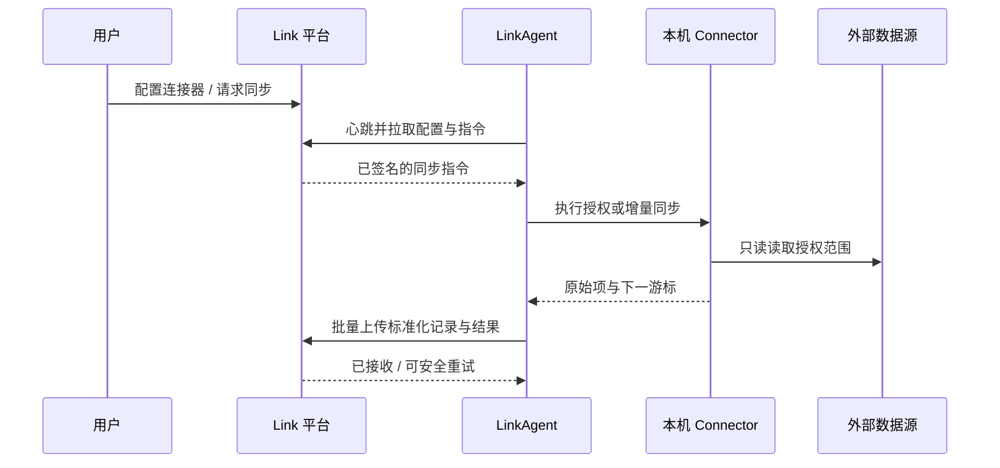

# LinkAgent 产品需求文档

更新日期：2026-07-18

客户端产品形态、页面、安装与第一期验收标准见：[LinkAgent 客户端产品需求文档](./link-agent-client-prd.md)。

## 1. 定位

LinkAgent 是安装在用户电脑上的轻量客户端智能体，是所有数据连接器唯一的运行时。它负责本机授权、增量读取、标准化、离线缓冲与向 Link 平台上传原始数据。

它不是数据治理、记忆生成或通用对话智能体；第一版不调用模型，不解释或改写内容。



## 2. 使用方式

第一版正式发布为 macOS 菜单栏客户端和 DMG 安装包，支持登录后自动运行；Docker 仅为开发与高级用户的可选封装。Windows 客户端和 Codex 内置扩展不属于第一版依赖。

`link-agent` CLI 作为开发诊断内核保留，普通用户通过客户端完成配对、授权和同步，不需要源码、Node.js 或终端命令。

```bash
link-agent init
link-agent connect https://link.example.com
link-agent start
link-agent status
link-agent sync codex
link-agent logs
```

`init` 创建本地工作目录；`connect` 完成设备配对；`start` 启动心跳、任务拉取和重试队列；`sync` 是用户主动触发指定连接器的一次同步。

## 3.1 客户端更新

- 平台在心跳中比较 LinkAgent 版本、已安装 Connector 版本与最低兼容版本。
- 修改同步范围、频率等平台配置时，LinkAgent 拉取新配置即可，不要求更新客户端。
- 新增 Connector、Connector 代码升级、权限模型或数据协议变化时，平台提示“需要更新 LinkAgent”。
- 用户下载并安装新版客户端后，设备身份、连接器配置、本地队列和同步游标必须保留；升级不得造成重复同步。
- 平台不向 LinkAgent 推送任意代码。客户端或 Connector 更新只能来自签名发布包。

## 4. 用户可见流程

1. 用户在 Link 平台“设置 - 连接器”选择一个连接器。
2. 平台显示当前 Agent 是否在线；若未配对，提供客户端下载安装包和一次性配对码。
3. 用户在本机通过 Agent 完成目录选择、OAuth 授权或只读权限确认。
4. 用户点击“立即同步”，平台创建指令；Agent 在下次心跳时获取并执行。
5. Agent 上传原始数据及结果；平台在“基础数据”展示来源容器和原始记录。
6. 用户可暂停连接器、修改同步范围、重新授权或查看失败原因。

平台不直接连接用户电脑；电脑休眠、离线或 Agent 未启动时，指令保持待执行，恢复后继续。

## 5. Agent 的职责与边界

| Agent 必须做                     | Agent 不做                         |
| -------------------------------- | ---------------------------------- |
| 安装、加载、升级连接器           | 数据治理、总结、分类、记忆生成     |
| 管理本机权限和 OAuth 凭据        | 向平台上传凭据、Cookie、原始登录态 |
| 保存连接器游标与待上传队列       | 将原始数据直接写入记忆或知识资产   |
| 执行同步、标准化、去重预判、重试 | 监听或开放本机入站端口给云端       |
| 上报状态、错误和版本信息         | 静默扩大用户已授权的读取范围       |

## 6. 连接器契约

每个 Connector 必须实现：

```ts
type Connector = {
  manifest: ConnectorManifest;
  authorize(context): Promise<AuthorizationResult>;
  validate(context): Promise<HealthResult>;
  discover(context): Promise<DiscoveryResult>;
  sync(cursor, scope): AsyncIterable<SourceItem>;
  normalize(item): SensoryRecord;
};
```

`manifest` 至少包含：稳定 `id`、名称、版本、授权方式、配置字段、支持的数据类型、游标策略和最小 Agent 版本。连接器只能产生标准 `sensory_records`，不得绕开上传协议写入平台任意其他表。

第一批 Connector：

| Connector | 本机权限        | 容器             | 原始类型                    | 游标                       |
| --------- | --------------- | ---------------- | --------------------------- | -------------------------- |
| Codex     | 只读 `~/.codex` | 会话             | 输入、输出、CLI、工具、技能 | 会话文件更新时间 + 记录 ID |
| 飞书      | OAuth 最小授权  | 文档、妙记、会议 | 文本、附件元数据、评论      | `updated_at` / 分页游标    |
| 本地文件  | 用户选择目录    | 文件夹、文件     | Markdown、PDF、Word、文本   | 路径 + 修改时间 + 内容哈希 |

## 7. 本地状态、凭据和隐私

```text
~/.link-agent/
  config.json          # 平台地址、设备 ID、非敏感运行配置
  credentials.enc      # 系统钥匙串引用或本地加密凭据
  cursors/             # 每个 connector + scope 的增量游标
  queue/               # 未确认上传批次，支持断点重试
  connectors/          # 已安装 Connector 包与 manifest
  logs/                # 本地可轮转日志，不保留完整原文
```

- 正式 macOS 客户端使用 Keychain 保存设备令牌和设备私钥，权限 `0600` 的本地配置只保存平台地址、设备 ID、游标和非敏感状态。
- 本地队列保存待上传原文，因此采用磁盘加密或应用级加密，并有容量上限与过期策略。
- 日志只记录连接器 ID、批次 ID、数量、耗时和错误码，默认不记录原文、Token、完整文件路径或 API 响应。
- 用户可以在本机执行 `link-agent revoke <connector>` 删除凭据、游标与待上传内容；平台同时撤销对应设备授权。

## 8. 同步规则

- Agent 以连接器、账户和读取范围为维度维护游标。
- 上传按批次进行：默认最多 200 条或 2 MB，任一限制达到即提交。
- 平台确认批次后才推进本地游标；网络失败时同一批次以稳定 `batch_id` 重试。
- 平台以 `source + source_record_hash` 幂等写入，重复上传不得产生重复原始记录。
- 外部删除默认上报删除标记，不物理删除已接入原始记录。
- 读取范围缩小时，停止后续读取；既有数据是否删除必须由用户显式发起独立操作。

## 9. 状态与错误

Agent 状态：`unpaired`、`online`、`offline`、`upgrade_required`、`revoked`。

连接器状态：`not_configured`、`authorization_required`、`ready`、`syncing`、`paused`、`error`、`disabled`。

失败重试采用指数退避；鉴权失败、范围失效、版本不兼容属于不可自动恢复错误，必须在平台和本机都给出可理解的下一步动作。

## 10. 验收标准

- 用户可在不开放本机端口的情况下，将在线 Agent 与一个平台账户配对。
- Agent 离线时，平台同步请求可保留；恢复在线后只执行一次。
- Codex Connector 可重复同步，断网重试不产生重复记录。
- 平台和本机均可看到最后同步时间、游标状态、数量和可理解错误。
- 凭据、Token 和 Cookie 不出现在平台数据库、上传载荷和普通日志中。
- Agent 不调用模型，不产生治理、记忆或知识资产。
- 当前客户端已提供配对、心跳、Codex 授权与同步、同步记录、菜单栏和 Keychain；CLI 同名能力作为开发诊断入口保留，指令签名验签属于公网部署前的安全加固。

## 11. 当前实现状态

已实现：macOS 客户端与菜单栏、一次性配对码、Keychain 设备令牌、Agent 心跳、白名单命令、Codex Connector、每批最多 200 条的幂等上传、本地 JSON 队列、平台安装包下载和配对与同步入口。

待实现：安装包签名与公证、指令签名验签、Connector 包签名、飞书 Connector、本地文件 Connector、删除标记上传以及真正的文件级增量扫描。
