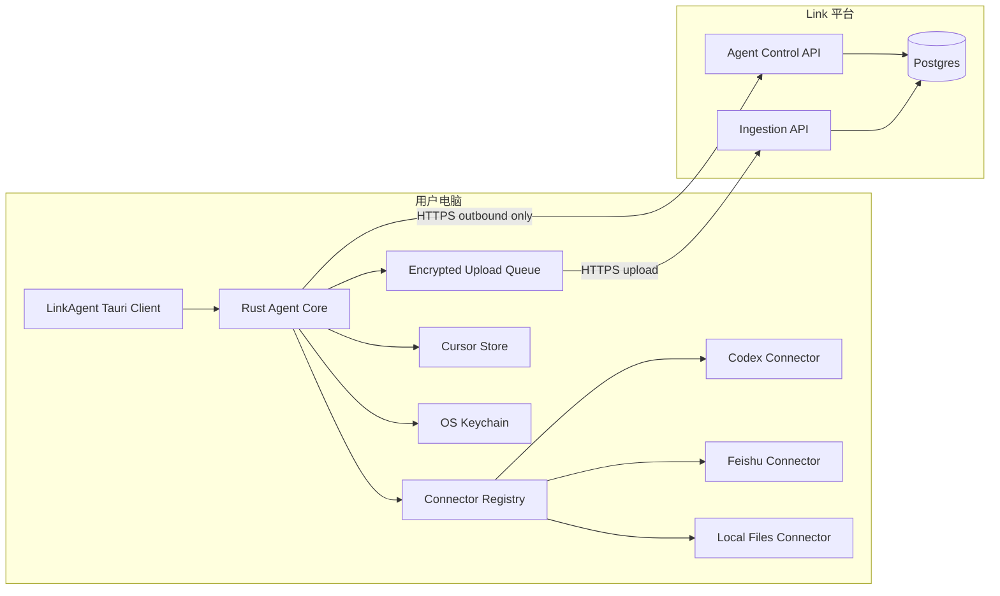

# LinkAgent 技术设计

更新日期：2026-07-19

## 1. 运行模型

正式客户端位于 `link-agent-client/`，使用 Tauri 2、Rust 与 React/TypeScript 构建。第一期发布 macOS 菜单栏应用和 DMG 安装包，Rust Core 负责设备配对、心跳、Connector 调度、队列、游标、Keychain 与网络传输，React 只负责本机授权和状态交互。

`agent/link-agent.mjs` 作为开发诊断 CLI 保留，用于协议联调与无界面排障，不再是普通用户的安装和配对入口。Windows Task Scheduler、Linux systemd 与 Docker 封装放在后续跨平台阶段。

平台不能主动访问 Agent。本机 Agent 通过 HTTPS 主动建立短轮询或长轮询：心跳默认 30 秒，离线退避至最长 5 分钟。



## 2. 平台与 Agent 协议

### 2.1 设备配对

1. 用户在平台创建一次性配对码，默认有效 10 分钟且单次使用。
2. 用户打开 LinkAgent，在配对页输入平台地址、配对码和设备名称。
3. Agent 生成设备密钥对，把公钥和设备元信息提交平台。
4. 平台返回 `agent_id` 与设备令牌。
5. 设备令牌和私钥仅保存在 macOS Keychain；平台保存公钥、设备状态、版本和最后心跳。

当前实现使用 TLS 部署前提下的 Agent Token 鉴权与过期指令白名单；设备公钥已在配对时登记。服务端指令签名、短期访问令牌和令牌轮换属于公网部署前的安全加固项。

### 2.2 心跳与指令

```text
POST /v1/agents/{agent_id}/heartbeat
Authorization: Bearer <short-lived-token>

{ agentVersion, os, connectorStates, capacity, lastCommandId }
```

平台响应包含配置版本和待执行指令。指令类型第一版仅限：`sync_connector`、`validate_connector`、`refresh_config`、`pause_connector`。不支持任意 shell 命令、任意文件路径或远程代码执行。

### 2.3 批量上传

```text
POST /v1/ingestion/batches
Idempotency-Key: <batch_id>

{
  agentId,
  connectorId,
  cursorBefore,
  records: [SensoryRecord],
  checksum
}
```

平台在事务内写入记录和批次结果。仅在收到确认后，Agent 提交 `cursorAfter`；重复 `batch_id` 返回原确认结果。

## 3. 本地状态机

每个 `(connector_id, account_id, scope_id)` 维护独立状态：

```text
not_configured -> authorization_required -> ready -> syncing -> ready
                                           |             |
                                           v             v
                                         paused         error
```

同步在单连接器、单 scope 内串行，避免游标竞争；不同 Connector 可以有限并行。默认并行度为 2，上传并行度为 3。Agent 崩溃后从本地队列恢复未确认批次，不能直接跳过游标。

## 4. 标准化与数据边界

Connector 输出标准记录：`source`、`source_container_id`、`source_record_id`、`raw_type`、`raw_text`、`occurred_at`、`source_uri`、`metadata`。Agent 添加 `agent_id`、`connector_version`、`batch_id` 等传输元信息，但不改变原文语义。

客户端可做格式校验、大小限制和敏感字段检测；是否上传敏感内容必须遵循 Connector 配置与用户选择。客户端不得做 AI 推断、摘要改写或自动分类。

## 5. 扩展与升级

Connector 通过签名 manifest 注册，包含版本、哈希、权限声明和支持的配置 schema。第一版只允许内置 Connector；后续才开放受签名校验的 Connector 包安装。

Agent 升级采用“下载 - 校验签名 - 原子替换 - 健康检查 - 可回滚”。当平台要求的最小版本高于本机版本时，Agent 仅上报 `upgrade_required`，不接受新指令。

平台在 Agent 心跳中保存 `agent_version` 与 `connector_versions`，并为每类 Connector 声明最低兼容版本。配置变化由心跳返回的配置版本完成；只有可执行代码、权限声明或协议发生变化时才触发客户端更新提示。

## 6. 当前系统的迁移

早期 Docker 服务直接只读挂载 `~/.codex` 并执行 `scripts/import-codex-history.mjs`，这是已经退出产品链路的本地原型实现。

迁移顺序：

1. 抽取 Codex 导入脚本为 Agent 内置 `codex` Connector。
2. 实现 Agent 本地游标、队列和 `link-agent sync codex`。
3. 增加平台设备、指令、批量上传和批次确认 API。
4. 平台 Codex 页面改为显示 Agent 状态并创建同步指令。
5. 停止平台容器挂载 `~/.codex`，移除 `POST /api/codex/sync` 本地直读路径。已完成。

## 7. 安全要求

- Agent 仅建立出站 TLS 连接，不监听公网或局域网入站端口。
- 平台无法下发 shell、脚本、任意 URL 下载或任意目录读取指令。
- 每项 Connector 权限、scope 变更和授权撤销均需用户在本机确认。
- 上传 API 限制单批大小、频率、来源白名单和 schema；服务端验证 `connector_id` 与设备授权关系。
- 平台数据库加密存储必要的设备令牌摘要；不存储 OAuth Access Token、Cookie、Codex 本地文件内容之外的原始权限材料。当前 Agent 开发版以权限 `0600` 本地文件保存设备令牌，正式安装包改用系统钥匙串。
- 设备撤销会立即拒绝 Token；Agent 下次心跳后清除平台配置与待执行指令。

## 8. 当前实现状态

正式客户端代码位于 `link-agent-client/`，开发诊断 CLI 位于 `agent/link-agent.mjs`，平台接口位于 `src/server.ts`，持久化实现位于 `src/lib/server-db.ts`。已实现 macOS 管理窗口与菜单栏、配对、Keychain、30 秒心跳、四类白名单指令、Codex 只读授权与解析、每批最多 200 条的本地持久队列、命令完成回执、批次幂等写入和同步结果展示。

当前 Codex Connector 以记录发生时间作为本地游标，并依赖服务端幂等写入兜底；后续应替换为会话文件级游标和内容变更检测。产品页面通过 Agent 指令执行同步，平台直读端点已经移除。macOS 安装包通过独立 Release 附件发布，CLI 命令只保留在开发文档中。

当前 `0.2.0` DMG 为 Apple Silicon 开发预览包，采用 ad-hoc 签名。开发阶段从临时构建路径迁移 Keychain 凭据到 `/Applications` 时需要重建访问控制；正式发布必须使用稳定 Developer ID 签名和公证，使覆盖安装前后的 Keychain 访问身份保持一致。
