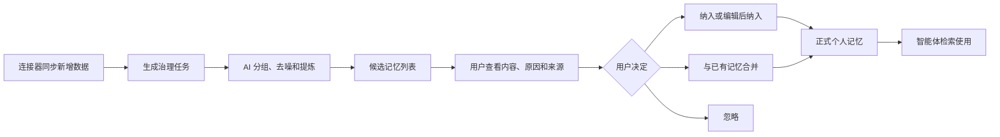

# Smallink 个人记忆模块产品需求文档

版本：1.2
更新日期：2026-08-21
产品阶段：Smallink Beta 的正式记忆模块
关联文档：[Smallink 产品技术架构设计](./link-technical-design.md)、[Smallink 个人记忆模块技术方案](./link-memory-technical-design.md)

## 1. 文档结论

旧数据原型的记忆页面只验证了部分交互，没有完整数据闭环；现有执行内核的记忆能力只是一组可直接增删的简单文本。两者都不能作为正式记忆模块直接迁移。

本次建设采用以下原则：

- 保留旧数据原型已确认的记忆类型、候选列表、来源解释、批量处理和人工确认等产品规则。
- 保留 Smallink 执行内核在任务中使用长期记忆的场景。
- 不继承旧 Mock 数据、没有真实后端支撑的页面逻辑和简单 `MemoryStore`。
- 以 Postgres 重新建设候选记忆、正式记忆、版本、来源、关系和检索能力。
- AI 负责分析和提出建议，用户拥有正式记忆的最终决定权。

> **当前进度（2026-08-21，SQLite 过渡实现）**：已贯通 `sensory_records` 原始池、真实模型 Provider、按批治理任务、独立候选记忆、人工单条/批量纳入或忽略、批量调整类型、正式记忆、版本/来源/决定记录、归档恢复，以及 `global`、`workspace`、`session` 三种作用域的对话检索注入与使用留痕。自动治理默认关闭，用户可配置周期和批量大小；每次只领取新增 `pending` 记录。知识层已提供项目级条目、版本、切片、FTS5/BM25 混合词法检索和来源解释。Codex、TRAE 同步适配器保留在后端，当前客户端按产品策略只展示 MineM 应用。尚未完成 Postgres/pgvector 迁移、向量语义召回、记忆冲突任务和提示词评估。

## 2. 产品定位

Smallink 个人记忆模块用于保存用户希望长期保留，并希望未来智能体能够正确使用的个人结论。

它回答的是：

- 用户长期偏好什么？
- 某个项目的背景、目标和限制是什么？
- 用户已经做过哪些产品或技术决策？
- 用户做决定时采用了什么思考过程？
- 还有哪些问题没有解决？
- 哪些方法和工作习惯以后可以复用？
- 哪些重要产物或文档值得长期记住？

个人记忆不是原始聊天记录的备份，也不是文档全文仓库。原始记录由 `sensory_records` 保存，文档正文由知识库保存，个人记忆只保存从这些事实中形成的长期结论。

## 3. 初学者术语

| 术语 | 白话解释 |
|---|---|
| 工作记忆 | 当前任务中的临时计划、待办和摘要，任务完成后不一定长期保留 |
| 候选记忆 | AI 提炼出来、等待用户确认的记忆草稿 |
| 正式记忆 | 用户确认后进入个人记忆库的长期内容 |
| 来源证据 | 支撑一条记忆的原始对话、文档或工具记录 |
| 版本 | 一条记忆每次修改时保留下来的历史内容 |
| 合并 | 把多条表达相同或互相补充的记忆整理成一条 |
| 冲突 | 新信息与已有记忆不一致，例如用户的技术选型已经改变 |
| 归档 | 记忆暂时不再使用，但仍保留历史和来源 |
| 物理删除 | 从存储中彻底清除数据，普通归档不等于物理删除 |
| 记忆关系 | 两条记忆之间的联系，例如支持、冲突、属于或替代 |
| 项目空间 | 把某个项目相关的数据、记忆、知识、任务和产物组织在一起 |

## 4. 产品目标

### 4.1 核心目标

1. 将 Codex、Link、飞书、本地文件等授权来源中的高价值信息提炼为可读的候选记忆。
2. 允许用户清楚看到 AI 为什么形成候选记忆，以及引用了哪些原始数据。
3. 让用户通过纳入、编辑、合并或忽略完成最终治理。
4. 确认后的记忆立即进入对应类型，并能够被未来智能体检索使用。
5. 记忆修改必须保留历史版本、来源和修改原因。
6. 允许项目记忆与用户全局记忆同时存在。
7. 防止 AI 无依据地生成记忆、反复总结自身内容或直接改写用户资产。

### 4.2 体验目标

- 用户读得懂候选记忆，而不是看到内部编号和机器日志。
- 用户最多点击两次即可从候选查看来源。
- 批量处理后，数量、任务状态和个人记忆库立即发生真实变化。
- 页面刷新和应用重启后，已完成动作不会丢失。
- 智能体使用某条记忆时，用户能够知道引用了什么。

## 5. 当前交付边界

以下内容是当前交付范围和可信边界，不构成 Link 长期架构上限：

- 不直接接入 mem0 作为运行依赖，只参考其记忆提取和更新思路。
- 不允许 AI 默认自动确认正式记忆。
- 不把所有原始记录逐条生成记忆。
- 不把记忆树作为物理文件夹存储。
- 不单独建设“搜索中心”一级页面。
- 当前优先交付个人记忆；数据模型预留所有者和作用域，未来可以扩展协作记忆。
- 不让智能体直接彻底删除正式记忆。
- 不在数据治理没有来源证据时生成正式记忆。

## 6. 三层记忆模型

### 6.1 工作记忆

工作记忆服务于当前任务，例如：

- 当前执行计划。
- 待办事项。
- 临时文件位置。
- 子智能体返回的中间报告。
- 当前任务摘要。

工作记忆由智能体运行层维护。任务完成后可以归档为任务记录，但不会自动进入个人长期记忆。

### 6.2 候选记忆

候选记忆由 AI 根据一组相关原始数据生成，例如：

> 用户倾向优先选择轻量、容易维护的个人部署架构。

它必须同时提供：

- 为什么值得记住。
- 记忆类型。
- 置信度。
- 引用的原始记录。
- 关键原文片段。
- 与已有记忆是否重复或冲突。

候选记忆属于数据治理模块，状态为待确认时不能被普通任务当作正式记忆使用。

### 6.3 正式记忆

正式记忆由用户确认产生，并进入个人记忆库。

正式记忆可以：

- 被智能体检索。
- 关联项目空间。
- 被用户编辑、合并和归档。
- 保留所有历史版本。
- 显示形成它的原始证据。

## 7. 记忆类型

Link 内置十种标准记忆类型：

| 类型 | 中文名称 | 保存内容 | 示例 |
|---|---|---|---|
| `user_preference` | 用户偏好 | 用户长期偏好的工具、交互、风格或方案 | 偏好轻量架构和较少维护工作 |
| `project_context` | 项目背景 | 项目目标、范围、限制和当前阶段 | Link 当前正在收敛执行、数据和记忆主线 |
| `product_decision` | 产品决策 | 已经明确采用或放弃的产品方案 | 检索不做成独立一级页面 |
| `reasoning_process` | 思考过程 | 用户如何分析和得出结论 | 先确认设计原因，再评价架构问题 |
| `open_question` | 未解决问题 | 需要后续继续处理的问题 | 桌面版如何自动管理本地 Postgres |
| `reusable_pattern` | 可复用方法 | 可以在其他任务中重复使用的流程或方法 | 先打通原始池，再接 AI 治理 |
| `work_habit` | 工作习惯 | 用户反复出现的工作节奏和操作习惯 | 先讨论清楚再修改代码 |
| `artifact_summary` | 产物摘要 | 重要代码、文档、报告或设计的摘要 | 已生成 Link 重构技术设计 |
| `document_insight` | 文档洞察 | 从文档中提取的核心观点和结论 | Link 优先服务本地单用户任务 |
| `life_memory` | 生活记忆 | 与工作无关但值得长期保留的生活信息 | 用户计划在某个时间完成个人事项 |

默认治理提示词只使用这十种标准类型，避免类型过多导致 AI 分类不稳定。底层类型注册表允许未来由用户、项目或插件扩展，并通过类型版本保证历史记忆仍可解释。

## 8. 记忆来源

候选记忆可以来自：

- Codex 用户输入和 Codex 输出。
- Codex 工具、技能和 CLI 记录。
- Link 工作台的用户输入、AI 输出和工具记录。
- 飞书文档、妙记、会议纪要和知识库。
- 用户授权的本地文件。
- 后续连接器同步的数据。
- 用户手动创建的记忆。

来源约束：

- 所有自动生成的候选记忆必须至少关联一条原始记录。
- 一个候选可以引用多条原始记录。
- 一条正式记忆可以在后续版本中增加新来源。
- 手动创建的记忆将来源标记为“用户手动输入”。
- AI 生成的候选和正式记忆本身不得重新作为新的原始来源被反复治理。

## 9. 完整用户流程



### 9.1 从同步到候选

1. 数据连接器完成一次增量同步。
2. 系统根据新增原始记录范围创建治理任务。
3. AI 按会话、时间、项目和主题组成内容组。
4. AI 去除没有长期价值的编号、重复日志和临时状态。
5. AI 从内容组中生成零条或多条候选记忆。
6. 治理任务进入“待人工确认”状态。
7. 数据治理导航和任务卡片显示待处理红点。

### 9.2 处理候选

1. 用户进入治理任务详情页。
2. 页面直接显示候选记忆列表，不再先展示大块流程说明。
3. 每条候选显示类型、标题、内容、原因、置信度和来源数量。
4. 用户点击“查看来源”，通过弹窗查看原始记录。
5. 用户选择纳入、编辑后纳入、合并或忽略。
6. 操作成功后，该候选立即从待处理列表移出。
7. 没有待处理候选时，治理任务自动完成。

### 9.3 从候选进入正式记忆

用户点击纳入后：

1. 系统创建或更新正式记忆。
2. 保存第一条或下一条记忆版本。
3. 关联候选引用的全部原始来源。
4. 记录用户做出的治理决定。
5. 更新记忆类型卡片数量。
6. 个人记忆列表立即可以看到新内容。

### 9.4 智能体使用记忆

1. 用户在工作台发起任务。
2. 系统根据任务、项目空间和关键词检索相关正式记忆。
3. 只把最相关的少量记忆交给智能体。
4. 任务记录保存本次引用的记忆 ID 和版本。
5. 用户可以在任务详情中查看“本次使用的记忆”。

## 10. 信息架构

### 10.1 数据治理中的候选记忆

候选记忆仍然位于：

```text
数据治理
└── 治理任务列表
    └── 治理任务详情
        └── 候选记忆列表
```

候选记忆不直接显示在个人记忆首页，因为它还没有被用户确认。

### 10.2 个人记忆

```text
个人记忆
├── 十种类型卡片
├── 类型记忆列表
└── 记忆详情弹窗或侧边面板
```

### 10.3 项目空间

```text
项目空间
└── 某个项目
    ├── 概览
    ├── 任务
    ├── 数据
    ├── 记忆
    ├── 知识
    └── 产物
```

项目空间中的“记忆”是对正式记忆的关联视图，不复制数据。

## 11. 页面需求

### 11.1 个人记忆首页

首页展示十张记忆类型卡片。

卡片字段：

- 类型名称。
- 一句话解释。
- 当前有效记忆数量。
- 最近更新时间。
- 待处理冲突或修改建议数量。

交互：

- 点击卡片进入该类型的独立列表页。
- 首页不直接展开记忆详情。
- 没有数据时显示真实空状态，不生成 Mock 记忆。
- 类型数量来自正式记忆数据，不包含候选和归档记忆。

### 11.2 类型记忆列表

列表字段：

- 标题。
- 两行内容摘要。
- 所属项目空间。
- 来源数量。
- 当前版本。
- 最近更新时间。
- 状态。

支持：

- 关键词搜索。
- 项目空间筛选。
- 有效、归档、已替代状态筛选。
- 更新时间排序。
- 分页或稳定的增量加载。

列表操作：

- 查看详情。
- 编辑。
- 合并。
- 归档。
- 恢复。

### 11.3 记忆详情

详情默认使用弹窗或侧边面板，内部独立滚动。

内容区域：

- 当前标题与完整内容。
- 记忆类型。
- 所属项目空间。
- 创建时间和更新时间。
- 为什么形成。
- 来源记录列表。
- 历史版本。
- 相关记忆。
- 被哪些任务引用过。

来源记录默认折叠，用户点击后展开原文、来源连接器、容器、发生时间和来源位置。

### 11.4 手动新增记忆

用户可以直接新增正式记忆。

必填字段：

- 记忆类型。
- 标题。
- 内容。

可选字段：

- 项目空间。
- 形成原因。
- 关联来源。

手动新增由用户本人发起，不需要经过候选确认；系统仍然创建第一条版本，并将创建者标记为用户。

### 11.5 编辑记忆

编辑时显示当前内容，用户提交后：

- 原版本保持不变。
- 创建新版本。
- 用户可以填写修改原因。
- 当前记忆指向新版本。

### 11.6 合并记忆

用户选择两条或多条记忆后，系统展示：

- 原记忆内容。
- AI 建议的合并标题与正文。
- 所有来源的合并结果。
- 合并后保留的项目空间和关系。

用户确认后：

- 创建新的合并版本或目标记忆。
- 原记忆状态变为已替代。
- 所有原始来源仍然可以追溯。

### 11.7 归档与恢复

- 归档后不再默认提供给智能体。
- 归档内容仍可搜索和查看。
- 用户可以恢复为有效状态。
- 物理删除放在单独的数据管理操作中，并进行二次确认。

## 12. 候选记忆列表

每条候选显示：

- 选择框。
- 记忆类型。
- 标题。
- 可读的候选内容。
- AI 提炼原因。
- 置信度。
- 引用来源数量。
- 重复或冲突提示。
- 纳入、编辑、合并、忽略操作。

批量操作：

- 批量纳入。
- 批量忽略。
- 批量调整类型。
- 清空选择。

批量处理要求：

- 操作前显示数量。
- 操作中禁用重复点击。
- 部分失败时明确显示成功和失败条数。
- 成功项立即从待处理列表中移除。
- 处理完最后一条后，治理任务自动完成。

> **实现状态（2026-08-20）**：批量纳入和批量忽略已实现，支持部分失败反馈与成功项即时移除；批量调整类型仍待实现。

## 13. AI 能力

### 13.1 AI 必须完成

- 判断一组数据是否具有长期价值。
- 跨多条记录合并同一主题。
- 去掉编号、调试日志、重复命令和临时状态。
- 区分用户观点、AI 建议和工具事实。
- 按十种记忆类型输出。
- 生成用户读得懂的标题和内容。
- 说明提炼原因。
- 提供原始来源。
- 检查与已有记忆的重复和冲突。

### 13.2 AI 不得完成

- 没有来源就创造用户偏好。
- 将 Codex 或 Link 智能体的建议错误描述为用户已经确认的决定。
- 将一次临时操作直接判断为长期习惯。
- 直接删除、覆盖或确认正式记忆。
- 将内部 ID、哈希或工具参数作为主要记忆正文。

### 13.3 模型与提示词

设置中提供：

- 治理模型配置。
- 记忆整理模型配置。
- 默认治理提示词。
- 提示词版本。
- 测试运行入口。

系统默认使用 Link 当前配置的主模型能力。后续支持 OpenAI 协议和 Ollama，但模型切换不改变候选记忆的数据结构。

## 14. 状态设计

### 14.1 候选记忆状态

| 状态 | 含义 |
|---|---|
| `pending` | 等待用户处理 |
| `accepted` | 已纳入正式记忆 |
| `merged` | 已合并到其他记忆 |
| `ignored` | 用户已忽略 |
| `superseded` | 被重新生成的候选替代 |
| `failed` | 处理失败，可重试 |

### 14.2 正式记忆状态

| 状态 | 含义 |
|---|---|
| `active` | 正常使用并可被智能体检索 |
| `archived` | 暂停使用但保留历史 |
| `superseded` | 已被其他记忆替代 |
| `purged` | 完成受控物理删除，仅保留必要审计结果 |

### 14.3 治理任务状态

| 状态 | 含义 |
|---|---|
| `pending` | 等待 AI 处理 |
| `running` | AI 正在分析 |
| `reviewing` | 候选已生成，等待用户处理 |
| `completed` | 所有候选已经处理 |
| `failed` | AI 或数据处理失败 |
| `cancelled` | 用户取消 |

## 15. 红点与数量

出现以下情况时显示红点：

- 数据治理存在 `reviewing` 任务。
- 当前治理任务存在 `pending` 候选。
- 正式记忆存在待处理冲突或修改建议。

红点数字必须来自真实待处理数量，不使用前端写死数字。

处理完成后：

- 候选待处理数立即减少。
- 治理任务红点在最后一条处理完成后消失。
- 新正式记忆的类型卡片数量立即增加。

## 16. 异常与空状态

必须设计以下状态：

- 没有任何正式记忆。
- 某一类型没有记忆。
- 治理任务没有生成候选。
- AI Provider 未配置。
- AI 返回格式不合法。
- 原始来源已被用户清除。
- 候选已经被其他操作处理。
- 批量操作部分成功。
- 数据库写入失败。
- 应用刷新后任务仍在运行。

错误信息使用用户可理解的语言，同时提供可以重试或返回的操作。

## 17. 隐私与控制

- 只有用户授权的数据可以进入原始池。
- 密钥、密码和 Token 不生成记忆。
- 高敏感来源可以设置为“不参与 AI 治理”。
- 记忆详情显示敏感等级。
- 用户可以导出个人记忆和来源关系。
- 用户可以归档或受控清除记忆。
- AI 调用前应遵守当前模型配置的数据发送范围。
- 本地模型和云端模型必须明确显示数据是否离开本机。

## 18. 模块验收标准

### 18.1 候选生成

- AI 可以从一组真实 `sensory_records` 生成零条或多条候选。
- AI 可以把同一主题的多条对话合并为一条候选。
- 每条候选都包含类型、标题、内容、原因、置信度和至少一个来源。
- 候选正文不以内部 ID、哈希或无意义日志为核心内容。

### 18.2 人工治理

- 支持单条纳入、编辑后纳入、合并和忽略。
- 支持批量纳入和批量忽略。
- 重复点击不会生成重复记忆。
- 操作后候选数量、任务状态和红点正确变化。
- 所有候选处理完成后任务自动完成。

### 18.3 正式记忆

- 新记忆立即出现在正确类型卡片和列表中。
- 详情可以查看来源、原因、版本和项目空间。
- 编辑创建新版本，不覆盖历史版本。
- 合并保留所有来源。
- 归档后不再默认提供给智能体。

### 18.4 智能体调用

- 工作台能够按任务检索相关正式记忆。
- 候选和归档记忆不进入默认检索结果。
- 任务详情能够显示引用的记忆和版本。
- 没有相关记忆时，智能体仍可正常完成任务。

### 18.5 数据可靠性

- “纳入成功”与正式记忆、版本、来源、治理决定使用同一个数据库事务。
- 页面刷新后数据和状态不丢失。
- Postgres 是正式记忆的唯一事实源。
- 不依赖 Mock 数据、generated snapshot 或 mem0 服务。

## 19. 分阶段交付

### M1：记忆数据内核

- 建立正式记忆、版本、来源和状态。
- 支持手动新增、编辑、归档和恢复。
- 完成十种类型卡片与列表。

### M2：候选到正式记忆闭环

- 建立候选记忆、来源和治理决定。
- 完成单条与批量处理。
- 完成可靠入库事务和治理任务完成逻辑。

### M3：AI 提炼

- 接入真实 Provider。
- 完成分组、去噪、提炼、查重和冲突建议。
- 设置中支持提示词查看、编辑、版本和测试。

### M4：智能体记忆调用

- 建立上下文构建器。
- 完成关键词和语义检索。
- 任务记录保存引用记忆。

### M5：关系与树形视图

- 建立记忆关系。
- 在数据治理中展示关系视图。
- 在个人记忆中支持按主题树形展开。

## 20. 产品成功判断

记忆模块成功不是“数据库里有很多记忆”，而是：

- 用户能够理解每条记忆为什么存在。
- 用户能够追溯它来自哪里。
- AI 不会把无意义日志当成长期结论。
- 用户修正一次后，系统保留修正并在未来任务中使用正确版本。
- Link 能够基于这些记忆更快、更准确地继续长期工作。
