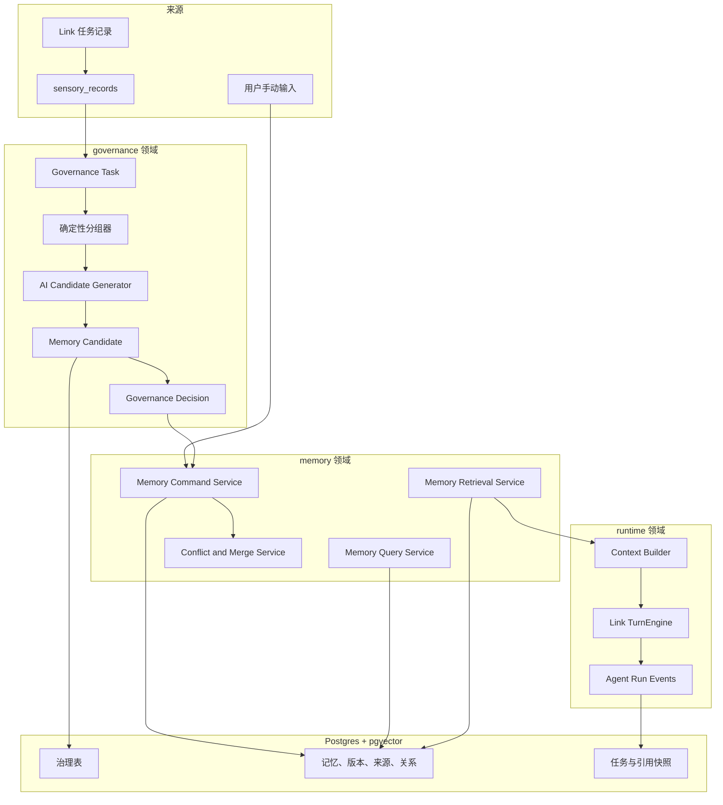

# Smallink 个人记忆模块技术方案

版本：1.2
更新日期：2026-08-21
关联文档：[Smallink 个人记忆模块 PRD](./link-memory-prd.md)、[Smallink 产品技术架构设计](./link-technical-design.md)、[Smallink Postgres 迁移运行手册](./smallink-postgres-migration-runbook.md)

> **本文档分两部分**：第 0 章记录**当前已落地的实现**（SQLite 过渡版，代码事实）；第 1 章起是**目标架构**（Postgres + pgvector，尚未实现）。阅读时请先分清“已实现”与“目标”，不要把目标章节当作已上线能力。

## 0. 当前已实现（SQLite 过渡实现，2026-08-21）

当前实现已经贯通从不可变原始数据到智能体读取正式记忆的完整闭环。AI 只生成候选，用户通过单条或批量决定把候选纳入正式记忆或忽略；只有 `active` 正式记忆会按作用域和相关性进入对话上下文。

### 0.1 当前数据流

```text
外部采集者（agent / 连接器 / 脚本）
      │  POST /v1/sensory-records
      ▼
sensory_records（不可变原始层，内容哈希幂等，governance_status='pending'）
      │  AI Provider 分析与治理任务领取
      ▼
governance_tasks + memory_candidates（类型、范围、理由、置信度、来源）
      │  用户单条/批量接受、编辑、合并或忽略
      ▼
memories（active）+ memory_history + memory_sources + memory_decisions
      │  global / workspace / session 作用域过滤 + 关键词相关性 + 字符预算
      ▼
Agent Context（记录实际使用的记忆版本）
```

### 0.2 已实现清单（代码事实）

| 能力 | 实现位置 | 说明 |
|---|---|---|
| 通用 ingest 端点 | `POST /v1/sensory-records`（`server/app.py`）→ `manager.ingest_sensory_record` | 外部采集者写原始数据；复用 `SQLiteSensoryStore.add`；缺必填字段返回 400；靠 `(source_type,external_id,content_hash)` 天然幂等；鉴权由全局 `require_sidecar_token` 中间件覆盖 |
| ingest 契约 | 请求体：`{source_type, content_type, raw_content, external_id?, normalized_content?, occurred_at?, connector_id?, account_id?, project_path?, conversation_id?, sensitivity?, metadata?, source_locator?}` | 未来本地连接器 / 外部采集 agent 均往此端点 POST |
| 记忆 schema 扩展 | `memory/base.py`、`memory/sqlite_store.py` | `memories` 表加 `status`（默认 active）、`updated_at`、`source_record_id`；房内既有风格的加法迁移（`ALTER TABLE ... ADD COLUMN` + `except OperationalError`），旧行自动回填 `status='active'` 不丢数据 |
| 版本历史 | `memory_history` 表 + `list_history()`（`memory/sqlite_store.py`） | 每次 add/update/delete 写一行 `old_content/new_content/event`（ADD/UPDATE/DELETE），仿 mem0 history 表 |
| 处理管道 | `memory/pipeline.py` `MemoryPipeline` | 一次 LLM 调用同时完成清洗+类型标记+分层；`memory_type` 取 10 种类型之一（`MEMORY_TYPES`，与 `MemoryView.tsx` 对齐）；scope 映射 global/workspace/session，兜底按 `project_path` 判定；产出 `status='pending'` + 溯源 |
| LLM 失败兜底 | `MemoryPipeline.process`（`_write_fallback`） | 解析失败/空/异常时，把原文存为 1 条 `key=None` 的 pending 记忆，**绝不抛错**，保证采集意图不丢 |
| 幂等重跑 | `MemoryPipeline.select_unprocessed` | 已处理判定来自 `memories.source_record_id` 集合（不改原始层）；重跑不重复产出 |
| pending 隔离不变量 | `MemoryStore.list(status="active")` 默认 | 默认只返回 active，pending 永不进 `agent.py` 注入、永不进 `GET /v1/memory` 确认视图；`?status=pending` / `?status=all` 仅用于查验 |
| 管道触发 | `POST /v1/memory/pipeline/run`（`asyncio.to_thread` 卸载阻塞 LLM）→ `manager.run_memory_pipeline` | 保留手动触发；正式治理另有增量调度器 |
| 治理任务与候选 | `governance_tasks`、`memory_candidates`、治理路由 | Provider 分析后生成独立候选，保留来源、理由、类型、作用域与置信度；失败可重试 |
| 人工决定 | 单条 decision 路由与 `POST /v1/memory/candidates/batch/decision` | 支持单条或批量接受/忽略；批量返回成功项与部分失败；接受操作在事务中写正式记忆、来源、版本和决定 |
| 候选批量分类 | `POST /v1/memory/candidates/batch/type` | 对选中候选统一调整十种标准记忆类型，不改变来源和 AI 理由 |
| 正式记忆归档 | `POST /v1/memory/{id}/archive`、`POST /v1/memory/{id}/restore` | 归档后退出默认检索，来源、历史和版本不删除；恢复后重新进入 active 集合 |
| 增量自动治理 | `GET/PATCH /v1/memory/governance/schedule` + `SessionManager` 后台循环 | 默认关闭；支持 15 分钟到 7 天周期和 1-500 条批量；只处理新增 pending 原始记录并记录最近执行结果 |
| 治理任务列表 | `GET /v1/memory/governance/tasks`、`GET /v1/memory/governance/tasks/{task_id}` | 列表展示待处理/审阅中/完成状态；候选全部作出决定后任务自动完成 |
| 对话检索注入 | `agent.py` context provider | 仅查询 active 记忆；按 global、当前 workspace、当前 session 隔离，再按关键词相关性和字符预算注入，并记录使用版本 |
| 项目知识检索 | `knowledge/store.py`、`knowledge/tools.py`、`server/routers/knowledge.py` | 知识条目版本化切片，使用 FTS5/BM25、查询词覆盖和精确短语进行可解释混合词法排序；返回 source_record_id/source_locator 引用 |
| Codex 本地数据源 | `codex` connector → `POST /v1/connectors/codex/sync` | 用户授权 `~/.codex` 后按会话轮次增量导入，写入 `source_type='codex'` |
| TRAE CLI 本地数据源 | `traex` connector → `POST /v1/connectors/traex/sync` | 用户授权 `~/.trae` 后读取 `cli/sessions`；只导入用户主线程和已有 `task_complete` 的轮次，排除子智能体与运行中尾部，写入 `source_type='traex'` |

### 0.3 端到端验证

```bash
# 1. 采集原始数据
curl -X POST localhost:<port>/v1/sensory-records -H "X-Link-Token: $LINK_API_TOKEN" \
  -H 'Content-Type: application/json' \
  -d '{"source_type":"notes","content_type":"document","raw_content":"我一直用 pnpm 部署，从不用 npm","external_id":"note-1","project_path":"/proj"}'
# → {record_id, governance_status:"pending", ...}

# 2. 跑管道
curl -X POST localhost:<port>/v1/memory/pipeline/run -H "X-Link-Token: $LINK_API_TOKEN" -d '{}'
# → {processed_records:1, memories_created:1, fallbacks:0}

# 3a. 确认视图为空（证明 pending 不泄漏）
curl localhost:<port>/v1/memory -H "X-Link-Token: $LINK_API_TOKEN"          # {"memory": []}
# 3b. 查验 pending（typed + scoped + 溯源）
curl "localhost:<port>/v1/memory?status=pending" -H "X-Link-Token: $LINK_API_TOKEN"

# 4. 重跑幂等 → {processed_records:0, memories_created:0, fallbacks:0}
```

测试覆盖：`tests/test_memory_pipeline.py`（typed 抽取 / 多事实 / 坏 JSON 兜底 / provider 异常兜底 / 幂等 / 空 facts）、`tests/test_sensory.py`（ingest 写入 / 幂等 / 缺字段 400）、`tests/test_memory.py`（迁移回填 active / pending 排除 / 版本历史 / 作用域检索）、`tests/test_memory_governance_lifecycle.py`（任务状态、批量分类、归档恢复、增量调度）、`tests/test_knowledge.py`（入库、版本、切片、项目隔离、排序解释和引用）。

### 0.4 当前仍未完成

尚未完成：记忆冲突任务、提示词评估、Postgres/pgvector 迁移、向量语义召回和 Token 级上下文预算。MineM 已进入应用中心并拥有 `system:minem`、素材列表/详情/搜索/改名/删除/导入、来源沉淀和项目知识索引；完整可嵌入工作台及 MineM 全量领域能力仍需通过版本化 Public UI API/Workspace Bridge 接入。

### 0.5 过渡实现与目标的映射

| 目标章节（下文） | 本期过渡实现 | 差距 |
|---|---|---|
| §7.9 `memory.memories`（Postgres，版本表分离） | `memories` 表内联正文 + 加 status/source_record_id | 正文未拆版本表；无 project_space_id |
| §7.10 `memory_versions` | `memory_history`（old/new/event 行） | 是变更留痕，非“当前版本指针 + 不可变版本”模型 |
| §4/§8 governance 候选与治理任务 | 已有独立治理任务、候选、来源、批量分类、用户决定和增量调度 | 冲突任务和提示词评估未完成 |
| §14 Context Builder 检索注入 | 记忆已有作用域、关键词相关性、字符预算和使用记录；知识已有可解释混合词法排序 | 向量语义评分、Token 级预算和效果反馈未完成 |

---

## 1. 技术结论（目标架构）

Smallink 记忆模块的目标架构采用 Postgres 重新实现，不迁移旧数据原型的半成品页面逻辑，也不直接使用执行内核中的简单 `MemoryStore`。

正式技术边界：

- `sensory_records` 保存不可被 AI 覆盖的原始事实。
- `governance` 保存治理任务、AI 分析、候选记忆和用户决定。
- `memory` 保存用户确认后的正式记忆、版本、来源和关系。
- `runtime` 保存智能体运行、工作记忆和上下文引用。
- AI 只能写候选区。
- 正式记忆只能通过统一的 Memory Command Service 写入。
- 候选入库使用单个数据库事务，任何一步失败都整体撤销。
- Postgres 是唯一业务事实源，pgvector 提供后续语义检索。

## 2. 当前实现判断

### 2.1 Link 旧数据原型

旧数据原型已收敛为数据接入验证版本：

- 保留 `sensory_records`、连接器同步和运行配置。
- 已删除正式治理、候选记忆、个人记忆、知识库和检索的主流程。
- 历史页面与 Mock 数据不具备可靠的数据库状态转换。

因此不存在可以直接复制到新系统的正式 Memory Service。

### 2.2 Link 执行内核

执行内核原有记忆结构包含：

- `MemoryStore` 抽象。
- SQLite 记忆实现。
- `global`、`workspace` 和 `session` 三种范围。
- `memory_add`、`memory_update` 和 `memory_forget` 旧工具实现；默认 Link 智能体已停止注册这些直接写入工具。
- 将较多记忆直接拼入系统提示词的逻辑。

它适合作为早期桌面智能体的偏好文本，但缺少：

- 候选状态。
- 原始来源证据。
- 记忆版本。
- 重复、冲突和合并。
- 人工确认。
- 项目空间关系。
- 检索引用记录。
- 可恢复的治理任务。

### 2.3 迁移决定

| 内容 | 处理方式 |
|---|---|
| Link 十种记忆类型 | 保留 |
| 候选列表与批量处理产品规则 | 保留并重写 |
| 来源、原因与人工确认规则 | 保留并加强 |
| Link 旧 Mock 数据 | 不迁移 |
| Link 历史正式数据 | 如果发现，导入为待确认候选 |
| Link SQLite 记忆 | 导入为待确认候选 |
| Link `MemoryStore` 正式写入 | 停止使用 |
| Link 记忆读取场景 | 由 Context Builder 替代 |

## 3. 初学者术语

| 术语 | 白话解释 |
|---|---|
| Domain 领域模块 | 只负责一种业务规则的代码区域，例如记忆模块只处理记忆 |
| Service 领域服务 | 执行完整业务动作的代码，例如“确认候选并创建正式记忆” |
| Repository 数据仓库层 | 负责读写数据库的代码，不在页面中直接写 SQL |
| Command 写操作 | 会改变系统状态的请求，例如纳入、编辑、归档 |
| Query 读操作 | 只读取数据的请求，例如记忆列表 |
| Transaction 事务 | 一组写操作全部成功才提交，否则全部撤销 |
| Row Lock 行锁 | 某条记录正在处理时暂时锁住，防止重复点击同时修改 |
| Migration 数据库迁移 | 用有版本的脚本逐步改变数据库结构 |
| Schema 数据库命名空间 | Postgres 中用于分类表的区域，类似数据库内部文件夹 |
| Structured Output 结构化输出 | 要求 AI 严格按规定字段返回 JSON，而不是自由发挥文本 |
| Embedding 向量 | 把一段文字转换成数字，用于寻找语义相近内容 |
| Hybrid Retrieval 混合检索 | 同时使用关键词、向量、项目范围等方式查找内容 |
| Idempotency Key 幂等键 | 防止同一个按钮请求重复执行的唯一编号 |
| Outbox Event 事务事件 | 与业务写入一起保存、稍后可靠通知其他模块的事件 |

## 4. 总体架构



## 5. 代码边界

### 5.1 目标模块目录

记忆能力直接进入 Link 模块化主线，不建立第二层 `link/link` 兼容目录：

```text
link/
  platform/
    db/
      base.py
      session.py
      migrations/
  governance/
    models.py
    schemas.py
    repository.py
    service.py
    ai_pipeline.py
    prompts.py
  memory/
    models.py
    schemas.py
    repository.py
    service.py
    retrieval.py
    conflicts.py
  agent_runtime/
    context.py
  api/
    governance_routes.py
    memory_routes.py
```

### 5.2 每层职责

| 文件类型 | 只负责什么 |
|---|---|
| `models.py` | 数据库表映射 |
| `schemas.py` | API 与 AI JSON 的字段验证 |
| `repository.py` | 数据库查询和写入 |
| `commands.py` | 纳入、编辑、合并、归档等完整写操作 |
| `queries.py` | 列表、详情、数量和筛选 |
| `retrieval.py` | 关键词和向量检索 |
| `conflicts.py` | 查重、冲突和合并建议 |
| `tools.py` | 智能体可调用的只读检索与候选提议工具 |
| `routes.py` | FastAPI 接口 |

页面和 API 不允许绕过领域服务直接修改记忆表。

## 6. 技术选型

### 6.1 数据库

- Postgres 16。
- `pgcrypto` 生成 UUID 或使用应用层 UUIDv7。
- `pgvector` 保存语义向量。
- `pg_trgm` 辅助中文标题和内容的模糊匹配。

### 6.2 Python 数据访问

建议使用：

- SQLAlchemy 2.0 Async。
- `asyncpg` 作为 Postgres 驱动。
- Alembic 管理数据库迁移。
- Pydantic 2 验证 API 和 AI 输出。

原因：

- SQLAlchemy 提供事务、关联和连接池。
- Alembic 让每次数据库结构变化都有版本，不再在应用启动时散落 `CREATE TABLE`。
- Pydantic 可以阻止 AI 返回缺字段或错误类型的数据直接入库。

### 6.3 后台任务

第一版不引入 Redis 和 Celery。

使用 Postgres `runtime.jobs` 表作为持久任务队列：

1. API 创建任务并写入数据库。
2. Link Core 内的 Job Runner 领取任务。
3. 通过 `FOR UPDATE SKIP LOCKED` 防止两个执行器领取同一任务。
4. 执行过程中持续更新心跳和事件。
5. 应用重启后重新领取超时任务。

这对个人单机产品足够轻量，同时比纯内存任务可靠。

## 7. 数据库设计

## 7.1 `governance.governance_tasks`

保存一次需要治理的数据范围。

| 字段 | 类型 | 说明 |
|---|---|---|
| `id` | UUID | 任务 ID |
| `source` | TEXT | Codex、Link、飞书等来源 |
| `connector_instance_id` | UUID 可空 | 具体连接器实例 |
| `sequence_from` | BIGINT | 本批最小接入序号 |
| `sequence_to` | BIGINT | 本批最大接入序号 |
| `status` | TEXT | pending/running/reviewing/completed/failed/cancelled |
| `record_count` | INTEGER | 原始记录数量 |
| `candidate_count` | INTEGER | 候选总数 |
| `pending_candidate_count` | INTEGER | 待处理数量 |
| `prompt_version_id` | UUID 可空 | 使用的提示词版本 |
| `model_profile_id` | UUID 可空 | 使用的模型配置 |
| `error_code` | TEXT 可空 | 机器可判断的错误 |
| `error_message` | TEXT 可空 | 用户可查看的错误说明 |
| `created_at` | TIMESTAMPTZ | 创建时间 |
| `started_at` | TIMESTAMPTZ 可空 | 开始时间 |
| `completed_at` | TIMESTAMPTZ 可空 | 完成时间 |

约束：

- `sequence_from <= sequence_to`。
- 同一连接器实例、同一序号范围不得重复创建有效任务。
- 任务完成时 `pending_candidate_count = 0`。

## 7.2 `governance.governance_task_records`

明确治理任务包含哪些原始记录。

| 字段 | 类型 | 说明 |
|---|---|---|
| `task_id` | UUID | 治理任务 |
| `sensory_record_id` | UUID | 原始记录 |
| `group_key` | TEXT 可空 | AI 分析前的内容组 |
| `processing_status` | TEXT | selected/processed/skipped/failed |

主键为 `(task_id, sensory_record_id)`。

## 7.3 `governance.ai_analyses`

保存一次可重跑的 AI 分析。

| 字段 | 类型 | 说明 |
|---|---|---|
| `id` | UUID | 分析 ID |
| `task_id` | UUID | 所属治理任务 |
| `group_key` | TEXT | 本次分析的数据组 |
| `model_profile_id` | UUID | 模型配置 |
| `prompt_version_id` | UUID | 提示词版本 |
| `input_record_ids` | UUID[] | 输入原始记录 |
| `request_payload` | JSONB | 去密后的请求信息 |
| `response_payload` | JSONB | 通过验证的结构化输出 |
| `status` | TEXT | running/completed/failed |
| `token_usage` | JSONB | 模型用量 |
| `latency_ms` | INTEGER | 耗时 |
| `error_message` | TEXT 可空 | 错误 |
| `created_at` | TIMESTAMPTZ | 创建时间 |

不保存模型密钥。是否保存完整模型请求正文由隐私设置控制。

## 7.4 `governance.memory_candidates`

保存待用户确认的记忆建议。

| 字段 | 类型 | 说明 |
|---|---|---|
| `id` | UUID | 候选 ID |
| `task_id` | UUID | 所属治理任务 |
| `analysis_id` | UUID | 来自哪次 AI 分析 |
| `proposal_kind` | TEXT | create/update/merge/archive |
| `memory_type` | TEXT | 十种记忆类型之一 |
| `title` | TEXT | 候选标题 |
| `content` | TEXT | 候选正文 |
| `reason` | TEXT | 为什么值得记住或修改 |
| `confidence` | NUMERIC(4,3) | 0 到 1 |
| `scope_type` | TEXT | global/project |
| `project_space_id` | UUID 可空 | 所属项目空间 |
| `status` | TEXT | pending/accepted/merged/ignored/superseded/failed |
| `dedupe_fingerprint` | TEXT | 标准化内容指纹 |
| `conflict_summary` | TEXT 可空 | 冲突说明 |
| `created_at` | TIMESTAMPTZ | 创建时间 |
| `resolved_at` | TIMESTAMPTZ 可空 | 用户处理时间 |

约束：

- `confidence` 在 0 到 1 之间。
- `scope_type = project` 时必须有 `project_space_id`。
- 候选进入终态后不能再次进入另一个终态。

## 7.5 `governance.candidate_sources`

保存候选引用的原始证据。

| 字段 | 类型 | 说明 |
|---|---|---|
| `candidate_id` | UUID | 候选 |
| `sensory_record_id` | UUID | 原始记录 |
| `source_role` | TEXT | primary/supporting/context |
| `excerpt` | TEXT | 支撑候选的原文片段 |
| `relevance` | NUMERIC(4,3) | 来源相关度 |
| `position` | INTEGER | 展示顺序 |

主键为 `(candidate_id, sensory_record_id)`。

AI 只能返回本次输入中的原始记录 ID。服务端必须验证来源 ID，防止模型引用不存在的数据。

## 7.6 `governance.candidate_targets`

保存候选建议更新、合并或替代哪些正式记忆。

| 字段 | 类型 | 说明 |
|---|---|---|
| `candidate_id` | UUID | 候选 |
| `memory_id` | UUID | 目标正式记忆 |
| `target_role` | TEXT | duplicate/update_target/merge_source/conflict |
| `similarity` | NUMERIC(4,3) | 相似度 |

## 7.7 `governance.governance_decisions`

保存用户最终决定。

| 字段 | 类型 | 说明 |
|---|---|---|
| `id` | UUID | 决定 ID |
| `candidate_id` | UUID UNIQUE | 每条候选只有一个最终决定 |
| `action` | TEXT | accept/edit_accept/merge/ignore |
| `result_memory_id` | UUID 可空 | 产生或更新的正式记忆 |
| `user_edit_payload` | JSONB | 用户编辑内容 |
| `reason` | TEXT 可空 | 用户处理原因 |
| `idempotency_key` | TEXT UNIQUE | 防重复请求 |
| `decided_at` | TIMESTAMPTZ | 决定时间 |

## 7.8 `governance.governance_watermarks`

保存每个来源已经治理到哪里。

| 字段 | 类型 | 说明 |
|---|---|---|
| `connector_instance_id` | UUID | 连接器实例 |
| `last_completed_sequence` | BIGINT | 最后完成治理的接入序号 |
| `last_task_id` | UUID | 最近完成任务 |
| `updated_at` | TIMESTAMPTZ | 更新时间 |

水位只在整个治理任务完成后推进，AI 分析完成但用户未处理时不推进。

## 7.9 `memory.memories`

保存正式记忆身份和当前状态。

| 字段 | 类型 | 说明 |
|---|---|---|
| `id` | UUID | 记忆 ID |
| `memory_type` | TEXT | 十种类型之一 |
| `scope_type` | TEXT | global/project |
| `project_space_id` | UUID 可空 | 项目范围 |
| `status` | TEXT | active/archived/superseded/purged |
| `current_version_id` | UUID | 当前版本 |
| `importance` | NUMERIC(4,3) | 检索重要度 |
| `sensitivity_level` | TEXT | normal/sensitive/restricted |
| `created_by` | TEXT | user/governance_import |
| `created_at` | TIMESTAMPTZ | 创建时间 |
| `updated_at` | TIMESTAMPTZ | 更新时间 |
| `archived_at` | TIMESTAMPTZ 可空 | 归档时间 |

正式记忆表不直接保存会被频繁覆盖的正文。标题和内容保存在版本表中。

## 7.10 `memory.memory_versions`

保存每一次不可修改的记忆版本。

| 字段 | 类型 | 说明 |
|---|---|---|
| `id` | UUID | 版本 ID |
| `memory_id` | UUID | 所属记忆 |
| `version_no` | INTEGER | 从 1 递增 |
| `title` | TEXT | 本版本标题 |
| `content` | TEXT | 本版本正文 |
| `reason` | TEXT | 创建或修改原因 |
| `change_kind` | TEXT | create/edit/merge/conflict_resolution/import |
| `source_candidate_id` | UUID 可空 | 来自哪个候选 |
| `created_by` | TEXT | user/system_migration |
| `created_at` | TIMESTAMPTZ | 创建时间 |

唯一约束为 `(memory_id, version_no)`。

版本创建后不允许修改。纠错通过创建下一版本完成。

## 7.11 `memory.memory_sources`

把正式记忆的某个版本与原始数据关联。

| 字段 | 类型 | 说明 |
|---|---|---|
| `memory_version_id` | UUID | 记忆版本 |
| `sensory_record_id` | UUID | 原始记录 |
| `source_role` | TEXT | primary/supporting/context |
| `excerpt` | TEXT | 引用片段 |
| `inherited_from_version_id` | UUID 可空 | 是否继承自旧版本 |

主键为 `(memory_version_id, sensory_record_id)`。

## 7.12 `memory.memory_relations`

保存记忆之间的关系。

| 字段 | 类型 | 说明 |
|---|---|---|
| `id` | UUID | 关系 ID |
| `from_memory_id` | UUID | 起点记忆 |
| `to_memory_id` | UUID | 终点记忆 |
| `relation_type` | TEXT | related_to/supports/contradicts/part_of/supersedes |
| `status` | TEXT | suggested/confirmed/rejected |
| `confidence` | NUMERIC(4,3) | AI 建议置信度 |
| `created_by` | TEXT | user/ai |
| `created_at` | TIMESTAMPTZ | 创建时间 |
| `confirmed_at` | TIMESTAMPTZ 可空 | 用户确认时间 |

AI 创建的关系默认为 `suggested`，不能直接成为确认关系。

## 7.13 `memory.memory_embeddings`

保存正式记忆当前版本的向量。

| 字段 | 类型 | 说明 |
|---|---|---|
| `memory_version_id` | UUID | 记忆版本 |
| `embedding_profile_id` | UUID | 使用的向量模型 |
| `embedding` | VECTOR | 向量 |
| `content_hash` | TEXT | 防止重复计算 |
| `created_at` | TIMESTAMPTZ | 创建时间 |

第一版固定一个标准向量维度并建立 HNSW 索引。更换向量模型时创建新的 embedding profile 并重新生成，不混用不同维度的距离。

## 7.14 `runtime.context_memory_refs`

记录一次智能体运行实际使用了哪些记忆。

| 字段 | 类型 | 说明 |
|---|---|---|
| `run_id` | UUID | 智能体运行 |
| `memory_id` | UUID | 记忆 |
| `memory_version_id` | UUID | 当时使用的版本 |
| `score` | NUMERIC | 检索分数 |
| `selection_reason` | TEXT | 为什么选中 |
| `position` | INTEGER | 注入顺序 |

这使用户可以查看“AI 当时看到了什么”，即使记忆后来发生修改，也能还原当时版本。

## 8. AI 候选生成流程

### 8.1 任务选择

治理任务根据 `sensory_records.ingest_sequence` 选择明确范围，不能每次扫描全部数据。

选择条件：

- 属于当前治理任务的连接器实例。
- 序号在 `sequence_from` 与 `sequence_to` 之间。
- 未被用户设置为禁止 AI 治理。
- 当前记录版本有效。

### 8.2 确定性预处理

在调用 AI 前，先用普通代码完成可以确定的工作：

- 按来源容器分组。
- 按时间窗口分段。
- 关联同一次工具调用的请求与结果。
- 关联用户输入与对应 AI 输出。
- 标记 CLI、工具、技能和附件。
- 去除完全重复记录。
- 计算敏感等级。
- 控制每组最大字符数和模型 Token。

普通代码先处理的原因是结果稳定、成本低，也方便重跑。

### 8.3 AI 结构化输出

AI 必须返回符合 Pydantic Schema 的 JSON：

```json
{
  "group_summary": "本组数据主要讨论了什么",
  "candidates": [
    {
      "proposal_kind": "create",
      "memory_type": "product_decision",
      "title": "Link 收敛为单一产品主线",
      "content": "Link 决定统一桌面执行、原始数据、治理和记忆能力，不再维护第二套产品。",
      "reason": "这是已经明确确认、会影响后续架构和开发顺序的长期产品决策。",
      "confidence": 0.94,
      "scope_type": "project",
      "project_space_id": "project-id",
      "source_record_ids": ["record-id-1", "record-id-2"],
      "source_excerpts": [
        {
          "record_id": "record-id-1",
          "excerpt": "我们可以基于 link 来进行改造"
        }
      ],
      "duplicate_candidates": [],
      "conflict_candidates": []
    }
  ]
}
```

服务端验证：

- 类型必须属于允许值。
- 来源 ID 必须来自本次输入。
- 标题和正文长度在限制内。
- 置信度在 0 到 1。
- 项目范围必须有项目空间。
- 不接受 Markdown 代码块包裹的伪 JSON。

格式不合法时最多自动修复重试一次；仍失败则保存错误并允许用户重新运行。

### 8.4 默认治理提示词

默认提示词由以下部分组成：

1. 角色：你是个人长期记忆整理助手。
2. 目标：从用户真实表达中提炼长期有价值的结论。
3. 类型定义：十种记忆类型及边界。
4. 排除规则：编号、日志、临时状态、AI 自己的建议不能冒充用户决定。
5. 来源规则：每条候选必须引用输入中的原始记录。
6. 合并规则：同一主题跨多条记录合并，不逐条机械总结。
7. 冲突规则：发现用户改变决定时提出更新或替代建议。
8. 输出 Schema：必须返回指定 JSON。

提示词保存在 `config.prompt_templates`，每次修改创建新版本。历史 AI 分析始终关联当时版本。

## 9. 去重、更新和冲突

### 9.1 去重顺序

1. 标准化标题和正文，计算精确指纹。
2. 检查来源是否高度重合。
3. 使用 pgvector 查找语义相近记忆。
4. 使用项目空间和记忆类型缩小范围。
5. 将最相近结果交给 AI 判断是重复、补充还是冲突。

AI 只提出建议，用户决定最终动作。

### 9.2 更新建议

新信息补充已有记忆时，候选使用 `proposal_kind = update` 并关联目标记忆。

用户确认后：

- 正式记忆身份不变。
- 创建下一版本。
- 新版本包含旧来源和新来源。
- 任务引用历史版本不受影响。

### 9.3 冲突建议

例如已有记忆是“Link 暂时使用 Ollama”，新数据明确表示“改成 Codex，不再使用本地模型”。

系统生成更新或替代候选，详情同时展示：

- 现有记忆。
- 新候选。
- 双方来源。
- AI 认为发生变化的原因。

用户可选择：

- 用新版本更新。
- 两条都保留并标记适用条件。
- 忽略新候选。

## 10. 正式入库事务

### 10.1 单条纳入

伪代码：

```python
async with database.transaction():
    candidate = await candidates.lock_for_update(candidate_id)
    assert candidate.status == "pending"
    assert request.idempotency_key_is_new()

    memory = await memories.create_identity(...)
    version = await memories.create_version(
        memory_id=memory.id,
        candidate=candidate,
        version_no=1,
    )
    await memories.attach_sources(version.id, candidate.sources)
    await memories.set_current_version(memory.id, version.id)
    await decisions.record(candidate.id, "accept", memory.id)
    await candidates.resolve(candidate.id, "accepted")
    await governance.decrement_pending_count(candidate.task_id)
    await governance.complete_task_if_empty(candidate.task_id)
    await outbox.append("memory.created", memory.id)
```

事务提交后：

- API 返回正式记忆 ID。
- 前端从待处理列表移除候选。
- Query Cache 更新类型数量和记忆列表。
- 后台任务生成向量。

向量生成失败不回滚正式记忆，只标记索引待重试，因为用户确认的记忆本身已经有效。

### 10.2 编辑后纳入

用户编辑后的标题、正文和类型保存在治理决定中，并用编辑结果创建正式版本。原始 AI 候选保持不变，便于以后比较 AI 建议和用户修正。

### 10.3 合并

合并事务需要：

1. 锁定候选和所有目标记忆。
2. 创建目标记忆新版本。
3. 汇总并去重来源。
4. 将被合并记忆标记为 `superseded`。
5. 建立 `supersedes` 关系。
6. 保存治理决定。
7. 更新任务数量和水位。

锁定记忆时统一按 UUID 排序，避免两个并发合并互相等待造成死锁。

### 10.4 忽略

忽略不会创建正式记忆，但仍保存治理决定和原因。相同来源重新治理时，可以使用历史忽略结果减少重复候选。

## 11. API 设计

所有接口使用 `/api/v1` 前缀。

### 11.1 记忆读取

| 方法 | 路径 | 用途 |
|---|---|---|
| GET | `/api/v1/memory/types` | 十种类型数量与最近更新 |
| GET | `/api/v1/memories` | 分页查询正式记忆 |
| GET | `/api/v1/memories/{memory_id}` | 记忆详情 |
| GET | `/api/v1/memories/{memory_id}/versions` | 历史版本 |
| GET | `/api/v1/memories/{memory_id}/sources` | 来源证据 |
| GET | `/api/v1/memories/{memory_id}/relations` | 相关记忆 |
| GET | `/api/v1/memories/{memory_id}/usage` | 被任务引用记录 |

列表参数：

- `memory_type`
- `project_space_id`
- `status`
- `query`
- `sort`
- `cursor`
- `limit`

优先使用游标分页，避免数据更新时页码跳动。

### 11.2 记忆写入

| 方法 | 路径 | 用途 |
|---|---|---|
| POST | `/api/v1/memories` | 用户手动创建 |
| PATCH | `/api/v1/memories/{memory_id}` | 创建编辑版本 |
| POST | `/api/v1/memories/merge` | 合并正式记忆 |
| POST | `/api/v1/memories/{memory_id}/archive` | 归档 |
| POST | `/api/v1/memories/{memory_id}/restore` | 恢复 |
| POST | `/api/v1/memories/{memory_id}/purge-request` | 创建物理清除请求 |

所有写接口要求 `Idempotency-Key` 请求头。

### 11.3 候选处理

| 方法 | 路径 | 用途 |
|---|---|---|
| GET | `/api/v1/governance/tasks` | 治理任务列表 |
| GET | `/api/v1/governance/tasks/{task_id}` | 任务详情 |
| GET | `/api/v1/governance/tasks/{task_id}/candidates` | 候选列表 |
| POST | `/api/v1/governance/tasks/{task_id}/run-ai` | 运行或重跑 AI |
| POST | `/api/v1/governance/candidates/{candidate_id}/accept` | 纳入 |
| POST | `/api/v1/governance/candidates/{candidate_id}/edit-accept` | 编辑后纳入 |
| POST | `/api/v1/governance/candidates/{candidate_id}/merge` | 合并 |
| POST | `/api/v1/governance/candidates/{candidate_id}/ignore` | 忽略 |
| POST | `/api/v1/governance/candidates/batch` | 批量处理 |

批量接口逐条返回结果：

```json
{
  "succeeded": [
    {"candidate_id": "id-1", "memory_id": "memory-1"}
  ],
  "failed": [
    {"candidate_id": "id-2", "code": "already_resolved", "message": "候选已处理"}
  ],
  "task_status": "reviewing",
  "pending_count": 3
}
```

## 12. 事件设计

关键事件：

- `governance.task.created`
- `governance.ai.started`
- `governance.ai.completed`
- `governance.ai.failed`
- `memory_candidate.created`
- `memory_candidate.resolved`
- `memory.created`
- `memory.version_created`
- `memory.merged`
- `memory.archived`
- `memory.restored`
- `memory.embedding_requested`
- `memory.embedding_completed`
- `governance.task.completed`

事件先与业务事务一起写入 Outbox，再由事件分发器推送给前端和后台任务。

前端 WebSocket 事件包含：

- `event_id`
- `sequence`
- `event_type`
- `entity_id`
- `payload`
- `occurred_at`

断线重连时，前端从最后一个 `sequence` 继续请求，避免红点、数量和任务状态丢失。

## 13. 智能体工具改造

### 13.1 保留的记忆工具

```text
memory_search
memory_get
memory_propose
memory_change_propose
```

### 13.2 权限

| 工具 | 权限 |
|---|---|
| `memory_search` | 只读，可直接调用 |
| `memory_get` | 只读，可直接调用 |
| `memory_propose` | 只写候选区，记录来源 |
| `memory_change_propose` | 只创建修改建议 |
| 正式记忆编辑 | 不作为普通智能体工具开放 |
| 正式记忆归档 | 必须由用户界面确认 |
| 物理删除 | 高风险操作，二次确认 |

Link 当前 `memory_add`、`memory_update` 和 `memory_forget` 在迁移后停止注册。

## 14. Context Builder 与检索

### 14.1 检索条件

只有以下记忆参与默认检索：

- `status = active`。
- 用户当前有权访问。
- 敏感设置允许交给当前 Provider。
- 全局记忆或当前项目空间记忆。

候选、归档、已替代和已清除记忆不参与默认检索。

### 14.2 混合检索

初始评分建议：

```text
最终分数 =
  语义相似度 * 0.55
  + 关键词匹配 * 0.20
  + 项目空间匹配 * 0.15
  + 重要度与时间 * 0.10
```

权重作为配置保存，后续根据真实召回质量调整。

### 14.3 上下文预算

Context Builder 输入：

- 用户当前任务。
- 当前项目空间。
- 最近必要对话。
- 允许使用的记忆类型。
- 最大 Token 预算。

输出：

- 选中的记忆内容。
- 记忆 ID 与版本 ID。
- 选择原因。
- 相关分数。
- 来源摘要。

默认最多注入 8 到 12 条记忆，并受总 Token 预算限制。不能把所有记忆直接拼入提示词。

### 14.4 引用格式

交给智能体的内部上下文示例：

```text
[Memory M-123 v3 | product_decision | project: Link]
Link 决定收敛为一条产品和代码主线。
Reason: 与当前架构设计直接相关。
```

模型回答不要求向用户暴露内部编号，但任务详情必须能够展开查看引用来源。

## 15. Provider 与提示词配置

### 15.1 Provider 选择

模型配置与记忆数据结构解耦：

- Link 运行在 Codex 集成环境中时，可以使用 Codex Runtime Provider。
- 独立 Link Desktop 不能假装拥有 Codex 能力；必须存在可调用的 Provider 配置。
- 独立桌面版支持 OpenAI 兼容协议和 Ollama。
- 治理模型与向量模型分别配置。

每次 AI 分析保存实际使用的 Provider、模型名称和提示词版本，不保存密钥。

### 15.2 Provider 失败

- 网络错误可以指数退避重试。
- 格式错误只自动修复一次。
- 鉴权错误不循环重试，直接提示用户检查配置。
- 用户取消任务时停止后续组处理。
- 已成功生成的内容组可以保留，任务标记为部分失败并允许继续。

## 16. 前端实现

### 16.1 目录

```text
surfaces/gui/src/
  features/
    governance/
      api/
      components/
      pages/
      types/
    memory/
      api/
      components/
      pages/
      types/
    projects/
    settings/
  routes/
  shared/
    api/
    events/
    ui/
```

### 16.2 技术规则

- 使用 TanStack Router 管理页面路由。
- 使用 TanStack Query 管理 API 数据、刷新和缓存失效。
- 使用有明确联合类型的 WebSocket Event，不使用 `data: any`。
- FastAPI OpenAPI 自动生成 TypeScript API 类型。
- 候选批量操作使用单独 mutation 状态，禁止重复提交。
- 详情弹窗使用固定视口高度和内部 `overflow-y: auto`。
- 长内容不会撑破弹窗或让整个页面失去滚动。

### 16.3 路由

```text
/governance
/governance/tasks/:taskId
/memories
/memories/:type
/projects/:projectId/memories
/settings/models
/settings/prompts
```

记忆详情默认通过弹窗或侧边面板打开，不要求建立独立详情路由；页面刷新需要保留当前列表筛选。

## 17. 安全和隐私

### 17.1 原始数据保护

- AI 永远不更新 `sensory_records.raw_text`。
- 原始记录清除后，记忆来源显示“来源已清除”，但根据用户的数据清除策略决定是否同时清除派生记忆。
- 敏感记录可禁止发送到云端 Provider。

### 17.2 模型请求

- 请求前执行敏感内容策略。
- Token、密码、私钥和认证头不进入 AI 输入。
- 调试日志默认不输出完整敏感正文。
- 模型密钥保存在系统钥匙串。

### 17.3 正式记忆权限

- 未知智能体工具默认拒绝。
- 智能体不能直接确认、编辑或删除正式记忆。
- 用户界面写操作需要本地已认证会话。
- 物理清除要求二次确认和审计事件。

## 18. 迁移方案

### 18.1 数据迁移原则

任何无法证明已经由用户确认的旧记忆，都不能直接成为正式记忆。

迁移来源：

1. Link SQLite `MemoryStore`。
2. 旧 JSON/JSONL 中的记忆文本。
3. 旧数据原型数据库中可能残留的候选或记忆表。
4. 历史 generated snapshot。

处理：

- 原始对话与工具记录进入 `sensory_records`。
- 简单记忆文本进入 `memory_candidates`，标记 `proposal_kind = create`。
- 来源无法恢复时标记“历史导入、来源不完整”。
- 用户批量确认后才进入正式记忆。
- Mock 数据不迁移。

### 18.2 切换顺序

1. 建立新表和只读查询。
2. 实现手动记忆创建、编辑和归档。
3. 实现候选确认事务。
4. 导入历史简单记忆为候选。
5. 将 Link 工具切换为新只读和提议工具。
6. 停止旧 `MemoryStore` 写入。
7. 验证后删除旧运行依赖，保留只读迁移工具。

不做长期双写，避免两套记忆状态不一致。

## 19. 测试方案

### 19.1 单元测试

- 十种记忆类型验证。
- AI 输出 Schema 验证。
- 内容指纹生成。
- 候选状态转换。
- 记忆状态转换。
- 检索评分。
- 敏感内容过滤。

### 19.2 数据库集成测试

- 单条纳入事务。
- 重复幂等请求。
- 两次同时点击同一候选。
- 批量处理部分失败。
- 合并时来源去重。
- 编辑创建下一版本。
- 最后一条候选完成后推进水位。
- 向量任务失败不回滚正式记忆。

### 19.3 API 测试

- 列表筛选和游标分页。
- 候选详情与来源权限。
- Provider 未配置。
- AI 格式错误。
- 已处理候选再次处理。
- 归档和恢复。

### 19.4 端到端测试

至少覆盖：

1. 同步真实测试数据。
2. 创建治理任务。
3. 运行 Fake Provider 生成多条候选。
4. 查看候选来源。
5. 单条纳入。
6. 批量忽略。
7. 治理任务完成。
8. 个人记忆类型数量更新。
9. 打开记忆详情。
10. 工作台检索并引用该记忆。
11. 刷新页面后状态保持。

测试默认使用可重复的 Fake Provider，不依赖外部模型网络。另设少量真实 Provider 手动验收。

## 20. 可观察性

需要记录：

- 每次治理任务处理的记录范围。
- AI 分析使用的模型和提示词版本。
- 每个内容组耗时和失败原因。
- 候选生成数量。
- 用户纳入、编辑、合并和忽略数量。
- 候选到正式记忆的事务失败。
- 记忆检索命中及最终是否进入上下文。
- 后台向量任务状态。

日志使用 ID 和错误码定位，默认不输出完整敏感正文。

## 21. 性能目标

以个人使用规模为第一版目标：

- `sensory_records`：100 万条以内可分页和按来源查询。
- 正式记忆：10 万条以内。
- 记忆类型卡片统计：本机环境 500ms 内。
- 记忆列表查询：本机环境 500ms 内。
- 候选单条确认：不含向量生成，1 秒内完成。
- 关键词与向量混合检索：常规任务 1 秒内返回。
- 单个治理任务默认处理 200 到 500 条原始记录，内部再按 Token 分组。

向量生成、AI 治理和历史导入全部在后台任务中执行，不阻塞页面请求。

## 22. 开发顺序

### T1：数据库与手动记忆

- 引入 SQLAlchemy、asyncpg 和 Alembic。
- 创建 `memory` 基础表。
- 实现手动新增、列表、详情、编辑、归档和恢复。
- 实现十种类型卡片。

### T2：候选确认事务

- 创建 `governance` 候选、来源和决定表。
- 实现纳入、编辑后纳入、合并、忽略和批量操作。
- 实现任务待处理数量和水位推进。

### T3：AI 治理

- 建立确定性分组器。
- 接入 Link Provider。
- 实现结构化输出验证和提示词版本。
- 实现去重、更新和冲突建议。

### T4：智能体记忆工具

- 增加 `memory_search`、`memory_get` 和候选提议工具。
- 停止注册旧直接增删工具。
- 增加 Context Builder 和引用快照。

### T5：向量与关系

- 启用 pgvector 和 embedding profile。
- 实现混合检索。
- 实现关系建议与确认。
- 实现记忆树形展开。

### T6：迁移与清理

- 导入 Link 简单记忆为候选。
- 检查旧数据原型的残留数据。
- 删除 Mock、旧写路径和 generated snapshot 依赖。
- 完成数据导出与恢复测试。

## 23. 完成定义

只有同时满足以下条件，记忆模块才算真正完成：

- 候选来自真实原始数据和真实 AI Provider。
- 用户可以查看每条候选的来源和原因。
- 纳入、编辑、合并、忽略和批量处理有真实后端状态。
- 正式记忆、版本、来源和治理决定在同一事务中提交。
- 新记忆立即出现在正确类型中。
- 智能体只检索有效正式记忆，并保存实际引用版本。
- 页面刷新、应用重启和重复点击不会破坏状态。
- Link 旧简单记忆工具不再绕过治理流程。
- Postgres 是唯一正式事实源。
