# Smallink 产品架构与完整需求文档（PRD）

文档版本：4.8
更新日期：2026-08-09
产品名称：Smallink
产品阶段：基于现有智能体执行底座的完整产品重构
文档性质：产品事实源、产品架构说明和功能验收依据
关联文档：[技术架构设计](./link-technical-design.md)、[智能体 AI 底座](./smallink-agent-ai-foundation-guide.md)、[个人记忆 PRD](./link-memory-prd.md)、[个人记忆技术方案](./link-memory-technical-design.md)、[应用中心与 MineM PRD](./smallink-app-center-minem-prd.md)、[UI 设计系统](./smallink-ui-design-system.md)

品牌说明：从 3.4 起，对外产品名和 macOS 应用名统一为 `Smallink`。从 4.1 起，正式 Python 实现统一位于 `smallink` 包；本文历史章节中的 `Link` 均指同一产品。`link` 导入、旧命令、API Header、WebSocket 子协议和本机状态目录只作为非破坏性兼容标识保留。

## 0. 文档使用说明

本文不是页面清单，而是 Smallink 的完整产品架构。它回答五个问题：

1. Smallink 面向谁，解决什么问题。
2. 产品由哪些模块组成，每个模块负责什么。
3. 用户从一个入口操作后，数据如何跨模块流转。
4. 每个功能有哪些状态、规则、异常和验收条件。
5. 哪些能力已经落地，哪些仍是目标设计。

本文描述目标产品行为。未实现能力必须明确显示为“尚未启用”或不出现在正式入口，不允许使用 Mock 数据伪装完成。当前实现进度以本文第 25 章和技术文档第 36 章为准。

本文使用以下状态标记：

| 标记 | 含义 |
|---|---|
| 已可用 | 已进入真实代码、真实接口和真实数据链路 |
| 部分可用 | 主链已存在，但仍使用过渡存储或缺少完整页面 |
| 待建设 | 已完成产品和技术设计，尚未形成正式可用闭环 |
| 历史参考 | 只用于迁移或设计参考，不属于运行时 |

### 0.1 阅读地图

- 第 1-6 章：产品定位、用户、目标和边界。
- 第 7 章：产品分层、核心对象、导航和三条闭环。
- 第 8-10 章：工作台、智能体和项目空间。
- 第 11-14 章：数据来源、治理、个人记忆和知识库。
- 第 15-20 章：自动化、待处理、设置、隐私、恢复和信息架构。
- 第 21-24 章：迁移、交付、验收和完成判断。
- 第 25 章：当前真实实现状态。
- 第 26-28 章：指标、非功能要求和文档治理。

## 1. 产品定义与结论

Smallink 以后只保留一条产品、代码和数据主线。

本次重构不是在旧个人记忆产品中接入一个外部智能体模块，也不是同时维护两套系统，而是以现有桌面智能体执行底座为基础，将其完整重构为 Smallink，并在同一底座上增加数据接入、AI 数据治理、个人记忆、知识库和项目空间。

现有执行能力不得降级。模型调用、工具、Skills、MCP、连接器、权限确认、自动化、Inbox、无人值守、会话、产物和桌面客户端都属于 Smallink 的原生能力。

Smallink 的最终定位是：

> Smallink 是一个在用户电脑上运行、能够连接个人数据、使用一个或多个智能体完成真实工作，并在用户控制下形成长期记忆和知识的个人 AI 工作系统。

第三方代码来源和许可证信息只在 `THIRD_PARTY_NOTICES.md` 与 `LICENSE` 中维护。对外产品、界面、客户端和正式业务模块统一使用 Smallink。

Smallink 的产品本质由三部分组成：

- 工作系统：接受目标、规划任务、调用模型与工具、交付产物。
- 数据系统：连接本地与外部数据，保存不可被 AI 覆盖的原始事实。
- 学习系统：通过 AI 治理与人工确认，将事实转化为可复用的记忆和知识。

三部分必须形成同一闭环。只有聊天而不能执行，不是完整 Smallink；只有执行而不沉淀，不具备长期价值；只有记忆而不能在后续任务中正确检索，也不构成闭环。

## 2. 为什么重新设计

当前 Smallink 已经拥有较完整的智能体执行能力，但数据、记忆和知识能力仍未形成同一条真实链路。

现状主要问题：

1. 会话、任务和智能体运行的概念仍然混在一起。
2. 子智能体只有只读探索能力，没有统一的父子运行模型。
3. 会话、自动化、审批、连接器和偏好数据分散在 SQLite、JSON 和 JSONL 中。
4. `sensory_records` 已进入运行底座并采集 Smallink 会话与工具事实；治理任务、候选记忆和正式记忆仍未形成完整事务链。
5. 智能体可以读取简单记忆，但正式记忆还没有统一的来源、版本和确认流程。
6. 数据连接器与智能体操作连接器没有形成统一但边界清晰的平台。
7. 当前后端管理器承担过多职责，不利于继续扩展。
8. 产品页面与技术模块缺少一一对应的职责定义。

本次重构需要解决的是产品主干问题，而不是继续在现有页面上叠加功能。

## 3. 产品目标

### 3.1 核心目标

1. 完整继承现有智能体底座的全部能力。
2. 用户只安装、启动和使用一个 Smallink Desktop。
3. 用户输入、连接器数据和智能体运行过程进入统一原始数据底座。
4. 任务、对话、智能体运行和工具调用可持续保存、恢复和追踪。
5. Smallink 能够按任务动态使用一个或多个智能体。
6. AI 能够从多条原始数据中去噪、分组、合并并生成候选记忆。
7. 用户可以查看候选记忆的来源和原因，再决定是否入库。
8. 正式记忆和知识能够被未来智能体按任务准确检索。
9. 项目空间能够组织任务、数据、记忆、知识和产物，但不复制它们。
10. Postgres 最终成为业务数据的唯一事实源。

### 3.2 用户价值

- 不再反复向 AI 解释自己的偏好、项目背景和历史决策。
- 在同一个产品中完成研究、编码、文档、数据处理和外部系统操作。
- 清楚看到 AI 正在做什么、调用了什么工具、为什么需要确认。
- 将不同来源的数据变成可验证、可编辑和可长期使用的记忆。
- 让日常工作过程持续沉淀为项目知识和个人方法。
- 让自动化任务和多智能体任务能够暂停、恢复和追踪。

### 3.3 当前交付范围

Smallink 当前优先服务单个用户和个人电脑，默认本地优先运行。

这只是当前交付范围，不构成长期架构上限。未来可以增加远程 Worker、多设备同步和协作能力，但不能因此破坏本地模式和单用户使用体验。

## 4. 产品原则

### 4.1 一个产品

Smallink Desktop、Smallink Core、智能体、连接器、治理、记忆和知识属于同一个产品，不再存在第二套业务后台或第二套用户界面。

### 4.2 能力完整继承

重构不能以删除现有能力换取代码整洁。旧模块只有在新模块达到功能等价并通过回归验证后才能退出。

### 4.3 原始事实先于 AI 结论

AI 可以解释和提炼原始数据，但不能覆盖原文。任何记忆和知识结论都必须能够回到来源。

### 4.4 AI 提炼，用户控制

AI 负责降低阅读和整理成本。用户负责决定正式记忆、敏感数据和高风险操作。

### 4.5 模块职责单一

每个模块必须明确：

- 它负责什么。
- 它拥有哪些数据。
- 它向其他模块提供什么。
- 它不能直接修改什么。

### 4.6 限制改为预算

智能体层数、并发数、模型费用、运行时间和工具调用次数不再成为固定产品上限，而是任务级或系统级预算。

### 4.7 安全边界不是能力限制

高风险操作确认、密钥保护、来源追溯、原始数据不可覆盖、正式记忆确认和运行审计必须保留。

### 4.8 真实链路优先

正式页面只展示真实接口、真实数据和真实状态。不使用 Mock 数据制造已完成功能。

## 5. 初学者术语

| 术语 | 含义 |
|---|---|
| 对话 Conversation | 用户和 Smallink 交换消息的交互记录 |
| 任务 Task | 用户真正想完成的一件事情 |
| 任务运行 Task Run | 某个任务的一次完整执行 |
| 智能体 Agent | 带有提示词、能力、权限和上下文的 AI 执行角色 |
| 智能体定义 Agent Definition | 一个智能体的角色模板 |
| 智能体运行 Agent Run | 某个智能体实际执行一次子任务 |
| 编排 Orchestration | 拆解任务、选择智能体、安排依赖并汇总结果 |
| 能力 Capability | Smallink 可以调用的工具、Skill、MCP 或连接器动作 |
| 原始记录 Sensory Record | 从真实来源保存的原始事实 |
| 数据治理 | AI 对一批原始记录进行去噪、合并和提炼 |
| 候选记忆 | AI 建议长期保存、但尚未被用户确认的内容 |
| 正式记忆 | 用户确认后允许未来智能体使用的长期信息 |
| 知识 | 文档、会议、代码、资料和任务产物中的可检索内容 |
| 项目空间 | 将相关任务、数据、记忆、知识和产物组织在一起的范围 |
| 产物 Artifact | 智能体生成的文件、报告、代码、表格或其他结果 |
| 任务预算 | 允许使用的时间、模型成本、并发、工具次数和智能体数量 |

## 6. 用户、场景与产品边界

### 6.1 核心用户

Smallink 当前首先服务单个用户，尤其适合：

- 同时处理多个项目，需要 AI 记住不同项目背景的人。
- 经常使用 Codex、终端、文件、文档和外部连接器完成工作的人。
- 希望 AI 能调用真实工具，但又要求关键操作可确认、可追踪的人。
- 希望将每天的对话、决策和产物沉淀为长期记忆的人。
- 不希望维护复杂服务器，希望产品能在个人电脑上稳定运行的人。

当前版本不以团队权限、多人协作、企业知识中台和云端集中管理为第一目标。数据模型预留所有者和作用域，但不能让未来协作需求破坏本地单用户体验。

### 6.2 核心使用场景

| 场景 | 用户动作 | Smallink 结果 |
|---|---|---|
| 完成工作 | 描述目标并提供文件或目录 | 创建任务，调用智能体和工具，交付产物 |
| 继续历史任务 | 打开既有会话或项目 | 恢复任务上下文、运行和产物 |
| 连接个人数据 | 在设置中配置连接器 | 增量同步到原始数据池 |
| 整理一天工作 | 打开待治理任务 | AI 合并提炼，用户批量确认候选记忆 |
| 查询历史结论 | 在任务中提问或打开记忆库 | 检索正式记忆并显示来源 |
| 查找资料 | 搜索项目、文档或产物 | 返回知识片段和可验证引用 |
| 定期执行 | 创建自动化 | 定时或事件触发标准任务运行 |
| 处理风险动作 | 打开待处理中心 | 查看影响范围并批准、拒绝或修改 |

### 6.3 产品边界

Smallink 负责：

- 在用户授权下读取数据。
- 使用模型、工具和智能体完成任务。
- 保存任务、运行、来源、产物和用户决定。
- 通过 AI 降低整理成本。
- 让正式记忆和知识在未来任务中可检索。

Smallink 不负责：

- 未经授权采集本地或云端数据。
- 让 AI 自动批准高风险动作。
- 让 AI 无来源地创造正式记忆。
- 以单一向量数据库替代关系、版本、权限和来源。
- 用项目空间复制数据形成多个事实版本。

## 7. 产品架构

### 7.1 产品分层架构

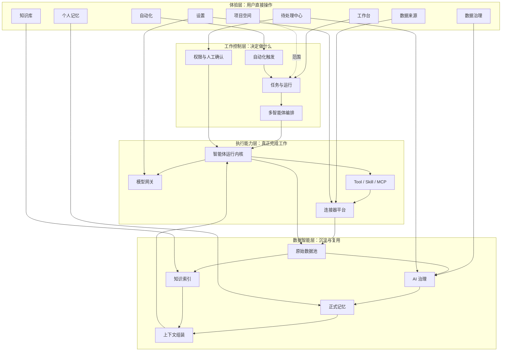

这四层的产品含义是：

- 体验层只负责让用户理解和操作，不直接制造业务状态。
- 控制层把用户目标变成可恢复的任务，并决定智能体如何协作。
- 执行层负责模型推理和真实工具调用。
- 数据智能层保存事实、产生候选、形成记忆，并将结果重新提供给执行层。

### 7.2 核心产品对象

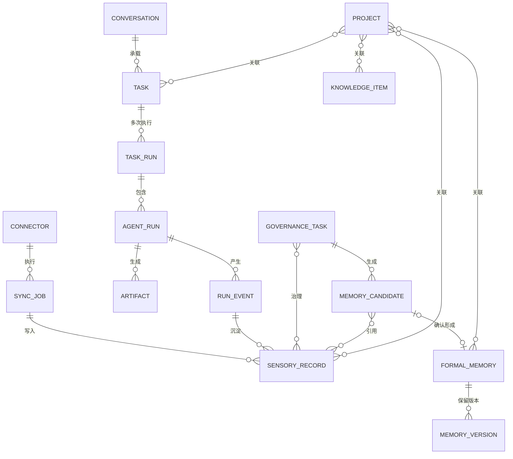

核心对象不能互相替代：

- Conversation 是交互历史，不是任务状态。
- Task 是长期目标，TaskRun 是一次执行尝试。
- AgentRun 是一个智能体的一次实际工作。
- SensoryRecord 是原始事实，不是 AI 总结。
- CandidateMemory 是建议，不是正式记忆。
- FormalMemory 是用户确认后的长期结论。
- KnowledgeItem 是资料，不是用户偏好或产品决策。

### 7.3 产品模块总览

产品模块是用户能够理解和操作的功能区域，不等同于代码目录。

| 产品模块 | 用户问题 | 核心职责 | 不负责什么 |
|---|---|---|---|
| 工作台 | “帮我完成这件事” | 对话、任务、运行、工具、审批和产物 | 不直接管理正式记忆 |
| 项目空间 | “这些内容属于哪个项目” | 聚合项目关系、目标和进度 | 不复制业务数据 |
| 连接器与能力 | “Smallink 可以连接和使用什么” | 数据连接器、Skill 与 MCP 服务 | 不处理治理任务 |
| 数据来源 | “数据从哪里来、同步到哪了” | 连接器、同步任务、水位和原始记录 | 不生成正式记忆 |
| 数据治理 | “这些原始数据值得记住什么” | AI 分析、候选记忆和人工处理 | 不覆盖原始事实 |
| 个人记忆 | “Smallink 长期记住了什么” | 正式记忆、版本、关系和引用 | 不保存文档全文 |
| 知识库 | “有哪些资料可以查” | 文档、代码、会议和产物检索 | 不替代用户记忆 |
| 自动化 | “什么时候自动做什么” | 定时和事件触发标准任务 | 不绕过任务和权限 |
| 待处理中心 | “哪些事情需要我决定” | 汇总审批、阻塞、候选和失败 | 不产生新的事实来源 |
| 设置 | “系统如何运行” | 模型、智能体、提示词、外观与安全 | 不承载连接器和业务数据处理 |

搜索作为工作台和智能体的全局能力，不设置独立“搜索中心”一级页面。知识图谱属于治理、记忆和知识之间的关系视图。

### 7.4 一级导航与页面层级

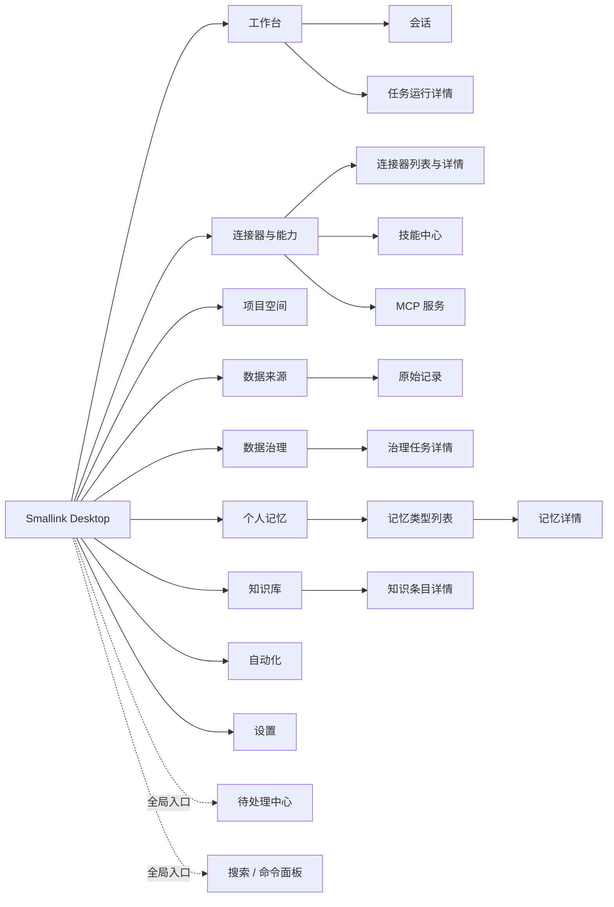

页面遵循“列表 → 详情 → 操作”的稳定结构。首页不同时展开大量详情；用户点击卡片、行或任务后进入独立详情页或侧栏。

### 7.5 三个核心闭环

#### 工作闭环

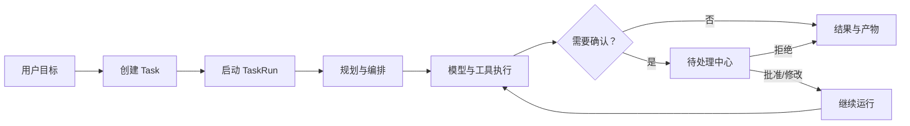

#### 数据学习闭环

#### 自动化闭环

### 7.6 跨模块状态原则

所有长任务都必须具备：

- 明确的 `pending`、`running`、`waiting`、`completed`、`failed` 和 `cancelled` 语义。
- 可见的开始时间、结束时间、来源和失败原因。
- 幂等重试，重复点击不能生成重复结果。
- 跨页面和跨重启可恢复。
- 先保存状态，再通知前端。
- 状态变化后，列表数量、红点和详情必须一致。

前端不能自己推断业务完成状态。列表、详情、角标和操作结果必须来自同一后端事实。

## 8. 工作台

### 8.1 页面目标

工作台是 Smallink 的默认首页。用户进入后直接开始一项真实工作，而不是先浏览营销页面。

工作台包含：

- 对话记录。
- 当前任务目标。
- 任务计划和进度。
- 父智能体与子智能体状态。
- 工具调用和审批。
- 使用的项目、数据来源、记忆和知识。
- 任务产物。
- 中断、重试、恢复和取消。

### 8.2 对话与任务关系

一段对话可以创建多个任务。一个任务也可以在同一对话中多次运行。

对话负责交互，任务负责完成目标，任务运行负责保存一次实际执行过程。

对象关系规则：

- 新建会话时可以暂时只有 Conversation，没有 Task。
- 用户发送一个可执行目标后创建 Task。
- 用户追问、补充文件或批准操作时，默认继续当前 TaskRun。
- 用户明确提出新的独立目标时，可以在同一 Conversation 中创建新 Task。
- 重试失败任务创建新的 TaskRun，不能覆盖失败运行。
- 仅聊天回答也保留消息，并形成可追溯的轻量任务记录。

### 8.3 新建任务

用户可以指定：

- 目标。
- 项目空间。
- 输入文件和数据来源。
- 智能体定义。
- 模型或模型策略。
- 允许使用的能力。
- 运行模式。
- 任务预算。

未指定时，Smallink 使用系统默认协调智能体和当前项目上下文。

新建任务入口包括：

- 侧栏“新建会话”。
- 当前会话输入框。
- 项目空间中的“新建任务”。
- 文件或目录上的快捷操作。
- 自动化触发。
- 外部连接器事件。

输入区支持：

- 文本目标。
- 拖入或粘贴文件。
- 选择已授权目录。
- 关联已有项目。
- 选择智能体和模型。
- 设置执行前确认、自动执行或仅规划模式。

提交前必须校验：

- 没有可用模型时明确提示配置模型，不能静默失败。
- 任务依赖目录但未授权时进入目录授权流程。
- 附件不可读取时指出具体文件和原因。
- 预算不合法时在提交前提示。
- 重复点击提交只创建一个任务。

### 8.4 运行过程

运行过程必须显示：

- 当前阶段。
- 当前智能体。
- 正在使用的能力。
- 子任务及依赖关系。
- 等待确认的动作。
- 失败原因和重试入口。
- 已产生的中间结果。

运行页由五个区域组成：

1. 对话正文：用户输入、智能体输出、思考摘要和引用。
2. 任务进度：计划步骤、当前阶段、完成比例和阻塞原因。
3. 智能体运行：父子关系、状态、耗时、模型和预算。
4. 工具与审批：调用参数摘要、风险、执行结果和确认入口。
5. 产物：文件、报告、代码、表格、网页和下载入口。

流式输出规则：

- 文本按事件顺序展示。
- 工具卡片不能因文本继续生成而消失或重新排序。
- 页面刷新后从已保存事件恢复，不重复显示。
- 用户可以中断当前运行；中断不删除已产生的事件和产物。
- 网络断开时显示“正在重连”，不能直接将任务判定为失败。

### 8.5 任务状态与操作

| 状态 | 用户看到的含义 | 可用操作 |
|---|---|---|
| `draft` | 目标尚未提交 | 编辑、删除草稿 |
| `pending` | 已创建，等待执行 | 取消 |
| `running` | 智能体正在工作 | 中断、查看详情 |
| `waiting_approval` | 等待用户决定 | 批准、修改、拒绝 |
| `paused` | 用户或系统暂停 | 恢复、取消 |
| `completed` | 已完成并产生结果 | 继续追问、重跑、查看产物 |
| `failed` | 因明确错误结束 | 查看原因、重试、修改配置 |
| `cancelled` | 已被用户或父任务取消 | 重新运行 |

操作规则：

- 暂停保留运行上下文，恢复继续同一 TaskRun。
- 重试创建新的 TaskRun，并引用原失败运行。
- 取消父任务时，尚未完成的子运行一起进入取消流程。
- 已完成任务可以继续对话，但新的执行形成新 TaskRun 或新 Task。
- 所有操作必须即时更新列表、详情和角标，不能点击后无变化。

### 8.6 任务产物

产物支持：

- 预览。
- 打开本地文件。
- 下载或导出。
- 关联项目。
- 纳入知识库。
- 查看产生它的任务和来源。

产物卡片至少显示：

- 名称和类型。
- 创建智能体。
- 创建时间。
- 所属任务与项目。
- 保存位置或外部目标。
- 当前版本和大小。

产物更新不能覆盖不可恢复的历史版本。文件已经被用户在外部修改时，Smallink 必须提示冲突并让用户选择覆盖、另存或保留外部版本。

产物链接交互规则：

- 智能体使用 `[标题](artifact:相对路径)` 返回产物；客户端同时兼容遗漏 `artifact:` 的本地相对文件链接。
- 中文、空格和其他非 ASCII 文件名必须显示原文，URL 编码只用于传输，不能作为文件名展示或查找。
- 无论右侧产物栏当前展开还是隐藏，点击产物卡片都必须立即打开对应预览并给出可见反馈。
- 文件不存在、读取失败或已经被移动时显示明确错误和文件路径，禁止停留在无限加载或点击无响应状态。

### 8.7 空状态与异常

- 没有会话：显示输入区和可执行示例，不显示假的最近任务。
- 没有模型：显示模型配置入口。
- 服务未启动：显示本地服务恢复状态和重试入口。
- 工具失败：工具卡片保留参数摘要、错误和重试建议。
- 任务运行中关闭客户端：重新打开后恢复任务状态。
- 产物丢失：保留产物记录并标记本地文件不可用。

### 8.8 工作台验收

- 用户可以从一个输入开始并看到真实 TaskRun。
- 模型、工具、审批和产物事件顺序稳定。
- 中断、重试、恢复和取消真实改变后端状态。
- 页面刷新后任务、输出、工具卡片和产物不丢失。
- 父子智能体运行可以展开查看。
- 工作台不出现无后端支持的假状态或 Mock 数据。

## 9. 智能体系统

### 9.1 产品定位

智能体是 Smallink 内部执行角色，不是多个独立产品。

用户默认只和 Smallink 交互。系统根据任务使用一个或多个智能体，用户可以展开查看运行细节。

### 9.2 智能体定义

每个智能体定义包含：

- 名称和说明。
- 系统提示词。
- 可用模型策略。
- 默认能力。
- 权限策略。
- 工作目录要求。
- 可读取的数据范围。
- 可委派的智能体类型。
- 默认任务预算。
- 输出结构。

系统提供协调、探索、执行、治理和记忆整理等内置模板，但不限制只能存在这些角色。

用户、项目、Skill、插件和连接器都可以提供新的智能体定义。

### 9.3 多智能体编排

协调智能体可以：

- 把任务拆成结构化子任务。
- 根据能力和数据范围选择智能体。
- 设置依赖和并行关系。
- 汇总结果。
- 请求补充信息。
- 在失败后重试或更换模型。

子智能体深度、并行数和运行时长由任务预算控制，不设置不可修改的固定上限。

### 9.4 子任务委派

委派必须包含：

- 目标。
- 输入。
- 允许读取的数据。
- 允许使用的能力。
- 约束。
- 预期输出。
- 时间和费用预算。
- 父运行 ID。

### 9.5 智能体可见性

用户可以查看：

- 为什么创建这个智能体运行。
- 它收到了什么任务。
- 它读取了哪些来源和记忆。
- 它调用了哪些工具。
- 它产生了什么结果。
- 它消耗了多少时间和模型用量。

### 9.6 多智能体运行逻辑

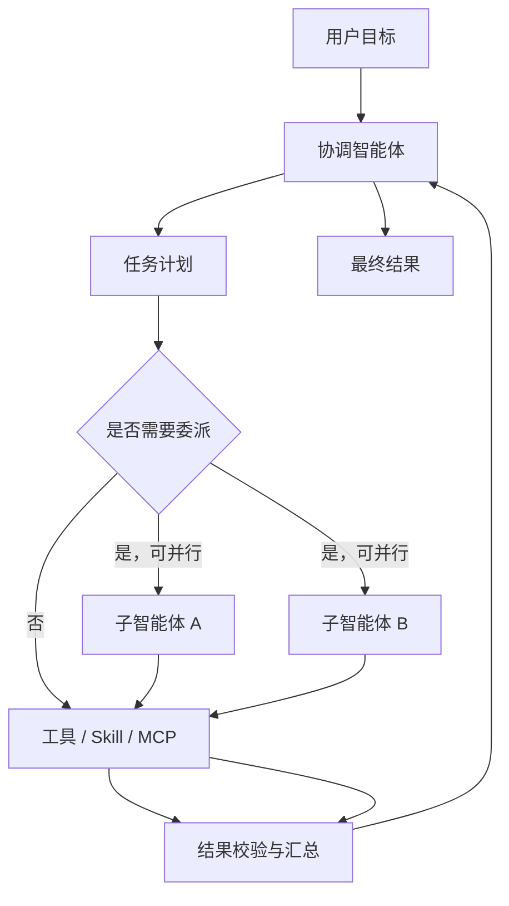

编排规则：

- 只有目标可以清楚拆分、能力隔离或并行节省时间时才创建子智能体。
- 子智能体必须获得最小必要上下文，不默认继承整段会话。
- 子智能体权限不得超过父任务。
- 每个子运行必须有独立 ID、状态、事件、输入、输出和预算。
- 子智能体失败时，父智能体可以重试、换模型、降级为自己执行或向用户说明。
- 父智能体不能在子运行尚未结束时把整个任务错误标记为完成。

### 9.7 智能体运行状态

| 状态 | 含义 |
|---|---|
| `created` | 已创建，尚未开始 |
| `running` | 正在推理或调用能力 |
| `waiting_approval` | 等待用户确认 |
| `waiting_dependency` | 等待其他子任务 |
| `paused` | 已暂停 |
| `completed` | 产生有效输出 |
| `failed` | 因明确错误结束 |
| `cancelled` | 被用户或父任务取消 |

### 9.8 模型选择与回退

- 智能体定义提供默认模型策略。
- 用户可以在任务级覆盖模型。
- 系统根据是否支持工具、多模态、结构化输出和上下文长度判断模型是否适用。
- Provider 不可用时不能无提示切换到会发送更多数据的其他 Provider。
- 自动回退必须满足用户的模型和隐私策略，并在运行详情记录原模型、回退模型和原因。
- 模型调用失败应区分认证、额度、网络、上下文过长、内容策略和格式错误。

### 9.9 智能体异常与验收

- 智能体定义被禁用：历史运行仍可查看，新任务不能继续选择。
- Skill 或 MCP 不可用：任务说明缺失能力，并允许重新连接或改用其他能力。
- 子智能体超时：保留当前事件，父运行决定重试或继续。
- 预算耗尽：暂停并向用户显示已消耗量和追加预算入口。

验收要求：

- 用户可以从根运行展开每个子运行。
- 每个子运行都能看到目标、来源、工具、状态和结果。
- 权限、预算和取消沿父子关系正确传播。
- 同一任务的并行子运行不会覆盖彼此事件和产物。

## 10. 项目空间

项目空间是组织范围，不是数据副本。

### 10.1 项目对象

一个项目可以关联：

- 本地文件夹。
- 代码仓库。
- 对话和任务。
- 智能体运行。
- 数据来源和原始记录。
- 记忆。
- 知识。
- 自动化。
- 产物。

同一条数据可以不属于任何项目，也可以通过关系被多个项目引用。项目删除后，原始数据、正式记忆和知识不会自动删除。

项目至少包含：

- 名称、说明和目标。
- 当前状态和阶段。
- 默认工作目录。
- 默认智能体、模型和预算。
- 关联连接器和来源容器。
- 创建时间和最近活动时间。

项目状态包括 `active`、`paused`、`completed` 和 `archived`。归档项目默认不参与新任务上下文，但历史数据仍可查看。

### 10.2 项目页面

项目页面展示：

- 项目目标和状态。
- 最近任务。
- 关联数据。
- 项目记忆。
- 项目知识。
- 产物。
- 自动化。
- 未解决问题。

项目首页使用模块摘要而不是把所有明细同时铺开：

- 顶部显示目标、阶段、最近活动和关键未解决问题。
- 模块卡片显示任务、数据、记忆、知识、产物和自动化数量。
- 点击卡片进入该项目范围内的对应列表。
- 项目时间线显示重要任务、决策、记忆变化和产物。

### 10.3 项目关联规则

- 用户可在创建任务时选择项目，也可在运行后补充关联。
- 从项目页新建任务时默认继承项目目录、智能体和范围。
- 原始记录可以由连接器规则自动关联项目，也允许人工调整。
- 记忆是否属于项目由正式关系决定，不能仅靠标题猜测。
- 同一知识条目可以被多个项目引用，但只有一个原始版本。
- 项目删除只删除项目关系；若用户希望同时清除关联数据，必须进入单独的数据清除流程并显示影响范围。

### 10.4 项目异常与验收

- 目录移动或权限失效：项目保留并显示“目录不可用”。
- 连接器暂停：项目数据停止新增，但历史记录不消失。
- 同名项目：允许存在，但必须用路径、说明或创建时间区分。
- 无项目数据：允许存在“未归属”范围，不能强迫所有记录进入项目。

验收要求：

- 项目删除不会误删原始记录、记忆、知识和产物。
- 从项目创建的任务自动获得正确项目范围。
- 项目卡片数量与各模块筛选结果一致。
- 一个对象关联多个项目时仍只有一个事实版本。

## 11. 数据来源

### 11.1 两类连接器

Smallink 区分：

1. 数据接入连接器：持续把外部数据同步到原始池。
2. 操作连接器：让智能体执行发送邮件、创建日程等动作。

两类连接器可以共享账户授权，但同步权限和操作权限必须分别配置。

### 11.2 连接器配置

设置中的连接器卡片负责配置：

- 账户或目录。
- 同步范围。
- 操作权限。
- 同步频率。
- 敏感字段策略。
- 运行位置。
- 暂停和恢复。

数据来源页面负责观察：

- 连接器实例。
- 来源容器。
- 同步任务。
- 当前水位。
- 新增、更新、重复和失败数量。
- 原始记录列表。

### 11.3 原始记录要求

所有授权接入的数据都进入统一原始池，包括：

- Smallink 对话输入和输出。
- Codex 对话、工具、技能和 CLI。
- 文件与文件变化。
- 邮件、日历、会议、Slack、GitHub 和其他连接器。
- 智能体工具调用和任务产物。
- 自动化运行结果。

原始记录必须保存来源、时间、账户、容器、外部 ID、内容哈希、版本和敏感级别。

每条原始记录详情至少展示：

- 用户可理解的来源名称和图标。
- 连接器实例、账户和来源容器。
- 原始发生时间与同步时间。
- 数据类型，例如用户消息、AI 输出、工具调用、CLI、文件或会议。
- 标题、正文和结构化字段。
- 所属项目。
- 当前版本、内容哈希和去重状态。
- 敏感级别和可见范围。
- 所属同步任务与治理任务。

内部编号可以在“技术信息”折叠区显示，不能替代可读标题和来源描述。

### 11.4 数据来源页面

数据来源一级页面包含：

1. 连接器概览：已连接、需配置、暂停和错误数量。
2. 连接器卡片：名称、类型、账户、最近同步、健康状态和待处理数量。
3. 同步任务：每次同步的范围、数量、耗时和结果。
4. 原始记录入口：查看所有来源的真实数据。

点击连接器卡片进入详情页，详情页包含：

- 账户和授权状态。
- 数据接入范围。
- 可执行操作能力。
- 来源容器列表。
- 同步频率与手动同步。
- 当前同步水位。
- 最近同步任务。
- 原始记录列表。
- 错误和重新授权入口。

### 11.5 同步与增量逻辑

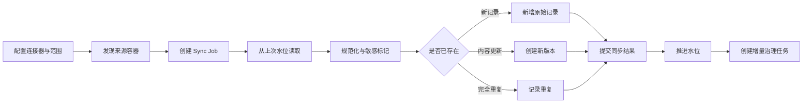

同步规则：

- 首次同步允许全量读取用户授权范围。
- 后续同步只读取水位之后的新增或更新内容。
- 同步失败时不推进水位，避免漏数据。
- 内容更新创建新版本，不能覆盖旧原文。
- 重复记录保留同步统计，但不创建重复业务记录。
- 用户可手动重跑失败同步，也可选择重新扫描指定时间范围。
- 重新扫描必须幂等，不因重跑产生重复记录。
- 所有项目和未归属数据都必须同步，不能只读取与 Smallink 当前项目相关的会话。

### 11.6 Codex 数据连接器

Codex 连接器必须读取用户授权设备上的全部可用历史，而不是只读取 Smallink 项目。

需要抽取：

- 任务或会话标题。
- 用户输入。
- Codex 输出。
- 工具名称、参数摘要和结果。
- Skill 与 MCP 调用。
- CLI 命令、输出摘要和退出状态。
- 工作目录和项目路径。
- 文件引用和产物。
- 发生时间、任务 ID 和来源文件位置。

Codex 数据进入统一原始池后与其他连接器遵循同一治理流程。“Codex 数据治理”可以作为按来源筛选的页面名称，但不能形成独立数据模型。

### 11.7 数据状态

连接器状态：

- `not_configured`
- `connecting`
- `connected`
- `paused`
- `reauthorization_required`
- `error`

同步任务状态：

- `queued`
- `running`
- `completed`
- `partially_completed`
- `failed`
- `cancelled`

原始记录处理状态：

- `ingested`
- `queued_for_governance`
- `in_governance`
- `governed`
- `excluded`

### 11.8 数据来源异常与验收

- 授权过期：保留历史数据并提示重新授权。
- 来源内容被删除：记录删除标记和最后有效版本，不静默物理删除。
- 数据量过大：分页读取并持续更新进度，不能阻塞页面。
- 单条记录解析失败：同步任务可以部分完成，并显示失败记录。
- 敏感内容：同步前按连接器策略过滤或标记，发送云模型前再次提示或脱敏。

验收要求：

- 用户能看到全部连接器、账户、来源容器和同步任务。
- 点击原始数据数量后显示与任务真实关联的记录列表。
- 原始记录详情与来源一致，不出现错位或跨任务数据。
- 重复同步不产生重复记录。
- 同步完成后只为新增和更新数据创建治理范围。

## 12. 数据治理

### 12.1 治理任务

同步完成后，只为新增或更新的数据创建治理任务。已经完成治理的数据不会因为页面刷新重复处理。

治理任务可以来自任何连接器，不局限于 Codex。

任务状态：

- 待分析。
- AI 分析中。
- 待人工确认。
- 部分完成。
- 已完成。
- 失败。
- 已取消。

治理一级页面是任务列表，不直接进入某个固定批次。

任务卡片显示：

- 数据来源和连接器。
- 时间范围和起止水位。
- 原始记录数量。
- AI 生成的候选数量。
- 待人工处理数量。
- 已纳入、已忽略和失败数量。
- 创建时间、最近处理时间和当前状态。

点击任务卡片进入独立详情页。已完成任务保留只读详情，方便追溯当时的模型、提示词、候选和用户决定。

### 12.2 AI 治理

AI 不是逐条机械总结，而是：

- 识别无效内容和技术噪声。
- 按时间、项目、主题和目标分组。
- 合并来自多条记录的结论。
- 识别偏好、决策、思考过程和未解决问题。
- 发现重复、冲突和变化。
- 生成可读的候选记忆。
- 解释为什么这样总结。
- 记录引用了哪些原始记录。

AI 治理分为六步：

1. 确定性过滤：排除空消息、心跳、重复状态和无法解析内容。
2. 关联分组：按时间、项目、任务、主题和来源关系形成批次。
3. 价值判断：判断哪些内容可能形成长期记忆或知识。
4. 合并提炼：多条记录形成一条用户可读候选，去掉内部编号和过程噪声。
5. 冲突检测：与现有候选和正式记忆比较重复、补充、替代或冲突。
6. 来源解释：保存引用记录、关键片段、形成理由和模型信息。

AI 结果必须使用结构化字段。格式错误可以自动重试，但原始模型输出和错误要保留在治理运行记录中。

### 12.3 AI 治理流程

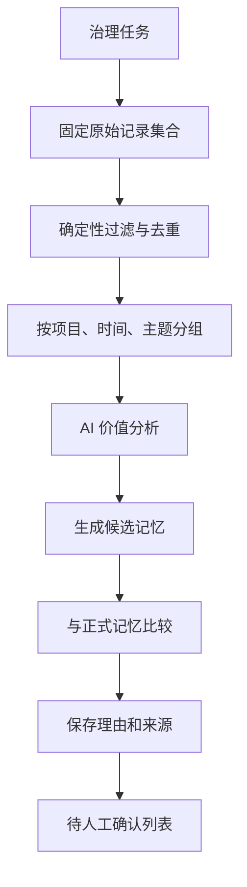

### 12.4 候选记忆类型

- `user_preference`
- `project_context`
- `product_decision`
- `reasoning_process`
- `open_question`
- `reusable_pattern`
- `work_habit`
- `artifact_summary`
- `document_insight`
- `life_memory`

默认只使用这十种标准类型。类型注册可以扩展，但扩展类型必须具有名称、说明、示例、版本和检索策略，不能由模型临时自由创造。

### 12.5 候选记忆列表

候选列表默认按 AI 生成时间和价值排序，支持：

- 按类型、项目、来源、置信度和冲突状态筛选。
- 多选和全选当前筛选结果。
- 批量纳入、批量忽略、延后和重新分析。
- 查看详情弹窗。
- 在列表中直接编辑标题和内容。

每条候选至少显示：

- 类型和标题。
- 可直接理解的记忆内容。
- 适用范围和项目。
- 置信度。
- 来源数量。
- AI 建议动作。
- 重复或冲突提示。

点击“查看详情”后显示：

- 为什么值得记忆。
- 为什么这样总结。
- 关键来源片段。
- 全部引用的原始记录。
- AI 使用的模型和提示词版本。
- 与已有记忆的比较结果。

### 12.6 人工处理

用户可以：

- 纳入记忆。
- 编辑后纳入。
- 合并。
- 拆分。
- 忽略。
- 延后。
- 批量处理。

任务中所有候选项完成处理后，治理任务完成并推进治理水位。

处理规则：

- 纳入：按候选当前内容创建正式记忆。
- 编辑后纳入：保存用户修改后的内容，同时保留 AI 原候选。
- 合并：选择已有正式记忆或其他候选，预览合并结果后确认。
- 拆分：从一条候选生成两条或多条待确认候选。
- 忽略：保存忽略原因，后续相同来源减少重复建议。
- 延后：候选保持待处理，不推进该候选对应的治理完成状态。
- 重新分析：创建新的治理运行，不覆盖旧候选和旧模型结果。

批量操作必须逐条返回成功或失败结果。部分失败时成功项立即更新，失败项保持可重试，不能整页无反馈。

### 12.7 任务完成与流向

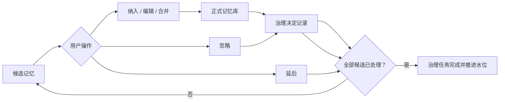

“纳入记忆”完成后必须同时发生：

1. 创建或更新正式记忆及版本。
2. 写入来源关系。
3. 写入治理决定。
4. 更新候选状态。
5. 更新任务统计和待处理角标。
6. 个人记忆库立即可以查到结果。

任何一步失败都不能显示成功。

### 12.8 红点与提醒

- 有待处理治理任务时，数据治理一级入口显示红点和数量。
- 某个来源存在待处理任务时，对应来源卡片显示红点。
- 红点数量来自后端待处理状态，不能由页面缓存推断。
- 处理完成后立即减少；页面刷新和应用重启后保持一致。
- 已失败任务使用错误状态，不混入待确认数量。

### 12.9 治理异常与验收

- AI Provider 不可用：任务进入失败或待重试，原始记录不丢失。
- 提示词更新：只影响新的治理运行，历史任务保留旧版本。
- 来源记录缺失：候选标记来源不完整，不能无提示正式入库。
- 同一候选被重复点击：幂等处理，只产生一个正式结果。
- 候选与正式记忆冲突：默认要求用户选择保留、替代、并存或合并。

验收要求：

- 治理任务按增量范围创建，不因刷新重复生成。
- AI 能从多条对话和工具记录中生成一条可读候选。
- 每条候选可以回到真实原始记录。
- 批量操作后列表、统计、红点和记忆库同步变化。
- 治理完成后仍能查看原始数据、AI 结果和用户决定。

## 13. 个人记忆

### 13.1 三层记忆

| 层级 | 用途 |
|---|---|
| 工作记忆 | 当前任务的计划、临时摘要和运行状态 |
| 候选记忆 | AI 提议但尚未确认的长期内容 |
| 正式记忆 | 用户确认、可供未来任务检索的长期内容 |

### 13.2 正式记忆结构

正式记忆至少包含：

- 类型。
- 标题。
- 内容。
- 适用范围。
- 项目关系。
- 状态。
- 置信度。
- 生效时间。
- 来源。
- 当前版本。
- 与其他记忆的关系。

十种默认类型在个人记忆首页分别显示为模块卡片：

- 用户偏好。
- 项目背景。
- 产品决策。
- 思考过程。
- 未解决问题。
- 可复用方法。
- 工作习惯。
- 产物摘要。
- 文档洞察。
- 生活记忆。

卡片显示有效数量、最近更新时间和主要项目。点击卡片进入该类型列表，首页不再同时展开记忆详情。

### 13.3 记忆列表与详情

记忆列表支持：

- 关键词搜索。
- 按项目、状态、来源和更新时间筛选。
- 按最近更新、最近使用和重要度排序。
- 批量关联项目、归档和导出。

记忆详情显示：

- 当前标题和内容。
- 类型、作用域、项目和有效时间。
- 当前状态和版本号。
- 支撑来源和关键原文。
- 形成过程及对应治理任务。
- 与其他记忆的关系。
- 被哪些任务检索和使用。
- 编辑、合并、归档和恢复入口。

### 13.4 记忆操作

用户可以：

- 查看和搜索。
- 按类型进入卡片列表。
- 编辑并生成新版本。
- 归档。
- 合并。
- 查看冲突。
- 查看来源。
- 查看被哪些任务引用。

智能体只能读取正式记忆和提出候选记忆，不能直接覆盖或删除正式记忆。

操作规则：

- 编辑：创建新版本，旧版本仍可追溯。
- 合并：创建新的合并版本，原记忆标记为已替代。
- 归档：停止参与默认检索，但保留来源与版本。
- 恢复：将归档记忆重新设为有效。
- 删除：普通操作只做归档；物理删除进入单独的数据清除流程。
- 手工新增：先创建“用户手工来源”的候选，再由用户确认。

### 13.5 记忆关系

支持的关系至少包括：

- `supports`：一条记忆支持另一条。
- `conflicts_with`：内容存在冲突。
- `supersedes`：新记忆替代旧记忆。
- `belongs_to`：属于某个主题或项目。
- `derived_from`：由另一条结论推导。
- `related_to`：一般关联。

知识图谱是这些关系的可视化方式，不是单独的数据事实源。用户从记忆详情或治理模块进入图谱，点击节点查看记忆、来源和关系理由。

### 13.6 记忆检索与使用

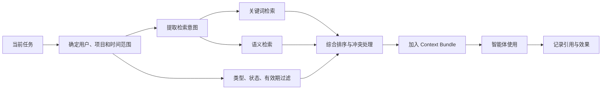

检索规则：

- 只检索有效且有权限的正式记忆。
- 项目记忆优先于无关项目记忆，用户全局偏好可以跨项目使用。
- 冲突记忆不能同时无解释地注入上下文。
- 返回内容必须包含记忆 ID、版本、来源摘要和相关性原因。
- 智能体回答引用关键记忆时，界面允许用户查看来源。
- 每次使用写入引用记录，便于后续判断记忆是否有效。

### 13.7 记忆状态

| 状态 | 含义 |
|---|---|
| `active` | 默认可被检索 |
| `archived` | 保留但不参与默认检索 |
| `superseded` | 已被新版本或合并结果替代 |
| `conflicted` | 存在尚未解决的冲突 |
| `deleted` | 已进入受控删除流程，不再使用 |

### 13.8 记忆异常与验收

- 来源不可用：保留记忆并标记来源暂时无法打开。
- 新候选与旧记忆冲突：进入冲突处理，不自动覆盖。
- 向量索引失败：记忆仍可通过关键词和列表读取，并显示索引状态。
- 项目被删除：记忆保留，项目关系解除或转为历史关系。

验收要求：

- 治理确认后记忆立即出现在正确类型列表。
- 每次编辑都有新版本，旧内容可查看。
- 来源、治理任务和使用记录可以相互跳转。
- 归档记忆不再进入默认任务上下文。
- 后续任务可以检索并显示实际使用的记忆版本。

## 14. 知识库

知识库保存可检索资料，而不是个人结论。

### 14.1 知识来源

知识来源包括：

- 文档。
- 会议记录。
- 代码和仓库说明。
- 网页和研究资料。
- 智能体产物。
- 用户确认纳入知识库的内容。

知识条目可以由连接器规则自动创建，也可以由用户从文件、产物或原始记录手动纳入。自动创建规则必须明确展示来源范围，不能将全部原始数据无差别转成知识文档。

### 14.2 知识处理流程

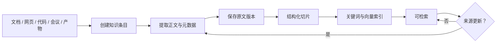

处理规则：

- 原文版本不可被新同步内容覆盖。
- 切片优先遵循标题、段落、代码结构和页码，不只按固定字符数切割。
- 每个切片保留知识条目、版本、页码或位置和来源。
- 向量索引是派生数据，可以重建；原文和来源不能只保存在向量库。
- 来源更新后创建新版本并增量重建受影响切片。

### 14.3 知识页面

知识条目支持：

- 原文预览。
- 内容切片。
- 关键词检索。
- 语义检索。
- 来源引用。
- 项目关联。
- 版本。

记忆回答“Smallink 应长期记住什么”，知识回答“有哪些资料可以查”。

知识库首页显示：

- 全部知识条目。
- 按来源类型和项目分组的筛选。
- 正在处理、处理失败和待更新数量。
- 最近新增和最近使用。

知识条目详情显示：

- 标题、类型、来源和项目。
- 原文预览或本地文件打开入口。
- 当前版本和历史版本。
- 切片与索引状态。
- 被哪些任务检索。
- 重新处理、关联项目、归档和删除入口。

### 14.4 搜索与引用

搜索使用关键词、语义相似度、来源、项目、时间和文档结构进行综合召回。

搜索结果必须显示：

- 命中的知识条目。
- 关键片段。
- 来源、版本和位置。
- 为什么匹配。
- 打开原文的入口。

智能体使用知识时必须将引用信息随结果带入任务事件。用户从回答中的引用可以回到原知识条目和原文位置。

### 14.5 知识状态与异常

知识状态：

- `processing`
- `ready`
- `partially_ready`
- `failed`
- `outdated`
- `archived`

异常处理：

- 文件不可解析：保留条目和原文件信息，显示失败原因。
- 文件移动：允许重新定位，不立即删除知识版本。
- 来源更新：旧任务引用旧版本，新任务默认使用最新有效版本。
- 向量服务不可用：关键词检索继续可用。
- 重复文件：提示复用已有条目、创建新版本或保留独立条目。

验收要求：

- 搜索结果能够打开到真实来源或明确位置。
- 文档更新不会破坏历史任务引用。
- 失败条目可以重试，不阻塞其他知识条目。
- 记忆和知识在产品中有清楚边界，不重复保存同一职责的数据。

## 15. 自动化

自动化负责创建任务，不建立第二套执行逻辑。

### 15.1 触发方式

触发方式包括：

- 定时。
- 连接器事件。
- 文件变化。
- 上一个任务完成。
- 用户手动触发。
- 智能体自唤醒。

不同触发方式统一创建标准 Task 和 TaskRun。自动化自身只保存“何时、用什么配置创建任务”，不保存另一套模型输出或工具事件。

### 15.2 自动化定义

自动化配置包括：

- 任务目标。
- 项目空间。
- 智能体定义。
- 输入数据。
- 允许能力。
- 权限策略。
- 任务预算。
- 通知方式。

无人值守任务遇到需要确认的动作时进入待处理中心。

自动化还必须保存：

- 名称、说明和启用状态。
- 触发器及其时区。
- 下次运行时间和最近运行时间。
- 失败重试策略。
- 错过计划后的处理策略。
- 输入数据的快照或读取规则。
- 创建人和修改时间。

### 15.3 自动化页面

自动化页面包含：

- 模板区：常用摘要、文件整理、项目回顾等起点。
- 自动化列表：状态、频率、下次运行和最近结果。
- 创建与编辑页：触发、任务、连接、权限、预算和通知。
- 运行历史：每次触发对应的 TaskRun。

模板不是静态演示卡片。选择模板后必须进入真实配置流程；所需连接器未连接时显示连接入口，配置完整后才能创建。

### 15.4 运行规则

- 创建时验证时区、时间表达式、模型、连接器和权限。
- 手动“立即运行”也创建一条正式 TaskRun。
- 同一个计划时间重复触发必须通过幂等键去重。
- 应用关闭期间错过的计划，根据策略选择启动后补跑、跳过或询问。
- 连续失败达到阈值后自动暂停并进入待处理中心。
- 自动化修改只影响未来运行，历史 TaskRun 保留当时配置快照。
- 自唤醒必须有明确来源任务和最大等待时间。

### 15.5 自动化状态与验收

状态：

- `draft`
- `active`
- `paused`
- `running`
- `needs_attention`
- `disabled`

验收要求：

- 每次自动化执行都能跳转到标准任务运行详情。
- 权限确认与手动任务使用同一套规则。
- 错过计划、重复触发和应用重启不会产生不可解释的重复任务。
- 禁用自动化不删除历史运行。
- 模板、创建、编辑、运行历史形成完整闭环。

## 16. 待处理中心

待处理中心统一承载：

- 高风险工具确认。
- 目录授权。
- 计划确认。
- 智能体提问。
- 候选记忆确认。
- 连接器授权失败。
- 自动化阻塞。
- 任务失败和重试。

每个待处理项必须显示来源任务、影响范围、建议动作和超时状态。

### 16.1 列表与分类

待处理中心按紧急程度和创建时间排序，支持按以下类型筛选：

- 权限审批。
- 信息补充。
- 计划确认。
- 候选记忆。
- 连接器异常。
- 自动化阻塞。
- 任务失败。

列表项显示：

- 需要用户决定什么。
- 来自哪个任务、自动化、连接器或治理任务。
- 风险等级和影响对象。
- 截止时间或超时后行为。
- 建议操作和替代方案。

### 16.2 处理规则

- 批准高风险工具前必须展示命令、目标、写入范围和风险。
- 用户可以只批准本次、批准规则范围或拒绝。
- 修改后批准时，实际执行参数必须等于用户最后确认内容。
- 候选记忆可以在待处理中心完成快速纳入或忽略，也可以进入治理详情。
- 任务失败项提供查看日志、重试和返回原任务。
- 处理结果写入审计并立即更新来源任务。

### 16.3 角标与异常

- 全局角标只计算真实待处理项目。
- 同一事项不能在权限审批和任务失败中重复计数。
- 已过期事项显示过期原因，不允许执行失效操作。
- 网络中断时操作保持提交中或失败，不提前从列表移除。

验收要求：

- 用户能从待处理项返回完整来源。
- 批准、拒绝和重试后来源任务立即继续或结束。
- 页面刷新后角标与列表一致。
- 高风险操作不存在绕开待处理中心的第二入口。

## 17. 设置

设置首页只承担系统配置入口，不直接铺开全部配置表单。

设置一级分组：

- 模型配置。
- 智能体。
- 提示词。
- 数据与安全。
- 外观与语言。

连接器与 Skill Hub 已从设置中移出，统一归入左侧一级“连接器”模块。设置页只保留系统运行和个人偏好配置。

### 17.1 连接器与能力模块

桌面端搜索收纳为侧栏品牌栏右侧的放大镜图标，点击后打开全局搜索弹层，不再占用完整导航行。“连接器”作为顶部操作区下方的首个能力模块；进入后使用固定子导航组织“连接器、技能中心、MCP 服务”，点击具体连接器卡片后进入详情。

详情区分：

- 数据同步配置。
- 智能体操作能力。
- 账户和授权。
- 风险策略。
- 最近运行。

连接器详情区分“数据接入”和“智能体操作”两个权限面板。用户可以只允许同步，不允许发送、修改或删除外部内容。

配置修改规则：

- 修改同步范围前预览将新增或移除哪些来源容器。
- 缩小范围不自动删除已同步历史，需单独选择数据处理方式。
- 断开账户前显示受影响自动化、项目和任务。
- 密钥、Token 和密码默认不回显完整值。

### 17.2 模型

支持：

- Smallink 当前可用的模型能力。
- OpenAI 协议兼容 Provider。
- 本地 Ollama。
- 不同智能体使用不同模型。
- 按任务切换模型。
- 模型测试和错误诊断。
- 费用、延迟和能力标签。

模型 Provider 卡片显示：

- Provider 名称和协议。
- 连接状态。
- 可用模型数量。
- 默认模型。
- 最近测试时间和结果。

模型详情支持：

- Base URL、API Key 和组织信息。
- 获取或手工填写模型列表。
- 标记工具调用、多模态、结构化输出和上下文长度。
- 设置默认模型与治理专用模型。
- 测试最小请求和工具调用能力。
- 查看认证、网络、协议和返回格式错误。

系统默认使用当前 Smallink 内置可用的模型能力。OpenAI 兼容协议和 Ollama 属于可选 Provider，用户明确切换后才使用。

### 17.3 智能体

智能体设置支持：

- 查看内置和已安装智能体。
- 创建和复制智能体定义。
- 配置提示词、模型、能力和权限。
- 配置默认预算。
- 设置项目专属智能体。
- 禁用新任务入口，但不破坏历史运行。

编辑智能体时必须区分：

- 角色说明和系统提示词。
- 默认模型策略。
- 能力清单。
- 权限策略。
- 数据可见范围。
- 可委派范围。
- 默认预算。

保存修改后创建定义版本。历史任务继续引用运行时冻结的旧版本。

### 17.4 Skill Hub

#### 17.4.1 产品定位

Skill 是提供给智能体的一组可复用工作说明和配套资源。它与其他能力的区别如下：

| 对象 | 解决的问题 | 典型内容 |
|---|---|---|
| Skill | 告诉智能体“如何完成一类工作” | `SKILL.md`、脚本、参考资料、模板与素材 |
| Tool | 让智能体执行一个具体动作 | 读写文件、运行命令、搜索网页 |
| Connector | 连接外部系统的数据和动作 | GitHub、Slack、日历、邮箱 |
| Agent | 负责规划、选择能力并完成任务 | 角色、模型、提示词、Skill、Tool 与权限 |

Skill Hub 是 Smallink 的 Skill 目录、创建入口和诊断中心，不是远程商店。它先解决本机 Skill “能发现、看得懂、找得到、知道是否生效”，并允许用户通过表单、完整文件夹、ZIP 压缩包和智能体对话把自己的工作方法沉淀为 Skill。

#### 17.4.2 入口和页面结构

入口位于“连接器 → 技能中心”。技能中心与数据连接器、MCP 服务共享能力接入模块，不再出现在设置页，也不单独占用左侧一级导航。

Skill Hub 页面由以下区域组成：

- 创建操作：新建 Skill、导入 Skill、对话创建。
- 顶部概览：Skill 总数、当前生效数量、来源数量和存在问题的数量。
- 搜索：按显示名称、Skill 名称、描述和标签搜索。
- 筛选：全部来源、内置、Smallink 用户目录、Codex、共享 Agent 目录和当前项目。
- 状态筛选：全部、当前生效、被同名 Skill 覆盖、配置异常。
- 卡片列表：显示平台真实发现的全部 Skill，不使用 Mock 卡片填充。
- 详情面板：点击卡片后在当前页面打开，不丢失搜索与筛选状态。

无 Skill 时显示真实空状态，说明可扫描的目录和下一步操作，不虚构“推荐 Skill”。

#### 17.4.3 Skill 卡片

每张卡片至少显示：

- 对用户友好的显示名称。
- 稳定的 Skill 名称。
- 一句话用途。
- 来源和作用范围。
- 当前状态：生效、被覆盖或异常。
- Tool 声明数量。
- 脚本、参考资料和素材资源数量。

卡片使用 Smallink 浅色渐变规范。只有当前选中卡片使用节点青蓝描边和轻量高亮，不使用大面积深蓝底色。

#### 17.4.4 Skill 详情

详情面板至少显示：

- 显示名称、Skill 名称和说明。
- 来源、作用范围、文件路径和当前生效状态。
- `SKILL.md` 结构检查结果。
- 声明的 Tool。
- `scripts/`、`references/` 和 `assets/` 数量。
- 完整 Skill 指令正文。
- 同名 Skill 的覆盖关系。

完整正文只在用户点击卡片后读取。列表页只返回元数据，保持渐进式披露，不因 Skill 数量增加而一次读取全部正文。

#### 17.4.5 来源和覆盖规则

Smallink 第一阶段发现以下来源：

1. Smallink 内置 Skill。
2. 用户共享 Agent Skill。
3. Codex 用户 Skill。
4. Smallink 用户 Skill。
5. 当前项目兼容目录 `.link/skills`。
6. 当前项目正式目录 `.smallink/skills`。

同名 Skill 按上述顺序由后者覆盖前者。Skill Hub 仍显示全部同名条目，并明确标出哪一条当前生效、哪一条被覆盖。智能体目录和 Skill Hub 必须使用同一套发现与覆盖规则，禁止出现“页面显示可用，但智能体实际加载了另一个版本”的分裂。

#### 17.4.6 Skill 创建与导入

用户可以通过三种方式新增 Skill：

| 方式 | 用户操作 | 系统行为 |
|---|---|---|
| 手动创建 | 填写稳定名称、显示名称、触发说明、完整指令和保存范围 | 校验后生成 `SKILL.md` 与 `agents/openai.yaml` |
| 文件夹导入 | 选择包含 `SKILL.md` 的本机文件夹并选择保存范围 | 保留脚本、配置、提示词、示例、模板和素材等完整相对目录，校验后原子写入 |
| ZIP 导入 | 选择只包含一个 Skill 的 `.zip` 压缩包 | 安全解压、自动识别常见外层目录、校验后按完整包原子写入 |
| 对话创建 | 与 Link Agent 讨论问题、触发场景、示例、资源、约束和输出 | Agent 先展示预览，用户确认后调用 `create_skill` 保存 |

保存范围分为“我的 Skills”和“当前项目”。用户级 Skill 在本机全部工作区可用；项目级 Skill 只写入当前工作区 `.smallink/skills`。没有打开工作区时，项目范围不可选。

创建与导入规则：

- `name` 只允许小写字母、数字和单连字符，最长 64 个字符。
- 同一保存范围内不得无提示覆盖同名 Skill；冲突必须返回明确错误。
- 文件夹和 ZIP 中必须且只能有一个有效的 `SKILL.md`。
- 导入保留 Skill 的完整普通文件结构，但忽略 `.git`、`node_modules`、缓存和系统元数据。
- ZIP 导入拒绝目录穿越、符号链接、加密条目、超过 200 个文件或解压后超过 10 MB 的包。
- 导入过程只复制和解析文件，不执行其中的脚本；脚本运行仍由智能体 Tool 权限和审批控制。
- 导入目录必须包含有效 `SKILL.md`。
- 只导入 `SKILL.md`、`agents/`、`scripts/`、`references/` 和 `assets/`，忽略其他顶层内容。
- 导入拒绝软链接，并限制文件数量和总大小，避免越界读取或超大导入。
- Agent 的 `create_skill` 属于写操作，必须经过用户确认；Skill 不能自行授予工具权限。

#### 17.4.7 Skill 运行流程

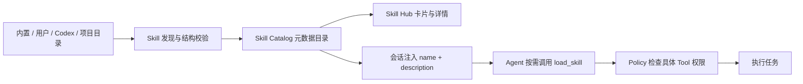

Skill 的 `allowed-tools` 或其他 Tool 声明只用于说明依赖和诊断，不能直接授予 Tool 权限。实际执行继续经过 Capability Registry、Policy 和人工确认。

#### 17.4.8 当前边界

当前已实现：

- 多来源本地发现。
- 卡片列表、搜索、来源与状态筛选。
- 点击卡片查看详情。
- 生效、覆盖和结构异常诊断。
- 手动创建用户级和项目级 Skill。
- 导入本机 Skill 文件夹。
- 从 Link Agent 对话中确认并创建 Skill。
- 中英文等价界面。

后续实现：

- 已有 Skill 编辑与删除。
- Skill 版本、升级与回滚。
- 绑定项目和智能体。
- 测试运行与使用历史。
- 签名、可信来源和远程社区市场。

#### 17.4.9 验收要求

- 页面展示数量与后端真实目录一致。
- 项目 Skill 和用户 Skill 可以同时出现。
- 同名覆盖状态与智能体运行时一致。
- 搜索和筛选不会修改 Skill 文件。
- 点击卡片能读取真实正文和资源统计。
- 缺少 `SKILL.md` 必填元数据或 YAML 错误时，单个 Skill 显示异常，不导致整个页面失败。
- Skill 中的 Tool 声明不绕开现有权限与审批。
- 中英文页面、空状态、状态和错误提示交互等价。
- 三种创建入口写入同一套 Skill 目录并使用同一套校验。
- 导入包含软链接、无效名称或超限资源时拒绝写入，不留下半成品目录。
- 对话创建必须先显示预览并等待确认，不能由 Agent 静默落盘。

### 17.5 提示词

系统提示词、治理提示词和记忆整理提示词可以查看、复制、恢复默认和调试。

提示词管理规则：

- 默认提示词在设置中可见。
- 编辑前可以复制为自定义版本。
- 每次保存创建版本并记录时间。
- 治理任务保存实际使用的提示词版本。
- 恢复默认只影响未来任务。
- 调试界面显示输入结构、模型输出和解析错误，但敏感原文默认折叠。

### 17.6 数据与安全

支持：

- 查看本地数据库和产物目录。
- 按连接器、项目、时间和数据类型导出。
- 管理敏感字段策略。
- 查看目录与能力授权。
- 查看审计记录。
- 发起归档、断开、清理或彻底删除。

所有删除操作必须先显示对象数量、关联模块、是否可恢复和预计影响。

### 17.7 外观与语言

支持：

- 简体中文和英文完整切换。
- 浅色、深色和跟随系统主题。
- 调整界面密度和字体大小。
- 减少动效。

切换语言不能只翻译导航，页面标题、按钮、空状态、错误、审批、模型与连接器说明都必须翻译。品牌与视觉规则以 UI 设计系统为准。

### 17.8 设置验收

- 设置首页结构清楚，不出现重复或错误数据。
- 连接器和模型均通过卡片列表进入详情。
- Skill Hub 只展示真实发现的 Skill，卡片与运行时使用同一份目录。
- 配置修改后相关运行模块使用新版本，历史记录不被重写。
- 密钥不通过普通接口或日志明文返回。
- 中英文在同一功能上保持交互等价。

## 18. 数据与隐私

### 18.1 本地优先

- 密钥保存在本地安全存储。
- 原始数据默认保存在用户控制的数据库中。
- 使用云端模型时清楚显示哪些内容会发送到云端。
- 本地模型和本地模式可以独立使用。

本地优先的产品含义：

- 客户端和核心服务默认在用户电脑运行。
- 未配置云服务时不联系继承或占位云端点。
- 数据库、配置、日志和产物位置对用户可见。
- 使用云模型不等于将全部数据库上传；只发送当前任务所需上下文。
- 用户可以按 Provider 设置允许发送的数据类型和敏感级别。

### 18.2 权限

- 未登记风险等级的能力默认需要确认或禁止。
- 智能体不能替用户批准高风险动作。
- 子智能体不能继承超过父任务的权限。
- 自动化不能绕过用户策略。
- 项目和目录访问按任务明确授权。

能力风险分级：

| 等级 | 示例 | 默认行为 |
|---|---|---|
| 只读 | 读取文件、搜索知识 | 在授权范围内执行 |
| 可恢复写入 | 创建新文件、生成草稿 | 按用户策略执行或确认 |
| 外部影响 | 发送消息、创建日程、提交代码 | 默认确认 |
| 高风险 | 删除、覆盖、付款、权限变更 | 必须逐次确认或禁止 |

授权决定必须包含能力、目标、范围、有效期和来源任务，不能只记录一个模糊的“已允许”。

### 18.3 删除与导出

用户可以按连接器、项目、时间和数据类型导出或删除数据。删除正式记忆时保留必要审计记录，但不继续用于检索。

删除分为：

- 断开：停止未来同步，不删除历史。
- 归档：默认界面和检索不再使用，可恢复。
- 清理：删除派生索引、缓存或临时文件，可重建。
- 彻底删除：删除用户指定的原始数据和关联派生数据，不可恢复。

彻底删除前必须展示：

- 将删除的原始记录、知识、候选、记忆和产物数量。
- 哪些任务或引用将变为来源不可用。
- 是否保留必要审计摘要。
- 操作是否可撤销。

### 18.4 云模型数据提示

当任务准备向云模型发送敏感数据时，界面显示：

- Provider 和模型。
- 将发送的数据来源类别。
- 是否包含文件、原始对话或个人记忆。
- 脱敏策略。
- 本次允许、始终允许该规则或取消。

### 18.5 数据与隐私验收

- 未授权连接器不能同步数据。
- 云模型调用可以追溯发送了哪些来源类别。
- 子智能体和自动化不扩大权限。
- 断开连接器不会误删历史。
- 彻底删除操作具有明确影响预览和执行结果。

## 19. 状态、恢复与可观察性

以下对象必须跨重启保存：

- 对话。
- 任务。
- 任务运行。
- 智能体父子运行。
- 工具调用。
- 审批。
- 自动化。
- 同步任务。
- 治理任务。
- 候选记忆。
- 正式记忆。
- 产物。

运行事件必须先持久化，再推送到前端。断线重连后，前端可以从最后事件位置继续读取。

### 19.1 全局状态一致性

- 列表、详情、红点、通知和统计使用同一个后端事实。
- 用户操作先进入提交中状态，后端确认后才显示成功。
- 乐观更新失败时必须回滚并说明原因。
- 任务完成、候选处理和同步完成通过事件实时更新相关页面。
- 页面重新进入时先查询当前快照，再接收增量事件。

### 19.2 恢复策略

- 客户端重启：重新连接本地服务并恢复正在运行或等待中的任务。
- 核心服务重启：识别未完成运行，恢复可恢复任务或明确收敛为失败。
- WebSocket 断开：使用最后事件位置补齐历史再继续实时推送。
- 模型调用中断：根据 Provider 能力重试，不能伪造已完成输出。
- 工具执行中断：先判断动作是否已经产生外部副作用，再决定重试。
- 同步中断：从未提交水位继续。
- 治理中断：保留已生成候选，按治理运行继续或重跑。

### 19.3 可观察内容

用户可见：

- 任务阶段、耗时和阻塞原因。
- 智能体父子关系。
- 模型和工具调用摘要。
- 审批与用户决定。
- 数据同步数量与失败项。
- AI 治理模型、提示词和来源。
- 记忆与知识引用。

开发诊断可见但默认折叠：

- 事件 ID、内部对象 ID。
- 结构化输入输出。
- 重试次数。
- 错误栈和协议响应。

### 19.4 性能与容量体验

- 列表默认分页或虚拟滚动，不能一次渲染全部历史。
- 原始记录、事件和来源详情按需展开。
- 大文件解析、向量生成、治理和历史导入在后台运行。
- 长任务持续显示进度或最近活动时间。
- 搜索输入应防抖并允许取消旧请求。

### 19.5 可观察性验收

- 关闭并重新打开客户端后，任务和治理状态一致。
- 断线期间产生的事件能够补齐。
- 失败状态包含可理解原因和下一步操作。
- 用户能从回答或记忆一路追溯到来源。
- 技术编号默认不干扰普通用户阅读。

## 20. 信息架构

建议一级入口：

1. 工作台。
2. 项目空间。
3. 数据来源。
4. 数据治理。
5. 个人记忆。
6. 知识库。
7. 自动化。
8. 设置。

待处理中心使用全局入口和红点角标，不占用一级业务导航。

任务历史保留在工作台侧栏。搜索通过全局命令入口提供。

### 20.1 导航原则

- 一级导航只放稳定业务域，不为单次操作增加入口。
- 工作台是默认首页。
- 设置只管理配置，数据处理放在数据来源和治理。
- 个人记忆首页按类型显示卡片，详情进入独立页面。
- 项目空间通过关联聚合其他模块，不复制它们的导航和数据。
- 面包屑或返回操作必须保留用户来源筛选。

### 20.2 全局搜索

全局搜索覆盖：

- 会话和任务。
- 项目。
- 原始记录。
- 正式记忆。
- 知识。
- 产物。
- 设置命令。

结果按类型分组，并显示来源、项目和更新时间。搜索结果点击后进入对应模块详情，不建立独立“搜索中心”数据页。

### 20.3 通知和反馈

- 成功反馈说明结果去了哪里，例如“已纳入个人记忆 > 产品决策”。
- 失败反馈说明原因和可执行下一步。
- 长任务使用进度、状态和通知，不依赖阻塞弹窗。
- 破坏性操作使用确认弹窗，并显示影响范围。
- 普通保存和筛选不使用不必要的弹窗。

## 21. 迁移要求

### 21.1 代码主线

- 当前 Git 仓库根目录是唯一代码主线。
- 新增业务实现、正式命令和界面名称只能使用 Smallink；旧标识只允许存在于明确标注的兼容层。
- 原执行底座能力直接演进为 Smallink 原生模块。
- 不启动第二套兼容业务服务。

### 21.2 能力迁移

每个能力记录：

- 当前实现位置。
- 新模块归属。
- 功能等价测试。
- 数据迁移方式。
- 切换条件。
- 旧实现退出条件。

### 21.3 数据迁移

- SQLite、JSON 和 JSONL 中的业务状态迁入 Postgres。
- `sensory_records` 迁入统一原始数据模型。
- 历史会话保留输入、输出、工具和产物关系。
- 历史记忆作为待确认或已确认数据迁移，不丢失来源。
- generated snapshot 只作为历史导入格式，不再作为实时事实源。

## 22. 交付工作流

重构采用能力保留的纵向切片，而不是先删除旧实现再重写。

### 工作流 A：运行底座

- 建立 Task、TaskRun、AgentRun 和 RunEvent。
- 让现有智能体执行通过新运行模型保存。
- 保持现有对话、工具和审批可用。

### 工作流 B：多智能体

- 将 Explorer 接入持久化子运行。
- 建立通用委派协议。
- 增加并行、依赖、预算、取消和恢复。

### 工作流 C：数据闭环

- 接入 `sensory_records`。
- 保存用户、连接器和运行数据。
- 建立同步任务和治理水位。

### 工作流 D：记忆与知识

- 建立候选记忆。
- 完成人工确认和正式版本。
- 建立上下文检索和来源引用。

### 工作流 E：客户端统一

- 保留现有工作台能力。
- 增加运行图、数据、治理、记忆、知识和项目页面。
- 删除旧原型和重复页面。

这些工作流可以并行推进，但必须通过同一数据模型和模块接口集成。

### 22.1 第一条纵向切片实施状态

截至 2026-07-27，工作流 A 和工作流 B 已完成第一条可运行链路：

- 普通会话、后台消息、审批恢复和自动化执行都会创建持久化 TaskRun。
- 每次 TurnEngine 执行都会形成根 AgentRun。
- TurnEngine 产生的模型、工具、审批、错误、中断和结束事件会按顺序保存为 RunEvent。
- Explorer 已作为真实子 AgentRun 挂到当前根 AgentRun，保留父子关系、输入、输出和事件。
- 运行结果可通过 Task、TaskRun、AgentRun 和 RunEvent 查询接口读取。
- 服务重启会收敛上一次进程遗留的运行中状态，避免任务永久显示为处理中。
- 原有会话、工具、审批、自动化和 Explorer 只读隔离能力保持不变。

本切片当前使用与现有 `link.db` 并存的 SQLite 运行仓库适配器，目的是先打通真实执行链路并保持个人部署轻量。它不是最终存储结论。Postgres 唯一事实源、通用委派协议、运行图客户端、暂停/恢复控制和预算调度仍属于后续切片。

### 22.2 macOS 客户端交互与品牌规范

截至 2026-07-27，Smallink Desktop 统一采用以下客户端规则。完整颜色、排版、组件和禁用规则以 `docs/smallink-ui-design-system.md` 为事实源：

- 产品内名称、窗口标题、系统菜单、App Bundle 和 DMG 统一显示为 `Smallink`。
- macOS App、Dock、菜单栏、安装包和产品内小尺寸 Logo 只使用新字标左侧的独立双旋涡图形，不在小图标中放入英文全称。
- 独立图形保持原稿的深蓝至青蓝渐变和透明背景，不增加底板、描边或额外文字。
- 主色为深邃夜蓝 `#00224D`，辅色为科技蓝 `#00529B`，交互点睛色为节点青蓝 `#00A8E8`。
- 页面遵循 60% 云雾白与冰蓝渐变空间、30% 轻量品牌结构、10% 青蓝交互焦点的使用比例。
- 浅色侧边栏采用白色到冰蓝的渐变，禁止整块深邃夜蓝；深蓝用于 Logo、标题与小面积节点。
- 页面、顶部玻璃层、侧栏、输入区和重点卡片允许使用低对比浅蓝渐变；高饱和渐变只用于关键 CTA。
- 普通导航保持中性，当前选中项使用浅青蓝渐变和左侧 2px 节点青蓝标记。
- 浅色页面背景为云雾白 `#F8FAFC`；深色页面背景为深钛灰 `#0F172A`。
- 按钮文字颜色必须随主题自动适配，不能直接固定为白色。
- 西文使用 Inter/Helvetica Neue/Arial，中文使用苹方/微软雅黑/Noto Sans SC，代码使用 JetBrains Mono/Fira Code。
- 小控件圆角为 8px，卡片与弹窗为 16px，节点与头像为正圆。
- macOS 窗口顶部 48 像素内的非交互区域在所有页面都可拖动窗口。
- 按钮、链接、输入框、下拉菜单和可编辑内容不得触发窗口拖动。
- 切换到智能体详情、设置、连接器、运行中心和自动化页面后，拖动能力不能消失。

客户端验收必须同时覆盖浅色主题、深色主题、页面切换、侧边栏展开、侧边栏收起、Dock 图标、菜单栏图标和 DMG 安装产物。

### 22.3 唯一项目目录

当前 Git 仓库根目录是 Smallink 的唯一开发主目录。当前代码、产品文档、技术文档、构建脚本、依赖环境、mem0 参考源码和早期记忆原型均在该目录下按“主工程、参考资料、历史归档”分层管理。

正式后端功能统一归属 `smallink/`：智能体、工具、连接器、模型 Provider、任务运行、自动化、数据治理、记忆和知识能力均不得继续写入旧 `link/`。`link/` 只保留一个兼容转发入口，不得包含第二份业务实现。

本机运行数据、密钥和用户产物不进入源码目录。已有安装继续读取 `~/.config/link/`、`link.db` 和工作区 `.link/`；新建会话产物默认进入 `~/Smallink/`。

## 23. 验收标准

### 23.1 产品统一

- 用户只启动一个 Smallink。
- 对外产品、客户端和业务入口统一使用 Smallink。
- 不存在第二套业务服务和重复页面。

### 23.2 能力完整

- 现有模型、工具、Skills、MCP、连接器、自动化、审批和桌面能力没有降级。
- 每项迁移能力拥有回归测试。

### 23.3 任务闭环

- 用户可以创建任务并查看 TaskRun。
- 一个任务可以产生多个可观察 AgentRun。
- 任务可以暂停、取消、重试和恢复。
- 产物可以追溯到运行和来源。

### 23.4 数据闭环

- Smallink、Codex 和外部连接器数据进入 `sensory_records`。
- 同步只处理新增或更新数据。
- AI 能够生成带来源和解释的候选记忆。
- 用户确认后形成正式记忆。

### 23.5 使用闭环

- 智能体能够按任务检索正确记忆和知识。
- 回答和产物能够显示引用来源。
- 新的执行过程继续进入原始池。

### 23.6 可靠性

- Postgres 是正式业务状态的唯一事实源。
- 应用重启后任务和治理状态不丢失。
- 前端断线重连后可以恢复事件。
- 同步、治理和运行支持幂等重试。

### 23.7 安全

- 未知能力不能默认低风险执行。
- 高风险动作必须进入用户确认。
- 正式记忆不能被智能体直接覆盖。
- 原始记录不可被 AI 修改。

## 24. 完成判断

只有以下完整链路使用真实数据、真实模型和真实持久化状态跑通，Smallink 才算完成本次重构：

1. 用户或连接器产生真实输入。
2. 输入进入任务或 `sensory_records`。
3. Smallink 使用一个或多个智能体完成任务。
4. 工具、审批、产物和运行事件可观察并可恢复。
5. 执行过程进入原始数据池。
6. AI 生成带来源的候选记忆。
7. 用户确认正式记忆。
8. 后续任务正确检索并引用这条记忆。
9. 全部能力在同一个 Smallink Desktop 和 Smallink Core 中完成。

## 25. 当前实现状态

本章用于防止“目标需求”和“当前产品”混淆。状态以真实代码、接口和持久化链路为准。

| 产品能力 | 当前状态 | 当前边界 | 下一完整条件 |
|---|---|---|---|
| macOS 客户端 | 已可用 | Tauri + React，可启动、构建和打包 | 持续完善页面与跨平台 |
| 会话工作台 | 已可用 | 支持对话、流式输出、工具卡片和产物 | 与正式 TaskRun 页面完全统一 |
| 模型 Provider | 已可用 | 支持多 Provider 配置和模型选择 | 完成统一模型能力探测与治理模型策略 |
| 工具、Skill、MCP | 已可用 | 文件、终端、搜索、浏览器、Skill 渐进加载和 MCP 等能力存在 | 全部接入统一 Capability 与 Policy |
| Skill Hub | 已可用 | 支持多来源发现、按需详情、手动创建、文件夹导入和对话确认创建 | 增加编辑、删除、版本、绑定和测试运行 |
| 权限与审批 | 已可用 | 关键工具可以等待用户确认 | 完成统一待处理中心和规则授权 |
| 自动化 | 部分可用 | 已有定时任务、模板、标准 TaskRun 映射、重启中断状态和等待审批恢复 | 完整 Checkpoint、通用暂停恢复和事件触发 |
| Task / TaskRun / AgentRun | 部分可用 | 真实运行链、自动重连、消息幂等和等待审批恢复已落地，当前使用 SQLite 适配器 | 迁移 Postgres，补任意执行点 Checkpoint 和预算 |
| 多智能体 | 可视化第一版已落地 | Explorer 已作为真实可观察子运行；客户端提供成员、协作任务、父子运行图和节点详情 | 通用委派、依赖、并行、预算和父子取消 |
| 数据连接器 | 部分可用 | 当前客户端只展示 MineM；Codex、TRAE 的目录探测、SyncJob、水位和幂等导入适配器保留在后端但按产品策略隐藏 | 完成 MineM 应用级闭环，并扩展更多经过验证的来源和自动增量调度 |
| `sensory_records` | 已可用第一版 | 运行时和本地连接器事实进入 SQLite；支持来源、状态、服务端搜索、分页、原文和删除；治理状态可推进与重试 | 批量删除影响预览、保留策略和 Postgres 迁移 |
| AI 数据治理 | 已可用第一版 | 真实 Provider、原子任务领取、敏感策略、独立候选、失败重试、接受、编辑、合并、忽略，以及批量接受/忽略已落地 | 批量调整类型、冲突任务、提示词评估和后台调度 |
| 正式个人记忆 | 已可用第一版 | 正式记忆、版本、来源和决策事务已落地；客户端提供十种类型、候选处理和来源证据；active 记忆按 global/workspace/session 作用域、关键词相关性和字符预算注入，并记录使用版本 | 向量/混合检索、Token 级 ContextBundle、关系、归档恢复和效果反馈 |
| 知识库 | 待建设 | 来源、切片、索引和引用规则已确定 | 真实知识条目、版本、检索和任务引用 |
| 项目空间 | 待建设 | 聚合关系和页面职责已确定 | 真实项目关系与各模块筛选打通 |
| Postgres + pgvector | 待建设 | 目标 Schema 和迁移原则已确定 | 成为正式业务唯一事实源 |

历史 generated snapshot、旧 Mock 页面和早期记忆原型只能用于导入或交互参考，不能作为当前完成状态。

## 26. 产品指标

### 26.1 工作效率指标

- 任务成功完成率。
- 需要用户重新解释上下文的次数。
- 中断后成功恢复率。
- 工具调用失败后的可恢复率。
- 从用户目标到首个有效结果的时间。

### 26.2 数据质量指标

- 授权范围内数据同步完整率。
- 增量同步重复率。
- 原始记录解析成功率。
- 同步失败后恢复率。
- 原始记录可追溯来源覆盖率。

### 26.3 治理与记忆指标

- AI 候选被纳入、编辑、合并和忽略比例。
- 每条候选平均引用来源数量。
- 无来源候选数量，目标必须为零。
- 正式记忆冲突发现率和解决率。
- 后续任务检索命中率。
- 记忆引用被用户认为有帮助的比例。

### 26.4 产品可信度指标

- 页面状态与后端状态不一致次数。
- 重复点击产生重复业务对象次数，目标为零。
- 断线或重启后状态丢失次数，目标为零。
- 高风险动作未经确认执行次数，目标为零。
- 正式记忆被 AI 直接覆盖次数，目标为零。

## 27. 非功能需求

### 27.1 启动与稳定性

- macOS 客户端一次启动同时管理本地核心服务。
- Sidecar 使用运行时可用端口，不依赖常见固定端口。
- 服务异常退出后客户端显示恢复状态，不无限加载。
- 本地数据库和迁移失败时停止危险写入并给出诊断。
- 启动过程必须分为“恢复本地服务、读取工作数据、恢复最近会话”三个可见阶段；阶段未完成时展示品牌化进度反馈，禁止让用户面对无反馈的空白或假死界面。
- 消息连接器和其他外部网络能力必须在后台恢复，不得阻塞核心 HTTP、WebSocket 和桌面工作区就绪。

### 27.2 性能

- 普通页面切换目标在 300ms 内出现结构反馈。
- 列表首屏目标在 1 秒内出现数据或加载状态。
- 输入和滚动保持流畅，长列表使用分页或虚拟化。
- 大文件、历史同步、AI 治理和向量索引不得阻塞主界面。
- 启动基础数据由应用层统一请求并下发给侧栏，子组件不得重复拉取同一份设置、会话、项目和智能体数据。
- 后台刷新只在窗口可见时执行；会话与项目使用 30 秒兜底刷新，待办状态使用 15 秒刷新，并在窗口重新聚焦时按需补拉。
- 打开已有会话时立即显示稳定尺寸的历史记录骨架，数据返回前保持布局不跳动。

### 27.3 可访问性

- 所有核心操作支持键盘访问。
- 焦点状态完整可见，不能出现断裂边框或只依赖颜色。
- 文本、背景和交互状态满足可读对比度。
- 状态同时使用文字、图标或形状表达。
- 支持减少动效。

### 27.4 国际化

- 简体中文和英文功能完整等价。
- 日期、时间、时区、数字和路径按系统环境显示。
- 后端错误映射为用户可理解的双语信息。
- 用户内容、代码和命令不被错误翻译。

### 27.5 兼容与迁移

- 升级不能无提示破坏旧会话、配置和本地数据。
- 旧内部标识在兼容层保留期间必须有明确迁移边界。
- 数据迁移支持进度、失败重试和结果核对。
- 新旧实现不长期双写同一业务事实。

## 28. 文档与需求治理

- 本文是产品需求和产品架构事实源。
- 技术模块、数据库、API 和部署实现以技术架构设计为准。
- 记忆字段、状态、事务和检索细节以个人记忆 PRD 与技术方案为准。
- 颜色、渐变、组件和交互视觉以 UI 设计系统为准。
- 产品功能发生变化时，必须同时更新本文对应模块、流程、状态和验收要求。
- 技术实现未达到本文要求时，必须更新第 25 章状态，不能直接删除需求或展示假完成状态。
- `docs/link-product-prd 2.md` 与 `docs/link-technical-design 2.md` 属于历史草稿，不再作为事实源。

## 29. 多智能体可视化需求（2026-07-29）

### 29.1 产品目标

用户需要同时看懂两件事：系统中有哪些智能体，以及一次真实任务中智能体之间怎样协作。“智能体定义”和“智能体运行”必须分层展示，不得把 Persona、工具、Skill 或 MCP 错误表述为已经发生的多智能体协作。

### 29.2 一级入口与页面结构

客户端主导航新增“智能体”，位于“记忆”和“运行中心”之间，页面包含两个页签：

1. **智能体架构**：用层级架构图展示 Persona 注册表中的真实智能体定义、Smallink Runtime 和 Explorer 这类系统子智能体。
2. **协作记录**：只展示至少包含一个子 `AgentRun` 的真实任务运行。

运行中心继续承担完整事件和技术诊断；智能体模块承担面向用户的成员理解、委派关系和结果解释，两者不互相替代。

### 29.3 智能体架构页

架构图按以下层级展示：

1. 用户任务：展示进入系统的目标、上下文和约束。
2. Smallink Agent Runtime：统一承载会话、模型、工具、策略和执行，不伪装成一个 Persona。
3. 可选择角色：展示 Runtime 可以直接启动的主智能体和专业智能体，例如 Smallink、Code、Chat 和 Ops Agent。
4. 系统子智能体：展示已具备真实委派能力的内部工作者，例如 Code 可以调用的 Explorer。

实线表示 Runtime 可以直接启动一个角色；虚线表示代码中已经存在的智能体间委派能力。停用角色使用文字、状态点和虚线边框共同表达。系统子智能体的有效可用状态必须继承父角色依赖：例如 Code 停用时，Explorer 不得继续显示为可运行。

架构画布支持空白区域拖拽平移、容器内滚动、围绕当前视口中心放大缩小、100% 重置和适应画布，节点数量增加时自动扩展画布。缩放或窗口变窄时，Runtime 仍应保持在可理解的视觉中心附近。

智能体节点显示名称、类型、职责和可用状态。点击节点打开详情，显示来源、权限范围、协作关系、工作空间范围、委派能力和完整工具列表。

Explorer 必须明确显示为“只读、独立上下文、由 Code 自动委派、不能继续委派”，不得伪装成用户可独立配置的通用团队成员。

### 29.4 协作记录与运行图

协作记录列表显示任务名称、项目、时间、参与角色、委派次数和状态。点击记录后显示：

- 根智能体与子智能体的父子运行图。
- 运行方向和委派关系。
- 每个智能体使用的模型、状态和耗时。
- 节点收到的任务输入、返回结果、错误和执行事件。
- 返回原始会话的入口。

列表和运行图必须读取 `runtime_tasks`、`runtime_task_runs`、`runtime_agent_runs` 和事件表，不生成 Mock 协作记录。没有真实子运行时显示空状态，并说明什么行为会触发 Explorer。

### 29.5 第一版边界

第一版只展示已经存在的能力，不新增虚构的 Planner、Reviewer、Writer 等角色，不把 Persona 卡片称为协作团队，不提供尚未落地的手工编队和通用 Agent-to-Agent 路由。

后续阶段再增加通用委派、并行依赖图、团队模板、预算、重试、暂停恢复和父子取消传播。

### 29.6 验收标准

1. 展开和收起导航都能进入“智能体”。
2. 中英文页面功能和信息等价。
3. 架构图节点来自真实 Persona 注册表，并包含真实系统子智能体；新增 Persona 后画布自动扩展。
4. 协作记录只包含存在子 `AgentRun` 的运行。
5. 点击运行图节点可以切换输入、输出与事件。
6. 多层父子关系仍能递归展示，不限定只有一层 Explorer。
7. 没有协作数据时不显示演示数据。
8. 实线和虚线必须分别表达可选择角色与真实委派能力，不能把角色定义画成已经发生的协作历史。
9. 架构图支持居中缩放、100% 重置、适应画布、拖拽平移、容器内滚动和节点详情，窄窗口下不得造成页面级横向溢出。
10. 系统子智能体的有效状态继承父依赖；父角色停用时，子智能体节点和委派线同步降权。

## 30. MineM 本机连接器（2026-07-30）

### 30.1 产品目标

用户可以在“连接器”中把已安装的 MineM 客户端作为 Smallink 智能体的本机素材源。
连接过程不要求账号、令牌或云端中转，不复制 MineM 素材库。

### 30.2 用户流程

1. 用户进入连接器列表并打开 MineM 卡片。
2. 用户点击“启动并连接 MineM”。
3. Smallink 调用 MineM 公开 CLI；MineM 未运行时由 CLI 启动客户端。
4. 握手成功后卡片显示版本和运行状态。
5. 用户可逐项开关 MineM 只读工具。
6. 智能体按需搜索和读取素材，并在活动记录中留下工具审计。

### 30.3 第一阶段能力

- 查询 MineM 状态和素材统计。
- 搜索报告、页面和资源。
- 按编号读取单项素材。
- 读取汇报页面。
- 读取素材版本。
- 读取素材来源关系。

### 30.4 产品边界

- Smallink 不直接读取 MineM SQLite 或素材目录。
- Smallink 不持久化 MineM 动态端口。
- 打开连接器页面不会自动启动 MineM。
- 当前客户端连接器目录只展示 MineM；其他历史连接器暂时从界面隐藏，
  不删除其实现、授权数据或底层能力。
- 当前客户端隐藏 MCP 子导航、已配置 MCP 列表，以及智能体详情和市场中的 MCP 摘要；
  已有 MCP 配置、授权数据和执行能力继续保留，后续可按产品阶段重新开放。
- 第一阶段不提供导入、创建汇报、编辑、删除或导出工具。
- 断开连接只删除 Smallink 的连接配置，不关闭 MineM，不删除素材。

### 30.5 验收状态

截至 2026-07-30，MineM `0.5.0-alpha.28` 真实联调通过；客户端连接、
运行状态、6 个只读工具、中英文文案、工具开关和生产构建均已完成。
详细接口和安全边界见 [MineM 连接器设计](./smallink-minem-connector-design.md)。

### 30.6 macOS 窗口恢复

关闭主窗口后 Smallink 继续驻留菜单栏并保持本地服务运行。用户再次点击 Dock 图标时，
客户端必须恢复、取消最小化并聚焦已有主窗口，不启动第二个实例，也不重复启动 Sidecar。

## 31. 应用中心与 MineM 首个应用（2026-08-09）

### 31.1 产品定位升级

Smallink 新增“应用中心”，用于把具有独立领域能力的本地或外部产品集成为可对话、可执行、
可沉淀、可记忆的 Smallink 应用。MineM 是第一个正式应用。

第 30 章定义的 MineM 本机连接器继续作为底层技术能力，但不再是目标产品的主要入口。用户
启用 MineM 后，Smallink 必须创建唯一的 `system:minem` 系统项目“MineM 素材库”，用户进入
项目即可通过自然语言搜索、理解、生成、编排和导出 MineM 素材，同时直接使用与 MineM 正式版本能力对齐的完整素材工作台。

### 31.2 产品组成

MineM 应用由以下模块共同组成：

- 应用中心卡片和详情；
- MineM CLI 连接器；
- MineM 系统默认项目；
- MineM 专属智能体；
- MineM 完整素材工作台，包括工作台、汇报、页面、案例、资源、故事线、导入任务和素材治理；
- 读取、创作和编排能力；
- 资料和产物卡片；
- 数据沉淀策略；
- 候选记忆提炼策略。

### 31.3 数据与记忆闭环

MineM 项目产生的用户输入、附件、AI 输出、CLI 调用、搜索命中、读取快照、用户确认、版本关系、
正式产物和错误恢复都必须进入可追溯数据链。MineM 继续拥有正式素材、文件、版本和编排；
Smallink 保存原始事实、读取快照、稳定引用、运行关系和记忆。

AI 可以跨多条事实提炼候选记忆，但候选必须说明价值、引用会话和 MineM 素材来源，只有用户确认
后才能进入正式记忆并在后续任务中召回。

MineM 继续作为正式素材事实源。Smallink 不复制 MineM 数据库，也不分叉 MineM 的 React 业务代码；
MineM 提供可嵌入工作台和版本化 Public UI API，Smallink 通过 AppHost 与 Workspace Bridge 统一导航、
主题、语言、权限、对象深链和语义操作事件。智能体与自动化继续使用白名单 CLI，高频列表、预览、
筛选、拖拽、版本和任务交互使用 UI/API 链路。

### 31.4 当前状态

截至 2026-08-09，CLI 自动发现、启动和六个只读工具已经真实可用；通用应用中心、系统项目、
完整素材工作台、Public UI API、写入和编排能力、应用级数据映射以及 MineM 记忆策略属于下一阶段待建设能力。正式需求、阶段和
验收标准见 [应用中心与 MineM PRD](./smallink-app-center-minem-prd.md)，未实现能力不得使用 Mock
数据或静态页面伪装完成。

## 32. 稳定性与数据安全验收增量（2026-08-15）

1. 桌面端 HTTP/WS 必须先可用，系统密钥库和连接器恢复不得阻塞主事件循环。
2. 任一 REST 非 2xx 响应不得作为正常业务对象进入页面状态；鉴权失败和服务异常必须显示可恢复错误页。
3. React 渲染异常必须由全局错误边界承接，不能留下空白窗口；用户可查看错误并重新加载。
4. `sensory_records` 保留文本事实，但任意层级的 `data:` 内嵌二进制必须替换为大小和 SHA-256 引用。
5. 新增原始记录在写入时标记 `private` 或 `secret`；显式密钥内容不得进入 AI 治理请求。
6. 单条 AI 治理输入必须有字符预算；截断时保留原始长度和内容哈希，原始池不被改写。
7. Runtime Task 的 `project_id` 必须是真实项目 UUID，工作目录只允许写入 `project_path/workspace` 字段。
8. 本机安装 TRAE、Ollama 等程序不能自动改变模型列表，只有用户明确配置或选择后才启用。
9. 当前连接器页面仅展示 MineM；Codex、TRAE 和其他连接器实现继续保留但不占用产品入口。
10. 运行中心只在选中任务版本变化时刷新详情，并优先显示可读结果，原始 JSON 默认折叠。
