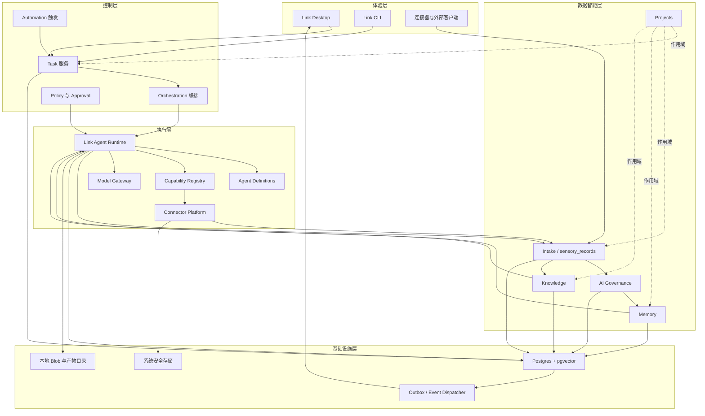
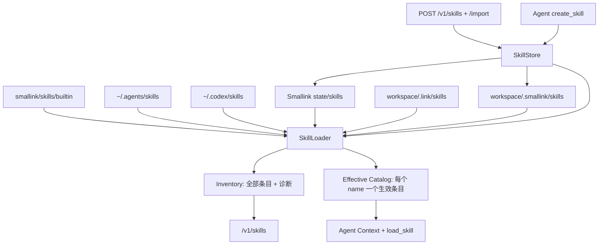
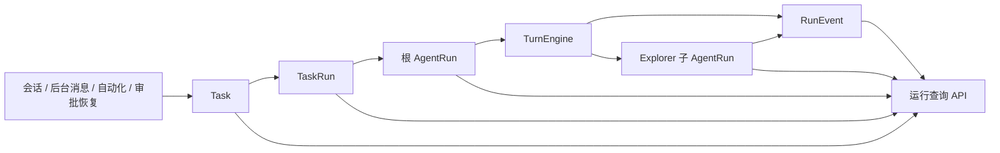

# Smallink 产品技术架构设计

文档版本：4.4
更新日期：2026-07-30
适用范围：Smallink Desktop、Smallink Core、智能体运行、多智能体、数据接入、治理、记忆、知识和项目空间

关联文档：[产品 PRD](./link-product-prd.md)、[整体架构导读](./smallink-architecture-guide.md)、[智能体 AI 底座](./smallink-agent-ai-foundation-guide.md)

命名边界：`Smallink` 是唯一产品名称，`smallink` 是唯一正式 Python 实现包。`link` Python 导入和 `link-server` 等旧命令仅为兼容转发层；`X-Link-Token`、`link` WebSocket 子协议、`~/.config/link/`、`link.db` 和 `.link/` 是当前运行兼容标识。本版本不执行破坏性数据目录迁移。

## 1. 架构结论

Smallink 以现有智能体执行底座为唯一代码基础进行重构。

原底座来源信息见 `THIRD_PARTY_NOTICES.md`。重构后不保留第二个产品名称、第二套业务服务或第二套用户界面，所有正式包、命令、配置和运行模块统一属于 Smallink。

现有智能体能力完整保留并增强：

- 桌面客户端。
- 模型 Provider。
- 智能体运行循环。
- 文件、终端、Git 和搜索工具。
- Tool Registry。
- Skills。
- MCP。
- Persona。
- Explorer 子智能体。
- 权限和人工确认。
- Inbox 和无人值守。
- 自动化和 SelfWake。
- 外部操作连接器。
- 会话、产物、审计、流式输出、中断和重试。

在此基础上新增：

- 持久化 Task、TaskRun 和 AgentRun。
- 通用多智能体编排。
- `sensory_records` 原始数据底座。
- AI 数据治理和候选记忆。
- 正式记忆、版本和检索。
- 知识库。
- 项目空间。
- Postgres 统一业务存储。

## 2. 架构目标

1. 一个 Smallink Desktop。
2. 一个 Smallink Core。
3. 一个主要 Postgres 数据库。
4. 一套智能体运行和权限机制。
5. 一套连接器平台。
6. 一套任务、事件和恢复机制。
7. 一条原始数据、治理、记忆和使用闭环。
8. 所有现有能力在迁移中保持可用。
9. 模块边界明确，可单独测试和演进。
10. 保持个人产品需要的轻量部署和维护成本。

## 3. 基础术语

| 术语 | 技术含义 |
|---|---|
| Module 模块 | 拥有明确职责、数据和接口的代码边界 |
| Modular Monolith 模块化单体 | 一个部署程序，内部按模块隔离，不等于把所有逻辑写在一起 |
| Task | 用户目标的持久化实体 |
| TaskRun | Task 的一次完整执行尝试 |
| AgentDefinition | 智能体角色模板 |
| AgentRun | 一个智能体实际执行一次子任务 |
| RunEvent | 运行中产生的状态、模型、工具、审批和输出事件 |
| Capability | Tool、Skill、MCP 或连接器动作的统一抽象 |
| Policy | 判断某项能力是否允许、需确认或禁止的规则 |
| ContextBundle | 为一次 AgentRun 组装的项目、记忆、知识和来源上下文 |
| SensoryRecord | 从真实来源进入系统的不可被 AI 覆盖的原始事实 |
| CandidateMemory | AI 生成、等待用户确认的候选记忆 |
| FormalMemory | 已确认并可被后续智能体检索的正式记忆 |
| Outbox | 与业务事务一起保存、随后可靠分发的事件表 |
| Watermark 水位 | 某个数据来源已经成功处理到的位置 |
| Idempotency 幂等 | 同一请求重复执行不会产生重复业务结果 |

## 4. 不降级原则

本次重构禁止通过删除能力来降低复杂度。

每项现有能力都必须登记：

- 当前实现。
- 目标模块。
- 当前行为测试。
- 新实现等价测试。
- 数据迁移。
- 切换条件。
- 旧实现退出条件。

旧实现只有在以下条件同时满足后才能删除：

1. 新接口已经接管真实调用。
2. 数据迁移完成。
3. 单元、集成和端到端测试通过。
4. 前端没有继续调用旧接口。
5. 回滚方式已经明确。

智能体层数、并发数、工具次数和模型成本由预算策略控制，不设置写死的产品上限。

权限确认、来源追溯、正式记忆确认和原始数据不可覆盖属于可信边界，不作为可取消的能力限制。

## 5. 总体架构



## 6. 部署形态

Link 保持轻量的模块化单体：

- Link Desktop：React + Tauri。
- Link Core：Python + FastAPI。
- Link Database：Postgres，启用 pgvector。
- 本地产物与大文件：用户目录下的受控 Blob 目录。
- 密钥：操作系统安全存储或现有 SecretStore 适配器。

默认端口：

- Link Desktop 开发端口：`41737`。
- Link Core 独立开发端口：`42871`。
- Tauri Sidecar：运行时分配本地端口。

不要求 Redis、Kafka、Kubernetes 或独立向量数据库。后台任务队列、锁、事件 Outbox 和重试首先使用 Postgres 实现。

## 7. 模块边界规则

1. 每张正式业务表只有一个所属模块。
2. 其他模块不能绕过所属模块直接修改该表。
3. 跨模块同步调用使用应用接口。
4. 跨模块异步通知使用领域事件和 Outbox。
5. 查询页面可以使用只读聚合模型，但不能通过聚合模型写业务状态。
6. 模块内部可以替换实现，不改变对外契约。
7. 所有跨模块请求携带 `user_id`、`task_id`、`project_id` 或来源上下文。

## 8. `task` 模块

### 8.1 职责

- 保存用户目标。
- 管理对话与任务关系。
- 创建 TaskRun。
- 聚合任务状态。
- 关联产物和项目。
- 提供任务历史。

### 8.2 核心数据

- `tasks`
- `task_runs`
- `conversations`
- `conversation_messages`
- `artifacts`
- `task_artifacts`

### 8.3 边界

Task 不直接调用模型或工具。它请求 Orchestration 创建运行。

Conversation 只表达用户交互历史，不再承担任务状态和智能体执行状态。

## 9. `agent_runtime` 模块

### 9.1 定位

现有 `TurnEngine` 完整保留并演进为 Link Agent Runtime Kernel。

它继续负责：

- 模型请求和流式响应。
- 工具调用循环。
- 权限询问。
- 模式切换。
- 中断和重试。
- 上下文注入。
- Provider 差异处理。
- 运行事件产生。

### 9.2 新增职责

- 将每次运行绑定到持久化 AgentRun。
- 在每个状态变化前写入 RunEvent。
- 支持从 ContextSnapshot 恢复。
- 支持父子运行。
- 支持预算检查。
- 支持异步取消。
- 将输入、输出、工具结果和产物发送到 Intake。

### 9.3 核心数据

- `agent_runs`
- `agent_run_events`
- `model_calls`
- `context_snapshots`
- `run_checkpoints`
- `run_budgets`

### 9.4 运行状态

- `queued`
- `preparing`
- `running`
- `waiting_approval`
- `waiting_child`
- `paused`
- `completed`
- `failed`
- `cancelled`
- `timed_out`

## 10. `orchestration` 模块

### 10.1 职责

- 将 TaskRun 拆成 AgentRun。
- 创建父子关系和依赖关系。
- 调度串行或并行运行。
- 汇总子运行结果。
- 处理失败、重试和替代模型。
- 传播取消信号。
- 检查任务预算。

### 10.2 核心数据

- `run_dependencies`
- `delegations`
- `run_attempts`
- `budget_reservations`

### 10.3 委派协议

委派使用结构化契约：

```json
{
  "goal": "分析本批 Codex 数据并提出产品决策类候选记忆",
  "inputs": {
    "sensory_record_ids": ["sr_1", "sr_2"],
    "project_id": "project_link"
  },
  "constraints": {
    "capability_policy": "governance_read_only",
    "memory_write": "candidate_only"
  },
  "expected_output_schema": "governance_candidate_batch.v1",
  "budget": {
    "timeout_seconds": 600,
    "max_model_cost": 2.0,
    "max_tool_calls": 50,
    "max_parallel_children": 4
  }
}
```

### 10.4 预算而非硬上限

默认预算由系统、智能体定义、项目和用户设置共同计算。

可以限制：

- 最大运行时间。
- 最大模型费用。
- 最大输入输出 Token。
- 最大工具次数。
- 最大并行运行。
- 最大委派深度。
- 最大重试次数。

高级用户可以调整预算，但不能用预算绕过权限策略。

## 11. `agents` 模块

### 11.1 职责

- 管理 AgentDefinition。
- 管理系统提示词和版本。
- 配置默认模型、能力、权限和预算。
- 管理内置、用户、项目和插件智能体。
- 保证历史运行能够解析原定义版本。

### 11.2 AgentDefinition

核心字段：

- `agent_definition_id`
- `slug`
- `name`
- `version`
- `description`
- `system_prompt_id`
- `model_policy`
- `capability_policy_id`
- `data_scope_policy`
- `delegation_policy`
- `default_budget`
- `workspace_policy`
- `output_schema`
- `enabled`
- `source`

### 11.3 与 Persona 的关系

现有 Persona 生命周期和 Markdown Manifest 能力继续保留。

目标模型中：

- Persona 是面向用户的角色配置形式。
- AgentDefinition 是运行时使用的正式版本。
- 启动任务时将 Persona 解析并冻结为 AgentDefinition 版本。

禁用智能体只影响新任务，不破坏历史运行和正在执行的任务。

## 12. `capabilities` 模块

### 12.1 统一抽象

以下能力统一进入 Capability Registry：

- Python Tool。
- Link Skill。
- MCP Tool。
- 文件和终端能力。
- Web 搜索。
- 连接器动作。
- 子智能体委派。

### 12.2 CapabilityDefinition

至少包含：

- 唯一名称。
- 显示名称。
- 版本。
- 输入 Schema。
- 输出 Schema。
- 风险等级。
- 是否需要确认。
- 数据访问范围。
- 是否允许无人值守。
- 是否幂等。
- 超时。
- 执行位置。
- 来源插件或模块。

未登记风险元数据的能力默认 `external/unknown`，需要确认或禁止。

### 12.3 核心数据

- `capability_definitions`
- `capability_versions`
- `capability_policies`
- `tool_calls`
- `tool_call_results`

### 12.4 现有能力保留

现有 ToolRegistry、Skills、MCP、文件、终端、Git、搜索和目录授权全部通过适配器进入新 Registry，不重写其业务能力。

### 12.5 Skill Catalog 与 Skill Hub

#### 12.5.1 技术边界

Skill 由文件系统承载，`SKILL.md` 是运行事实源。第一阶段不把 Skill 正文复制到数据库，也不让前端直接扫描用户目录。Smallink Core 负责发现、解析、覆盖计算和结构诊断，客户端只通过 REST 读取目录。

运行时和管理界面共用 `SkillLoader`：



目录优先级从低到高依次为内置、共享 Agent、Codex、Smallink 用户、项目兼容目录、项目正式目录。后读取来源覆盖同名 Skill。Inventory 保留所有条目，Effective Catalog 只保留当前生效条目。

#### 12.5.2 领域模型

`Skill` 运行模型包含：

- `id`：根据规范化目录路径生成的稳定标识。
- `name`：Agent 调用 `load_skill` 使用的稳定名称。
- `description`：进入会话目录的触发说明。
- `instructions`：按需读取的完整正文。
- `path`：Skill 根目录。
- `allowed_tools`：依赖声明，不是权限授予。
- `display_name`、`short_description`：优先读取 `agents/openai.yaml` 的界面元数据。
- `source`、`scope`、`source_label`：来源和作用范围。
- `active`、`shadowed_by`：覆盖计算结果。
- `valid`、`errors`：结构诊断。
- `resources`：scripts、references、assets 的文件数量。

`SkillLoader.catalog()` 保留原有轻量 `name + description` 契约供 Agent 上下文使用，并将 description 归一化、限制为 320 个字符，避免大量第三方 Skill 元数据挤占会话上下文；`SkillLoader.inventory()` 返回 Skill Hub 所需的完整元数据，但默认不返回 `instructions`。

#### 12.5.3 解析与容错

- 使用 YAML 解析器读取 frontmatter，支持多行 description。
- `name` 和 `description` 是必填字段。
- `agents/openai.yaml` 只承担界面元数据，不参与 Skill 触发判断。
- 单个 Skill YAML 错误转为该条目的诊断信息，不能阻断其他 Skill。
- 详情接口按 `id` 读取正文，列表接口不批量发送正文。
- 所有路径在服务端规范化；接口仅返回本机可读路径，不提供任意路径参数。

#### 12.5.4 SkillStore 写入边界

`SkillStore` 是表单创建、目录或 ZIP 导入和 Agent `create_skill` 的唯一写入边界。它根据 `scope` 将数据写入 Smallink 状态目录 `skills/` 或当前工作区 `.smallink/skills/`，各入口不得各自实现文件写入。

写入过程：

1. 校验名称、必填内容、字符长度、作用范围和目标目录冲突。
2. 在目标父目录创建临时目录。
3. 生成或复制 `SKILL.md` 与完整 Skill 包；ZIP 先安全解压到系统临时目录。
4. 对最终结构再次使用同一解析器校验。
5. 使用同文件系统重命名原子提交；异常时删除临时目录。
6. 刷新当前 Agent 的 `SkillLoader`，REST 写入后淘汰空闲 Engine，使后续任务读取新目录。

导入保留 Skill 包内的普通文件和相对目录，包括 `agents/`、`scripts/`、`references/`、`assets/`、`config/`、`prompts/`、`examples/` 和根目录数据文件。`.git`、`node_modules`、缓存和系统元数据不进入目标目录。目录导入拒绝符号链接和特殊文件；ZIP 导入额外拒绝路径穿越、符号链接、加密条目和多 Skill 包。统一限制为最大 200 个文件、解压后 10 MB；同范围同名目录返回 409，不执行覆盖。导入阶段不运行脚本。

#### 12.5.5 API

```text
GET /v1/skills?workspace=<optional-path>
GET /v1/skills/{skill_id}?workspace=<optional-path>
POST /v1/skills
POST /v1/skills/import
POST /v1/skills/pick-archive
```

列表响应：

```json
{
  "skills": [],
  "summary": {
    "total": 0,
    "active": 0,
    "issues": 0,
    "sources": 0
  }
}
```

详情响应在列表字段基础上增加 `instructions`。未知 `skill_id` 返回 404 语义的错误响应。

创建接口接收 `name`、`display_name`、`description`、`instructions`、`scope` 和可选 `workspace`。导入接口接收本机文件夹或 `.zip` 的 `path`、`scope` 和可选 `workspace`。浏览器开发模式通过本地 sidecar 的 `pick-archive` 接口打开原生 ZIP 选择器；桌面客户端使用 Tauri 原生选择器。无效输入返回 400，同范围冲突返回 409，成功响应返回包含 `instructions` 的 Skill 详情。

#### 12.5.6 客户端

`IntegrationsView` 在连接器列表与 MCP 服务之间增加固定 `skills` 标签，挂载独立 `SkillHub` 组件并传入当前工作区。`SettingsView` 不再持有 Skill Hub。组件状态分为：

- `loading`：首次读取目录。
- `ready`：展示概览、搜索、筛选和卡片。
- `empty`：真实目录为空。
- `error`：服务不可达或接口失败，可重试。
- `detail`：已选择卡片并按需读取正文。
- `create`：手动创建表单与保存状态。
- `import`：原生文件夹或 ZIP 选择、来源类型提示、范围选择与导入状态。

客户端不缓存 Skill 正文到持久化存储，不修改文件，不伪造统计。搜索与筛选在已获取的元数据上本地完成，点击卡片才请求详情。

“对话创建”不在前端伪造 Skill：客户端创建新的 Link 会话并预填需求澄清提示。Agent 收集问题、触发场景、具体示例、资源、约束和输出后展示预览；用户批准工具调用后，运行时 `create_skill` 经 `SkillStore` 保存并刷新目录。工具元数据为 `medium` 风险并设置 `requires_approval=True`。

桌面侧栏的全局搜索入口由完整文字行收纳为品牌栏右侧的图标按钮，继续复用 `SearchModal`，并保留 `title`、`aria-label` 与 `data-testid`。连接器成为新建会话下方的首个模块导航项，避免搜索与能力模块争夺纵向空间。

#### 12.5.7 安全

- Skill 发现和详情读取为只读操作。
- 创建和导入只能进入用户 Skill 根目录或当前工作区约定目录，不能由请求指定任意目标目录。
- 导入拒绝软链接、特殊文件、ZIP 目录穿越、加密压缩包、超限资源和静默覆盖。
- `allowed-tools` 仅显示依赖，不写入 PermissionEngine 的授权集合。
- Skill 指令中的命令和外部动作仍走 ToolRegistry、Capability Policy 和审批。
- 项目 Skill 的读取范围固定为当前工作区约定目录。
- 未来引入远程安装时必须增加来源签名和可恢复卸载；当前仅支持用户主动选择的本机目录。

## 13. `policy` 模块

### 13.1 职责

- 计算能力调用决策。
- 创建审批项。
- 管理目录和项目授权。
- 管理无人值守策略。
- 管理 Standing Approval。
- 保存审计事件。

### 13.2 决策结果

- `allow`
- `allow_once`
- `require_approval`
- `deny`
- `defer_to_inbox`

### 13.3 继承规则

子智能体的权限是以下策略的交集：

1. 用户全局策略。
2. 项目策略。
3. TaskRun 策略。
4. 父 AgentRun 授权范围。
5. AgentDefinition 策略。
6. Capability 风险元数据。

子智能体不能获得超过父运行的权限。

### 13.4 核心数据

- `policies`
- `policy_bindings`
- `approvals`
- `standing_approvals`
- `directory_grants`
- `audit_events`

## 14. `connectors` 模块

### 14.1 两种端口

连接器平台为同一账户提供两种不同端口：

1. Intake Port：同步外部数据。
2. Action Port：向智能体暴露外部动作。

共享账户授权不代表共享权限策略。

### 14.2 数据连接器接口

```python
class DataConnector:
    def discover_containers(self, account, cursor): ...
    def sync(self, container, watermark, limit): ...
    def normalize(self, external_item): ...
    def health(self): ...
```

输出只能进入 Intake，不得直接写 Memory 或 Knowledge。

### 14.3 操作连接器接口

```python
class ActionConnector:
    def capabilities(self): ...
    def invoke(self, capability_name, arguments, context): ...
    def health(self): ...
```

调用必须经过 Capability Registry 和 Policy。

### 14.4 核心数据

- `connector_definitions`
- `connector_instances`
- `connector_accounts`
- `source_containers`
- `connector_health`
- `connector_cursors`

### 14.5 现有代码处理

现有连接器能力全部迁入 `smallink/connectors`。大型 `integration_tools.py` 按供应商和能力域拆分，但对外 Schema 和行为必须保持兼容测试。

## 15. `intake` 模块

### 15.1 职责

- 接收所有原始事实。
- 规范化公共元数据。
- 计算去重键和内容哈希。
- 保存记录版本。
- 管理同步任务和水位。
- 标记敏感级别。
- 为治理和知识模块发布事件。

### 15.2 原始记录来源

- 用户消息。
- AI 输出。
- 工具调用与结果。
- CLI。
- Skill 和 MCP 调用。
- 文件和文件变化。
- 连接器同步。
- 自动化运行。
- 智能体产物。

### 15.3 `sensory_records`

目标字段：

```text
record_id
source_type
connector_instance_id
source_container_id
external_id
external_version
record_type
occurred_at
ingested_at
project_id
actor
title
content_text
content_json
content_hash
dedupe_key
sensitivity
schema_version
current_version_id
deleted_at
```

原始内容不可更新覆盖。外部内容变化时创建 `sensory_record_versions`，并推进当前版本指针。

当前第一阶段 SQLite 适配器已经落地以下字段：

```text
record_id
source_type
connector_id
account_id
external_id
content_type
raw_content
normalized_content
occurred_at
ingested_at
project_path
conversation_id
content_hash
sensitivity
governance_status
metadata_json
source_locator
```

当前唯一约束为 `source_type + external_id + content_hash`，保证同一来源的相同事实重复写入时保持幂等。记录采用追加写入；治理层不得覆盖 `raw_content`。

### 15.4 去重

去重优先级：

1. 连接器实例 + 外部 ID + 外部版本。
2. 来源容器 + 规范化外部 ID。
3. 明确业务唯一键。
4. 内容哈希用于辅助检测，不单独作为所有数据的唯一键。

### 15.5 同步任务

`sync_jobs` 保存：

- 连接器。
- 来源容器。
- 起始和结束水位。
- 扫描数量。
- 新增数量。
- 更新数量。
- 重复数量。
- 失败数量。

### 15.6 第一阶段运行链实现（2026-07-29）

当前已实现：

1. 每次 Smallink 运行将用户输入或连接器入站写入 `sensory_records`。
2. 完整 AI 输出、工具提议、工具结果、运行错误和中断写入原始池。
3. 流式 token 增量只用于实时传输，不逐 token 持久化，避免事件库和原始池无意义膨胀。
4. 附件中的 `data_url` 不写入原始池，只保存字节数和 SHA-256，避免数据库存储大段 base64。
5. 提供 `GET /v1/sensory-records`、`GET /v1/sensory-records/stats` 和 `GET /v1/sensory-records/{record_id}`。
6. 客户端“数据来源”页面支持来源、治理状态、项目、会话、原文、元数据和来源定位查看。
7. `POST /v1/memory` 暂时返回 `409 governance_required`，禁止绕过治理直接写正式记忆。

当前边界：Codex 历史导入和外部连接器同步仍需通过统一 SyncJob 接入；记录版本、治理任务水位和 Postgres Repository 属于后续阶段。
- 状态和错误。

只有成功提交的记录才能推进水位。

## 16. `governance` 模块

### 16.1 职责

- 根据未治理增量创建治理任务。
- 为 AI 组装一批相关原始记录。
- 去噪、分组和合并。
- 生成候选记忆。
- 保存理由、置信度和来源。
- 处理用户决策。
- 推进治理水位。

### 16.2 核心数据

- `governance_tasks`
- `governance_task_records`
- `governance_runs`
- `memory_candidates`
- `candidate_sources`
- `governance_decisions`
- `governance_watermarks`

### 16.3 任务边界

治理任务不是每次刷新重新计算。它绑定一个确定的增量范围：

- 来源。
- 时间区间。
- 起止水位。
- 原始记录集合。
- 使用的提示词版本。
- 使用的模型。

### 16.4 候选记忆

候选记忆至少包含：

- 类型。
- 标题。
- 内容。
- 适用范围。
- 项目。
- 置信度。
- 为什么值得记忆。
- 为什么这样总结。
- 来源记录。
- 冲突和重复建议。
- 提示词和模型版本。

Governance 只能写候选区，不能写正式记忆表。

## 17. `memory` 模块

### 17.1 三层模型

- Working Memory：属于 AgentRun。
- Candidate Memory：属于 Governance。
- Formal Memory：属于 Memory。

### 17.2 核心数据

- `memories`
- `memory_versions`
- `memory_sources`
- `memory_relations`
- `memory_project_bindings`
- `memory_usage_events`

### 17.3 正式入库事务

用户确认候选记忆时，在一个事务中：

1. 锁定候选项。
2. 校验候选项仍未处理。
3. 创建或更新正式记忆。
4. 创建记忆版本。
5. 写入来源关系。
6. 写入用户决策。
7. 更新候选状态。
8. 写入 Outbox 事件。

### 17.4 写入边界

- 智能体不能直接调用正式记忆增删改。
- 手工创建记忆也先创建用户来源的候选项，再确认入库。
- 删除正式记忆默认转为归档或撤销生效，不物理破坏来源链。
- 旧 `/v1/memory` 直接写入接口迁移为候选创建接口后删除。

### 17.5 检索

检索综合：

- 用户范围。
- 项目范围。
- 类型。
- 时间有效性。
- 关键词。
- 向量相似度。
- 最近使用。
- 置信度。
- 冲突状态。

每次返回记录引用了哪些记忆版本，并写入 `memory_usage_events`。

## 18. `knowledge` 模块

### 18.1 职责

- 管理文档、会议、网页、代码说明和产物。
- 提取文本。
- 生成内容切片。
- 建立关键词和向量索引。
- 返回带引用的检索结果。

### 18.2 核心数据

- `knowledge_items`
- `knowledge_versions`
- `knowledge_chunks`
- `knowledge_embeddings`
- `knowledge_sources`
- `knowledge_project_bindings`

### 18.3 与 Memory 的边界

Knowledge 保存资料内容，Memory 保存用户确认的长期结论。

同一来源可以同时：

- 作为 Knowledge 文档被检索。
- 经过 Governance 产生 Candidate Memory。

二者不能共用一张含义模糊的表。

## 19. `projects` 模块

### 19.1 职责

- 保存项目定义。
- 管理项目与其他实体的关系。
- 提供项目范围查询。
- 管理未归属数据。

### 19.2 核心数据

- `projects`
- `project_folders`
- `project_bindings`
- `project_settings`

### 19.3 不复制数据

项目只保存实体引用：

- Task ID。
- SensoryRecord ID。
- Memory ID。
- KnowledgeItem ID。
- Artifact ID。
- Automation ID。

删除项目默认只删除关系，不删除被引用实体。

## 20. `automation` 模块

### 20.1 职责

- 管理定时和事件触发器。
- 将触发转换为 Task。
- 管理 SelfWake。
- 保存自动化运行历史。
- 管理失败重试和通知。

### 20.2 核心数据

- `automations`
- `automation_triggers`
- `automation_runs`
- `wake_requests`
- `job_queue`
- `job_attempts`

### 20.3 统一执行

Automation 不直接创建另一套 Agent Engine。每次触发都创建 TaskRun，并通过 Orchestration 和 Agent Runtime 执行。

## 21. `platform` 模块

### 21.1 职责

- Model Provider 配置。
- Secret 引用。
- 系统设置。
- 用户设置。
- 数据库连接。
- 事件分发。
- 健康检查。

### 21.2 Model Gateway

保留现有 ProviderRouter，并标准化：

- Provider 能力矩阵。
- 模型 ID。
- Tool calling。
- 流式能力。
- 多模态能力。
- 上下文窗口。
- 费用与延迟元数据。
- 错误类型。

AgentDefinition 保存模型策略，不直接保存明文密钥。

## 22. 上下文组装

Agent Runtime 不再把全部历史直接塞入提示词。

ContextAssembler 按 TaskRun 组装：

1. 当前用户目标。
2. 当前对话的必要消息。
3. 项目说明和目录。
4. 相关正式记忆。
5. 相关知识切片。
6. 指定原始记录。
7. 当前任务预算和权限。
8. 父运行提供的结构化输入。

输出 ContextBundle：

```json
{
  "task_id": "task_1",
  "agent_run_id": "run_2",
  "project_id": "project_link",
  "conversation_message_ids": ["msg_1"],
  "memory_version_ids": ["mv_8"],
  "knowledge_chunk_ids": ["kc_4"],
  "sensory_record_ids": ["sr_12"],
  "workspace_roots": ["/Users/example/project"],
  "policy_snapshot_id": "policy_snapshot_3"
}
```

ContextBundle 在运行开始时保存快照，保证后续能够解释“当时为什么得到这个结果”。

## 23. 任务和事件

### 23.1 事件先保存

所有用户可见运行事件遵循：

1. 在业务事务中写入状态和 Outbox。
2. 事务提交。
3. Event Dispatcher 发送 WebSocket 事件。
4. 前端确认最后事件位置。

### 23.2 核心事件

- `task.created`
- `task_run.started`
- `agent_run.created`
- `agent_run.started`
- `agent_run.delegated`
- `model_call.started`
- `tool_call.proposed`
- `approval.requested`
- `tool_call.completed`
- `artifact.created`
- `agent_run.completed`
- `task_run.completed`
- `sensory_record.ingested`
- `sync_job.completed`
- `governance_task.ready`
- `memory_candidate.created`
- `memory.confirmed`
- `knowledge.indexed`

### 23.3 断线恢复

WebSocket 事件携带单调递增 `event_id`。客户端重连时提供最后处理的 ID，服务端先补历史事件，再继续推送实时事件。

## 24. API 边界

建议正式 API：

```text
/v1/tasks
/v1/tasks/{task_id}/runs
/v1/task-runs/{run_id}
/v1/agent-runs/{run_id}
/v1/agent-definitions
/v1/capabilities
/v1/approvals
/v1/connectors
/v1/connectors/{id}/sync-jobs
/v1/intake/records
/v1/governance/tasks
/v1/governance/candidates
/v1/memories
/v1/knowledge
/v1/projects
/v1/automations
/v1/settings/models
/v1/settings/prompts
/v1/health
```

关键写接口：

- 创建任务。
- 启动、暂停、恢复、取消 TaskRun。
- 确认能力调用。
- 创建同步任务。
- 启动治理分析。
- 处理候选记忆。
- 归档或编辑正式记忆。

正式 Memory API 不接受智能体直接创建未确认记忆。

## 25. 前端架构

### 25.1 保留

- React 组件体系。
- Tauri 桌面容器。
- 会话工作台。
- 流式输出。
- 工具确认卡片。
- 进度和产物区域。
- 连接器配置。
- 模型配置。
- 自动化。
- Inbox。

### 25.2 新增

- TaskRun 页面。
- AgentRun 父子运行图。
- 运行事件时间线。
- 数据来源和原始记录。
- 治理任务列表和详情。
- 候选记忆批量处理。
- 个人记忆分类页面。
- 知识库。
- 项目空间。

### 25.3 状态来源

前端只使用：

- REST 查询当前快照。
- WebSocket 接收增量事件。
- 本地 UI 状态。

前端不得通过 generated snapshot 伪造正式业务状态。

### 25.4 页面与模块对应

| 页面 | 后端模块 |
|---|---|
| 工作台 | task、agent_runtime、orchestration |
| 项目空间 | projects 及只读聚合 |
| 连接器与能力 | connectors、capabilities/skills、capabilities/mcp |
| 数据来源 | connectors、intake |
| 数据治理 | governance |
| 个人记忆 | memory |
| 知识库 | knowledge |
| 自动化 | automation、task |
| 待处理中心 | policy、governance |
| 设置 | platform、agents、models、policy |

## 26. Postgres 数据组织

建议使用逻辑 Schema：

```text
runtime
agents
capabilities
connectors
intake
governance
memory
knowledge
projects
automation
policy
platform
```

单机部署仍然只运行一个 Postgres 实例。

所有表使用：

- UUID 或时间有序 UUID 主键。
- `created_at`、`updated_at`。
- 明确的状态枚举。
- 乐观锁版本或事务锁。
- 幂等键。
- JSONB 只保存扩展字段，不替代明确列。

pgvector 只用于向量索引，原文、来源和业务状态仍保存在普通关系表。

## 27. 文件和 Blob

大文件不直接全部写入数据库。

建议：

```text
~/.config/link/
  blobs/
    sha256/...
  artifacts/
    <task_id>/...
  imports/
  exports/
```

数据库保存：

- Blob 哈希。
- 相对路径。
- MIME。
- 大小。
- 来源。
- 加密状态。
- 引用计数。

只有没有任何业务引用的 Blob 才能被后台清理。

## 28. 目标代码结构

```text
link/
  task/
    domain.py
    service.py
    repository.py
  agent_runtime/
    engine.py
    runner.py
    checkpoint.py
    context.py
  orchestration/
    service.py
    delegation.py
    scheduler.py
    budget.py
  agents/
    definitions.py
    manifests.py
    service.py
  capabilities/
    registry.py
    policy.py
    tools/
    skills/
    mcp/
  connectors/
    contracts.py
    accounts.py
    intake/
    actions/
  intake/
    service.py
    normalization.py
    dedupe.py
    repository.py
  governance/
    service.py
    analyzer.py
    candidates.py
  memory/
    service.py
    retrieval.py
    repository.py
  knowledge/
    service.py
    extraction.py
    retrieval.py
  projects/
  automation/
  policy/
  platform/
  api/
```

模块化不要求一次移动全部文件。迁移期间可以保留旧导入路径，通过适配器逐步切换。

## 29. 当前代码映射

| 当前代码 | 目标模块 | 处理决定 |
|---|---|---|
| `smallink/engine.py` | `agent_runtime` | 完整保留并增加持久运行 |
| `smallink/agent.py` | `agent_runtime/context` | 拆分上下文、能力和运行组装 |
| `smallink/agents` | `agents` | 保留并版本化定义 |
| `smallink/personas` | `agents/manifests` | 保留用户角色体验 |
| `smallink/tools` | `capabilities/tools` | 保留 |
| `smallink/skills` | `capabilities/skills` | 保留 |
| `smallink/mcp` | `capabilities/mcp` | 保留 |
| `smallink/tools/subagent.py` | `orchestration` | Explorer 迁为首个持久子运行 |
| `smallink/permissions.py` | `policy` | 保留并扩展策略快照 |
| `smallink/inbox.py` | `policy/approvals` | 迁入统一待处理模型 |
| `smallink/automation` | `automation` | 保留，触发统一 TaskRun |
| `smallink/selfwake.py` | `automation` | 保留 |
| `smallink/connectors` | `connectors` | 保留并拆分 Intake/Action |
| `smallink/conversations.py` | `task` | 从 JSONL/SQLite 迁入 Postgres |
| `smallink/memory` | `memory/legacy` | 只读迁移适配器 |
| `smallink/server/app.py` | `api` | 按模块拆路由 |
| `smallink/server/manager.py` | 各模块 Service | 逐步拆分，不再新增跨域逻辑 |
| `surfaces/gui` | Link Desktop | 保留并扩展 |

## 30. 迁移策略

### 30.1 建立能力基线

- 固化现有后端、前端和端到端测试。
- 建立能力清单。
- 为关键接口记录请求与响应契约。

### 30.2 引入 Postgres Repository

- 先建立新 Schema 和迁移工具。
- 旧 Store 通过 Adapter 实现相同接口。
- 新数据双写只用于短期验证，并带一致性检查。
- 切换后 Postgres 成为唯一写入点。

### 30.3 运行模型切片

第一条纵向切片：

1. 用户在现有工作台发送消息。
2. 创建 Task 和 TaskRun。
3. 现有 TurnEngine 作为 AgentRun 执行。
4. 工具、审批、输出和产物写入 RunEvent。
5. 前端仍然保持原有交互。

### 30.4 多智能体切片

1. 将 Explorer 创建为真实子 AgentRun。
2. 保存父子关系。
3. 返回结构化结果。
4. 支持取消、失败和重试。
5. 再开放通用委派。

### 30.5 数据学习切片

1. 运行输入输出进入 Intake。
2. 创建治理任务。
3. AI 生成候选记忆。
4. 用户确认。
5. 下一次任务检索该记忆。

### 30.6 退出旧实现

每次只退出一个明确能力的旧实现。禁止一次性删除多个仍被前端或后台任务调用的模块。

## 31. 测试策略

### 31.1 单元测试

- 领域状态转换。
- 预算计算。
- 权限决策。
- 去重。
- 治理候选生成解析。
- 记忆版本事务。
- 上下文排序。

### 31.2 契约测试

- Provider。
- Capability。
- Data Connector。
- Action Connector。
- Repository。
- WebSocket Event。

### 31.3 集成测试

- Postgres 事务。
- Outbox 分发。
- Job 抢占和重试。
- 断线恢复。
- 父子运行取消。
- 候选记忆确认事务。

### 31.4 端到端测试

- 普通任务。
- 工具审批。
- 多智能体任务。
- 自动化任务。
- 连接器同步。
- 治理批量处理。
- 正式记忆检索。
- 应用重启恢复。

### 31.5 能力等价测试

现有能力迁移必须复用或扩展当前回归测试。测试通过前，不得宣布迁移完成。

## 32. 可观察性

每个日志和事件携带：

- `request_id`
- `task_id`
- `task_run_id`
- `agent_run_id`
- `tool_call_id`
- `connector_instance_id`
- `sync_job_id`
- `governance_task_id`

指标包括：

- 任务成功率。
- AgentRun 延迟。
- 模型调用次数和费用。
- 工具失败率。
- 审批等待时间。
- 同步吞吐和失败率。
- 治理压缩率。
- 候选记忆接受率。
- 记忆检索命中和引用率。

用户可见错误使用自然语言，诊断页保留结构化错误代码和上下文。

## 33. 安全设计

1. API 使用 `X-Link-Token`。
2. WebSocket 使用 `link` 子协议或等价安全握手。
3. Core 默认只监听 `127.0.0.1`。
4. 密钥不写入数据库明文字段、日志或 RunEvent。
5. 工具参数按敏感字段规则脱敏。
6. 原始记录保留敏感级别。
7. 未知工具默认失败关闭。
8. 高风险操作必须由用户确认。
9. 子智能体不能提升权限。
10. AI 不能覆盖原始记录。
11. AI 不能直接创建或删除正式记忆。
12. 数据导出和删除写入审计。

## 34. 关键架构决定

### ADR-001：以现有执行底座为 Link 主线

不再从旧记忆原型反向接入智能体。现有执行底座直接演进为 Link。

### ADR-002：保持模块化单体

个人产品优先可维护性和轻量部署，不提前拆微服务。

### ADR-003：Postgres 是唯一事实源

SQLite、JSON 和 JSONL 进入迁移和导入导出状态。

### ADR-004：TurnEngine 完整保留并增强

TurnEngine 是 Link Agent Runtime Kernel，不降级为临时兼容组件。

### ADR-005：多智能体使用持久化父子运行

子智能体不是不可见的递归函数调用，每个运行拥有 ID、状态、事件和预算。

### ADR-006：限制使用预算表达

层数、并发和成本可配置；权限和数据可信边界不可被预算覆盖。

### ADR-007：连接器区分 Intake 与 Action

共享授权但不共享业务权限和写入边界。

### ADR-008：正式记忆必须经过确认

Governance 只能生成候选，Memory 模块负责正式版本事务。

### ADR-009：项目空间只保存关系

项目空间不复制原始记录、记忆、知识和产物。

### ADR-010：运行事件先持久化再推送

前端状态可以跨断线和重启恢复。

## 35. 技术验收标准

1. 现有执行能力回归测试全部通过。
2. Task、TaskRun、AgentRun 和 RunEvent 使用真实 Postgres。
3. TurnEngine 能通过 AgentRun 启动、暂停、恢复和取消。
4. Explorer 作为持久化子运行完成父子闭环。
5. Capability 和 Policy 对所有工具调用生效。
6. 数据连接器将真实数据写入 `sensory_records`。
7. 智能体输入输出和工具调用进入 `sensory_records`。
8. Governance 生成带来源的候选记忆。
9. 用户确认在事务中生成正式记忆版本。
10. 后续智能体能检索并引用正确记忆版本。
11. 前端能查看任务图、事件、工具、来源和产物。
12. 应用和数据库重启后状态一致。
13. 旧直接记忆写入和 generated snapshot 实时依赖退出。
14. 当前 Git 仓库根目录是唯一代码主线。

## 36. 当前实现状态

### 36.1 已落地的运行主链

截至 2026-07-27，第一条运行纵向切片已经进入真实代码路径：



已实现内容：

- `smallink/task/models.py` 定义 Task、TaskRun、AgentRun 和 RunEvent 领域记录。
- `smallink/task/store.py` 提供线程安全的 SQLite 运行仓库适配器。
- `smallink/task/observer.py` 将 Explorer 接入当前会话的根 AgentRun。
- `SessionManager.tracked_engine_events` 成为服务内统一运行记录入口。
- WebSocket 会话、后台投递、审批恢复和自动化运行均经过该入口。
- RunEvent 在推送到界面之前写入运行仓库。
- 根运行结束会同步收敛 TaskRun 和 Task 状态。
- 子运行独立保存状态，不覆盖根运行结果。
- 服务启动时将上一次进程遗留的 `running` 和 `waiting_approval` 收敛为 `failed`，保留失败原因。

### 36.2 当前数据表

第一切片新增四张隔离表：

- `runtime_tasks`
- `runtime_task_runs`
- `runtime_agent_runs`
- `runtime_agent_run_events`

它们当前与现有会话库共用 `link.db` 文件，但不复用会话表，也不让 TurnEngine 直接操作 SQL。存储边界由 `SQLiteTaskRuntimeStore` 封装，因此后续可以增加 Postgres Repository 并切换实现。

### 36.3 当前查询接口

- `GET /v1/tasks`
- `GET /v1/agent-collaborations`
- `GET /v1/tasks/{task_id}`
- `GET /v1/sessions/{session_id}/task`
- `GET /v1/task-runs/{task_run_id}`
- `GET /v1/agent-runs/{agent_run_id}`
- `GET /v1/agent-runs/{agent_run_id}/events`

### 36.4 状态映射

| TurnEngine 结果 | AgentRun / TaskRun 结果 |
|---|---|
| `turn_end: completed` | `completed` |
| `turn_end: max_iterations_exceeded` | `failed` |
| `error` | `failed` |
| `interrupted` | `cancelled` |
| 等待审批、目录、问题或计划确认 | `waiting_approval` |
| 重试或恢复没有待处理内容 | `completed`，输出标记 `no_op` |
| 进程重启时仍未结束 | `failed`，记录重启原因 |

### 36.5 过渡边界

SQLite 运行仓库是迁移适配器，不修改 ADR-003。以下目标仍未完成：

- Postgres Repository 和数据迁移。
- 通用多智能体委派、依赖图、预算和父子取消。
- 通用 AgentRun 依赖图、并行执行与跨任务可视化。
- RunEvent 断线续传游标。
- 记忆和知识上下文进入 ContextBundle。

在 Postgres 切换和通用多智能体依赖图完成前，技术验收标准第 2、3、11、12 项仍不能判定为全部完成。

### 36.6 记忆入口与原始数据边界（2026-07-29）

客户端主导航中的原“数据来源”入口调整为“记忆”：

1. 记忆首页读取 `GET /v1/memory`，按十种标准记忆类型显示真实数量。
2. 点击类型进入该类型的正式记忆列表，点击记忆查看内容、作用域和创建时间。
3. 没有正式记忆时显示真实空状态，不使用 Mock 数据。
4. 没有标准类型的早期 SQLite 记忆不被错误归类，页面显示待分类提示。
5. `sensory_records` 继续作为后台不可变原始事实池，通过治理模块使用，不再以“数据来源”名义占用客户端一级导航。
6. 连接器配置继续位于“连接器”，未来真实数据源实例、同步任务与水位应进入独立数据管理模块。

## 37. macOS 客户端外壳与主题实现

### 37.1 稳定拖动区域

窗口拖动由客户端外壳统一负责，不再依赖某个页面单独提供标题栏：

1. `App.tsx` 在应用根节点监听顶部 48 像素内的主按钮按下事件。
2. `windowDrag.ts` 统一判断是否允许开始拖动。
3. `button`、`a`、表单控件、可编辑内容及显式 `data-window-no-drag` 元素被排除。
4. 合法手势通过 Tauri `start_window_drag` 命令调用原生 `WebviewWindow.start_dragging()`。
5. 会话页原有标题栏拖动入口继续保留，根节点规则负责智能体详情、设置、连接器、运行中心和自动化等页面。

该实现使页面组件可以独立演进，不会因为替换页面头部或收起侧边栏而失去窗口拖动能力。拖动判断具有独立单元测试，覆盖顶部空白、交互控件、区域外点击和非主按钮点击。

### 37.2 品牌主题变量

品牌色通过设计变量集中管理，`docs/smallink-ui-design-system.md` 是视觉规范事实源：

| 变量 | 浅色主题 | 深色主题 | 用途 |
|---|---|---|---|
| `--brand-primary` | `#00224D` | `#00224D` | Logo 主体、标题和小面积品牌节点 |
| `--brand-secondary` | `#00529B` | `#00529B` | 次级操作、边框和图表主色 |
| `--accent` | `#00A8E8` | `#00A8E8` | 关键 CTA、选中态、焦点态和数据节点 |
| `--paper` | `#F8FAFC` | `#0F172A` | 页面背景 |
| `--panel` | `#FFFFFF` | `#111C31` | 卡片、弹窗和输入区 |
| `--ink` | `#0F172A` | `#F8FAFC` | 正文 |
| `--on-accent` | `#00224D` | `#001A36` | 青蓝背景上的文字和图标 |

Tailwind 的 `primary`、`secondary`、`accent`、`heading`、`accentSoft` 和 `onAccent` 映射到同一组 CSS 变量。组件不得写入旧绿色品牌常量，也不得在 `bg-accent` 上固定使用 `text-white`。节点青蓝与深邃夜蓝对比度为 5.81:1，深邃夜蓝与云雾白对比度为 15.02:1。

浅色侧栏局部覆盖语义令牌，使用白色到冰蓝的低对比渐变，不再以深邃夜蓝铺满结构面。主工作区、顶部玻璃层、输入区与重点卡片分别使用 `--surface-gradient`、`--glass-gradient`、`--panel-gradient`；选中项使用 `--selection-gradient`，CTA 使用 `--cta-gradient`。普通状态保持中性，节点青蓝面积控制在约 10%。外部连接器 Logo 保留第三方品牌色，组件外壳继续使用 Smallink 语义令牌。

### 37.3 本地 macOS 打包

重复构建可能从 Finder 继承资源分支、FinderInfo 或隔离扩展属性。`packaging/build_dmg.sh` 在本地临时签名前执行 `xattr -cr`，随后再进行完整应用签名与严格校验，避免旧 `.app` 元数据导致重打包失败。

DMG 背景由 `packaging/dmg-background.png`、`packaging/dmg-background@2x.png` 与 `packaging/dmg-background.tiff` 共同组成，三者必须使用相同品牌文案。安装标题固定为 `Install Smallink`，不得保留 OpenWorker 或 Link 等历史产品名；构建脚本只读取已校验的 TIFF 双分辨率资产。

### 37.4 品牌资产与应用图标

品牌源文件统一位于 `design/brand/`：

- `smallink-wordmark-source.png` 保存用户确认的完整字标原稿。
- `smallink-mark.png` 是透明背景、1024 x 1024 的独立图形事实源。
- `surfaces/gui/src/assets/smallink-mark.png` 是前端运行副本。
- `surfaces/gui/src-tauri/icons/` 由 Tauri 图标工具从独立图形生成，不手工分别维护多尺寸版本。

`tauri.conf.json` 的 `productName`、Bundle ID、窗口标题、系统托盘提示和 `packaging/build_dmg.sh` 的 App 名称统一为 `Smallink`。应用图标只使用左侧独立图形；完整字标不进入 Dock、菜单栏或小尺寸按钮。npm 包、Rust crate、离线语音模块和桌面 Sidecar 分别使用 `smallink-desktop`、`smallink-stt` 与 `smallink-server`。旧命令、API Header、WebSocket 子协议和状态目录暂保留兼容名，避免触发用户数据丢失或双实例状态分裂。

### 37.5 代码命名空间收口

- `smallink/` 是全部 Python 业务能力的唯一实现位置。
- `link/__init__.py` 只将旧 `link.*` 导入转发到 `smallink` 包路径，不允许新增业务文件。
- `pyproject.toml` 的正式发行包名为 `smallink`，正式脚本入口指向 `smallink.*`。
- `link`、`link-server` 与 `link-connectors` 作为命令别名继续指向同一份 `smallink` 实现。
- PyInstaller 从 `smallink` 收集正式模块；安装包不存在第二份 Link 运行时。
- 测试代码默认导入 `smallink.*`，并保留独立兼容测试保证旧导入可用。
- 历史 `~/.config/link/link.db` 原位读取，不在命名空间迁移中复制、覆盖或新建空数据库。

### 37.6 收起导航

展开态继续使用 264px 完整侧栏。收起态不再把侧栏移出屏幕并依赖边缘 Hover，而是挂载独立 `CompactSidebar`：

- 浏览器宽度 56px，macOS overlay 宽度 84px，为原生交通灯保留横向空间。
- macOS 首个操作从顶部 54px 后开始，避免与交通灯重叠。
- 固定提供展开、新建会话、搜索、连接器、运行中心、自动化和设置。
- 当前页面使用浅青蓝渐变、左侧节点色标记和 `aria-current`，所有图标提供 tooltip 与 `aria-label`。
- 收起态和展开态只渲染其中一个组件，避免浮层、Hover 区与顶部重复按钮争抢点击和拖动事件。

## 38. 开发目录与运行数据边界

唯一源码根目录为当前 Git 仓库根目录。构建脚本必须根据脚本自身位置计算项目根目录，业务代码不得写死旧 `link-main` 路径。

目录职责如下：

- 主代码、测试、文档、依赖环境和构建产物位于源码根目录。
- 第三方参考源码位于 `references/`，不加入运行时导入路径。
- 已退出的原型位于 `archive/`，不作为接口或数据事实源。
- 密钥、数据库、日志和模型位于 `~/.config/link/`。
- 用户产物默认位于 `~/Smallink/`；已有用户偏好中的旧路径继续生效。
- 工作区私有设置位于项目自身的 `.link/`。

迁移源码目录后必须验证 Python 可编辑安装、前后端测试、生产构建、Tauri 编译、应用签名与 DMG 完整性。

## 39. 多智能体可视化实现（2026-07-29）

### 39.1 数据边界

智能体页面组合两类事实，但不混写：

- 智能体定义来自 `GET /v1/personas`。Persona 描述名称、职责、工具、工作空间要求、启用状态和来源。
- 智能体协作来自 Task Runtime。只有 `runtime_agent_runs.parent_agent_run_id IS NOT NULL` 才证明本次运行发生了委派。

Explorer 当前由 `smallink/tools/subagent.py` 提供，不属于 Persona 注册表，因此客户端以系统子智能体元数据展示它；它的真实调用次数和协作关系仍以 `runtime_agent_runs` 为准。

### 39.2 协作聚合接口

新增：

```http
GET /v1/agent-collaborations?limit=100
```

`SQLiteTaskRuntimeStore.list_collaborative_runs()` 使用单次聚合查询连接任务、任务运行和智能体运行，`HAVING child_agent_count > 0` 排除单智能体运行。返回字段包括任务、会话、项目、运行状态、模型、开始结束时间、参与角色、智能体数量和子智能体数量。

该接口只负责列表投影。运行详情继续读取：

```http
GET /v1/task-runs/{task_run_id}
GET /v1/agent-runs/{agent_run_id}/events
```

因此数据库仍是唯一运行事实源，客户端不需要扫描每个 Task，也不在本地推断是否发生协作。

### 39.3 客户端结构

`AgentsView` 包含两个内部视图：

```text
AgentsView
├── AgentArchitecturePanel
│   ├── 用户任务节点
│   ├── Smallink Agent Runtime 节点
│   ├── Persona 可选择角色节点
│   ├── Explorer 系统子智能体节点
│   ├── SVG 路由与委派连线
│   ├── 缩放、重置与滚动画布
│   └── MemberDialog
└── CollaborationsPanel
    ├── 真实协作运行列表
    ├── AgentTreeNode 递归运行图
    └── AgentRunDetail 输入、输出与事件
```

`AgentTreeNode` 根据 `parent_agent_run_id` 递归建立父子关系，并允许多层子运行。孤立节点在父记录缺失时作为根节点展示，避免迁移或异常数据导致整棵树不可见。

### 39.4 导航与国际化

`App` 新增 `agents` surface。`Sidebar` 和 `CompactSidebar` 都提供入口和当前页状态，页面切换不改变已有会话。导航固定顺序为连接器、记忆、智能体、运行中心、自动化。

固定导航文案使用类型化 `t()`；页面解释文案使用 `tr()`，简体中文和英文共享组件和数据逻辑。运行输入、输出、工具参数、代码和用户内容保持原文，不进行内容翻译。

静态架构图和运行协作图承担不同职责：前者从 Persona 注册表与当前系统能力生成“可以怎样运行”，后者从 `runtime_agent_runs` 生成“某次任务实际怎样运行”。两者不得共用虚构数据。

`AgentArchitecturePanel` 使用固定尺寸节点和动态坐标布局。可选择角色数量决定画布宽度，角色节点在同一层均匀排列；系统子智能体根据已知委派关系挂到父角色下方。当前关系表只包含 `code -> explorer`，未来通用委派注册表落地后再替换为后端关系接口。Explorer 的有效 `enabled` 状态由 Code Persona 当前状态派生，避免展示无法到达的系统子智能体。

连线使用同一坐标系中的 SVG Path：

- 实线为 Runtime 到可选择 Persona 的路由关系。
- 虚线为 Persona 到系统子智能体的委派关系。
- 停用 Persona 的路由线和节点同时降权显示。

画布缩放通过变换内部 Stage 实现，外层尺寸按缩放比例同步计算，避免缩放后滚动范围错误。缩放前记录当前视口中心在 Stage 坐标中的锚点，渲染后按新比例恢复该锚点，避免视角跳动。挂载和成员数量变化后，滚动容器自动定位到画布水平中心。

拖拽平移只从画布空白区域开始，节点按钮仍保留正常点击和键盘行为。Pointer Capture 保证指针移出画布时仍能完成拖动；`Ctrl/Command + 滚轮` 复用中心缩放逻辑。“适应画布”根据容器和 Stage 尺寸计算缩放比例，并受 30% 到 120% 范围约束，以保证窄窗口仍能完整查看拓扑。

### 39.5 视觉与交互

- 架构画布使用白色到冰蓝的低对比渐变与细点阵背景，不使用大面积深色底。
- 顶层用户、Runtime、角色和系统子智能体使用不同的层级、边框与关系线表达。
- 架构画布支持 30% 到 120% 居中缩放、100% 重置、适应画布、空白拖拽平移和容器内双向滚动。
- 运行图使用稳定宽度节点、青蓝连接线和可横向滚动的画布。
- 选中节点使用边框、背景和焦点环共同表达，不只依赖颜色。
- 点击架构节点打开详情弹窗；点击运行节点更新同页详情，不跳离协作上下文。
- 每个运行节点提供独立 `aria-label`，页签、关闭和刷新操作可通过键盘访问。

### 39.6 当前限制

该实现只解决真实能力的展示和可观察性，没有改变 TurnEngine 的编排能力。当前只有 Code 家族通过 `explore` 工具产生 Explorer 子运行。通用委派注册、并行依赖、预算、重试策略、父子取消和团队模板仍属于后续架构阶段。

## 40. MineM 本机连接器实现

### 40.1 架构边界

MineM 使用 `local_app` 连接器类型。Smallink 通过
`/Applications/MineM.app/Contents/Resources/sidecar/minem-server --cli`
调用 `minem.cli/v1`；打包 CLI 不存在时依次回退到 `~/.local/bin/minem`
和 `PATH`。Smallink 不读取 MineM SQLite、不缓存服务端口、不开放任意 CLI 参数。

### 40.2 启动与状态

`POST /v1/connectors/minem/connect` 复用通用连接器 API，在工作线程中执行
`MineMClient.connect()`。CLI 负责启动 MineM、读取动态运行清单、等待服务和输出
JSON 状态。成功后 SecretStore 只保存 `type=local_app`、启用状态、版本和 API 版本。

`GET /v1/connectors` 不执行 CLI，而是被动读取 MineM `runtime/service.json` 并检查
PID，返回 `running` 或 `offline`。这样页面轮询不会意外启动目标应用。已授权连接
保持存在；服务停止后工具再次调用 CLI 时可由 MineM 自行恢复。

### 40.3 工具契约

工具白名单为：

```text
minem_status
minem_search_assets
minem_get_asset
minem_get_report_pages
minem_get_versions
minem_get_lineage
```

全部在 `tool_defs.py` 标记为 `read`，连接器未连接、被停用或工具关闭时不会进入
TurnEngine。参数由 Smallink 构造，模型不能指定可执行路径、子命令或原始选项。
搜索上限 20 条，报告页面上限 100 条，版本上限 50 条；嵌套深度、列表长度、
字符串长度和 CLI 标准输出总量均有限制，令牌类字段会被移除。

### 40.4 客户端

MineM 使用通用连接器列表、预连接详情、连接弹窗和连接后详情。弹窗提供
“启动并连接 MineM”，展示本机 CLI 边界和错误；列表展示版本以及运行中/已停止。
连接后详情复用统一工具开关和断开行为，没有建设第二套 MineM 素材浏览器。

当前 `ConnectorsSection` 使用显式可见集合，只向客户端目录投影 `minem`。
服务端描述符、SecretStore 配置和其他连接器工具实现不删除、不迁移，避免“界面隐藏”
被错误实现成数据删除或能力降级。后续恢复其他连接器只需调整可见集合。

`IntegrationsView` 当前只投影“连接器”和“技能中心”两个子页签，不挂载 `McpTab`。
`PersonaView`、`GalleryModal` 和 `PersonasTab` 同步过滤 MCP 推荐项与能力摘要，因此已经
配置的 MCP 也不会从其他客户端页面旁路暴露。MCP 注册表、SecretStore 和运行时实现保持
不变；本次调整只改变前端可见性。

macOS 关闭按钮继续执行 close-to-tray。Tauri 事件循环显式处理
`RunEvent::Reopen`，调用统一 `show_main()` 完成取消最小化、显示和聚焦；因此点击 Dock
图标与菜单栏“打开 Smallink”、重复启动应用走同一窗口恢复语义。

### 40.5 验证

- 完整 Python 回归：917 项通过、1 项跳过。
- 完整前端回归：88 项通过。
- TypeScript 与 Vite 生产构建通过。
- MineM `0.5.0-alpha.28`、API v1 真实联调通过。
- 真实状态为 1,528 项可见素材；搜索、详情、报告页面、版本和来源关系均成功。
- 安装后的 `/Applications/Smallink.app` sidecar 在临时端口 `52873` 完成连接 API 验收。
