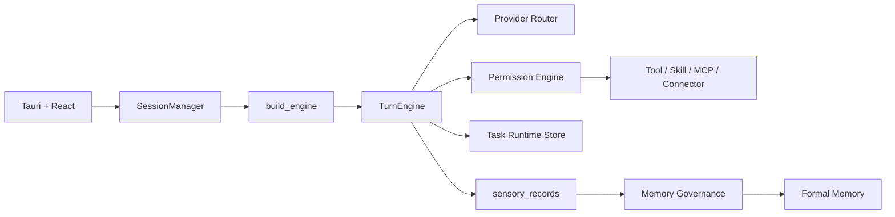
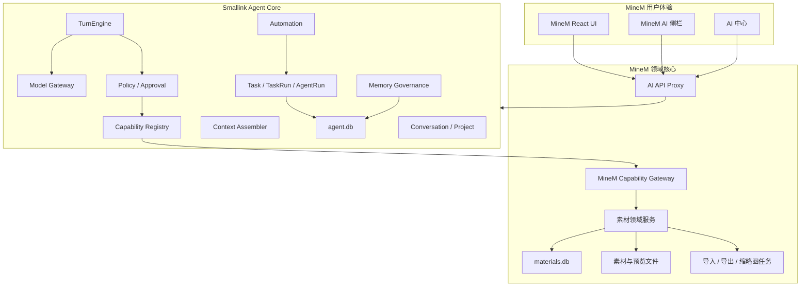
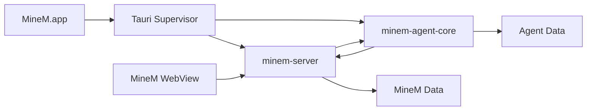

# MineM × Smallink 能力融合全量分析与目标架构

> 文档类型：产品分析 + 融合 PRD + 技术架构蓝图  
> 状态：历史分析，2026-08-09 的“Smallink 应用中心 + MineM 首个应用”决策已取代本文中“用户最终只看到 MineM”的建议  
> 日期：2026-08-09  
> 目标代码主线：`~/Documents/work/pitch_html/minem`  
> 分析来源：Smallink 0.2.0 当前代码与文档、MineM 0.5.0-beta.8 当前代码与文档

> 当前决策事实源：[应用中心与 MineM PRD](./smallink-app-center-minem-prd.md)、[应用中心与 MineM 技术设计](./smallink-app-center-minem-technical-design.md)。本文仍可作为两个代码库的能力分析参考，但不再作为产品合并方向和界面边界的依据。

---

## 0. 结论先行

### 0.1 推荐结论

不要把 Smallink 整个产品、前端、数据库和 Sidecar 直接复制进 MineM。

推荐把 Smallink 定义为 MineM 的 **AI 控制平面与智能体内核**，把 MineM 保持为 **汇报素材领域系统与唯一业务事实源**：

```text
MineM
= 用户界面
+ 汇报 / 页面 / 案例 / 资源 / 故事线领域能力
+ 素材数据库、文件、版本、编排、预览、导出
+ 最终业务校验、幂等、确认和审计

Smallink Agent Core
= 模型接入
+ 对话与流式输出
+ 任务 / 运行 / 智能体运行
+ Tool / Skill / MCP / Connector
+ 权限与人在回路
+ 项目上下文
+ 候选记忆与人工确认
+ 自动化
```

用户最终只看到一个 MineM 产品。Smallink 不作为第二套导航、第二个工作台或第二个数据库管理界面出现。

### 0.2 最适合 MineM 的产品定义

融合后的 MineM 应从：

> 本地优先的汇报素材工作台

升级为：

> 本地优先的 AI 汇报生产与素材操作系统：用户提出目标，MineM 智能体理解上下文、调用真实素材能力、生成或修改页面与汇报，并在用户确认下持续学习创作偏好。

### 0.3 首个可交付闭环

首个版本不要一开始就移植全部记忆、自动化和多智能体。先完成一条可验证纵向闭环：

```text
用户在某份汇报详情中打开 AI 助手
→ 提出“把第 6 页替换成面向管理层的经营摘要”
→ AI 读取当前汇报、页面和可用素材
→ 生成执行计划与影响预览
→ 用户确认
→ MineM 创建新页面版本并替换页槽
→ 真实汇报链接完成校验
→ 返回新页面编号、版本、链接和变更摘要
→ 原页面和旧版本保持不变
```

这条闭环同时验证模型、上下文、Skill、工具、审批、幂等、运行状态、产物回链和 MineM 领域规则，是融合是否成功的最小充分证明。

### 0.4 四条不可破坏的边界

1. **MineM 是素材事实源**：Smallink 不复制 MineM 全库，不直接写 `materials.db`。
2. **MineM 是业务最终裁判**：AI 可以规划，Smallink 可以做权限判断，但素材类型、版本、引用、编排和删除规则必须由 MineM 校验。
3. **一个用户界面**：用户不应在 MineM 与 Smallink 两套产品之间来回切换。
4. **分阶段融合**：先通过稳定协议集成，再决定是否抽取为同进程 Python 包；不直接合并两个现有巨型管理模块。

---

## 1. 本次需求的真实含义

当前已经存在一条反方向链路：

```text
Smallink → MineM
```

Smallink 已把 MineM 作为本机能力型连接器，并通过 MineM CLI 提供六个只读工具：

- 检查 MineM 状态；
- 搜索素材；
- 读取素材；
- 读取汇报页面；
- 读取素材版本；
- 读取来源关系。

这条链路证明了两个产品可以通过稳定协议协作，但它只解决“Smallink 能读取 MineM”。

本次需求是更深的一层：

```text
MineM ← Smallink 的智能能力
```

也就是让 MineM 自身具备：

- 自然语言工作入口；
- 模型与 Provider；
- 流式输出；
- 任务和运行过程；
- Tool / Skill / MCP；
- 高风险操作确认；
- 项目上下文；
- 长期创作偏好；
- 自动化；
- 后续多智能体协作。

因此，这不是“再增加几个 MineM Tool”，而是一次产品层级升级。

---

## 2. Smallink 产品全量分析

## 2.1 产品定位

Smallink 不是单纯聊天客户端。它的完整产品逻辑包含三条闭环：

### 工作闭环

```text
用户目标
→ Task / TaskRun
→ AgentRun
→ 模型判断
→ Tool / Skill / MCP / Connector
→ 审批或用户回答
→ 真实产物
```

### 数据学习闭环

```text
会话、工具、文件、连接器数据
→ sensory_records 原始事实
→ AI 生成候选记忆
→ 用户接受 / 编辑 / 合并 / 忽略
→ 正式记忆
→ 后续任务按相关性使用
```

### 自动化闭环

```text
定时或事件触发
→ 独立运行
→ 与普通会话相同的工具、权限和事件链
→ 等待审批或完成
→ 结果与产物
```

Smallink 最有价值的不是某个具体页面，而是把模型、工具、权限、运行事实和记忆治理放进了同一个控制系统。

## 2.2 当前已经真实落地的能力

| 能力 | 当前成熟度 | 对 MineM 的价值 |
| --- | --- | --- |
| `TurnEngine` 智能体循环 | 已真实运行 | 控制“模型 → 工具 → 模型”的多轮执行 |
| 多 Provider | 已真实运行 | 接入 OpenAI、Anthropic、Gemini、TRAE CLI 等 |
| 流式事件 | 已真实运行 | 让 MineM AI 不出现长时间空白 |
| Tool Registry | 已真实运行 | 把 MineM 能力以受控 Schema 暴露给模型 |
| Permission Engine | 已真实运行 | 在动作前做目录、模式和风险判断 |
| 审批 / Inbox | 已真实运行 | 处理写操作、目录授权和用户问题 |
| Task / TaskRun / AgentRun | 已有第一版 | 统一任务、重试、子智能体和运行详情 |
| Explorer 子智能体 | 已有纵向切片 | 可用于素材研究和证据收集 |
| Project | 已有骨架 | 可组织会话与工作区，但管理体验仍需补齐 |
| Artifact | 已真实运行 | 交付 HTML、图片、PDF、表格等产物 |
| Connector | 已有框架 | 可接本地应用、CLI、外部账户和数据来源 |
| Skill / MCP | 已真实运行 | 可以复用 MineM 现有 Skill，并接标准工具协议 |
| 原始事实池 | 已有第一版 | 保存可追溯的运行和来源记录 |
| 记忆治理 | 已有第一版 | AI 提炼、用户确认后生效 |
| 自动化 | 部分可用 | 支持定时任务、立即运行和历史记录 |
| 系统提示词透明度 | 已真实运行 | 可展示七层 Prompt 组装逻辑 |

## 2.3 Smallink 的七层上下文结构

Smallink 当前运行时会组装七类内容：

1. Agent Persona；
2. Narration 运行说明；
3. Environment Context；
4. 工作区 `AGENTS.md`；
5. Memory Guidance；
6. Skill Catalog；
7. 每轮临时上下文。

这套结构适合迁移成 MineM 专用上下文：

```text
MineM Agent Persona
+ 运行与状态说明
+ MineM 环境和当前页面
+ MineM 领域规则
+ 已确认创作偏好
+ MineM Skill Catalog
+ 当前汇报 / 页面 / 素材引用
```

关键原则是：只注入必要摘要和稳定引用，不把整个素材库、整份 HTML 或所有历史对话塞进模型上下文。

## 2.4 Smallink 当前架构



最值得复用的资产：

- `TurnEngine`；
- Provider 抽象；
- Tool Registry；
- Permission Engine；
- RunEvent；
- Task Runtime Store 的对象模型；
- Skill / MCP / Connector 装配方式；
- 候选记忆到正式记忆的治理边界。

## 2.5 Smallink 当前技术债

不能把 Smallink 当前工程整体复制进 MineM，原因包括：

### 后端聚合过重

- `smallink/server/manager.py` 约 4,600 行；
- `SessionManager` 同时承担会话、引擎缓存、连接器、审批、自动化、运行追踪、记忆和后台任务；
- 直接移植会把当前耦合完整带入 MineM。

### API 入口过重

- `smallink/server/app.py` 约 2,100 行；
- 大量路由直接围绕 `SessionManager` 展开；
- 不适合作为 MineM 新模块的直接模板。

### 前端仍是单体状态导航

- Smallink GUI 使用一个大型 `App.tsx` 管理 Surface；
- 没有真正路由层；
- 直接合并会与 MineM 现有 `App.tsx` 再次叠加。

### 存储仍然分散

当前会话、任务、自动化、记忆、治理和连接器状态由多个 SQLite 表和文件共同维护。目标文档中的 Postgres + pgvector 尚未落地。

### 多智能体仍是早期阶段

目前只有 Explorer 形成真实子运行。通用 Orchestrator、Delegation Contract、预算、依赖图和可靠取消尚未完成。

### 知识库尚未形成正式能力

Smallink 有原始事实与记忆，但完整知识条目、索引、引用和语义检索闭环仍是目标能力。

因此，融合应复用“经过验证的内核合同”，而不是复用所有现有组织代码。

---

## 3. MineM 产品全量分析

## 3.1 产品定位

MineM 是本地优先的汇报素材工作台，核心价值是：

- 把整份汇报拆成可复用的页面资产；
- 保存页面、资源、汇报、案例和故事线关系；
- 保留版本和来源；
- 非破坏性编排；
- 统一预览；
- 导入、导出和数据治理；
- 通过 CLI 让外部 AI 操作真实素材。

MineM 当前的核心对象是：

| 对象 | 稳定编号 | 事实源 |
| --- | --- | --- |
| 汇报 | `RPT-*` | MineM |
| 页面 | `CTRL-*` | MineM |
| 案例 | `CASE-*` | MineM |
| 资源 | `RES-*` | MineM |
| 故事线 | `STL-*` | MineM |
| 导入 / 导出任务 | Task ID | MineM |
| 页槽与编排 | 内部 ID + 汇报引用 | MineM |

## 3.2 MineM 当前已经具备的 AI 接口基础

MineM 已经具备：

- 可安装 CLI；
- `minem.cli/v1` JSON 输出；
- 动态服务发现；
- 本机会话令牌；
- 只读与写入命令；
- `--confirm` 写操作保护；
- 素材搜索、详情、版本、来源关系；
- 页面构建和发布；
- 汇报创建；
- 页面插入、替换、移动、隐藏、恢复和移出；
- 导入、导出与异步任务；
- `agent capabilities` 能力发现；
- 部分能力参数 Schema；
- 页面、汇报和案例 Skill。

这意味着 MineM 不缺“被 AI 调用”的基础，缺的是一个产品内的 AI 控制面。

## 3.3 MineM 当前 AI 模型

MineM 当前产品逻辑是：

```text
外部 AI 负责理解与生成
→ 调用 MineM CLI
→ MineM 做确定性素材操作
```

MineM 的本地 AI 客户端 PRD 也明确把 AI 产品放在外部，首版不内置通用模型或对话界面。

本次融合会改变这一边界：

```text
MineM 自身提供 AI 交互
→ 仍通过受控能力层调用 MineM 领域服务
```

这个变化应以新的 PRD 和 ADR 明确记录，不能只作为前端增加一个聊天框。

## 3.4 MineM 当前的“Agent Runtime”不是 Smallink Agent Runtime

`minem/agent/` 当前是一个面向代码仓库治理的内部模块，能力包括：

- 仓库扫描；
- Repo Map；
- 任务影响文件分析；
- 白名单验证；
- Checkpoint；
- Audit。

它没有：

- 模型循环；
- 对话；
- Provider；
- Tool Calling；
- 用户审批；
- 任务事件流；
- 记忆；
- 自动化。

因此，后续必须避免概念冲突。建议：

- 保留 `minem/agent/` 作为 `developer_governance` 或内部工程工具；
- 新的用户侧智能体能力命名为 `agent_core`、`creative_agent` 或 `ai_runtime`；
- 不把两者混在同一个 API 和文档中。

## 3.5 MineM 当前架构债务

### 后端仍是大型 `http.server`

`server.py` 已超过 7,000 行，包含大量手工路由。继续把会话、模型、WebSocket、审批、自动化和记忆全部放进去，会迅速失控。

### 能力网关仍是目标，不是完整事实

MineM 文档已经设计 `Capability Gateway`，但当前真实实现主要还是 CLI 对现有 HTTP 路由的封装：

- 能力发现已有；
- Schema 只覆盖部分命令；
- 统一预检、确认令牌、幂等和事件流尚未完整成为单一业务网关；
- 不适合让新 Agent Runtime 动态信任全部能力。

### 前端也存在顶层集中问题

MineM `frontend/src/App.tsx` 仍负责较多顶层导航与状态。AI 能力应以独立模块接入，不应继续向主组件堆叠运行逻辑。

### 当前工作树有大量未提交改动

当前 MineM 主线存在大量已修改和新增文件。正式实施融合前，需要先：

1. 固化当前 beta.8 行为基线；
2. 保存路由、CLI 和数据库契约快照；
3. 将融合工作拆到独立分支或明确变更批次；
4. 避免在未归档现有改动时进行大范围目录迁移。

---

## 4. 两个产品的能力互补关系

| 领域 | Smallink 强项 | MineM 强项 | 融合后的责任 |
| --- | --- | --- | --- |
| 用户目标理解 | 模型、对话、流式输出 | 领域词汇与对象 | Smallink Core |
| 执行循环 | TurnEngine | 确定性业务 API | Smallink Core |
| 素材事实 | 不拥有 | 完整资产、版本和引用 | MineM |
| 工具目录 | Tool / Skill / MCP / Connector | CLI 与业务动作 | 共同 Capability Contract |
| 权限 | 通用目录与风险判断 | 素材影响和最终确认 | 双层判断，MineM 最终裁决 |
| 项目 | 会话与工作区组织 | 汇报不是项目 | 新增“创作项目”，只保存引用 |
| 记忆 | 候选、确认、版本、作用域 | 素材来源和历史 | Smallink Core 保存创作偏好 |
| 知识 | 目标能力，尚不完整 | 素材库本身可检索 | MineM 素材按需联邦检索 |
| 自动化 | 定时运行框架 | 导入、治理、导出任务 | Smallink 触发，MineM 执行 |
| 产物 | 通用文件产物 | 页面、汇报和导出包 | MineM ID 是一等产物引用 |
| 客户端 | 通用 AI 工作台 | 成熟 MineM 产品界面 | 只保留 MineM 外壳 |

最核心的设计不是“谁调用谁”，而是：

> Smallink 负责控制过程，MineM 负责业务结果。

---

## 5. 可选融合路线比较

## 5.1 路线 A：直接合并两个完整应用

做法：

- 把 Smallink 后端复制到 MineM；
- 把 Smallink React 页面合并到 MineM；
- 合并两个 Tauri 壳和 Sidecar；
- 合并数据库。

优点：

- 看起来最像“一体化”；
- 短期能快速看到大量功能入口。

缺点：

- 两个 `App.tsx`、两个 Sidecar、两套 Token、两套数据目录直接冲突；
- 把 Smallink 的 `SessionManager` 和 MineM 的 `server.py` 两个巨型模块叠在一起；
- 数据迁移和错误边界不可控；
- Smallink 为 BSL 1.1，MineM 为 Apache-2.0，直接复制会改变 MineM 的发行边界；
- 很难保持 MineM 当前稳定性。

结论：**不推荐**。

## 5.2 路线 B：MineM 连接外部 Smallink 应用

做法：

- Smallink 继续单独安装和运行；
- MineM 通过本机协议调用 Smallink；
- Smallink 再通过现有 MineM Connector 调用 MineM。

优点：

- 代码改动小；
- 可以快速做概念验证；
- 许可证和进程边界清晰。

缺点：

- 用户需要安装两个产品；
- 启动、登录、模型、设置和诊断分散；
- MineM 体验仍依赖外部产品；
- 不符合最终“一体化”目标。

结论：适合原型，不适合作为最终产品形态。

## 5.3 路线 C：MineM 内置独立 Smallink Agent Core Sidecar

做法：

- MineM.app 仍是唯一应用；
- 打包一个无独立前端的 `minem-agent-core` Sidecar；
- MineM Server 代理 AI API；
- Agent Core 使用 MineM Capability Gateway；
- 两个运行数据域分开。

优点：

- 用户只安装一个应用；
- Agent 依赖与 MineM 领域依赖隔离；
- 可以先复用 Smallink 已验证的运行内核；
- 故障可以隔离和降级；
- 后续可以再抽取为同进程包。

缺点：

- MineM.app 需要监督两个服务；
- 打包体积与诊断复杂度上升；
- 必须设计清楚 Token、健康检查和事件桥接；
- 许可证仍需明确处理。

结论：**推荐作为第一阶段产品化架构**。

## 5.4 路线 D：抽取可复用 `smallink-agent-core` Python 包并由 MineM 直接托管

做法：

- 从 Smallink 抽取 Engine、Provider、Capability、Policy、Task Runtime、Memory；
- 移除 Smallink GUI 和连接器市场耦合；
- MineM Server 直接创建和管理 Agent Core。

优点：

- 长期架构最简洁；
- 只有一个 Python 服务和一个事件系统；
- 性能和部署更好；
- 更容易形成统一 Capability Registry。

缺点：

- 需要先拆解 Smallink 当前管理层；
- MineM 当前 `http.server` 与 Smallink FastAPI/async 运行模型不同；
- 初期改造风险最大；
- 需要先解决许可证和模块边界。

结论：**推荐作为目标架构，不推荐直接作为第一步**。

## 5.5 推荐组合

```text
近期：路线 C
→ 通过进程和协议边界完成真实闭环

中期：路线 C + 抽取共享合同
→ 稳定 Agent Core、Capability Contract、Event Contract

长期：路线 D
→ 在不改变产品行为的前提下合并运行时
```

---

## 6. 融合后的产品设计

## 6.1 产品命名

用户侧不建议出现“Smallink”第二品牌。建议使用：

- `MineM AI`
- `MineM Copilot`
- `MineM 创作助手`
- `MineM 智能工作台`

Smallink 只作为内部技术来源或 Agent Core 名称。

## 6.2 信息架构

保持 MineM 当前高频导航：

```text
工作 / 汇报 / 页面 / 案例 / 资源 / 故事
```

新增两类 AI 入口：

### 全局入口

右上角或右侧固定入口：

```text
MineM AI
```

打开后是可展开侧栏，不遮断当前素材上下文。

### 情境入口

在业务对象中提供：

- 在当前汇报中询问；
- 用 AI 修改此页；
- 从这些页面生成汇报；
- 从此文档提炼案例；
- 检查当前汇报；
- 为当前汇报生成讲稿；
- 解释来源和版本；
- 查找可替换素材。

情境入口自动注入对象引用，用户不需要复制 `RPT-*` 或 `CTRL-*`。

## 6.3 AI 侧栏

AI 侧栏包含：

1. 当前上下文；
2. 对话和运行时间线；
3. Tool / Skill 调用；
4. 影响预览；
5. 审批卡片；
6. 生成结果；
7. 新素材编号和链接；
8. 停止、重试和继续；
9. 运行详情。

空状态应根据当前页面给出真实快捷任务。例如汇报详情：

- 优化故事线；
- 替换一页；
- 查找相关案例；
- 生成管理层摘要；
- 检查品牌一致性；
- 生成演讲稿。

## 6.4 AI 中心

P1 再增加独立 AI 中心，用于低频管理：

- 会话；
- 创作项目；
- Runs；
- 自动化；
- 待确认；
- 创作偏好；
- 模型与能力设置。

不要在 P0 把 Smallink 全部一级导航搬进 MineM。

## 6.5 创作项目

MineM 的“汇报”不能直接等于 Smallink Project。

推荐新增 `CreativeProject`：

```text
创作项目
├── 会话
├── 关联汇报
├── 关联页面 / 案例 / 资源
├── 来源文档
├── 自动化
├── 项目创作偏好
└── 运行与产物
```

项目只保存关系，不复制 MineM 素材。

适合的项目示例：

- 2026 年年度战略会；
- 广州客户提案；
- CEO AI 分享；
- 制造业解决方案模板；
- 每周经营汇报。

---

## 7. 目标技术架构

## 7.1 逻辑架构



## 7.2 首阶段部署架构



约束：

- WebView 只访问 `minem-server`；
- 浏览器不直接持有 Agent Core Token；
- `minem-server` 代理 `/api/ai/*`；
- Agent Core 通过独立本机令牌调用 MineM 能力；
- 两个进程都只监听 loopback；
- Tauri 统一监督、健康检查、日志轮转和退出回收。

## 7.3 目标部署架构

等 Agent Core 合同稳定后，可逐步变成：

```text
一个 MineM Python 服务
├── MineM Domain
├── Capability Gateway
└── Agent Core
```

但这个合并不应早于：

- Capability Contract 稳定；
- Run Event Contract 稳定；
- 数据所有权稳定；
- Agent Core 从 `SessionManager` 解耦；
- MineM Server 完成薄路由改造。

---

## 8. 数据所有权与存储

## 8.1 唯一事实源

| 数据 | 唯一事实源 |
| --- | --- |
| 汇报、页面、案例、资源、故事线 | MineM |
| 素材版本与来源关系 | MineM |
| 页槽、编排、隐藏状态 | MineM |
| 导入、导出、缩略图任务 | MineM |
| 对话、项目、Task、TaskRun、AgentRun | Agent Core |
| 模型配置与密钥引用 | Agent Core / Keychain |
| 通用审批与用户问题 | Agent Core |
| MineM 操作确认与影响结果 | MineM |
| 候选记忆、正式创作偏好 | Agent Core |
| Skill 启用状态 | Agent Core |
| MineM 能力定义与风险等级 | MineM Gateway |

## 8.2 数据目录建议

```text
~/Library/Application Support/MineM/
├── data/
│   └── materials.db
├── uploads/
├── extracted/
├── thumbnails/
├── report-exports/
├── artifacts/
├── agent/
│   ├── agent.db
│   ├── sessions/
│   ├── artifacts/
│   └── runtime/
├── runtime/
│   ├── service.json
│   ├── session-token
│   └── agent-service.json
└── logs/
    ├── minem-server.log
    └── agent-core.log
```

不要继续把融合后的数据写到 `~/.config/link/`。如果未来需要迁移 Smallink 用户数据，应做显式导入，而不是运行时同时读取两套目录。

## 8.3 跨库引用

Agent Core 只保存稳定引用：

```json
{
  "kind": "minem.report",
  "id": "internal-id-if-needed",
  "code": "RPT-20260809-001",
  "version": 3
}
```

禁止：

- 在 `agent.db` 复制完整资产行；
- 建跨 SQLite 外键；
- 保存永久预览 URL 作为唯一引用；
- 让记忆直接持有素材文件绝对路径。

每次使用时通过 MineM Gateway 重新解析当前对象。

---

## 9. Capability Gateway 设计

## 9.1 为什么必须先补 Gateway

现有 CLI 很适合外部 Agent，但内置 Agent 需要更稳定的机器合同：

- 完整输入 Schema；
- 输出 Schema；
- 风险等级；
- 是否异步；
- 是否幂等；
- 是否需要预检；
- 是否需要确认；
- 结果引用；
- 任务事件；
- 版本兼容信息。

不能让模型：

- 拼接任意 CLI 字符串；
- 直接请求任意 HTTP 路由；
- 直接读写数据库；
- 根据前端文案猜测业务状态。

## 9.2 Capability 定义

```text
CapabilityDefinition
├── id
├── version
├── title
├── description
├── input_schema
├── output_schema
├── risk_level
├── side_effects
├── async
├── idempotent
├── confirmation_policy
├── availability
└── required_scopes
```

## 9.3 P0 只读能力

- `system.health`
- `system.capabilities`
- `asset.search`
- `asset.get`
- `asset.versions`
- `asset.lineage`
- `report.get`
- `report.pages`
- `task.get`

## 9.4 P0 写入能力

- `page.build`
- `page.import`
- `report.create`
- `report.page.add`
- `report.page.replace`
- `report.page.move`
- `report.page.hide`
- `report.page.show`
- `report.export`
- `case.brief`
- `case.import`

## 9.5 P1 能力

- `report.arrangement.preview`
- `report.arrangement.apply`
- `report.presenter_script.generate`
- `report.presenter_script.update`
- `asset.rename`
- `asset.merge.preview`
- `asset.merge.apply`
- `asset.delete.preview`
- `asset.delete.apply`
- `tag.analyze`
- `tag.taxonomy.update`

删除、合并和批量治理必须晚于普通创建与版本化操作。

## 9.6 标准操作协议

请求：

```json
{
  "schema": "minem.operation.v1",
  "requestId": "req_...",
  "idempotencyKey": "idem_...",
  "actor": {
    "type": "agent",
    "agentRunId": "agent_run_..."
  },
  "context": {
    "sessionId": "session_...",
    "taskRunId": "task_run_...",
    "projectId": "project_..."
  },
  "capability": "report.page.replace",
  "input": {
    "reportRef": "RPT-20260809-001",
    "targetPageRef": "CTRL-PAGE-006",
    "replacementPageRef": "CTRL-PAGE-103"
  },
  "dryRun": true
}
```

响应：

```json
{
  "ok": true,
  "status": "awaiting_confirmation",
  "requestId": "req_...",
  "operationId": "op_...",
  "impact": {
    "reports": 1,
    "pageSlotsChanged": 1,
    "oldVersionsPreserved": true
  },
  "confirmation": {
    "required": true,
    "confirmationId": "confirm_...",
    "expiresAt": "..."
  },
  "resultRefs": [],
  "links": {
    "confirm": "minem://confirm/op_..."
  }
}
```

## 9.7 单一确认原则

融合后最容易出现“双重审批”：

```text
Smallink 先弹一次
→ MineM CLI 再要求 --confirm
→ MineM 客户端再弹一次
```

必须统一成：

1. Smallink Policy 判断当前动作是否允许进入预检；
2. MineM Gateway 计算真实影响；
3. 只展示一张 MineM 影响确认卡；
4. 用户确认后由 MineM 发放一次性确认令牌；
5. Agent Core 使用该令牌执行；
6. MineM 再次校验对象版本和影响是否变化。

MineM 是最终确认权威，Smallink 不伪造 `--confirm`。

## 9.8 事件桥接

MineM 异步任务事件映射为 Agent Run Event：

| MineM 状态 | Agent Event |
| --- | --- |
| `queued` | `tool.queued` |
| `validating` | `tool.progress` |
| `awaiting_confirmation` | `approval.requested` |
| `running` | `tool.started` / `tool.progress` |
| `succeeded` | `tool.completed` |
| `failed` | `tool.failed` |
| `cancelled` | `tool.cancelled` |

P0 可先用 `task.get` 受控轮询；P1 应增加 SSE 或 WebSocket 事件流，避免长期递归轮询。

---

## 10. Agent、Skill 与上下文设计

## 10.1 首版 Agent

P0 只需要一个用户可见根 Agent：

> MineM AI：理解汇报目标，检索素材，调用 MineM Skill，生成或修改页面与汇报，并解释实际结果。

不要一开始暴露多个 Agent 让用户选择。

## 10.2 第一批内部角色

P1 再增加内部协作：

| 角色 | 职责 | 默认权限 |
| --- | --- | --- |
| Material Researcher | 搜索页面、案例、资源和来源 | 只读 |
| Story Planner | 设计汇报结构和页面任务 | 只读 |
| Page Builder | 生成页面 Spec 与 HTML | 项目范围写入 |
| Reviewer | 检查内容、尺寸、品牌和引用 | 只读 |
| Governance Agent | 生成标签或偏好候选 | 写候选区，不写正式事实 |

子 Agent 权限不得高于根 Agent。

## 10.3 Skill 体系

直接复用 MineM 已有 Skill 作为领域工作手册：

- `minem-html-page`
- `minem-report-workflow`
- `minem-case-material`

后续增加：

- `minem-report-review`
- `minem-story-planning`
- `minem-presenter-script`
- `minem-material-governance`

Skill 只提供流程与约束，不能绕过 Capability 和 Policy。

## 10.4 ContextBundle

每次 AgentRun 冻结：

```text
ContextBundle
├── 用户目标
├── 当前 MineM 页面
├── 当前汇报 / 页面 / 案例引用
├── 必要素材摘要
├── 项目说明
├── 已确认创作偏好
├── 启用 Skill
├── 可用 Capability 版本
├── 权限与预算
└── 来源与裁剪记录
```

运行详情必须能够回答：

- 模型看到了哪些素材；
- 为什么选中这些素材；
- 使用了哪些偏好；
- 哪个 Skill 提供了规则；
- 哪个 Capability 修改了真实数据。

---

## 11. 记忆如何融入 MineM

## 11.1 记忆的产品名

不建议直接在 MineM 中使用“个人记忆数据库”作为主入口。建议用户侧叫：

- 创作偏好；
- 我的表达方式；
- MineM 对我的理解；
- 项目约定。

## 11.2 可形成的记忆

### 全局创作偏好

- 喜欢结论先行；
- 页面文字密度；
- 常用色彩和视觉风格；
- 数据表达习惯；
- 默认语言；
- 是否保留英文术语；
- 常用汇报对象。

### 项目偏好

- 目标受众；
- 品牌规范；
- 禁用表达；
- 项目术语；
- 常用案例；
- 当前项目长期目标。

### 会话偏好

- 本次任务的临时约束；
- 尚未确认的风格选择；
- 仅当前会话使用的素材边界。

## 11.3 不应成为记忆的内容

- MineM 素材本体；
- 页面完整 HTML；
- 可以通过素材 ID 实时查询的事实；
- 临时预览 URL；
- 模型密钥和令牌；
- 未经用户确认的客户敏感结论；
- 来源文档中的指令性文本；
- AI 自己推断但没有来源的业务事实。

## 11.4 记忆治理

```text
会话或运行完成
→ 生成创作偏好候选
→ 显示来源与作用域
→ 用户接受 / 编辑 / 合并 / 忽略
→ 正式生效
```

只有 `active` 的正式偏好进入上下文。Pending、ignored、archived 和失败记录不得进入模型。

## 11.5 新作用域

Smallink 当前主要是：

- global；
- workspace；
- session。

MineM 需要扩展为：

- global；
- project；
- report；
- session。

其中 `report` 作用域适合保存某份汇报特有的受众、结构和表达要求，但不能保存可直接从 MineM 查询的页面事实。

---

## 12. 自动化如何融入 MineM

## 12.1 高价值自动化

- 每周从指定来源更新经营汇报；
- 每日检查新导入素材的标签和重复项；
- 定期生成汇报质量检查；
- 新案例导入后生成候选页面；
- 汇报交付前自动执行引用、尺寸和离线依赖检查；
- 定期生成演讲稿更新候选；
- 指定时间导出 HTML / PDF。

## 12.2 自动化安全规则

- 只读检查可自动完成；
- 创建新候选页面可以完成，但默认不自动替换正式汇报；
- 修改正式页槽、删除、合并和发布编排必须等待确认；
- 自动化使用与普通会话相同的 TaskRun、AgentRun 和 Capability；
- 重启后不能永久停在 `running`；
- 同一时间计划使用幂等键避免重复执行；
- 自动化产生的页面和报告必须带来源与运行 ID。

---

## 13. Connector 如何融入 MineM

不要把 Smallink 的整个连接器目录原样展示给 MineM 用户。

MineM 应只开放与汇报生产直接相关且真实验证的来源：

### P0

- 本地文件和文件夹；
- 网页；
- 飞书文档；
- 飞书妙记；
- 飞书幻灯片；
- MineM 自身素材库。

### P1

- 云盘；
- 邮件附件；
- 日历与会议；
- GitHub 项目资料；
- RSS / 定期网页来源。

### 后续

- Slack；
- CRM；
- 销售与数据平台；
- 其他通用连接器。

原则：

- Connector 负责授权与取数；
- 原始内容保留来源；
- 不等于已经形成记忆；
- 不等于已经成为 MineM 素材；
- 是否入库由明确工作流决定。

---

## 14. 安全、隐私与可信设计

## 14.1 本地边界

- 所有服务只监听 loopback；
- WebView 只访问 MineM Server；
- Agent Core Token 不暴露给页面；
- CLI、Agent Core、浏览器会话使用不同权限；
- Token 文件权限限制为当前用户；
- 动态端口不长期缓存。

## 14.2 文件权限

- Agent 只能访问 MineM 数据目录、当前项目工作区和用户明确授权目录；
- 不允许模型传入任意可执行文件路径；
- 不允许任意 Shell 字符串；
- 页面构建输出先写 Agent Artifact 区，再通过 MineM Capability 发布；
- 外部目录必须走原生目录授权。

## 14.3 Prompt Injection

汇报、网页、飞书文档和 HTML 都是不可信内容。

必须：

- 把来源内容标记为 Data，而不是 Instruction；
- 忽略素材中要求修改系统提示词、调用工具或泄露数据的文本；
- 不把网页或页面内脚本作为 Agent 指令；
- Tool Result 保留来源和截断信息；
- 高风险动作只依据系统 Policy 和 MineM 影响计算；
- 外部内容不能改变 Capability 白名单。

## 14.4 云模型数据提示

每个模型配置应显示：

- 哪些内容会发送给模型；
- Provider；
- 是否包含页面正文、图片或附件；
- 是否使用本地模型；
- 是否允许记忆提炼；
- 是否保留模型日志。

对敏感素材支持：

- 本地模型优先；
- 不发送完整文件；
- 只发送摘要；
- 关闭记忆候选；
- 任务级隐私模式。

## 14.5 审计

每次真实业务动作记录：

- 用户、Session、TaskRun、AgentRun；
- Capability 和版本；
- 输入对象引用；
- 幂等键；
- 影响预览；
- 确认记录；
- MineM Operation ID；
- 结果对象引用；
- 错误与重试；
- 模型和 Skill 版本。

日志不记录模型密钥、会话令牌和完整客户正文。

---

## 15. 许可证与发行策略

这是融合前必须解决的阻断项。

当前：

- Smallink 第一方代码：Business Source License 1.1；
- MineM：Apache License 2.0。

如果直接把 Smallink 源码复制进 MineM 并继续宣称整个 MineM 都是 Apache-2.0，会形成不一致的发行声明。

可选方案：

### 方案 1：为抽取出的 Agent Core 单独重新授权为 Apache-2.0

前提是版权持有人有权这样做，并保留 OpenWorker 等第三方 MIT 归属。

优点：

- MineM 继续保持 Apache-2.0；
- 最适合开源主线；
- 后续可以同进程集成。

推荐度：最高。

### 方案 2：Agent Core 保持独立 BSL 组件

MineM Apache Core 与 BSL Agent Core 分开分发和声明。

优点：

- 不需要立即重授权；
- 进程边界清楚。

缺点：

- MineM 安装包不再是纯 Apache 组件集合；
- 必须更新 README、安装包许可证和第三方声明；
- 对外产品定位需要明确 OSS Core 与 AI Edition 的边界。

### 方案 3：首阶段只连接用户已安装的 Smallink

优点：

- MineM 仓库不引入 BSL 代码；
- 适合快速验证。

缺点：

- 用户体验不是最终形态。

在许可证决定前，建议用协议和 Sidecar 边界做验证，不在 MineM 主仓直接复制 Smallink 源码。

> 本节是工程发行风险说明，不替代正式法律意见。

---

## 16. 分阶段实施路线

## Phase 0：冻结产品与合同

目标：先把“如何融合”变成稳定合同，不写大规模功能代码。

交付：

- 融合 PRD；
- 许可证 ADR；
- 数据所有权 ADR；
- Agent Core 进程 ADR；
- Capability Definition；
- Operation Protocol；
- Run Event Contract；
- 统一确认规则；
- P0 用户旅程；
- MineM 当前路由、CLI 和数据库契约快照。

退出标准：

- 能明确回答谁拥有数据；
- 能明确回答一次写操作在哪里确认；
- 能明确回答崩溃后如何判断成功；
- 能明确回答安装包包含哪些许可证。

## Phase 1：只读情境助手

目标：在不修改素材的前提下，让 MineM 内出现真实 AI 体验。

范围：

- MineM AI 侧栏；
- 模型配置；
- 流式输出；
- 当前汇报 / 页面上下文；
- 素材搜索、详情、页面、版本和来源关系；
- Session、TaskRun、AgentRun；
- 停止和重试；
- 运行详情；
- Agent Core Sidecar 监督；
- 只读审计。

首版可复用 Smallink 当前 MineM Connector 作为协议适配层。

退出标准：

- 用户可在汇报详情询问并获得真实素材引用；
- 不复制 MineM 全库；
- MineM 未运行、Agent 未运行和模型未配置都有明确状态；
- 关闭 AI 功能不影响现有 MineM。

## Phase 2：最小安全写入

目标：完成第一个真实创作闭环。

范围：

- `page.build`；
- `report.create`；
- `report.page.add`；
- `report.page.replace`；
- `report.export`；
- 预检；
- 单一确认；
- 幂等；
- MineM 任务状态；
- 真实结果校验；
- 深度链接；
- Artifact 与 MineM ID 统一展示。

退出标准：

- 重复提交不产生重复素材；
- 未确认不能修改正式汇报；
- 旧页面和版本保留；
- 返回真实预览链接；
- 任务失败不误报成功；
- 重启后运行状态可解释。

## Phase 3：创作项目与偏好记忆

目标：让 MineM 从一次性 AI 工具变成持续理解用户的工作系统。

范围：

- CreativeProject；
- 项目关联会话和 MineM 对象；
- 项目默认模型与 Agent；
- global / project / report / session 偏好；
- 自动生成候选；
- 接受、编辑、合并和忽略；
- Prompt 透明度；
- ContextBundle 记录。

退出标准：

- 用户确认前候选不生效；
- 偏好不跨项目泄漏；
- 运行详情能展示实际使用的偏好；
- 素材事实不被复制为记忆。

## Phase 4：领域 Connector 与自动化

目标：让外部资料持续进入 MineM 工作流。

范围：

- 飞书文档、妙记、幻灯片；
- 本地目录与网页来源；
- 定时任务；
- 自动质量检查；
- 自动生成候选页面；
- 自动化 Inbox；
- 失败重试与幂等。

退出标准：

- 已连接、已同步、已生成候选、已确认和已入库状态明确区分；
- 自动化不能静默修改正式汇报；
- 每个结果可追溯到来源与运行。

## Phase 5：多智能体与运行时收敛

目标：提升复杂任务质量并减少双进程债务。

范围：

- AgentDefinition；
- ContextAssembler；
- Delegation Contract；
- Researcher / Planner / Builder / Reviewer；
- 预算、取消传播和输出合同；
- Checkpoint / Outbox / Replay Cursor；
- Capability Registry 统一；
- 评估 Agent Core 是否并入 MineM Server；
- 继续推进 MineM 后端薄路由或 FastAPI 现代化。

退出标准：

- 父子运行可追踪；
- 子 Agent 权限不高于父 Agent；
- 取消能传到正在执行的 MineM 任务；
- 重启不重复执行外部副作用；
- 历史运行能解释模型、上下文、能力和版本。

---

## 17. 验收场景

## 17.1 P0 产品验收

1. 用户从汇报详情打开 AI，当前汇报自动进入上下文。
2. 发送后立即显示运行状态，不回到空白欢迎页。
3. AI 可以搜索并引用真实 `RPT-*`、`CTRL-*`、`CASE-*` 和 `RES-*`。
4. 只读任务不弹无意义确认。
5. MineM 或 Agent Core 离线时显示可恢复状态。
6. 用户可以停止长任务。
7. 运行详情显示模型、Skill、Tool 和 MineM 引用。

## 17.2 写入验收

1. AI 先返回影响预览，再请求一次确认。
2. 用户拒绝后不产生任何正式修改。
3. 用户确认后产生真实页面或汇报编号。
4. 替换页面保留旧页面和历史版本。
5. 相同幂等键重复执行不重复创建。
6. 数据库成功但预览失败时，任务不能误报完整成功。
7. 操作过程中对象版本变化时要求重新预检。
8. 失败可重试且审计链完整。

## 17.3 记忆验收

1. AI 自动提出“你偏好结论先行”的候选。
2. 用户未确认前，下一次任务不使用该偏好。
3. 用户编辑并接受后，后续相关任务自然应用。
4. 用户可查看来源、版本和使用记录。
5. 项目偏好不进入无关项目。
6. 用户归档后不再注入。

## 17.4 稳定性验收

1. Agent Core 崩溃不影响 MineM 素材浏览。
2. MineM Server 崩溃时 Agent 不继续猜测写入成功。
3. 应用重启后遗留运行被恢复或明确收口。
4. 关闭 AI 功能后 MineM 原功能完整可用。
5. 更新 MineM.app 不删除 Agent 数据与素材数据。
6. 动态端口变化后连接能够恢复。

---

## 18. 成功指标

### 激活

- 模型连接成功率；
- 首次 AI 对话成功率；
- 首次真实 MineM Capability 完成率；
- 从安装到首次产物的时间。

### 工作闭环

- 用户目标到真实素材结果的完成率；
- 任务失败和卡死率；
- 需要人工确认的平均次数；
- 重试后成功率；
- 运行中断恢复率。

### 素材价值

- AI 创建页面进入正式汇报的比例；
- 历史页面复用率；
- 新汇报使用既有素材的比例；
- AI 推荐素材被采用的比例；
- AI 变更后的回滚或人工修正率。

### 记忆

- 候选接受率；
- 编辑后接受率；
- 忽略率；
- 已确认偏好在后续任务中的使用率；
- 用户纠正记忆的频率。

### 信任

- 未确认写入次数必须为 0；
- 重复副作用次数必须为 0；
- 跨项目记忆泄漏次数必须为 0；
- 无来源业务结论进入正式记忆次数必须为 0。

---

## 19. 主要风险与控制

| 风险 | 后果 | 控制 |
| --- | --- | --- |
| 把 Smallink 全量 UI 搬入 MineM | 产品复杂、导航失控 | P0 只做情境侧栏 |
| 复制 Smallink `SessionManager` | 新巨型模块 | 抽取 Agent Core 接口 |
| 继续向 MineM `server.py` 堆逻辑 | 路由和状态耦合 | AI Proxy + 独立服务层 |
| 两套数据库互相复制 | 状态漂移 | 明确唯一事实源和稳定引用 |
| 双重审批 | 用户疲劳、状态错乱 | MineM 单一影响确认 |
| CLI Schema 不完整 | Agent 参数不稳定 | 先冻结 Capability Schema |
| 异步任务只靠轮询 | 卡死和状态滞后 | P1 增加事件流 |
| 素材内 Prompt Injection | 越权调用工具 | Data / Instruction 隔离 |
| 云模型泄露敏感素材 | 隐私风险 | 任务级数据提示与本地模型 |
| Smallink BSL 与 MineM Apache 冲突 | 发行声明不一致 | 许可证 ADR / 重授权 / 分离分发 |
| 两个 Sidecar 打包复杂 | 启动和升级失败 | Tauri 统一 Supervisor 与降级 |
| 直接上多智能体 | 调试困难、成本高 | 先单 Agent 纵向闭环 |
| 记忆未经确认生效 | 用户失去控制 | 候选与正式记忆严格分层 |
| 把素材事实当记忆 | 陈旧和重复 | MineM 实时查询，记忆只存偏好 |

---

## 20. 代码落点建议

## 20.1 MineM 主线

只在：

```text
~/Documents/work/pitch_html/minem
```

实施。不要同时修改 `minem-open-source/` 快照。

建议新增：

```text
minem/
  capabilities/
    definitions.py
    gateway.py
    operations.py
    risk.py
    events.py
  ai_proxy/
    client.py
    auth.py
    schemas.py

frontend/src/
  ai/
    AIDrawer.tsx
    AITranscript.tsx
    ApprovalCard.tsx
    RunStatus.tsx
    ContextChip.tsx
    api.ts
    types.ts

desktop/src-tauri/src/
  agent_runtime.rs
```

不建议把新逻辑继续集中放入：

- `server.py`；
- `frontend/src/App.tsx`；
- `desktop/src-tauri/src/main.rs`。

## 20.2 Agent Core

先从 Smallink 抽取：

```text
agent_core/
  engine/
  providers/
  capabilities/
  policy/
  runtime/
  context/
  memory/
  automation/
  api/
```

首阶段不要迁入：

- Smallink GUI；
- 通用连接器市场全部内容；
- Smallink 品牌和导航；
- 现有巨型 `SessionManager`；
- 与 MineM 无关的 Slack / CRM 业务逻辑；
- `~/.config/link/` 数据目录约定。

## 20.3 可直接复用的验证资产

- Smallink 的 MineM CLI Adapter；
- Smallink 的 MineM Connector 测试；
- Smallink TurnEngine 事件和中断测试；
- Permission Engine 测试；
- Task Runtime Store 测试；
- Memory Governance 测试；
- MineM CLI 工作流测试；
- MineM 导入、编排、版本和预览测试；
- MineM 安装包与 Sidecar 测试。

---

## 21. 实施前必须确认的决策

### 决策 1：许可证路线

推荐：

> 将抽取出的 Agent Core 在权利允许的前提下单独授权为 Apache-2.0；在完成前保持协议边界。

### 决策 2：首个场景

推荐：

> “在当前汇报中，通过 AI 生成或替换一页，并返回真实版本与链接。”

这个场景价值高、边界清楚，也最能验证 MineM 的非破坏性规则。

### 决策 3：首版模型

推荐同时支持：

- 用户配置的 OpenAI / Anthropic / Gemini；
- TRAE CLI Provider 作为可选本地已授权入口。

不要把产品绑定到单一 Provider。

### 决策 4：首版部署

推荐：

> MineM.app + `minem-server` + `minem-agent-core`，UI 只连接 MineM Server。

### 决策 5：记忆上线阶段

推荐：

> P0 不上线正式记忆；P1 写入闭环稳定后，再上线“创作偏好候选 → 用户确认 → 后续生效”。

### 决策 6：是否保留 Smallink 独立产品

推荐：

- Smallink 继续作为通用个人 AI 工作系统；
- MineM 复用其 Agent Core；
- 两者共享内核，不共享用户界面和业务数据库。

---

## 22. 最终判断

Smallink 最值得融入 MineM 的不是“聊天页面”，而是以下六个底层能力：

1. 可控的 Agent Loop；
2. Provider 与流式输出；
3. Tool / Skill / MCP / Connector 能力装配；
4. 权限、审批与运行事件；
5. Task / TaskRun / AgentRun；
6. 候选记忆与用户确认。

MineM 最不能让出的，是：

1. 素材对象定义；
2. 版本与来源；
3. 页面和汇报引用；
4. 编排与预览；
5. 业务幂等与最终校验；
6. 用户数据的唯一事实源。

因此最合理的产品形态是：

> MineM 继续拥有“做什么算正确”，Smallink Agent Core 负责“如何理解目标并完成过程”。

先用独立 Agent Core Sidecar 建立真实、稳定、可回滚的纵向闭环；等能力、事件、数据和许可证合同稳定后，再逐步收敛为同一运行时。这条路线比直接合并两个应用更慢一点看到“功能数量”，但会显著降低数据损坏、产品失焦、发行冲突和长期技术债风险。
