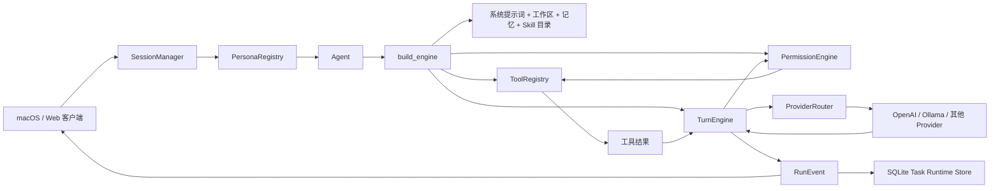
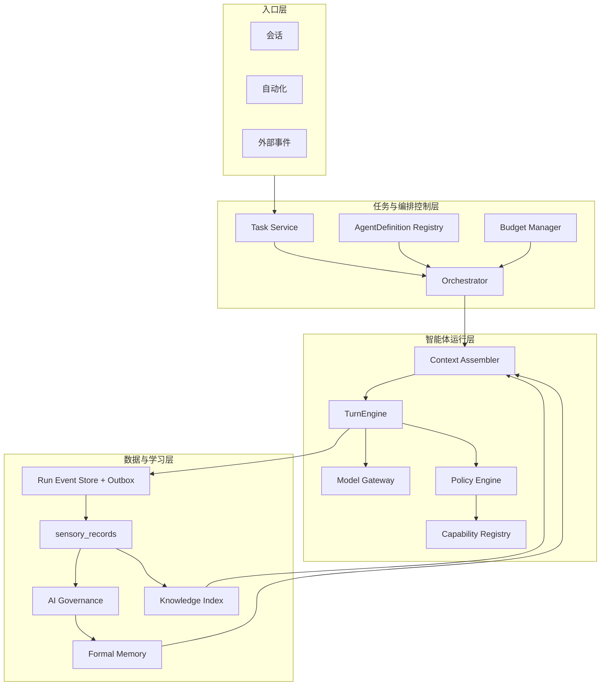
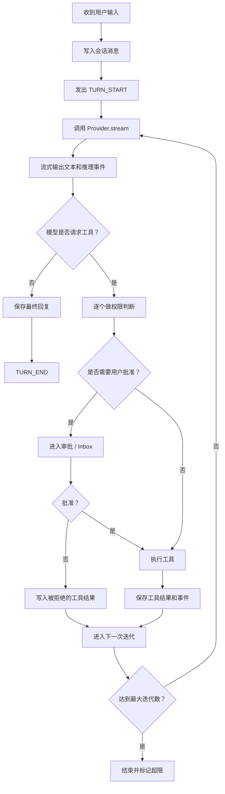
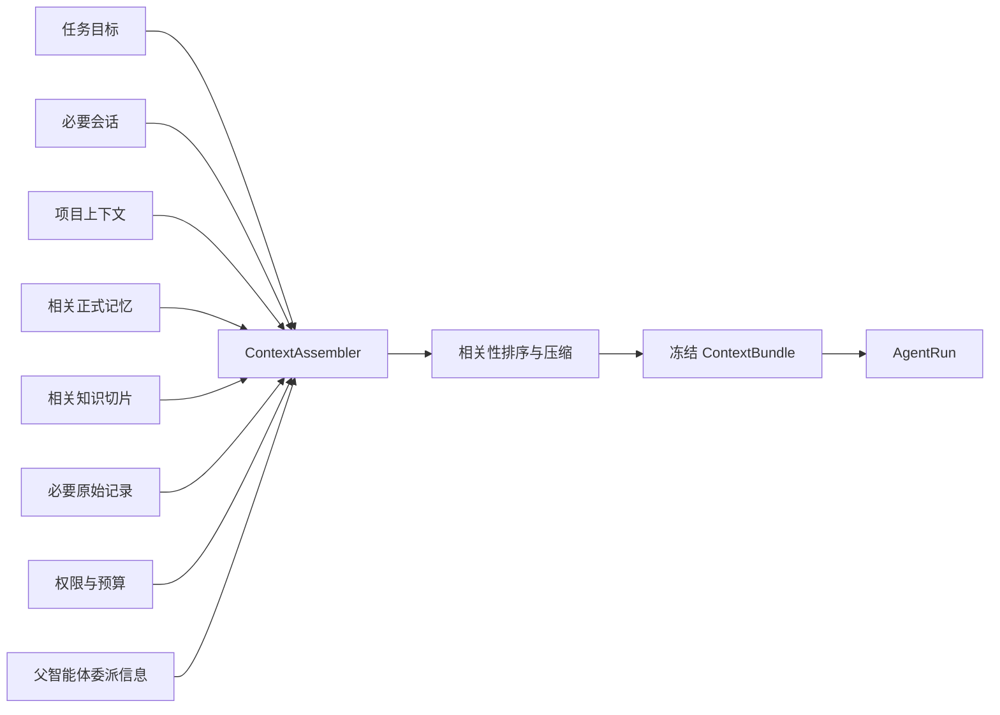
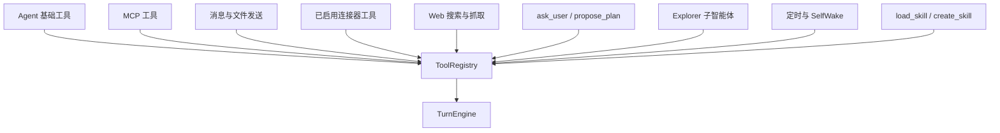
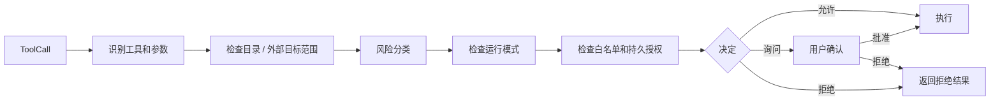
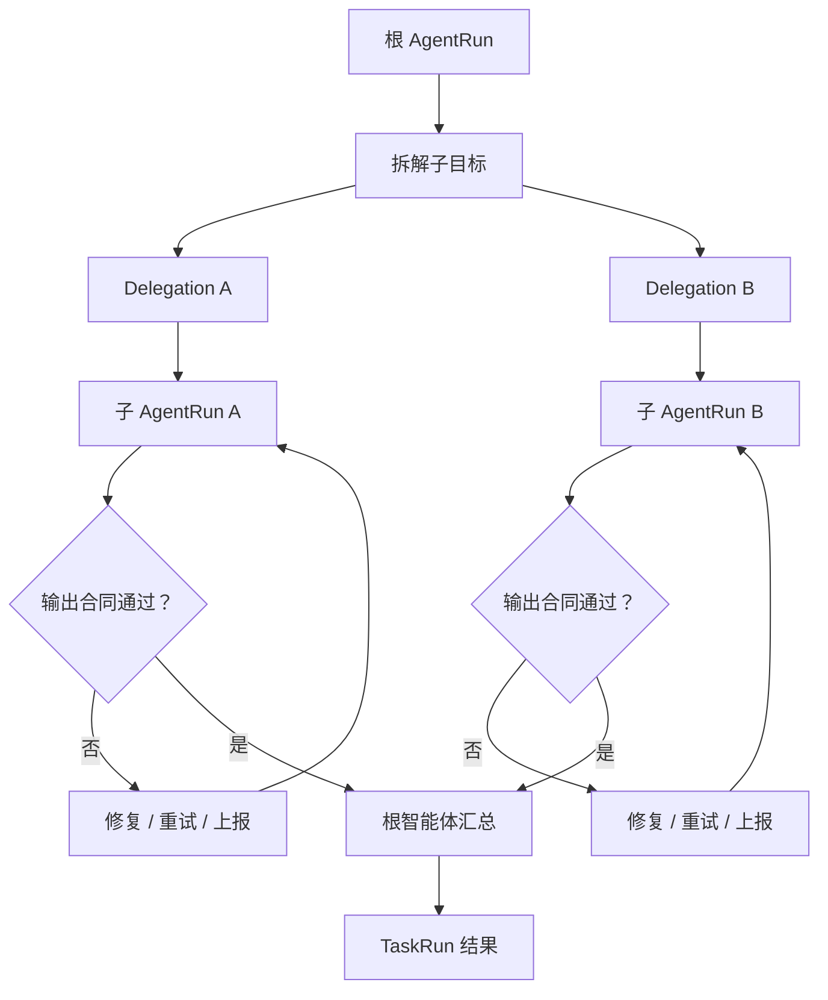
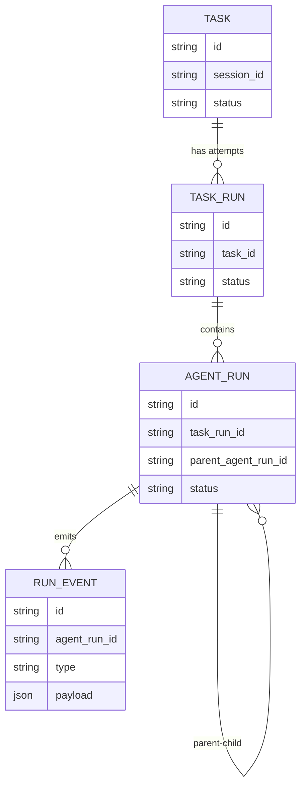
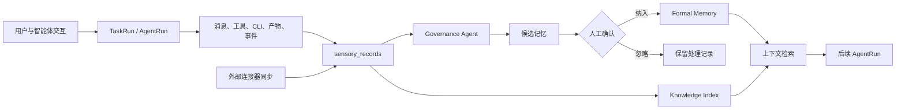
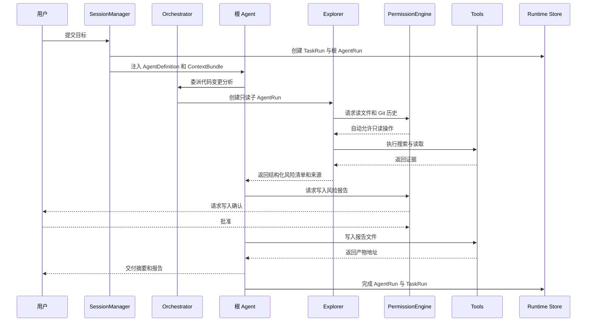

# Smallink 智能体 AI 底座设计与迭代指南

文档版本：1.0
更新日期：2026-07-28
适用对象：产品、设计、研发，以及第一次理解智能体系统的用户
关联文档：[整体架构导读](./smallink-architecture-guide.md)、[产品 PRD](./link-product-prd.md)、[技术设计](./link-technical-design.md)

## 1. 先用一句话理解智能体底座

Smallink 的智能体底座不是“把一句话发给大模型，再显示回复”，而是一套可持续运行的工作系统：

> 它把用户目标转成任务，组装完成任务所需的上下文，让模型决定下一步，通过受控的 Tool、Skill、MCP 和连接器执行动作，记录每一步，必要时请求用户确认，并允许多个智能体协作完成同一个目标。

大模型负责判断和生成，Smallink 负责边界、执行、状态、数据、恢复与可信度。二者不能混为一谈。

## 2. 小白版心智模型

可以把 Smallink 想成一家运行在个人电脑里的小型数字公司：

| 系统概念 | 公司类比 | 实际含义 |
|---|---|---|
| 用户 | 委托人 | 提出目标、提供资料、做关键决定 |
| Task | 工单 | 一个需要长期追踪的目标 |
| TaskRun | 一次办理 | 对同一个目标的一次实际执行或重试 |
| Agent | 员工 | 具有角色、指令、模型和能力边界的执行者 |
| AgentRun | 员工的一次工作记录 | 某个智能体在某次任务中的完整运行 |
| Model | 大脑 | 理解目标、推理、选择下一步、生成内容 |
| Tool | 手和脚 | 读文件、写文件、运行命令、搜索、发消息等动作 |
| Skill | 工作手册 | 告诉智能体某类任务应该怎么做 |
| Connector | 外部账户通道 | 连接邮箱、日历、GitHub、Codex 等外部系统 |
| Permission Policy | 公司制度 | 决定什么可以自动做，什么必须请示 |
| Context | 工作桌面 | 当前任务真正需要看到的信息集合 |
| Memory | 已确认经验 | 可供以后任务复用的长期事实、偏好和方法 |
| RunEvent | 工作日志 | 记录思考、调用、审批、结果和异常 |

这套类比中，最重要的一条是：**模型不是系统本身，模型只是系统中的推理部件。**

## 3. 当前真实架构与目标架构

### 3.1 当前已经跑通的主链



当前真实能力包括：Persona 到 Agent 的解析、模型路由、模型与工具循环、权限审批、Skill 加载、连接器工具、Explorer 子智能体、运行事件记录、停止和基础恢复。

### 3.2 目标架构



目标架构比当前多出的关键能力是：正式的智能体定义版本、统一上下文包、通用多智能体编排、能力目录、预算、可靠检查点、事件回放，以及记忆和知识检索主链。

## 4. 六个最容易混淆的概念

### 4.1 Persona、Agent 与 AgentDefinition

- **Persona（角色）**：用户在界面中选择的身份，例如 Smallink、Code、Ops。它关注“用户看到谁”。
- **Agent（智能体）**：运行时真正拿到模型、提示词和工具的执行对象。它关注“谁在工作”。
- **AgentDefinition（智能体定义）**：目标架构中的可版本化配置，包含角色、模型策略、能力、权限、预算和委派规则。它关注“这个员工的岗位说明书是什么”。

当前代码中 Persona 和 Agent 已经存在；完整、可冻结版本的 AgentDefinition 还没有形成正式实体。

### 4.2 Task、TaskRun 与 AgentRun

- **Task**：用户要完成的长期目标，例如“持续整理 Smallink 的产品方案”。
- **TaskRun**：Task 的一次执行。失败后重试，会产生新的 TaskRun，但 Task 不变。
- **AgentRun**：某一个智能体在这次 TaskRun 中的运行。根智能体可以产生多个子 AgentRun。

这种三层结构解决两个问题：任务不会因为重试丢失；多智能体的责任可以分开追踪。

### 4.3 Tool、Skill、MCP 与 Connector

| 概念 | 本质 | 是否直接执行动作 | 例子 |
|---|---|---:|---|
| Tool | 本地可调用函数 | 是 | 读文件、写文件、运行命令 |
| Skill | 可加载的工作说明与资源 | 否 | 生成 PRD 的步骤、品牌文案方法 |
| MCP | 标准化外部工具协议 | 间接是 | 通过 MCP Server 暴露数据库或设计工具 |
| Connector | 外部系统的账户连接 | 是 | GitHub、邮箱、日历、Codex 数据同步 |

Skill 不能绕过权限。它只能教 Agent 怎么做，真正的动作仍必须经过 Tool 或 Connector，并接受权限检查。

### 4.4 Provider 与 Model

- **Model（模型）**：具体的大模型，例如某个 GPT 或本地模型。
- **Provider（提供方）**：提供模型 API 的服务商或运行方式，例如 OpenAI 或 Ollama。
- **Provider Adapter（适配器）**：把不同服务商的请求和响应翻译成 Smallink 的统一格式。
- **Model Gateway（模型网关）**：目标架构中的统一入口，除了路由，还负责能力判断、超时、重试、成本和降级策略。

当前 `ProviderRouter` 已完成基础路由，但还不是完整的 Model Gateway。

### 4.5 Context 与 Memory

- **Context（上下文）**：本次运行临时提供给模型的信息，受模型窗口大小限制。
- **Memory（记忆）**：经过治理和确认、跨任务长期保存的信息。
- **Knowledge（知识）**：文档、代码、网页等可检索资料本身。

记忆和知识不会自动等于上下文。每次运行都需要筛选最相关的部分再装入上下文，否则模型会被噪声淹没。

### 4.6 权限与能力

“系统能做”不代表“这次允许做”。Capability 表示能力存在，Policy 表示在当前用户、任务、目录、模式和风险下能否执行。

## 5. 智能体的一次完整运行

### 5.1 TurnEngine 是什么

`TurnEngine` 是当前 Smallink 最核心的智能体运行内核。它负责一个用户回合中的多轮“模型判断 -> 工具执行 -> 模型继续判断”，直到得到最终结果。

专业上常把这种模式称为 **Agent Loop（智能体循环）** 或 **ReAct**：Reasoning and Acting，即“推理和行动交替进行”。Smallink 不依赖模型自己保持循环，而是由 Runtime 显式控制循环。

### 5.2 当前执行流程



### 5.3 Turn 与 Iteration 的区别

- **Turn（回合）**：用户发一条消息到智能体给出最终回复的完整过程。
- **Iteration（迭代）**：一个 Turn 内部的一次模型调用及其工具处理。

例如用户说“读这个文件并生成摘要”：第一次 Iteration 让模型决定读取文件；第二次 Iteration 让模型基于文件内容生成摘要。两次 Iteration 仍属于一个 Turn。

### 5.4 为什么循环必须由 Smallink 控制

1. 可以在每次动作前检查权限。
2. 可以保存完整过程，而不是只保存最终回复。
3. 可以停止、重试和恢复。
4. 可以限制最大迭代、费用和时间。
5. 可以在工具失败后把错误交回模型处理。

## 6. 智能体定义层

### 6.1 当前实现

当前 `Agent` 包含：

- `name`：内部标识。
- `title`：界面名称。
- `system_prompt`：系统提示词。
- `needs_workspace`：是否需要工作目录。
- `tool_factory`：创建基础工具的工厂。
- `family`：knowledge 或 code 等能力族。
- `messaging`：是否允许发送消息。
- `connectors`：是否加载连接器工具。

`PersonaRegistry` 负责内置角色、Markdown 角色、启用状态、是否在选择器展示和默认角色。

### 6.2 为什么这样设计

角色与运行内核分开后，同一个 TurnEngine 可以运行不同角色；新增角色不需要复制执行器。用户看到的 Persona 生命周期也不会污染底层 Agent Loop。

### 6.3 当前不足

当前 Agent 仍偏轻量，缺少：

- 定义版本和不可变快照。
- 主模型、备用模型和路由策略。
- 能力白名单与细粒度权限绑定。
- Token、费用、时间和工具调用预算。
- 可以委派给哪些子智能体。
- 输出结构和验收规则。

### 6.4 建议的 AgentDefinition

```text
AgentDefinition
├── id / version / display_name
├── role_prompt
├── model_policy
├── capability_policy
├── permission_policy_id
├── context_policy
├── delegation_policy
├── budget_policy
└── output_contract
```

每次 AgentRun 必须记录使用的 `agent_definition_id + version`。以后修改智能体时，历史任务仍能解释“当时为什么这样运行”。

## 7. 上下文系统

### 7.1 当前实现

`build_engine` 当前会把以下内容拼接进系统提示词或最新用户消息：

- Agent 的系统提示词。
- 运行进度说明。
- 工作区环境信息。
- 项目内 `AGENTS.md`。
- 已有的只读记忆。
- Skill 名称和描述目录。
- 当前模式和动态目录列表。

这已经能工作，但属于分散式组装。

### 7.2 Context Window

**Context Window（上下文窗口）** 是模型一次请求能读取的 Token 上限。Token 可以粗略理解为模型处理文字的最小片段。窗口不是越塞满越好，低相关信息会降低判断质量并增加成本。

### 7.3 目标 ContextAssembler



**ContextBundle（上下文包）** 是某次 AgentRun 实际看到的信息快照。它应保存来源 ID、版本、排序分数和压缩方式，从而回答“模型当时看到了什么”。

### 7.4 RAG 与 Embedding

- **RAG（检索增强生成）**：先从知识库检索相关片段，再让模型基于片段回答。
- **Embedding（向量表示）**：把文字转换成一组数字，用于寻找语义相近内容。
- **Hybrid Search（混合检索）**：结合关键词检索与向量检索，通常比只用其中一种稳定。

Smallink 后续不应把整个记忆库直接塞给模型，而应通过项目、时间、类型、相关性和可信度共同筛选。

## 8. 模型 Provider 与模型网关

### 8.1 当前实现

`ProviderClient` 统一了模型请求和响应，核心对象包括：

- `AssistantTurn`：一次模型响应。
- `ToolCall`：模型请求调用的工具。
- `StreamChunk`：流式输出片段。
- `ModelCapabilities`：模型是否支持工具、图片、PDF、并行工具和流式输出。

`ProviderRouter` 根据模型名前缀选择 Provider。当前裸模型默认走 OpenAI，`ollama:` 前缀可走本地兼容服务。

### 8.2 为什么 Provider 只负责一次模型响应

Provider 不拥有 Agent Loop。这样切换模型不会改变任务、工具、权限和事件语义，也避免每个 Provider 各自实现一套智能体逻辑。

### 8.3 下一步 Model Gateway 要补什么

1. 模型能力矩阵：工具、视觉、长上下文、结构化输出。
2. 路由策略：按任务类型、隐私、成本和延迟选模型。
3. 失败策略：超时、有限重试、备用模型和熔断。
4. 用量记录：输入 Token、输出 Token、费用、延迟。
5. 结构化输出校验：不合格时自动修复或重试。

**Circuit Breaker（熔断器）**：某个 Provider 连续失败时，暂时停止继续请求，避免系统反复卡死。

## 9. 能力系统

### 9.1 当前 ToolRegistry

`ToolRegistry` 保存工具名称、JSON Schema、执行函数和元数据。模型只看到 Schema，不直接拿到 Python 函数。

**JSON Schema** 是一份机器可读的参数说明，例如工具需要 `path` 和 `content`，各自是什么类型、是否必填。它让模型能够产生结构化的工具调用。

### 9.2 当前能力装配顺序



### 9.3 Capability Registry 的目标

目标不是把所有东西都叫 Tool，而是用 Capability 作为统一目录项：

```text
Capability
├── identity: id / version / owner
├── kind: tool / skill / mcp / connector_action
├── input_schema / output_schema
├── risk_level / side_effects
├── availability / health
├── required_secrets
├── policy_tags
└── invocation_adapter
```

这样 Skill Hub、连接器列表、智能体配置和审批系统才能共享同一份“平台具有什么能力”的事实源。

## 10. 权限、风险与人工介入

### 10.1 当前四种运行模式

| 模式 | 含义 | 典型行为 |
|---|---|---|
| Discuss | 只讨论 | 不执行写入和命令 |
| Plan | 只读规划 | 可探索，提交计划后等待批准 |
| Interactive | 交互执行 | 读取自动，写入和命令通常询问 |
| Auto | 自动执行 | 在明确目录和规则范围内自动运行 |

### 10.2 PermissionEngine 的判断流程



### 10.3 关键术语

- **Policy（策略）**：判断动作是否允许的一组规则。
- **Guardrail（护栏）**：防止系统越界的技术约束，不依赖模型自觉。
- **HITL（Human in the Loop）**：人在回路中，关键动作由用户确认。
- **Sandbox（沙箱）**：限制程序能访问的目录、网络或系统资源。
- **Allowlist（白名单）**：只允许明确列出的命令、工具或目标。

权限必须在 Tool 执行前由系统检查，不能只在提示词中写“请小心”。提示词是软约束，PermissionEngine 才是硬约束。

## 11. 多智能体底座

### 11.1 当前已经实现的部分

当前 Code 类智能体可以调用 `explore`：

- 创建一个新的子 TurnEngine。
- 使用全新的消息上下文。
- 只提供只读能力。
- 使用 Plan 模式，不能写入。
- 最大 10 次迭代。
- 不能再次创建子智能体，避免无限递归。
- 子运行通过 `AgentRunObserver` 记录到根运行下面。
- 子智能体只把最终研究报告交给父智能体，减少父上下文噪声。

这是真实的父子智能体运行，但目前只覆盖 Explorer 这一种固定模式。

### 11.2 多智能体不是“多开几个模型”

真正的多智能体需要五部分：

1. **分工**：每个子智能体有清晰角色和输出合同。
2. **委派**：父智能体传递目标、输入、约束和预算。
3. **依赖**：知道哪些子任务可以并行，哪些必须等待前一步。
4. **汇总**：验证子结果，再合成最终输出。
5. **治理**：父子权限、成本、取消和审计都可控。

### 11.3 目标编排流程



### 11.4 Delegation Contract

**Delegation Contract（委派合同）** 是父智能体给子智能体的结构化任务，建议包含：

```text
Delegation
├── goal
├── input_refs
├── expected_output_schema
├── allowed_capabilities
├── permission_ceiling
├── token / cost / time budget
├── deadline
└── parent_agent_run_id
```

`permission_ceiling` 表示子智能体的权限不能高于父智能体。父智能体没有写权限时，不能委派出一个有写权限的子智能体。

### 11.5 Orchestrator 与 Agent 的区别

- **Agent** 决定某个工作节点如何完成。
- **Orchestrator（编排器）** 管理工作节点之间的依赖、并行、重试、预算和生命周期。

早期可以让根 Agent 决定拆分，但运行状态和资源控制必须交给 Orchestrator，不能只靠模型在对话文本里“记住”。

### 11.6 建议的第一批通用子智能体

| 子智能体 | 主要职责 | 默认权限 |
|---|---|---|
| Explorer | 搜索代码、文件和资料 | 只读 |
| Researcher | 外部研究和来源核验 | Web 只读 |
| Builder | 生成文件或执行改动 | 项目范围写入，需策略 |
| Reviewer | 检查质量、风险和遗漏 | 只读 |
| Governance Agent | 从原始数据生成候选记忆 | 只读原始池，写候选区 |

“生成候选记忆”和“写入正式记忆”必须是两种权限。Governance Agent 可以写候选区，但不能绕过用户确认直接修改正式记忆。

## 12. 任务、运行、事件与恢复

### 12.1 当前数据模型



当前 `SQLiteTaskRuntimeStore` 已保存 Task、TaskRun、AgentRun 和 RunEvent。服务启动时会把遗留的 running 或 waiting 运行收口为失败，避免界面永远显示执行中。

### 12.2 Event 与状态

事件包括：回合开始、文本增量、推理增量、工具提议、审批请求、工具开始、工具结束、迭代结束、回合结束、错误和中断。

**Event Sourcing（事件溯源）** 是用不可变事件重建状态的设计。Smallink 当前已经记录事件，但还没有完全做到“所有状态都由事件重建”。

### 12.3 Durable Execution

**Durable Execution（持久化执行）** 表示服务崩溃或电脑重启后，任务可以从已确认的位置继续，而不是从头重跑。

要完整实现，需要：

- **Checkpoint（检查点）**：保存某次迭代后的消息、工具结果、预算和上下文引用。
- **Idempotency（幂等性）**：同一个动作重复请求不会产生两次副作用。
- **Outbox**：业务状态和待发送事件在同一事务中落库，防止状态成功但界面没收到事件。
- **Replay Cursor（回放游标）**：客户端重连后从上次事件位置继续接收。

当前 Smallink 已能避免一部分重复工具执行，也能恢复未回答的工具调用，但还不是任意进程中断后的完整持久化恢复。

## 13. 智能体与记忆、知识、原始数据的关系

### 13.1 数据闭环



### 13.2 三条不能破坏的边界

1. 原始数据是事实记录，不能被 AI 总结覆盖。
2. 候选记忆是 AI 建议，不是正式记忆。
3. 正式记忆必须保留来源、版本和人工确认记录。

### 13.3 sensory_records 的作用

`sensory_records` 是所有输入的原始事实池，包括会话输入输出、工具调用、CLI、文件、连接器数据和运行事件。它相当于系统的“感官记录”，为治理重跑、来源解释和未来模型升级保留依据。

**Watermark（处理水位）** 是某条流水线已经成功处理到的位置。同步水位、治理水位和索引水位必须分开，只有事务成功后才能前进。

## 14. 从用户请求到多智能体交付的示例

用户提出：“分析本周产品文档和代码变更，输出一份风险报告。”



在这个流程里，根 Agent 负责目标与汇总，Explorer 负责证据搜索，PermissionEngine 负责边界，Tool 负责动作，Runtime Store 负责过程事实。任何一个角色都不能替代其他角色。

## 15. 当前代码映射

| 架构职责 | 当前实现位置 | 状态 |
|---|---|---|
| Agent 基础定义 | `smallink/agents/base.py` | 已实现，定义较轻 |
| 默认 Smallink Agent | `smallink/agents/link.py` | 已实现 |
| Persona 生命周期 | `smallink/personas/registry.py` | 已实现 |
| Engine 装配 | `smallink/agent.py` | 已实现，职责偏集中 |
| 智能体循环 | `smallink/engine.py` | 已实现，是当前核心 |
| Provider 抽象 | `smallink/providers/base.py` | 已实现 |
| Provider 路由 | `smallink/providers/router.py` | 已实现，网关能力待补 |
| Tool Registry | `smallink/tools/registry.py` | 已实现 |
| Skill Loader / Store | `smallink/skills/base.py`、`smallink/skills/store.py` | 已实现 |
| 权限引擎 | `smallink/permissions.py` | 已实现 |
| Explorer 子智能体 | `smallink/tools/subagent.py` | 已实现，通用编排待补 |
| Session 与运行桥接 | `smallink/server/manager.py` | 已实现，职责较重 |
| Task Runtime Store | `smallink/task/store.py` | SQLite 版本已实现 |
| 子运行观察 | `smallink/task/observer.py` | 已实现 |
| 运行事件模型 | `smallink/events.py` | 已实现 |
| ContextAssembler | 尚无独立模块 | 待建设 |
| Capability Registry | 尚无统一持久化实体 | 待建设 |
| Orchestrator | 尚无通用模块 | 待建设 |
| Postgres Event Store / Outbox | 尚未替换 SQLite 主链 | 待建设 |

## 16. 为什么当前设计合理，以及为什么仍需重构

### 16.1 当前设计合理的部分

1. Runtime 拥有循环，Provider 只负责模型响应，模型可以替换。
2. Tool 执行和 Permission 判断分开，安全边界清楚。
3. Persona 和 Skill 分开，角色不会与工作手册绑定死。
4. 子智能体使用独立上下文，避免根智能体上下文污染。
5. 运行事件先保存再给界面，已经具备可观测性的基础。

### 16.2 当前结构开始承压的部分

1. `build_engine` 同时装配模型、工具、连接器、Skill、上下文和权限，后续会越来越难维护。
2. `SessionManager` 同时承担会话、引擎缓存、审批、运行追踪和后台任务协调，边界过宽。
3. 当前 Agent 定义过轻，无法冻结一次运行的完整配置。
4. Explorer 是专用实现，还不能支持任意智能体角色与依赖图。
5. SQLite Runtime Store 适合单机原型，但与未来 Postgres 事实源、事件回放和数据治理尚未统一。

重构原则不是推翻 TurnEngine，而是保留已经验证的 Loop、Provider、Tool、Permission 和 Event 机制，把装配、编排、上下文和持久化拆成明确服务。

## 17. 后续迭代路线

### 阶段 A：冻结智能体运行合同

目标：让每次运行都能解释“谁、用什么模型、拿了哪些能力、在什么权限和预算下工作”。

- 引入 `AgentDefinition` 和版本。
- AgentRun 保存定义快照、模型设置和能力快照。
- 定义统一 `OutputContract`。
- 保持现有 TurnEngine 行为不变。

验收：历史运行不受角色后续修改影响；运行详情可完整展示配置。

### 阶段 B：独立 ContextAssembler

目标：让上下文可控、可追溯、可压缩和可测试。

- 把 `build_engine` 中的上下文拼装迁出。
- 产生可持久化的 `ContextBundle`。
- 接入项目、记忆、知识和来源引用。
- 记录 Token 预算和裁剪原因。

验收：运行详情可以回答“模型看到了哪些信息，为什么选中这些信息”。

### 阶段 C：通用多智能体编排

目标：把 Explorer 模式升级为可复用的父子 AgentRun。

- 引入 `Orchestrator` 与 `DelegationContract`。
- 支持依赖、并行、汇总、重试和取消传播。
- 子智能体权限不得高于父智能体。
- 首批提供 Explorer、Researcher、Builder、Reviewer。

验收：运行中心能展示 AgentRun 树，并能单独查看每个子智能体的上下文、工具和结果。

### 阶段 D：统一能力与策略

目标：让 Tool、Skill、MCP 和 Connector 在同一目录被发现、配置、授权和审计。

- 建立 Capability Registry。
- 每项能力拥有版本、Schema、风险、健康状态和来源。
- AgentDefinition 只引用能力 ID，不直接硬编码工具。
- 审批记录绑定能力版本和目标范围。

验收：Skill Hub、连接器、智能体配置和审批页共享同一份能力状态。

### 阶段 E：持久化执行与唯一事实源

目标：重启后可恢复，客户端重连可回放，Postgres 成为正式事实源。

- Runtime Store 迁移到 Postgres。
- 引入 Checkpoint、Outbox、Replay Cursor 和幂等键。
- 接入时间、Token、费用和工具调用预算。
- 逐步停止依赖 generated snapshot。

验收：运行中断后不会重复发送消息、重复写文件或丢失审批状态。

### 阶段 F：接入治理、记忆与检索闭环

目标：让智能体在可靠数据基础上持续学习，但不能自我篡改正式记忆。

- RunEvent 和连接器数据进入 `sensory_records`。
- Governance Agent 生成带来源的候选记忆。
- 用户确认后写入正式记忆。
- ContextAssembler 使用正式记忆和知识检索。
- 记录记忆被哪些任务使用以及效果反馈。

验收：任何回答都能追溯使用了哪些记忆或知识；任何记忆都能追溯原始来源和确认记录。

## 18. 迭代时绝对不能破坏的架构原则

1. Provider 不能拥有任务循环，模型切换不应改变 Runtime 语义。
2. Skill 不能直接授予权限，所有副作用必须经过 Tool 和 Policy。
3. 子智能体权限不能高于父智能体。
4. Conversation、Task、TaskRun、AgentRun 必须保持不同语义。
5. 原始事实、候选记忆、正式记忆必须分层保存。
6. 每次运行必须冻结 AgentDefinition、ContextBundle、能力和模型版本。
7. 所有外部副作用必须具备幂等键和审计记录。
8. 运行事件必须先可靠落库，再推送给客户端。
9. 用户停止任务时，父子运行和正在执行的工具都必须收到取消信号。
10. UI 不应通过猜测文本判断运行状态，必须读取正式状态和事件。

## 19. 专业术语速查表

| 术语 | 中文解释 |
|---|---|
| LLM | 大语言模型，负责理解、推理与生成 |
| Agent | 能使用模型和能力完成目标的运行主体 |
| Persona | 用户可见的智能体角色 |
| AgentDefinition | 可版本化的智能体岗位配置 |
| Runtime | 控制智能体循环、工具、停止和状态的运行内核 |
| Agent Loop | 模型判断与工具行动反复交替的循环 |
| ReAct | Reasoning + Acting，推理与行动结合 |
| Turn | 一次用户输入到最终回复的完整回合 |
| Iteration | 一个 Turn 内的一次模型调用与工具处理 |
| Tool Calling | 模型输出结构化参数，请系统调用工具 |
| JSON Schema | 工具参数和输出的机器可读格式说明 |
| Provider | 提供模型 API 的服务商或运行方式 |
| Adapter | 把不同外部接口转换成内部统一接口的适配层 |
| Model Gateway | 统一模型路由、重试、成本、能力和降级的入口 |
| Capability | 平台可发现、可授权、可调用的一项能力 |
| Skill | 智能体可加载的工作说明和资源 |
| MCP | 让外部工具按统一协议接入模型应用的标准 |
| Connector | 连接外部账户、数据和动作的集成 |
| Orchestrator | 管理多智能体依赖、并行、重试和生命周期的编排器 |
| Delegation | 父智能体把结构化子目标交给子智能体 |
| Context Window | 模型一次能读取的信息容量 |
| ContextBundle | 某次运行实际使用的上下文快照 |
| RAG | 检索资料后再让模型生成答案 |
| Embedding | 用数字向量表达文本语义 |
| Policy | 决定动作是否允许的规则 |
| Guardrail | 防越权、防危险行为的硬约束 |
| HITL | Human in the Loop，关键节点由人确认 |
| Sandbox | 限制文件、命令、网络访问范围的隔离环境 |
| Durable Execution | 崩溃或重启后仍可继续的持久化执行 |
| Checkpoint | 可用于恢复的运行状态快照 |
| Event Sourcing | 通过不可变事件记录并重建状态 |
| Outbox | 保证业务状态和待推送事件一致落库的模式 |
| Idempotency | 同一动作重复执行仍只产生一次业务效果 |
| Budget | Token、费用、时间和工具次数的资源上限 |
| Watermark | 某条数据流水线已成功处理到的位置 |
| sensory_records | 保存所有输入原始事实的统一记录池 |

## 20. 最终判断

Smallink 当前已经拥有一个真实可运行的单智能体内核，以及一个受限但真实的 Explorer 子智能体。最值得保留的资产是 TurnEngine、Provider 抽象、ToolRegistry、PermissionEngine 和 RunEvent；最需要补齐的是 AgentDefinition、ContextAssembler、通用 Orchestrator、Capability Registry 和持久化执行。

后续迭代不应从“再做一个智能体页面”开始，而应从运行合同、上下文合同、委派合同和事件合同开始。四个合同稳定后，智能体数量、Skill 数量、连接器数量和模型数量都可以持续增加，而不会把系统变成一组互相耦合的功能开关。
