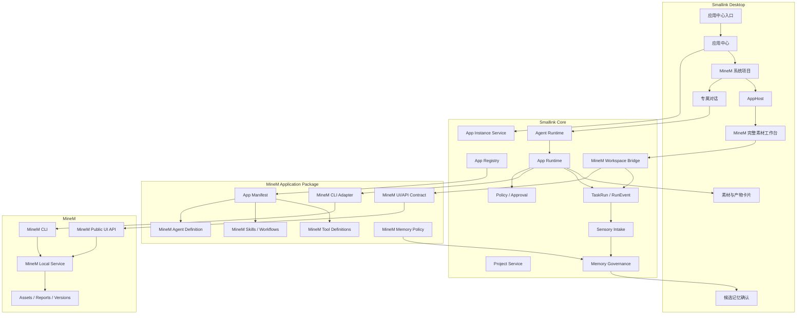
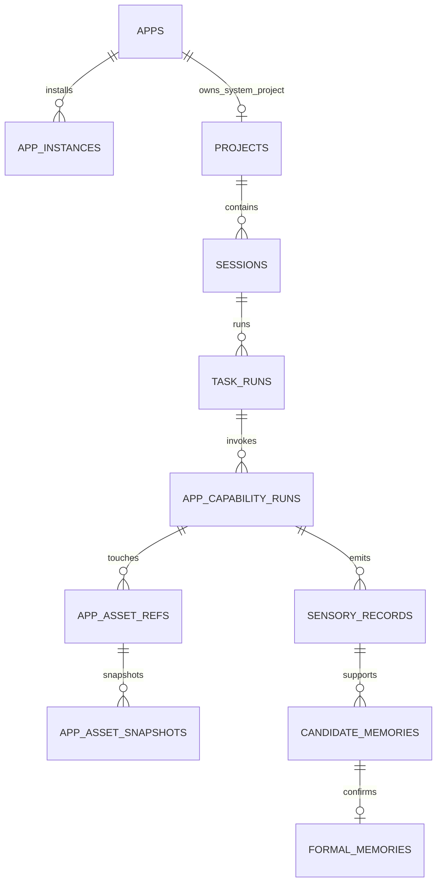
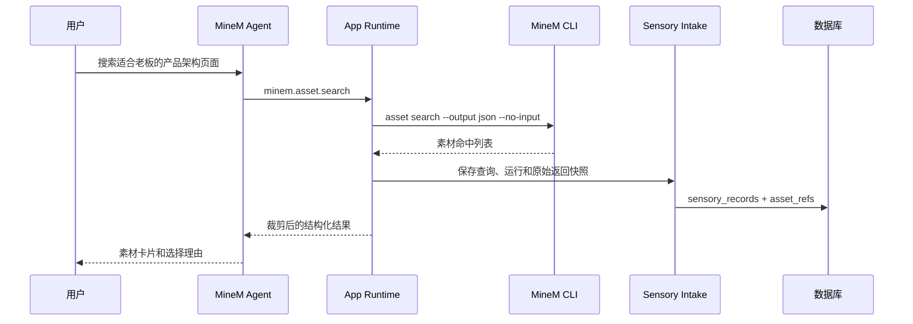
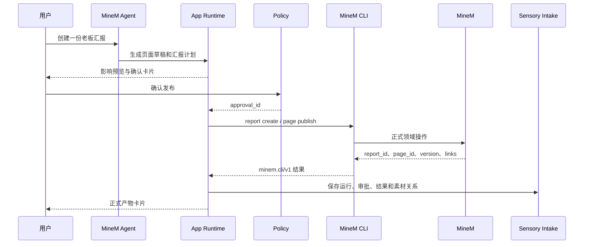

# Smallink 应用中心与 MineM 首个应用技术设计

文档版本：1.1  
更新日期：2026-08-09  
状态：目标技术方案，进入开发前评审  
关联文档：[产品 PRD](./smallink-app-center-minem-prd.md)、[测试计划](./smallink-app-center-minem-test-plan.md)、[Smallink 主技术文档](./link-technical-design.md)

## 1. 技术结论

应用中心应实现为 Smallink Core 内部的通用应用平台。MineM 通过应用清单注册入口、系统项目、可嵌入工作台、专属智能体、CLI 适配器、公开 UI API、工具、工作流、权限、数据和记忆策略。

MineM 的领域数据仍以 MineM 为唯一事实源；Smallink 保存运行事实、读取快照、稳定引用、项目关系、审批、产物映射和记忆。

完整集成采用双链路：

```text
智能体与自动化：Smallink Agent Runtime → MineM CLI（minem.cli/v1）→ MineM 本机服务
高频素材界面：Smallink AppHost → MineM Workspace Bridge → MineM Public UI API → MineM 本机服务
```

CLI 链路负责可审计的智能体操作；UI/API 链路负责列表、筛选、预览、拖拽、版本、导入任务和治理等高频交互。两条链路调用同一 MineM 领域服务和同一素材库。

不直接导入 MineM Python 内部模块，不调用未版本化私有路由，不读取 `materials.db`，也不复制 MineM 的 React 业务代码到 Smallink。

## 2. 架构原则

1. **应用优先，连接器内聚**：用户看到应用，连接器只是应用的运行适配器。
2. **声明式注册**：入口、项目、智能体、能力和策略由清单声明，不在 UI 到处判断 `minem`。
3. **事实源隔离**：MineM 管素材；Smallink 管任务、运行、记忆和引用。
4. **能力白名单**：模型只能调用注册的结构化能力，不能传入任意命令行。
5. **先事实后记忆**：所有输入先进入原始事实层，AI 只能生成候选记忆。
6. **写入可确认**：正式发布、编排和导出遵循 Smallink Policy 与 Approval。
7. **幂等与可恢复**：重试、重启和局部失败不得产生重复正式资产。
8. **渐进迁移**：现有 MineM 只读连接器继续可用，逐步迁移到应用运行框架。
9. **界面复用，不做分叉**：MineM 将正式工作台抽成可嵌入模块；Smallink 只提供 AppHost、桥接协议和统一外壳。
10. **双链路同领域服务**：UI/API 与 CLI 共享对象 ID、版本、权限和事务规则，不形成双事实源。
11. **语义事件沉淀**：只采集搜索、查看、编排、合并、导出等业务事件，不采集无意义的原始鼠标轨迹。

## 3. 总体架构



## 4. 模块职责

### 4.1 `apps.registry`

职责：

- 加载内置应用清单；
- 校验 `app_id`、版本和能力引用；
- 提供前端可见应用列表；
- 解析应用的项目、智能体、工具和策略；
- 防止重复或冲突注册。

不负责启动外部进程或执行工具。

### 4.2 `apps.instances`

职责：

- 保存本机应用启用状态；
- 维护发现、安装、运行、连接和兼容状态；
- 调用适配器执行检查、连接和停用；
- 产生状态变化事件；
- 保存最近健康检查和错误摘要。

### 4.3 `apps.projects`

职责：

- 按清单幂等创建系统项目；
- 将会话、任务、素材引用和记忆候选关联到系统项目；
- 在应用停用后保留历史；
- 阻止普通文件夹逻辑覆盖系统项目属性。

### 4.4 `apps.runtime`

职责：

- 将应用能力装配到指定 AgentRun；
- 执行 Capability 到 Adapter 方法的映射；
- 统一超时、取消、输出裁剪和错误归一化；
- 记录调用、审批、幂等键和结果；
- 将领域结果转换为素材卡片和产物卡片。

### 4.5 `apps.memory`

职责：

- 定义某应用允许提炼的记忆类型；
- 选择可用于治理的原始事实和素材快照；
- 生成带来源引用的候选记忆；
- 避免把路径、编号和工具日志机械写成记忆；
- 为后续应用会话提供相关正式记忆。

## 5. 应用清单

### 5.1 清单模型

建议使用版本化 Python 数据类或 JSON/YAML 清单，启动时编译为同一领域对象。

```json
{
  "schema_version": "smallink.app/v1",
  "app_id": "minem",
  "name": "MineM",
  "description": "通过自然语言搜索、创建和管理 MineM 素材库。",
  "icon": "minem",
  "runtime": {
    "kind": "hybrid_local_app",
    "agent_adapter": "smallink.apps.builtin.minem.adapter:MineMAdapter",
    "workspace_bridge": "smallink.apps.builtin.minem.bridge:MineMWorkspaceBridge"
  },
  "surfaces": {
    "project_home": "minem.home",
    "workspace": "minem.workspace",
    "workspace_contract": "minem.workspace/v1"
  },
  "compatibility": {
    "cli_protocol": "minem.cli/v1",
    "ui_api_protocol": "minem.ui-api/v1",
    "capability_set": "minem.material-workspace/v1"
  },
  "system_project": {
    "project_id": "system:minem",
    "name": "MineM 素材库",
    "default_agent": "minem-agent"
  },
  "capabilities": [
    "minem.status",
    "minem.asset.search",
    "minem.asset.get",
    "minem.page.build",
    "minem.page.publish",
    "minem.report.create",
    "minem.report.export"
  ],
  "memory_policy": "minem-memory-v1",
  "permission_policy": "minem-permissions-v1"
}
```

### 5.2 清单校验

启动时必须校验：

- `schema_version` 受支持；
- `app_id` 唯一且格式稳定；
- 系统项目 ID 唯一；
- 默认智能体存在；
- 所有能力都有工具定义和适配器方法；
- 权限和记忆策略存在；
- 未实现能力不能出现在正式清单。
- `surfaces` 引用的界面存在且可加载；
- UI API、CLI 和素材工作台能力集版本相互兼容；
- 能力对齐清单中缺失核心能力时降级为只读诊断，不允许静默隐藏功能。

## 6. 领域对象与数据模型

以下为逻辑模型。当前实现可以先落在现有 SQLite，后续迁移到主技术文档定义的 Postgres，不允许由前端本地状态代替持久化。

### 6.1 `apps`

| 字段 | 说明 |
|---|---|
| `app_id` | 稳定应用标识，例如 `minem` |
| `schema_version` | 应用清单协议版本 |
| `manifest_version` | 清单版本 |
| `name` | 显示名称 |
| `runtime_kind` | `cli`、`api`、`mcp` 或 `local_service` |
| `builtin` | 是否内置应用 |
| `created_at` / `updated_at` | 时间 |

### 6.2 `app_instances`

| 字段 | 说明 |
|---|---|
| `instance_id` | 本机实例 ID |
| `app_id` | 应用 ID |
| `device_id` | 当前设备 |
| `enabled` | 是否启用 |
| `install_state` | 未发现、已安装 |
| `runtime_state` | 离线、启动中、可用、异常 |
| `app_version` | 外部应用版本 |
| `protocol_version` | CLI/API 协议版本 |
| `adapter_config` | 不含秘密的适配器配置 |
| `last_checked_at` | 最近检查 |
| `last_error_code` | 最近错误码 |

唯一约束：`(app_id, device_id)`。

### 6.3 `projects` 扩展

新增或明确：

| 字段 | 说明 |
|---|---|
| `project_type` | `folder`、`system_app` 等 |
| `owner_app_id` | 系统应用项目所属应用 |
| `workspace_path` | 系统应用项目为 `NULL` |
| `system_key` | `system:minem` |
| `disabled_at` | 应用停用时间，不删除历史 |

唯一约束：`system_key`。

### 6.4 `app_capability_runs`

| 字段 | 说明 |
|---|---|
| `capability_run_id` | 能力运行 ID |
| `app_id` / `instance_id` | 应用和实例 |
| `project_id` / `session_id` | 所属上下文 |
| `task_run_id` / `agent_run_id` | 运行链 |
| `capability` | 规范化能力名 |
| `arguments_redacted` | 脱敏参数 |
| `idempotency_key` | 幂等键 |
| `approval_id` | 可选审批 |
| `status` | 状态 |
| `external_request_id` | MineM 请求或任务 ID |
| `started_at` / `finished_at` | 时间 |
| `error_code` | 归一化错误 |

### 6.5 `app_asset_refs`

| 字段 | 说明 |
|---|---|
| `asset_ref_id` | Smallink 引用 ID |
| `app_id` / `instance_id` | 来源应用 |
| `project_id` | 默认 `system:minem` |
| `external_asset_id` | MineM 内部 ID |
| `external_code` | MineM 公开编号 |
| `asset_type` | report/page/resource/case |
| `version_id` | 版本 |
| `content_hash` | 内容哈希 |
| `title` | 标题 |
| `preview_ref` | 可重新解析的预览引用 |
| `first_seen_at` / `last_seen_at` | 时间 |

唯一约束建议：`(instance_id, external_asset_id, version_id)`。

### 6.6 `app_asset_snapshots`

保存实际读取过的受控内容，而不是全库同步。

| 字段 | 说明 |
|---|---|
| `snapshot_id` | 快照 ID |
| `asset_ref_id` | 素材引用 |
| `sensory_record_id` | 对应原始事实 |
| `content_hash` | 快照哈希 |
| `content_blob_ref` | 文本或 Blob 引用 |
| `schema_version` | 快照结构版本 |
| `captured_at` | 捕获时间 |

### 6.7 关系图



## 7. MineM CLI 适配器

### 7.1 现有基础

当前 `smallink/connectors/minem_client.py` 已经实现：

- 应用包内 CLI、用户 CLI 和 PATH 的发现；
- `subprocess.run` 参数数组调用；
- JSON 输出解析；
- 超时和最大输出；
- loopback URL 过滤；
- 只读结果归一化。

迁移时将其保留为底层传输实现或移动到 `apps/builtin/minem/adapter.py`，不能复制两套客户端。

### 7.2 命令规则

1. 禁止 `shell=True`。
2. 命令和参数由能力实现生成，模型不能提供完整命令字符串。
3. 所有调用追加 `--output json --no-input`。
4. 写命令仅在 Smallink 审批通过后追加 MineM 所需 `--confirm`。
5. 校验 `schemaVersion=minem.cli/v1`、产品名和兼容版本。
6. stdout 仅解析 JSON；stderr 进入脱敏诊断。
7. 子进程支持超时、取消和父进程退出治理。
8. 大对象写入快照层，发送给模型的内容必须有条数和字符限制。

### 7.3 能力映射

| Smallink Capability | MineM CLI |
|---|---|
| `minem.status` | `minem status` |
| `minem.asset.search` | `minem asset search` |
| `minem.asset.get` | `minem asset get` |
| `minem.report.pages` | `minem report pages` |
| `minem.asset.versions` | `minem asset versions` |
| `minem.asset.lineage` | `minem asset lineage` |
| `minem.page.build` | `minem page build` |
| `minem.page.publish` | `minem page build --publish --wait` 或 `page import` |
| `minem.report.create` | `minem report create` |
| `minem.report.page.add` | `minem report page add --confirm` |
| `minem.report.page.replace` | `minem report page replace --confirm` |
| `minem.report.page.move` | `minem report page move --confirm` |
| `minem.report.export` | `minem report export --wait` |

### 7.4 错误模型

适配器统一返回：

```json
{
  "ok": false,
  "error": {
    "category": "not_installed|offline|incompatible|invalid_input|not_found|conflict|timeout|cancelled|partial|internal",
    "code": "MINEM_CLI_TIMEOUT",
    "message": "MineM 在限定时间内没有响应。",
    "retryable": true,
    "partial_results": []
  }
}
```

UI 不直接展示 stderr 或 Python 堆栈。

## 8. 系统项目与上下文组装

### 8.1 幂等创建

启用应用事务：

```text
upsert app_instance
→ upsert project(system:minem)
→ seed MineM agent definition
→ seed project capability defaults
→ commit
→ 异步检查 MineM 健康
```

系统项目创建不依赖 MineM 当前是否运行。这样应用离线时仍可浏览历史会话和资料引用。

### 8.2 会话创建

从 MineM 项目创建会话时：

- `project_id=system:minem`；
- `agent_id=minem-agent`；
- MineM 应用能力默认启用；
- 只注入相关正式记忆；
- 不设置伪造的 `workspace_path`；
- 文件操作仍需用户选择或授权真实文件夹。

### 8.3 MineM ContextBundle

每轮按需组装：

1. MineM Agent Persona；
2. 当前应用和协议状态；
3. 当前任务目标；
4. 当前选择的 report/page/resource 引用；
5. 相关项目资料摘要；
6. 已确认 MineM 记忆；
7. 可用 MineM Skills 和能力清单；
8. 本轮临时搜索结果。

禁止注入整个素材库和所有历史会话。

## 9. 读取数据流



需要读取正文时单独调用 `asset.get`，并保存对应版本快照。搜索列表本身不触发全量正文读取。

## 10. 写入与编排数据流



## 11. 幂等、事务与恢复

### 11.1 幂等键

写能力生成：

```text
sha256(app_instance_id + capability + canonical_arguments + task_run_id + approval_revision)
```

Smallink 先查 `app_capability_runs`：

- 已成功：返回原结果；
- 运行中：恢复轮询；
- 可重试失败：复用同一外部请求信息；
- 参数或审批版本变化：创建新幂等键。

若 MineM CLI 支持显式幂等键，应同步传递；不支持时必须在重试前通过素材编号、任务 ID 或来源关系核验是否已经成功。

### 11.2 部分成功

例如页面已发布但汇报创建失败：

- `status=partial`；
- 保存已创建页面引用；
- UI 显示失败步骤；
- 重试只执行未完成步骤；
- 不删除已发布页面，除非用户另行明确操作。

### 11.3 重启恢复

应用启动时：

1. 将无心跳的 `running` 能力运行标记为 `recovering`；
2. 根据 MineM task ID 或素材引用查询真实状态；
3. 已成功则补齐结果；
4. 仍运行则恢复轮询；
5. 无法确认则进入人工检查，而不是盲目重跑。

## 12. 数据沉淀实现

### 12.1 原始事实映射

每次 MineM 交互至少产生：

- 用户消息 SensoryRecord；
- AI 输出 SensoryRecord；
- CapabilityRequested；
- ApprovalRequested/Resolved（如有）；
- CapabilityStarted；
- CLIResponseSnapshot；
- AssetObserved/AssetCreated/AssetUpdated；
- CapabilityCompleted/Failed/Cancelled。

### 12.2 Blob 与引用

- 小型 JSON 和文本可进入数据库 JSON/Text 字段；
- 大型 CLI 返回、HTML、图片和导出文件进入本机 Blob/Artifact 存储；
- 数据库保存内容哈希、MIME、大小和 Blob 引用；
- 正式 MineM 文件仍由 MineM 管理；
- Smallink 只在用户上传、草稿生成或需要可重放快照时保存自己的副本。

### 12.3 去重

- SensoryRecord 使用来源记录 ID 或确定性指纹去重；
- 素材引用使用实例、素材 ID 和版本唯一约束；
- 快照使用 `asset_ref_id + content_hash` 唯一约束；
- 搜索事件不去掉，因为不同查询本身是有意义的用户事实；
- 列表刷新不得重复创建素材引用和候选记忆。

## 13. 记忆治理实现

### 13.1 策略输入

MineM 记忆治理批次按项目和水位读取：

- 尚未治理的用户消息；
- 用户接受、拒绝和编辑动作；
- 已读取素材快照；
- 已完成的页面和汇报摘要；
- 版本替换和修改原因；
- 工具运行元数据。

### 13.2 AI 输出契约

```json
{
  "candidates": [
    {
      "type": "user_preference",
      "title": "老板汇报首屏偏好",
      "content": "用户偏好首屏只保留结论、风险、责任和决策。",
      "value_reason": "该偏好在多次页面修改中重复出现。",
      "confidence": 0.92,
      "source_ids": ["sensory-1", "sensory-8"],
      "asset_refs": ["CTRL-PAGE-0182"],
      "merge_key": "minem:presentation:first-screen:executive"
    }
  ]
}
```

### 13.3 约束

- 工具名、文件路径、随机 ID 和执行日志本身不是记忆；
- 单次短期指令默认不升级为长期偏好；
- 候选至少有一个可打开来源；
- 相同 `merge_key` 应更新或合并，不机械新增；
- 正式记忆必须保留治理模型、提示词版本和人工动作。

## 14. API 设计

建议新增：

```text
GET    /v1/apps
GET    /v1/apps/{app_id}
POST   /v1/apps/{app_id}/enable
POST   /v1/apps/{app_id}/disable
POST   /v1/apps/{app_id}/check
GET    /v1/apps/{app_id}/runs
GET    /v1/apps/{app_id}/system-project

GET    /v1/projects/{project_id}/app-assets
GET    /v1/app-assets/{asset_ref_id}
GET    /v1/app-assets/{asset_ref_id}/lineage
POST   /v1/app-capability-runs/{run_id}/retry
POST   /v1/app-capability-runs/{run_id}/cancel
```

会话 WebSocket 和 Tool 执行继续复用现有 Agent Runtime，不为 MineM 新建第二套聊天协议。

### 14.1 MineM Public UI API

完整素材工作台不能依赖每次点击都创建 CLI 子进程。MineM 本地服务需要把当前前端正在使用的领域路由整理为版本化公开契约，至少覆盖：

```text
/assets              汇报、页面、案例和资源列表及详情
/reports             页面编排、故事线、演讲稿、查看器和导出
/storylines          故事线列表、版本和创建汇报
/case-groups         案例组及组成页面
/import-tasks        导入任务、取消和重试
/tag-taxonomy        标签体系和 AI 标签任务
/duplicates          重复分析、合并和版本提升
/lineage             来源、历史和版本关系
```

上述是领域集合，不要求 Smallink 直接绑定现有未版本化 URL。MineM 应输出 OpenAPI 或等价类型契约，由生成客户端或共享类型包消费。公开 UI API 必须有稳定错误码、游标/分页、并发版本、幂等键和取消语义。

### 14.2 Workspace Bridge

`MineMWorkspaceBridge` 是 Smallink 外壳与 MineM 工作台之间唯一通信边界，职责包括：

- 获取受信 loopback API 地址和短期会话凭证；
- 协商 `workspace_contract`、`ui_api_protocol` 和能力集版本；
- 同步语言、主题、当前项目、路由和窗口焦点；
- 把 MineM 对象转换为稳定 `AppAssetRef`；
- 从素材进入 Smallink 对话，或从对话定位工作台对象；
- 上报语义操作事件和长任务状态；
- 请求 Smallink 的文件选择、目标目录和高风险动作审批；
- 处理卸载、断线、重连和应用停用。

Bridge 不得接收任意 Shell 字符串，不得暴露数据库路径，不得让嵌入模块绕过 Smallink 权限系统。

## 15. 事件模型

建议事件：

```text
AppDiscovered
AppEnabled
AppDisabled
AppHealthChanged
SystemProjectCreated
AppCapabilityRequested
AppCapabilityStarted
AppCapabilityProgressed
AppCapabilityAwaitingApproval
AppAssetObserved
AppAssetCreated
AppAssetUpdated
AppCapabilityCompleted
AppCapabilityPartiallyCompleted
AppCapabilityFailed
AppWorkspaceOpened
AppWorkspaceRouteChanged
AppAssetViewed
AppAssetSearched
AppAssetSelectionChanged
AppAssetTagged
AppAssetMerged
AppAssetDeleted
AppReportArranged
AppImportTaskChanged
AppExportTaskChanged
AppConversationHandoffRequested
MemoryCandidateGenerated
```

所有事件包含 `app_id`、`project_id`、`session_id`、`task_run_id` 和时间。没有关联值时明确为 `null`。

## 16. 前端设计

### 16.1 Surface

- `apps`：应用中心；
- `app-detail`：应用详情；
- `project`：复用项目与会话主界面，支持 `project_type=system_app`；
- `app-workspace`：由 AppHost 挂载完整 MineM 素材工作台；
- `app-asset-detail`：素材引用和来源详情，可作为抽屉或右侧栏；
- `memory-governance`：复用候选记忆列表，增加应用和素材来源筛选。

### 16.2 加载策略

1. 应用中心只读取 Smallink 本地实例状态，不因打开页面启动 MineM。
2. MineM 项目先渲染本地历史和骨架，再异步检查连接。
3. CLI 启动不阻塞整个应用导航。
4. 搜索和素材列表分页、虚拟化并缓存最近结果。
5. 运行事件通过已有流式通道更新，不轮询整个页面数据。
6. MineM 工作台按模块懒加载；应用中心和普通会话不下载工作台代码。
7. API 客户端对列表查询使用取消、请求合并和短时缓存，切换筛选时旧响应不能覆盖新状态。
8. 大列表使用服务端分页或虚拟化；预览缩略图懒加载，整页 iframe 仅在可见或用户打开时创建。
9. 工作台未完成版本协商前显示不可交互的加载骨架；失败后显示重试和打开 MineM，不留下无响应控件。

### 16.3 状态边界

- `app_instance` 是全局连接状态；
- `project` 是长期归属；
- `session capability override` 决定当前会话是否允许使用 MineM；
- `run` 是一次调用状态；
- UI 不从一个布尔值推断所有层级状态。

### 16.4 嵌入方式

目标方案是 MineM 提供可版本化加载的 `MineMWorkspace` 前端模块或本地 bundle，Smallink 通过 AppHost 挂载。该模块继续由 MineM 仓库维护，Smallink 不复制其 `App.tsx`、状态机和业务组件。

迁移期可使用隔离 WebView 承载 MineM 本地 SPA，但必须通过 Bridge 限制导航、权限和事件；WebView 只是过渡方案，不能用来绕过能力对齐、主题、键盘、焦点、深链和自动化测试要求。

MineM 当前较大的单体入口应先拆为领域路由和可组合 Surface：

```text
MineMWorkspace
├── WorkbenchSurface
├── ReportsSurface
├── PagesSurface
├── CasesSurface
├── ResourcesSurface
├── StorylinesSurface
├── ImportTasksSurface
└── GovernanceSurface
```

各 Surface 共享 MineM Query Client、领域 Store、预览器和任务事件，不在 Smallink 中各自建立第二套请求逻辑。

## 17. 安全设计

1. 优先调用 `/Applications/MineM.app` 内的受信 CLI。
2. 用户 CLI 必须检查可执行文件、所有者和可写权限。
3. 只允许 loopback 服务发现结果。
4. 禁止模型控制二进制路径、命令名、环境变量和输出格式。
5. 输入文件路径必须经过 Smallink 工作区权限和审批。
6. 写操作同时经过 Smallink 审批和 MineM 领域确认。
7. CLI 返回中的 Token、密钥和未知 URL 在持久化前脱敏。
8. 产物预览继续执行内容类型、路径和 iframe 安全策略。
9. 应用停用后撤销新调用能力，但不破坏历史引用。
10. Public UI API 使用随机 loopback 端口、短期会话 Token、Origin 校验和最小作用域。
11. 嵌入模块只允许访问清单声明的 MineM Origin，不允许任意外部导航。
12. 删除、合并、主版本提升和正式编排必须使用 MineM 并发版本检查；Smallink 审批不能替代 MineM 领域校验。

## 18. 可观察性

结构化日志字段：

- `app_id`；
- `instance_id`；
- `project_id`；
- `capability`；
- `capability_run_id`；
- `task_run_id`；
- `duration_ms`；
- `status`；
- `error_code`；
- `external_request_id`；
- `asset_count`；
- `bytes_in` / `bytes_out`；
- `truncated`。

禁止记录用户素材全文和秘密字段。

关键指标：

- 发现和启动耗时；
- CLI 成功率和超时率；
- 搜索首结果时间；
- 写能力审批转化率；
- 幂等命中和重复资产率；
- 部分成功和恢复率；
- 记忆候选生成和接受率。
- 工作台首屏可交互时间、路由切换耗时和 API P95；
- Bridge 重连次数、契约不兼容率和旧响应丢弃数；
- 导入、预览、编排、治理和导出任务成功率。

## 19. 目标代码结构

```text
smallink/
  apps/
    __init__.py
    manifest.py
    registry.py
    instances.py
    runtime.py
    projects.py
    asset_refs.py
    memory_policy.py
    builtin/
      minem/
        manifest.py
        adapter.py
        bridge.py
        ui_api.py
        tools.py
        workflows.py
        memory.py
        cards.py
  server/
    routers/
      apps.py
      app_assets.py

surfaces/gui/src/
  apps/
    AppCenterView.tsx
    AppDetailView.tsx
    AppStatus.tsx
    AppAssetCard.tsx
    minem/
      MineMProjectHome.tsx
      MineMArtifactCard.tsx
      MineMAppHost.tsx
      MineMWorkspaceBridge.ts
      minemUiApiClient.ts
```

MineM 仓库目标提供：

```text
frontend/src/embed/
  MineMWorkspace.tsx
  surfaces/
  bridge-contract.ts

server/public_api/v1/
  assets.py
  reports.py
  storylines.py
  imports.py
  governance.py
```

这是一种目标模块边界，不要求首个提交一次性移动所有文件。迁移期间现有 `connectors/minem_client.py` 可以由新 Adapter 组合调用。

## 20. 迁移方案

### 20.0 当前落地状态（2026-08-21）

已完成：

- `smallink/apps` 中的内置 App Manifest、Registry、Instance、CapabilityRun 和 AssetRef；
- 唯一且受保护的 `system:minem` 系统项目；
- 应用中心和 MineM 素材工作台第一版；
- CLI 白名单覆盖素材读取、改名、删除、导入、页面/案例/汇报相关正式能力；
- 素材读取与语义操作写入 SensoryRecord、稳定素材引用和项目知识；
- 专属项目会话与项目聚合页；
- 本地开发服务 `managedByClient=false` 时，从受信清单向 CLI 注入动态 loopback URL，避免重复等待桌面 App；
- Fake CLI 合约测试和真实 MineM 0.5.0-beta.9 只读冒烟测试。

仍未完成：MineM 版本化 Public UI API、可嵌入 Workspace Bridge、完整领域 Surface、复杂编排与影响预览，以及写操作的隔离真实 E2E 数据集。因此本节后续阶段继续有效，不得把第一版素材工作台描述为 MineM 全功能等价替代。

### 20.1 阶段 1

- 建立 App Manifest、Registry 和 Instance；
- 将现有 MineM 描述符映射为内置应用；
- 创建 `system:minem`；
- 现有六个只读工具通过 App Runtime 注册；
- 保留连接器 API 兼容入口；
- 前端主入口改为应用中心和系统项目。

### 20.2 阶段 2

- 从 MineM 现有前端抽取可嵌入 `MineMWorkspace` 和领域 Surface；
- 整理版本化 Public UI API 与生成客户端；
- 在 Smallink AppHost 中接入工作台、汇报、页面、案例、资源、故事线、导入任务和素材治理；
- 打通工作台语义事件、AppAssetRef 和 SensoryRecord；
- 建立 MineM 正式版本能力对齐矩阵。

### 20.3 阶段 3

- 增加页面构建、发布、汇报创建和导出的智能体能力；
- 增加能力运行、审批、幂等和产物卡片；
- 接通对话与工作台双向定位和上下文交接。

### 20.4 阶段 4

- 增加智能编排能力和影响预览；
- 增加 MineM 记忆治理策略；
- 停止在新代码中直接使用连接器页作为 MineM 主入口。

### 20.5 旧实现退出条件

现有 MineM 连接器专属入口只有在以下条件满足后才能收敛：

1. 应用中心可以完成启用、诊断和停用；
2. 系统项目可以完成全部只读能力；
3. 连接器状态和应用状态没有双写分歧；
4. 单元、集成、端到端和真实 MineM 合约测试通过；
5. 历史连接配置和会话不丢失；
6. 有明确回滚开关。
7. Smallink 内完整素材工作台通过能力对齐测试，核心流程无需跳出客户端。

## 21. 当前代码映射

| 当前代码 | 目标角色 |
|---|---|
| `smallink/connectors/minem_client.py` | MineM Adapter 底层 CLI 传输 |
| `smallink/connectors/integration_tools.py` | 迁移到 MineM 应用工具实现 |
| `smallink/connectors/tool_defs.py` | 迁移到通用 Capability Registry |
| `smallink/connectors/descriptors.py` | MineM 信息迁移到 App Manifest |
| 连接器列表与详情页 | 保留诊断能力，主入口迁移到应用中心 |
| Project/ConversationStore | 扩展支持 `system_app` 项目 |
| sensory_records | 接收应用运行和素材快照事实 |
| Memory Governance | 增加应用级策略和素材来源引用 |
| MineM `frontend/src/App.tsx` 及现有领域组件 | 在 MineM 仓库内抽取为可嵌入 Surface，不复制到 Smallink |
| MineM `server.py` 现有素材路由 | 整理为版本化 Public UI API，保留领域实现和数据库所有权 |

## 22. 技术验收标准

1. 应用清单校验失败不会导致 Smallink 无法启动。
2. 重复启用 MineM 不会创建重复实例或系统项目。
3. MineM 项目不依赖文件夹路径。
4. MineM 离线不阻塞 Smallink 启动和其他项目。
5. CLI 自动启动、版本校验、超时、取消和错误映射有测试。
6. 模型不能执行清单外命令或绕过审批。
7. 写能力具备幂等键、审批和部分成功恢复。
8. 每个素材卡片都能追溯到真实 MineM 素材和产生它的运行。
9. 搜索刷新不重复保存素材正文和候选记忆。
10. 正式记忆包含来源、治理版本和人工确认记录。
11. 应用停用后历史可读、新写调用被阻止。
12. 现有 MineM 六个只读工具不降级。
13. Smallink 内能真实完成 MineM 当前受支持版本的完整素材管理主流程。
14. UI 高频操作不启动 CLI 子进程；CLI 与 UI/API 结果使用同一对象 ID 和版本。
15. 工作台与对话可以双向携带稳定对象上下文。
16. 语义操作事件能追溯到用户、项目、MineM 对象和版本，但不记录无意义鼠标轨迹。
17. 不兼容的 Workspace/UI API 版本会阻止危险写操作并显示可恢复提示。

## 23. 架构决定记录

### ADR-APP-001：MineM 是应用，不只是连接器

连接器只能描述连接和工具，无法承载默认项目、专属智能体、工作流、资料视图和记忆策略。因此建立应用聚合层，连接器作为其适配器。

### ADR-APP-002：系统项目不是文件夹

MineM 素材库是外部领域空间，不应伪造本地目录。使用 `project_type=system_app` 和 `workspace_path=NULL`，需要文件能力时单独授权真实目录。

### ADR-APP-003：MineM 保持素材事实源

Smallink 保存交互和引用，不直接管理 MineM 的领域库，避免版本、编排和删除规则出现双事实源。

### ADR-APP-004：智能体使用白名单 CLI

MineM CLI 已有稳定机器协议、动态服务发现和领域校验。白名单 CLI 适合智能体、自动化和可重跑动作，比任意 Shell 更稳定、安全且便于合约测试。

### ADR-APP-005：原始事实全沉淀，正式素材按引用联邦管理

该决定同时满足可追溯和不复制全库。实际读取过的内容保存版本快照，未读取的全库素材不被 Smallink 被动同步。

### ADR-APP-006：完整工作台使用可嵌入 UI 与 Public UI API

列表、筛选、预览、拖拽和任务监控属于高频状态化交互。若全部经 CLI 子进程执行，会造成延迟、取消困难和状态不同步。因此 MineM 在自身仓库中维护可嵌入工作台和版本化 UI API，Smallink 只提供 AppHost 与 Bridge。

### ADR-APP-007：完整能力对齐不等于复制代码

Smallink 必须提供 MineM 全量素材管理体验，但领域组件、API 和状态机仍归 MineM 所有。通过能力集版本、契约测试和嵌入模块保证对齐，禁止把 MineM 前端文件拷贝到 Smallink 后独立修改。
