# Smallink 整体产品架构与技术架构导读

文档版本：1.0
更新日期：2026-07-28
适用对象：产品、设计、研发，以及第一次理解 Smallink 的用户
关联事实源：[产品 PRD](./link-product-prd.md)、[技术架构](./link-technical-design.md)、[智能体 AI 底座](./smallink-agent-ai-foundation-guide.md)、[UI 规范](./smallink-ui-design-system.md)

## 1. 一句话理解 Smallink

Smallink 是一个运行在个人电脑上的个人 AI 工作系统：用户通过对话或自动化提出目标，智能体调用模型、工具、Skill、MCP 和连接器完成工作；真实过程进入原始数据池，经 AI 治理和人工确认形成长期记忆与知识，再供后续任务检索使用。

它不是单纯聊天工具，也不是单纯知识库。完整产品由三个闭环组成：

1. 工作闭环：目标变成可恢复、可观察的任务执行。
2. 数据学习闭环：原始事实变成经过确认的记忆和可检索知识。
3. 自动化闭环：定时或事件触发同一套任务与权限机制。

## 2. 当前状态必须先分清

| 状态 | 模块 |
|---|---|
| 已可用 | macOS 客户端、会话工作台、模型 Provider、TurnEngine、Tool、Skill Hub、MCP、审批、Inbox、基础自动化、运行事件记录 |
| 部分可用 | Task/TaskRun/AgentRun、Explorer 子智能体、连接器、运行中心、基础 MemoryStore |
| 待打通正式主链 | sensory_records、通用 AI 治理、正式记忆事务、知识库检索、项目空间、Postgres + pgvector |

因此，下文会同时说明“目标架构”和“当前实现”，不会把设计文档中的目标当作已经上线的事实。

## 3. 产品总架构

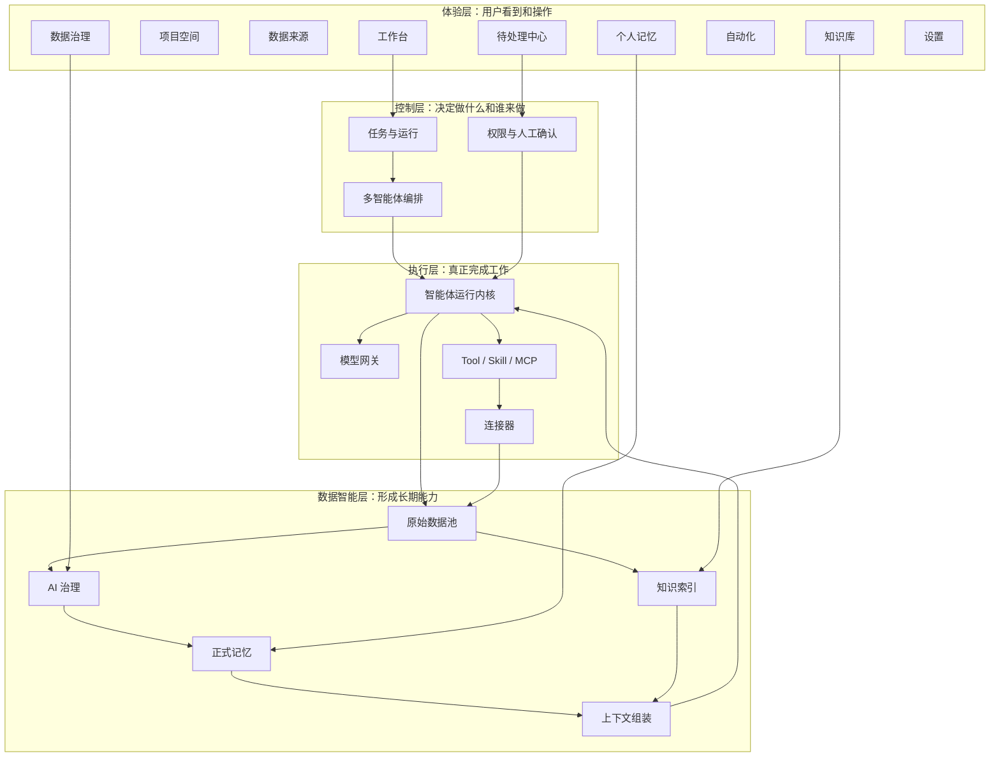

### 3.1 产品模块关系

| 产品模块 | 用户看到的价值 | 主要输入 | 主要输出 | 当前状态 |
|---|---|---|---|---|
| 工作台 | 让 AI 完成工作 | 用户目标、文件、上下文 | 回复、工具结果、产物 | 已可用 |
| 智能体系统 | 让不同角色协作 | TaskRun、AgentDefinition | AgentRun、事件、结果 | 部分可用 |
| 项目空间 | 按项目组织所有内容 | 任务、来源、记忆、知识的引用 | 项目聚合视图 | 待建设 |
| 连接器与能力 | 扩展 Smallink 能做什么 | 账户、Skill、MCP、工具 | 数据输入端口和动作能力 | 部分可用 |
| 数据来源 | 看清数据从哪里来 | 连接器、会话、运行、文件 | 原始记录、同步任务、水位 | 待打通主链 |
| 数据治理 | 从噪声中提炼价值 | 未治理原始记录 | 带来源的候选记忆 | 待打通主链 |
| 个人记忆 | 保存经过确认的长期结论 | 用户确认的候选 | 正式记忆、版本、关系 | 待打通主链 |
| 知识库 | 检索资料内容 | 文档、代码、会议、网页、产物 | 切片、索引、引用结果 | 待建设 |
| 自动化 | 按时间或事件自动工作 | 触发器、任务模板、权限 | 标准 TaskRun、通知 | 部分可用 |
| 待处理中心 | 集中处理需要人的决定 | 审批、问题、候选、失败 | 决策和恢复信号 | 审批链已可用 |
| 设置 | 配置系统运行方式 | 模型、智能体、外观、安全 | 生效配置和健康状态 | 已可用 |

## 4. 产品模块与流程图

### 4.1 工作台

职责：承接用户目标，展示对话、运行过程、工具调用、审批、子任务和产物。Conversation 只是交互历史；Task 才是持久目标，TaskRun 是一次执行尝试。

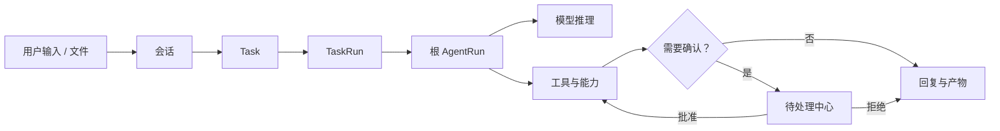

边界：工作台不直接写正式记忆，也不自己推断任务完成状态。

### 4.2 智能体系统

职责：管理角色定义、模型策略、能力范围、预算和委派；把一个 TaskRun 拆成一个或多个 AgentRun。

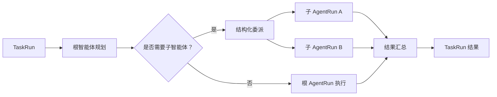

当前：根 Agent 与 Explorer 子 Agent 已能记录父子运行；通用依赖图、并行预算、父子取消尚未完整实现。

### 4.3 项目空间

职责：保存项目定义和关系，把分散在其他模块的数据按项目聚合。项目不复制原始数据、记忆或知识。

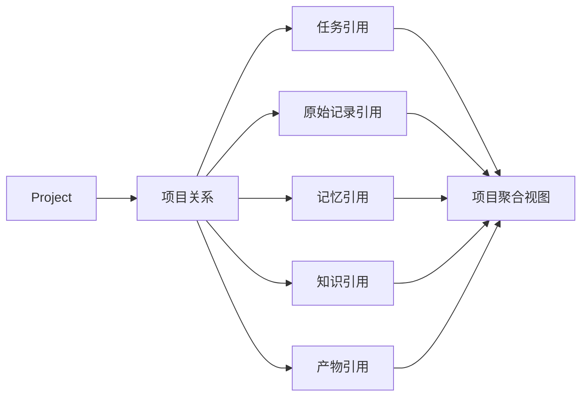

删除项目默认只删除关系，不删除被引用实体。

### 4.4 连接器与能力

职责：统一管理数据连接器、操作连接器、Tool、Skill 和 MCP。连接器有“同步数据”和“执行动作”两个端口。

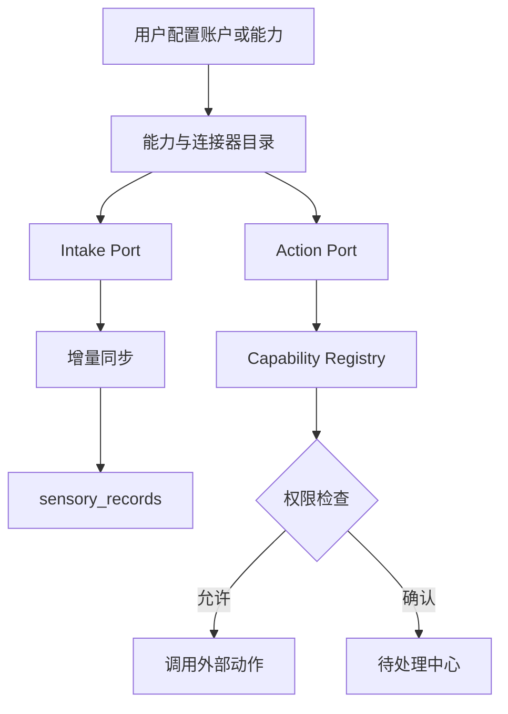

Skill Hub 当前支持发现、搜索、诊断、手动创建、完整文件夹导入、ZIP 压缩包导入和对话确认创建。导入保留 Skill 的脚本、配置、提示词、示例、模板和素材等完整普通文件结构，但不会在导入阶段执行脚本。

### 4.5 数据来源

职责：显示所有数据源、连接器实例、来源容器、同步任务、水位和原始记录。所有事实先进入原始池，不能直接进入正式记忆。

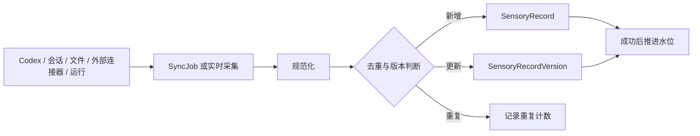

核心规则：先提交数据，再推进水位；重复同步不产生重复业务记录。

### 4.6 数据治理

职责：按未治理增量建立任务，让 AI 去噪、分组、合并并直接生成候选记忆，再由用户批量确认或忽略。

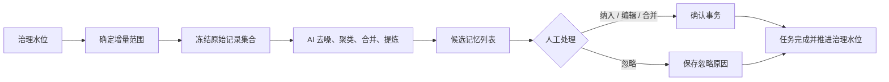

治理任务绑定来源、时间范围、记录集合、提示词版本和模型，不因刷新页面而重新计算。

### 4.7 个人记忆

职责：管理用户确认后的长期结论、版本、来源、关系和使用记录。候选不是正式记忆，智能体不能直接写正式记忆。

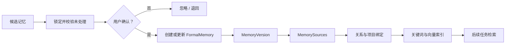

正式记忆类型包括用户偏好、项目背景、产品决策、思考过程、未解决问题、可复用方法、工作习惯、产物摘要、文档洞察和生活长期记忆。

### 4.8 知识库

职责：保存资料本身的可检索内容。Memory 记录“确认后的结论”，Knowledge 保存“可以引用的资料”。

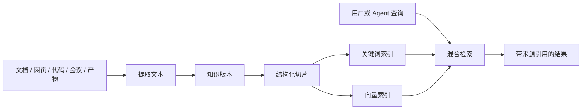

同一份文档可以进入知识库，同时经过治理产生候选记忆，但两者必须保存为不同语义对象。

### 4.9 自动化

职责：管理定时、事件、文件变化和 SelfWake 触发。自动化不拥有另一套执行引擎，每次触发都创建标准 TaskRun。

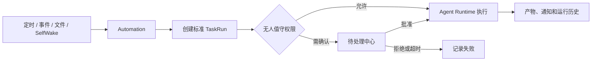

### 4.10 待处理中心

职责：把审批、问题、目录授权、计划确认、治理候选和失败恢复集中在一个地方。

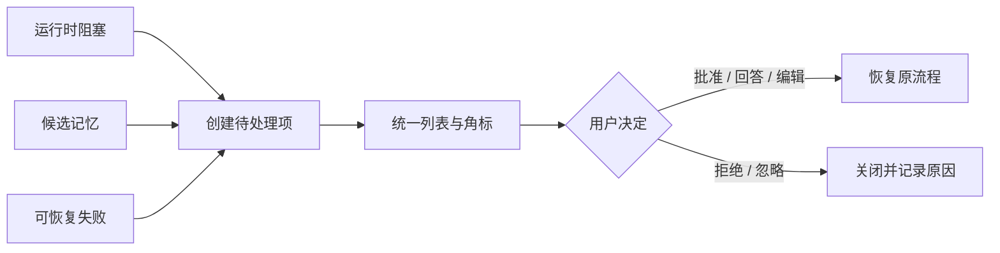

### 4.11 设置

职责：配置模型、智能体、提示词、外观、语言、数据与安全。连接器和 Skill Hub 已移动到“连接器与能力”模块。

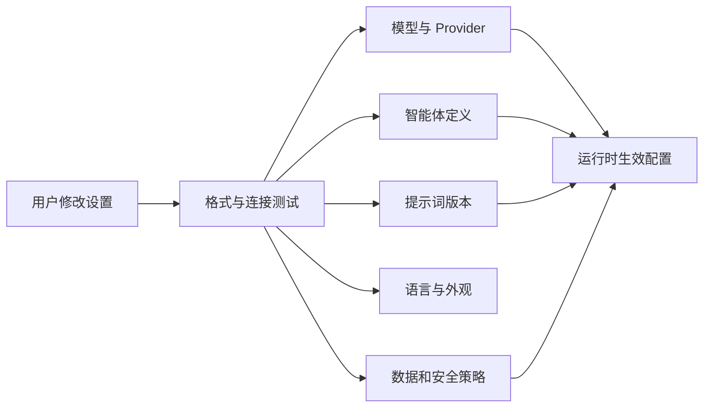

## 5. 三条端到端产品闭环

### 5.1 工作闭环

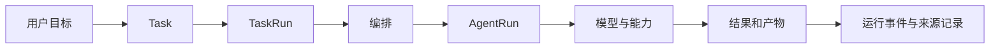

### 5.2 数据学习闭环

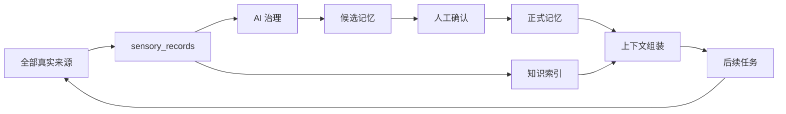

### 5.3 自动化闭环

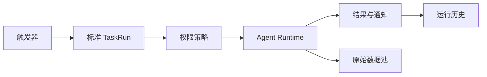

## 6. 技术总架构

Smallink 采用轻量模块化单体，而不是微服务集群。客户端、Core、数据库和本地文件构成一个个人可维护系统。

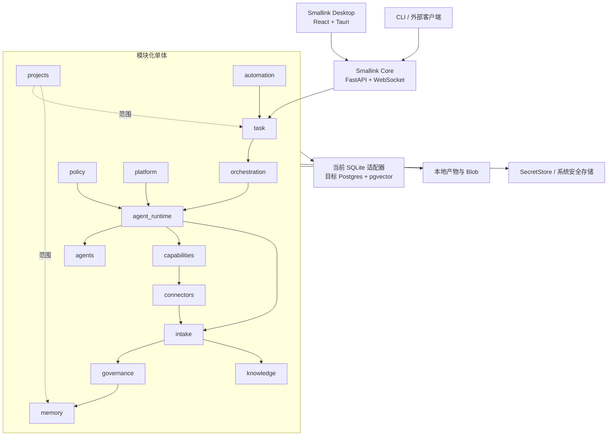

## 7. 技术模块与流程图

### 7.1 Desktop 客户端

技术：React + TypeScript + Tauri。REST 读取快照，WebSocket 接收增量，组件本地状态只负责临时交互。

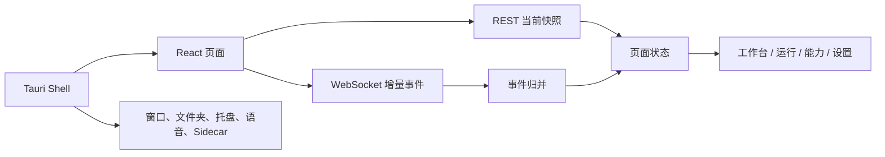

### 7.2 `task`

负责 Task、TaskRun、Conversation 和 Artifact 的持久状态，不调用模型。

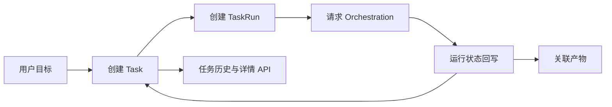

当前由 `SQLiteTaskRuntimeStore` 保存四张 `runtime_*` 表；目标切换为 Postgres Repository。

### 7.3 `agent_runtime`

核心是现有 `TurnEngine`，负责模型循环、工具调用、流式输出、中断、重试和运行事件。

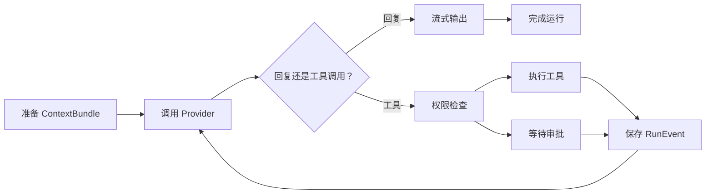

### 7.4 `orchestration`

负责拆解任务、父子运行、依赖、并行、重试、结果汇总和预算。

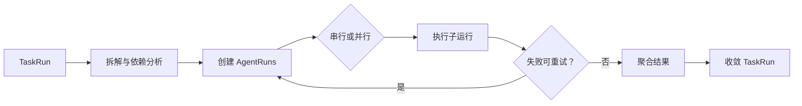

当前只有 Explorer 委派纵向切片，通用调度仍待建设。

### 7.5 `agents`

负责 Persona 和 AgentDefinition 的定义、版本、模型策略、能力策略、预算和数据范围。

```mermaid
flowchart LR
  Persona["用户可见 Persona"] --> Resolve["解析定义"]
  Resolve --> Version["冻结 AgentDefinition 版本"]
  Version --> Model["模型策略"]
  Version --> Capability["能力策略"]
  Version --> Budget["预算策略"]
  Version --> Runtime["启动 AgentRun"]
```

### 7.6 `capabilities`

把 Python Tool、Skill、MCP、连接器动作、文件、终端、Web 和子智能体委派统一成能力。

```mermaid
flowchart LR
  Sources["Tool / Skill / MCP / Connector"] --> Adapter["能力适配器"]
  Adapter --> Registry["Capability Registry"]
  Registry --> Schema["输入输出与风险元数据"]
  Schema --> Policy["Policy 决策"]
  Policy --> Invoke["执行"]
  Invoke --> Audit["调用结果与审计"]
```

Skill 的 `allowed-tools` 是依赖说明，不是授权。

### 7.7 `policy`

负责权限、目录授权、审批、无人值守、Standing Approval 和审计。

```mermaid
flowchart LR
  Request["Capability 请求"] --> Merge["合并用户 / 项目 / Task / Agent 策略"]
  Merge --> Risk["叠加能力风险元数据"]
  Risk --> Decision{"决策"}
  Decision -- "allow" --> Execute["执行"]
  Decision -- "require approval" --> Approval["创建审批"]
  Approval --> Inbox["Inbox"] --> Resume["批准后恢复"]
  Decision -- "deny" --> Audit["拒绝并审计"]
```

子智能体权限永远是父运行权限与自身策略的交集。

### 7.8 `connectors`

负责连接器定义、账户、来源容器、健康状态、同步游标和外部动作。

```mermaid
flowchart LR
  Account["账户授权"] --> Instance["ConnectorInstance"]
  Instance --> Health["健康检查"]
  Instance --> DataPort["DataConnector"]
  Instance --> ActionPort["ActionConnector"]
  DataPort --> Intake["Intake"]
  ActionPort --> Registry["Capability Registry"]
  Registry --> Policy["Policy"] --> External["外部系统"]
```

### 7.9 `intake`

负责接收所有原始事实、规范化、版本、去重、同步任务和水位。

```mermaid
flowchart LR
  Input["原始输入"] --> Normalize["标准元数据"]
  Normalize --> Key["dedupe_key + external_version"]
  Key --> Check{"新记录 / 更新 / 重复"}
  Check -- "新记录" --> Record["sensory_records"]
  Check -- "更新" --> Version["sensory_record_versions"]
  Check -- "重复" --> Metrics["重复计数"]
  Record --> Event["sensory_record.ingested"]
  Version --> Event
```

当前该模块是最高优先级的数据底座，但正式主链尚未完成。

### 7.10 `governance`

负责按增量原始记录运行 AI 治理并产生带来源候选，不能直接写正式记忆。

```mermaid
flowchart LR
  Pending["未治理记录"] --> Task["GovernanceTask"]
  Task --> Context["组装批次上下文"]
  Context --> AI["治理模型"]
  AI --> Candidate["MemoryCandidate"]
  Candidate --> Sources["CandidateSources"]
  Sources --> Decision["用户决策"]
  Decision --> Watermark["推进治理水位"]
```

### 7.11 `memory`

负责正式记忆、版本、来源、关系、项目绑定、检索和使用事件。

```mermaid
flowchart LR
  Confirm["确认候选"] --> Tx["数据库事务"]
  Tx --> Memory["memories"]
  Tx --> Version["memory_versions"]
  Tx --> Source["memory_sources"]
  Tx --> Decision["governance_decisions"]
  Tx --> Outbox["memory.confirmed"]
  Memory --> Retrieve["关键词 + 向量 + 范围检索"]
```

当前 `SQLiteMemoryStore` 只是过渡能力，不等于正式记忆事务已经完成。

### 7.12 `knowledge`

负责资料版本、切片、Embedding、来源和带引用检索。

```mermaid
flowchart LR
  Item["KnowledgeItem"] --> Version["KnowledgeVersion"]
  Version --> Extract["文本提取"] --> Chunk["KnowledgeChunk"]
  Chunk --> Embed["Embedding"]
  Query["查询"] --> Hybrid["关键词 + 向量混合检索"]
  Chunk --> Hybrid
  Embed --> Hybrid
  Hybrid --> Citation["引用来源与版本"]
```

### 7.13 `projects`

负责项目定义和跨模块关系，只保存 ID 引用。

```mermaid
flowchart LR
  Project["projects"] --> Folders["project_folders"]
  Project --> Bindings["project_bindings"]
  Bindings --> Task["Task ID"]
  Bindings --> Record["SensoryRecord ID"]
  Bindings --> Memory["Memory ID"]
  Bindings --> Knowledge["KnowledgeItem ID"]
```

### 7.14 `automation`

负责触发器、自动运行、SelfWake、队列、重试和通知。

```mermaid
flowchart LR
  Trigger["AutomationTrigger"] --> Queue["job_queue"]
  Queue --> Attempt["job_attempt"]
  Attempt --> Task["创建 TaskRun"]
  Task --> Runtime["标准运行主链"]
  Runtime --> History["automation_runs"]
  History --> Retry{"失败重试？"}
  Retry -- "是" --> Queue
```

### 7.15 `platform`

负责 Provider、Secret、系统设置、数据库连接、事件分发和健康检查。

```mermaid
flowchart LR
  Settings["系统与用户设置"] --> Router["ProviderRouter"]
  Secrets["SecretStore"] --> Router
  Router --> Model["OpenAI 协议 / 本地或云模型"]
  DB["数据库连接"] --> Modules["业务模块"]
  Modules --> Outbox["Outbox Dispatcher"] --> WS["WebSocket"]
  Health["Health Check"] --> Desktop["Desktop 状态"]
```

### 7.16 存储与事件基础设施

目标是一个 Postgres + pgvector、一个受控本地 Blob 目录和一个安全密钥存储，不引入 Redis、Kafka 或 Kubernetes。

```mermaid
flowchart LR
  Command["业务命令"] --> Tx["Postgres 事务"]
  Tx --> State["业务表"]
  Tx --> Outbox["Outbox"]
  Outbox --> Dispatcher["事件分发"]
  Dispatcher --> WS["客户端增量"]
  Dispatcher --> Worker["后台处理"]
  Artifact["大文件与产物"] --> Blob["本地 Blob 目录"]
  Secret["凭据"] --> Keychain["系统安全存储"]
```

## 8. 核心数据对象

```mermaid
erDiagram
  CONVERSATION ||--o{ TASK : "承载"
  TASK ||--o{ TASK_RUN : "多次执行"
  TASK_RUN ||--o{ AGENT_RUN : "包含"
  AGENT_RUN ||--o{ RUN_EVENT : "产生"
  AGENT_RUN ||--o{ ARTIFACT : "生成"
  CONNECTOR ||--o{ SYNC_JOB : "执行"
  SYNC_JOB ||--o{ SENSORY_RECORD : "写入"
  GOVERNANCE_TASK }o--o{ SENSORY_RECORD : "治理"
  GOVERNANCE_TASK ||--o{ MEMORY_CANDIDATE : "生成"
  MEMORY_CANDIDATE }o--o{ SENSORY_RECORD : "引用"
  MEMORY_CANDIDATE o|--o| FORMAL_MEMORY : "确认形成"
  FORMAL_MEMORY ||--o{ MEMORY_VERSION : "保留版本"
  KNOWLEDGE_ITEM ||--o{ KNOWLEDGE_CHUNK : "切片"
  PROJECT }o--o{ TASK : "关联"
  PROJECT }o--o{ FORMAL_MEMORY : "关联"
  PROJECT }o--o{ KNOWLEDGE_ITEM : "关联"
```

必须始终区分：

- Conversation 是聊天历史，Task 是目标。
- TaskRun 是一次尝试，AgentRun 是一个智能体的一次实际执行。
- SensoryRecord 是原始事实，CandidateMemory 是 AI 建议。
- FormalMemory 是用户确认的结论，KnowledgeItem 是资料内容。

## 9. 一次任务的完整技术时序

```mermaid
sequenceDiagram
  participant U as 用户
  participant D as Desktop
  participant T as Task
  participant O as Orchestration
  participant R as Agent Runtime
  participant P as Policy
  participant C as Capability
  participant I as Intake
  participant DB as Database

  U->>D: 输入目标
  D->>T: 创建 Task / TaskRun
  T->>DB: 保存初始状态
  T->>O: 请求运行
  O->>R: 创建根 AgentRun
  R->>DB: 保存 RunEvent
  R->>R: 调用模型
  R->>P: 提议能力调用
  alt 允许
    P->>C: 执行能力
    C-->>R: 返回结果
  else 需要确认
    P-->>D: 创建审批
    U->>D: 批准或拒绝
    D->>R: 恢复运行
  end
  R->>DB: 保存结果与产物
  R->>I: 发送输入、输出、工具和产物原始记录
  R-->>D: 推送已持久化事件
  D-->>U: 展示结果
```

## 10. 当前代码映射

| 代码位置 | 当前职责 |
|---|---|
| `surfaces/gui/` | React/Tauri 客户端 |
| `smallink/server/` | FastAPI、WebSocket、SessionManager 和 REST 控制面 |
| `smallink/engine.py` | TurnEngine 运行循环 |
| `smallink/task/` | Task、TaskRun、AgentRun、RunEvent 和 SQLite 适配器 |
| `smallink/agents/`、`smallink/personas/` | 智能体和 Persona |
| `smallink/tools/` | 文件、终端、Git、计划、提问和子智能体工具 |
| `smallink/skills/` | SkillLoader、SkillStore 和 Agent Skill 工具 |
| `smallink/mcp/` | MCP Server 管理和 Tool 适配 |
| `smallink/connectors/` | 连接器账户、同步和外部动作 |
| `smallink/providers/` | 模型 Provider 与路由 |
| `smallink/memory/` | 当前基础 MemoryStore 适配 |
| `smallink/automation/` | 自动化任务、调度和工具 |

目标中的 `intake`、`governance`、正式 `knowledge`、`projects` 和 Postgres Repository 尚未形成完整正式目录，这也是下一阶段的主要建设内容。

## 11. 推荐建设顺序

```mermaid
flowchart LR
  Intake["1. 打通 sensory_records"] --> Provider["2. 稳定 AI Provider 治理调用"]
  Provider --> Governance["3. 候选记忆治理闭环"]
  Governance --> Memory["4. 正式记忆事务与检索"]
  Memory --> Tree["5. 记忆关系树可视化"]
  Tree --> Knowledge["6. 知识库与混合检索"]
  Knowledge --> Postgres["7. Postgres 成为唯一事实源"]
```

当前最重要的架构原则仍然是：先保存全部真实原始事实，再让 AI 提炼；AI 只能生成候选，正式记忆必须由用户确认；所有自动化和多智能体最终走同一 TaskRun、Policy、Agent Runtime 和事件链。
