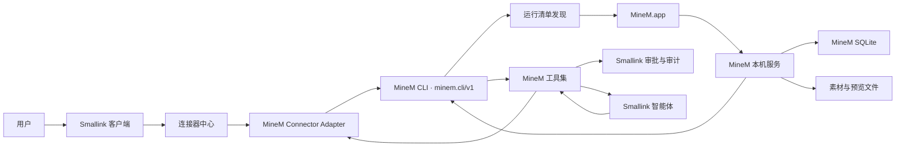

# Smallink × MineM 客户端连接器设计

> 状态：第一阶段已实现并完成真实 MineM 联调
> 更新日期：2026-07-30
> 范围：只打通同一台 Mac 上的 Smallink 客户端与 MineM 客户端，不复制 MineM 数据库，不建设云端中转

## 1. 设计结论

MineM 应作为 Smallink 的“本机能力型连接器”，而不是普通账号型连接器。

首版采用以下边界：

1. Smallink 通过 MineM 客户端随包提供的 CLI 连接 MineM。
2. MineM 继续拥有素材、数据库、文件、版本、编排和导出结果。
3. Smallink 只保存连接状态和本地客户端元数据，不复制 MineM 的素材库。
4. Smallink 智能体按需搜索、读取或提交操作，结果中保留 MineM 素材编号和预览链接。
5. 写操作继续经过 Smallink 的工具审批和审计，不向模型暴露任意 CLI 或任意 HTTP 请求能力。

这是一种“联邦查询”设计：数据仍留在原产品，Smallink 需要时再读取，而不是先把全部数据同步一份。

## 2. 项目走查结论

### 2.1 MineM 当前可复用能力

MineM 主项目位于独立仓库，例如：

```text
../minem
```

已经具备：

- React + TypeScript 主界面。
- Tauri 2 macOS 客户端。
- 客户端托管的 Python sidecar 服务。
- SQLite 与本地素材文件目录。
- 动态端口与 `runtime/service.json` 服务发现。
- 可安装的 `minem` CLI。
- 稳定的 `minem.cli/v1` JSON 输出。
- `agent capabilities` 能力发现。
- 素材搜索、详情、版本、来源关系、导入、汇报创建和编排等命令。

本机走查快照：

| 项目 | 当前值 |
| --- | --- |
| 客户端 | `/Applications/MineM.app` |
| 客户端版本 | `0.5.0-alpha.28` |
| API 版本 | `1` |
| CLI | `~/.local/bin/minem` |
| 当前服务 | `http://127.0.0.1:8790` |
| 运行清单 | `~/Library/Application Support/MineM/runtime/service.json` |
| 可见素材 | 1,528 |
| 汇报素材 | 14 |
| 页面素材 | 433 |
| 资源素材 | 1,081 |

真实执行以下命令已经成功：

```bash
minem status --output json --no-input
minem agent capabilities --output json --no-input
minem asset list --type page --limit 2 --output json --no-input
```

### 2.2 Smallink 当前可复用能力

Smallink 已经具备完整的连接器外壳：

- 服务端连接器描述符。
- 连接、断开、状态列表和工具开关 API。
- 客户端连接器列表、详情页和连接弹窗。
- 每个连接器独立的工具清单。
- 读写工具风险分级。
- 写工具执行前确认。
- 会话和智能体级连接器开关。
- 工具调用审计。

因此 MineM 不需要重新建设一套连接器中心，只需要新增：

- MineM 本地客户端发现器。
- MineM CLI 适配器。
- MineM 工具实现。
- MineM 连接器详情页。
- MineM 图标与中英文文案。

### 2.3 当前差距

MineM 技术文档规划了客户端会话令牌，但当前 `service.json` 只包含地址、端口、PID、版本和托管状态，没有写入令牌。普通素材 API 目前依赖 `127.0.0.1` 边界，并未统一鉴权。

能力发现目前也不是完整的动态工具协议：

- `agent capabilities` 会列出 `report.pages` 等能力。
- `agent schema report.pages` 当前返回 `NOT_FOUND`。
- 当前只有部分写入和搜索能力注册了参数 Schema。

因此 Smallink 首版不能根据 MineM 能力列表自动生成全部工具。工具名称和参数必须在 Smallink 中白名单定义，并通过当前 MineM CLI 做合约测试；等 MineM 的 Schema 注册表覆盖全部能力后，再考虑动态生成。

真实 `report pages` 返回也包含每页完整素材对象。54 页汇报的单次 JSON 结果超过 30 KB，而且简表中的 `code` 当前为空，真实页面编号位于 `control.asset_code`。Smallink 适配器必须：

- 只保留页序、页面编号、标题、状态和预览链接。
- 使用 `control.asset_code` 补齐页面编号。
- 限制返回条数和字符数。
- 不把完整内部字段直接送入模型。

因此首版不直接把 MineM HTTP API 作为 Smallink 的长期公共契约，而是使用已经稳定的 CLI：

- CLI 会自动发现动态端口。
- CLI 能在 MineM 未运行时唤起客户端。
- CLI 对结果做了统一 JSON 封装。
- CLI 已定义错误码、确认参数和引用解析规则。
- Smallink 不需要依赖 MineM 的内部路由和数据库结构。

## 3. 产品定位

连接器名称：`MineM`

一句话说明：

> 让 Smallink 智能体搜索、读取并整理 MineM 中的汇报、页面和资源素材。

首版不是：

- MineM 数据同步器。
- MineM 数据库浏览器。
- MineM 前端的内嵌复制品。
- 任意命令执行入口。
- MineM 内部 Agent Runtime 的开放入口。

## 4. 客户端体验

### 4.1 连接器卡片状态

| 状态 | 卡片文案 | 主操作 |
| --- | --- | --- |
| 未安装 | 未检测到 MineM 客户端 | 定位客户端 |
| 已安装未运行 | MineM 已安装 | 启动并连接 |
| 启动中 | 正在启动 MineM | 等待 |
| 已连接 | 已连接 · v0.5.0-alpha.23 | 查看详情 |
| 版本不兼容 | 需要更新 MineM | 打开 MineM |
| 服务异常 | MineM 服务不可用 | 重新连接 |
| 用户断开 | 已暂停 | 重新启用 |

### 4.2 连接动作

用户点击“启动并连接”后：

1. Smallink 验证 MineM.app 和 CLI 是否存在。
2. 运行只读 `minem status`。
3. 如果 MineM 未运行，由 MineM CLI 后台唤起 MineM.app。
4. CLI 读取动态运行清单并等待 MineM 服务就绪。
5. Smallink 校验 `product=MineM`、`apiVersion=1` 和 CLI Schema。
6. Smallink 记录本机连接配置，刷新连接器卡片。

连接过程不要求用户填写：

- 端口。
- Token。
- 数据目录。
- SQLite 路径。
- Python 或 Docker 地址。

### 4.3 详情页

详情页显示：

- 客户端路径。
- CLI 路径。
- MineM 版本。
- API 与 CLI Schema 版本。
- 当前健康状态。
- 可见汇报、页面和资源数量。
- 最近检查时间。
- 已启用工具。

详情页操作：

- 打开 MineM。
- 重新检查。
- 暂停连接。
- 管理工具。

不显示 MineM 的完整素材列表。素材查询由聊天和智能体工具按需完成，避免把连接器详情页变成第二个 MineM。

## 5. 目标架构



### 5.1 数据所有权

| 数据 | 唯一事实源 |
| --- | --- |
| 汇报、页面、资源、版本、来源关系 | MineM |
| MineM 文件和预览 | MineM |
| MineM 导入与导出任务 | MineM |
| 连接是否启用 | Smallink |
| MineM 工具开关 | Smallink |
| Smallink 工具审批与调用审计 | Smallink |
| 对话和智能体运行记录 | Smallink |

## 6. 连接协议

### 6.1 CLI 解析优先级

```text
1. /Applications/MineM.app/Contents/Resources/sidecar/minem-server --cli
2. ~/.local/bin/minem
3. 用户显式选择的 MineM.app
```

优先使用应用包内 sidecar，避免 `PATH` 中的同名程序劫持调用。使用用户 CLI 时必须检查：

- 文件属于当前用户。
- 文件不是符号链接到未知位置。
- 文件不可被其他用户写入。
- 启动后返回的产品名必须是 `MineM`。

### 6.2 进程调用规则

- 使用参数数组执行，禁止 `shell=True`。
- 工具实现只允许调用代码中定义的命令组合。
- 不接受模型传入完整命令字符串。
- 每次调用设置超时和最大输出长度。
- stdout 只解析 JSON；stderr 只进入脱敏诊断。
- 校验 `schemaVersion=minem.cli/v1`。
- 保留 `requestId`、素材编号和任务编号用于审计。

### 6.3 连接配置

Smallink 只保存：

```json
{
  "type": "local_app",
  "enabled": true,
  "appPath": "/Applications/MineM.app",
  "cliPath": "/Applications/MineM.app/Contents/Resources/sidecar/minem-server",
  "expectedApiVersion": 1,
  "connectedAt": "2026-07-30T00:00:00Z"
}
```

不保存：

- 当前端口。
- 数据库路径。
- 用户素材内容。
- CLI 返回的完整大对象。

端口每次通过 MineM 自己的运行时发现机制获取，不能缓存为长期连接配置。

## 7. 首版工具范围

### 7.1 P0：连接与只读

| Smallink 工具 | MineM 能力 | 风险 |
| --- | --- | --- |
| `minem_status` | `status` | 只读 |
| `minem_search_assets` | `asset search/list` | 只读 |
| `minem_get_asset` | `asset get` | 只读 |
| `minem_get_report_pages` | `report pages` | 只读 |
| `minem_get_versions` | `asset versions` | 只读 |
| `minem_get_lineage` | `asset lineage` | 只读 |

只读结果默认只返回：

- `id`
- `code`
- `type`
- `title`
- `version`
- `updatedAt`
- `previewUrl`
- 必要的来源和引用摘要

不得把完整 HTML、二进制文件或超长素材正文直接送入模型。

### 7.2 P0.5：最小写入闭环

| Smallink 工具 | MineM 能力 | Smallink 行为 |
| --- | --- | --- |
| `minem_import_material` | `import report/page`、`case import` | 校验本地路径，执行前确认 |
| `minem_create_report` | `report create` | 展示页面编号和目标名称，执行前确认 |

导入工具只能读取：

- 当前 Smallink 工作区。
- 用户已经授权的文件夹。
- 用户在当前任务中明确选择的附件。

### 7.3 后续再做

- 页面 JSON 构建与发布。
- 汇报页面插入、替换、移动、隐藏和移出。
- 导出 HTML/PDF。
- 素材重命名。
- 删除、合并和批量治理。
- MineM MCP。
- MineM 素材主动同步到 Smallink 记忆。

这些能力不是首版客户端连接的必要条件。

## 8. Smallink 代码模块设计

```text
smallink/connectors/
  descriptors.py          # 增加 MineM 描述符
  catalog_copy.py         # 关于与访问说明
  tool_defs.py            # MineM 工具与读写级别
  minem_client.py         # CLI 发现、调用、Schema 校验
  integration_tools.py   # 模型可调用的 MineM 白名单工具
  setup.py                # 动态连接状态

smallink/server/
  app.py                  # 复用通用 connect/disconnect 路由
  manager.py              # 复用通用连接器状态与工具装配

surfaces/gui/src/
  connectors/registry.tsx
  components/connectors/AddConnectionModal.tsx
  components/connectors/ConnectorsSection.tsx
  components/connectors/ConnectorsList.tsx
  api.ts
  i18n.tsx
```

### 8.1 连接器描述符

MineM 不能使用当前 `auth="none"` 的内置连接逻辑，因为该逻辑会永久显示为已连接，无法表达“未安装、未运行、版本不兼容”。

建议新增：

```text
auth = "local_app"
```

`local_app` 表示：

- 不需要账号凭证。
- 连接状态来自本机应用发现和健康检查。
- 可以启动目标应用。
- 可以因客户端卸载或版本变化转为异常状态。

### 8.2 服务端状态字段

`GET /v1/connectors` 中 MineM 增加：

```json
{
  "name": "minem",
  "connected": true,
  "auth": "local_app",
  "health": "running",
  "app_installed": true,
  "app_version": "0.5.0-alpha.28",
  "api_version": 1,
  "visible_asset_count": 1528
}
```

连接器列表通过 `runtime/service.json` 和 PID 做被动检查，不运行 CLI，
因此打开设置或刷新卡片不会启动 MineM。只有显式连接或智能体实际调用工具时
才运行 CLI；CLI 自己负责动态端口发现和必要时启动 MineM。

## 9. 安全与确认

### 9.1 必须遵守

- 不读取 MineM SQLite。
- 不扫描 MineM 素材目录。
- 不暴露任意 CLI、Shell 或 HTTP 工具。
- 不允许模型指定可执行程序路径。
- 不持久化动态端口。
- 不把 MineM 大段素材正文默认写入 Smallink 记忆。
- 写操作必须进入 Smallink 审批。
- 所有调用写入 Smallink 审计，记录连接器、工具、对象编号、结果状态和 MineM `requestId`。
- 审计日志不记录完整素材正文和本机私有绝对路径。

### 9.2 当前 MineM 限制

MineM 的普通本地素材 API 当前没有统一会话令牌。虽然只监听 `127.0.0.1`，同一用户会话中的其他本机进程仍可能访问。

这不阻塞首版 CLI 连接器，但如果后续改为直接 HTTP、流式任务或 MCP，必须先在 MineM 中完成：

1. 服务启动时生成会话令牌。
2. 令牌以当前用户权限写入运行清单或独立文件。
3. 所有外部能力 API 强制鉴权。
4. 写操作使用预检、一次性确认令牌和幂等键。

## 10. 异常处理

| 异常 | 处理 |
| --- | --- |
| MineM 未安装 | 显示定位客户端，不尝试下载未知软件 |
| MineM 未运行 | CLI 后台启动 MineM 并等待 |
| `8790` 被占用 | 由 MineM 选择动态端口，Smallink 不干预 |
| 运行清单过期 | 重新运行 `status`，不复用旧端口 |
| CLI Schema 不兼容 | 禁用工具，提示更新 MineM |
| MineM 服务中断 | 当前调用失败，连接器标记离线，可重试 |
| 素材引用不唯一 | 返回候选列表，不猜测目标 |
| 写操作需要确认 | Smallink 审批通过后再传 MineM `--confirm` |
| 异步任务超时 | 返回 MineM 任务编号，允许稍后查询 |
| 预览链接失效 | 先确保 MineM 服务在线，再重新获取素材 |

## 11. 验收标准

### 11.1 连接

1. MineM 已运行时，Smallink 5 秒内显示已连接。
2. MineM 未运行时，点击连接能够启动 MineM 并完成握手。
3. MineM 使用非 8790 端口时仍可连接。
4. MineM 未安装时给出明确状态，不显示空白或永久加载。
5. 暂停连接后，新的 Smallink 会话不再获得 MineM 工具。

### 11.2 工具

1. 可以搜索并返回真实 MineM 素材编号。
2. 可以读取汇报页面、版本和来源关系。
3. 只读工具不弹确认。
4. 导入和创建汇报必须确认。
5. 未授权路径不能导入。
6. 模型无法传入任意 CLI 参数。
7. 每次调用在 Smallink 审计中可追踪到 MineM `requestId`。

### 11.3 数据

1. 连接后 Smallink 不新增 MineM 全库副本。
2. MineM 素材数量和版本关系保持不变。
3. MineM 升级或切换动态端口后连接能够恢复。
4. 断开 Smallink 不会关闭或删除 MineM 数据。

## 12. 推荐实施顺序

1. 实现 `minem_client.py` 和只读 CLI 合约测试。
2. 增加 `local_app` 连接器类型和动态健康状态。
3. 完成 MineM 连接器卡片与详情页。
4. 接入六个只读工具和 Smallink 审计。
5. 使用本机 MineM `0.5.0-alpha.28` 做真实联调。
6. 再加入导入素材和创建汇报两个写工具。
7. 后续根据真实使用频率决定是否接入更完整的编排能力。

## 13. 2026-07-30 实施记录

第一阶段已经落地：

- 新增 `auth="local_app"`，MineM 不再被错误当作永久在线的内置连接器。
- “启动并连接 MineM”调用 MineM CLI；不直接访问 HTTP 私有路由或 SQLite。
- 客户端显示 MineM 已连接、运行中或已停止，以及已连接版本。
- 智能体获得 6 个只读白名单工具：状态、搜索、详情、报告页面、版本、来源关系。
- CLI 返回经过条数、深度、字符串长度和敏感字段限制后才进入模型上下文。
- 工具沿用 Smallink 连接器开关、会话过滤和统一审计链路；只读工具不弹审批。
- 完整 Python 回归 917 项通过、1 项跳过；完整前端回归 88 项通过，生产构建通过。
- 真实 MineM `0.5.0-alpha.28` 联调通过；状态返回 1,528 项可见素材，6 个只读工具全部成功。
- 安装包内 sidecar 在临时端口 `52873` 完成 API 验收，连接状态持久化为
  `connected=true`、`enabled=true`、`health=running`。

本阶段没有实现导入、创建汇报和其他写操作。第 7.2 节中的写工具仍属于下一阶段，
不能在客户端或工具目录中显示为已可用。
