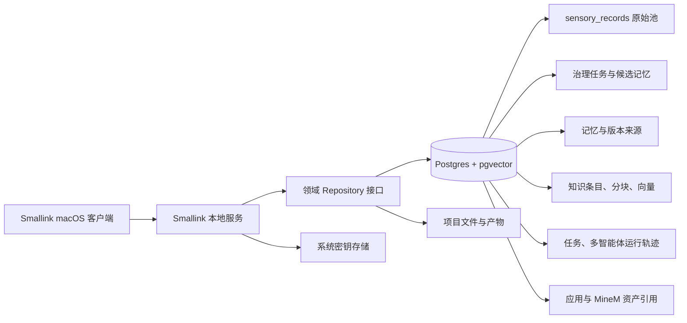

# Smallink Postgres 迁移运行手册

文档版本：1.0
更新日期：2026-08-21
状态：迁移设计已冻结，尚未执行生产切换

## 1. 目标

把 Smallink 的业务事实数据从本地 SQLite/JSON 逐步迁移到 Postgres，使 Postgres 成为唯一事实源，同时保留本地优先、单人使用、低维护成本和可回滚能力。

本次迁移不改变产品领域边界：

- 原始数据进入 `sensory_records`，治理始终保留来源与处理轨迹。
- 知识、记忆、会话、项目、任务、应用资产和审计记录分别存储，不混成一张通用表。
- 密钥继续进入系统钥匙串或受限文件，不写入普通数据库表。
- 对话正文当前仍是 append-only JSONL；必须完成校验和影子读取后才能切换。

## 2. 当前事实源清单

### 2.1 `link.db`

| 领域 | 表 |
|---|---|
| 会话与项目 | `sessions`、`workspaces`、`projects` |
| 原始数据池 | `sensory_records` |
| 数据治理 | `governance_tasks`、`governance_task_records`、`memory_candidates`、`candidate_sources`、`governance_decisions` |
| 记忆 | `memories`、`memory_history`、`memory_versions`、`memory_sources`、`memory_usage` |
| 知识 | `knowledge_items`、`knowledge_versions`、`knowledge_chunks`、`knowledge_chunks_fts` |
| 运行中心 | `runtime_tasks`、`runtime_task_runs`、`runtime_agent_runs`、`runtime_agent_run_events` |
| 应用中心 | `app_instances`、`app_capability_runs`、`app_asset_refs` |
| 连接器同步 | `connector_sync_jobs`、`connector_sync_watermarks` |
| 审计 | `audit_events` |

### 2.2 `automation.db`

- `scheduled_tasks`
- `task_runs`

### 2.3 文件数据

- `conversations/<session_id>.jsonl`：对话消息正文，追加写入。
- `personas.json`、`inbox.json`、`inbox_routing.json`、`unattended.json`、`wakes.json`。
- `subscriptions.json`、`channels.json`、`mention_threads.json`、`parked.json`、`unrouted.json`。
- `people.json`、`persona_connections.json`、`session_connections.json`、`prefs.json`。
- 工作空间中的项目文件、产物和 Skill 文件继续保留在文件系统，只把索引、版本和来源关系写入数据库。

### 2.4 不进入普通数据库的数据

- Provider、MCP、连接器凭证。
- API key、OAuth token、会话令牌。
- `sidecar-<port>.token` 等本机进程鉴权信息。

这些数据继续由 macOS Keychain、Windows Credential Locker、Linux Secret Service 或 `0600` 兼容文件管理。

## 3. 目标架构

单机默认用一个 Postgres 容器和一个数据库，不拆微服务。数据库扩展只启用 `vector`；全文检索使用 Postgres 自带 `tsvector`/GIN。

## 4. 目标 Schema 规则

### 4.1 命名与类型

- 现有字符串 ID 原样保留，避免迁移时重写外键。
- 时间统一使用 `TIMESTAMPTZ`，导入时按原始 ISO 8601/UTC 解析。
- JSON 字段改为 `JSONB`，但领域关键字段继续使用独立列。
- 布尔值从 SQLite `INTEGER` 映射为 `BOOLEAN`。
- `memory_id` 等自增 ID 使用 `BIGINT GENERATED BY DEFAULT AS IDENTITY`，并在导入后校准 sequence。
- 所有外键在 staging 导入完成后统一验证，避免导入顺序造成误报。

### 4.2 知识检索

`knowledge_chunks` 增加：

- `search_vector TSVECTOR`：关键词和全文召回。
- `embedding VECTOR(<provider_dimension>)`：语义召回。
- `embedding_model TEXT`、`embedded_at TIMESTAMPTZ`：支持重建和模型升级。

排序分数由关键词、向量相似度、项目范围、时间和来源可信度共同组成，并返回每项分数与引用源，不能只返回一个不可解释的总分。

### 4.3 对话正文

新增 `conversation_messages`：

| 字段 | 说明 |
|---|---|
| `message_id` | 稳定 ID；旧 JSONL 迁移时由 `session_id + ordinal + content_hash` 生成 |
| `session_id` | 所属会话 |
| `ordinal` | 会话内顺序，唯一约束 `(session_id, ordinal)` |
| `role` | `user`、`assistant`、`tool`、`system` |
| `content_json` | 原始结构化消息 |
| `content_text` | 便于检索和治理的可读文本 |
| `created_at` | 原始时间；缺失时记录迁移时间并写明 metadata |
| `content_hash` | 幂等和校验 |

切换前 JSONL 继续保留为只读备份；切换完成且观察期通过后再停止写入。

## 5. Repository 边界

先抽象领域接口，再增加 Postgres 实现：

- `ConversationRepository`
- `ProjectRepository`
- `SensoryRepository`
- `GovernanceRepository`
- `MemoryRepository`
- `KnowledgeRepository`
- `RuntimeRepository`
- `AutomationRepository`
- `AppRepository`
- `ConnectorSyncRepository`
- `AuditRepository`

`SessionManager` 只接收这些接口，不直接知道 SQLite 或 Postgres。配置项 `SMALLINK_STORAGE_BACKEND=sqlite|postgres` 控制装配；默认值在正式切换前保持 `sqlite`。

## 6. 迁移步骤

### 阶段 A：盘点与冻结

1. 停止写入 1 至 3 分钟，等待进行中的会话、治理和自动化任务结束。
2. 记录 Smallink 版本、schema 版本、数据库路径和文件清单。
3. 对 `link.db`、`automation.db` 执行 `PRAGMA integrity_check`。
4. 对每张表记录行数、主键最小/最大值和稳定 checksum。
5. 对每个 JSONL/JSON 文件记录大小、行数和 SHA-256。

任何 integrity check 失败都必须停止迁移。

### 阶段 B：一致性快照

1. 使用 SQLite backup API 生成快照，不能直接复制正在 WAL 写入的数据库文件。
2. 把 JSONL/JSON、版本清单和 checksum 放入同一个只读快照目录。
3. 对快照再次校验，并保存 `migration-manifest.json`。
4. 原始快照至少保留到 Postgres 切换后两个稳定版本。

### 阶段 C：Staging 导入

1. 创建 `smallink_staging` schema。
2. 按父表到子表顺序批量导入。
3. JSON 文本在导入前解析；解析失败进入隔离表，不得静默丢弃。
4. JSONL 消息按原始行号导入 `conversation_messages`。
5. 导入后校准 identity sequence，建立索引，再验证外键。
6. 比对表行数、内容 checksum、孤儿外键和唯一约束冲突。

### 阶段 D：影子读取

1. SQLite 仍是写入事实源。
2. 每次关键读取同时从 Postgres 获取结果，但只把 SQLite 结果返回给用户。
3. 对项目列表、会话、原始池、治理任务、记忆、知识检索和运行轨迹记录差异。
4. 连续运行至少 7 天；关键实体差异率必须为 0，排序型检索差异必须在批准阈值内。

### 阶段 E：受控双写

1. 启用 outbox：同一 SQLite 事务记录业务写入和待同步事件。
2. 后台 worker 幂等写入 Postgres，成功后确认 outbox。
3. 禁止在两个数据库间直接做无事务的顺序双写。
4. 监控积压量、最长延迟、失败率和重试次数。

### 阶段 F：切换

1. 再次短暂停写并清空 outbox。
2. 执行最终 checksum 和关键 API 对比。
3. 把读取切到 Postgres，观察一个发布周期。
4. 把写入切到 Postgres；SQLite 降为只读回滚快照。
5. 更新 `schema_version` 和迁移审计事件。

### 阶段 G：收尾

1. 两个稳定版本后删除双写代码。
2. 保留导出与恢复工具，不删除用户快照。
3. `generated snapshot` 只能作为兼容导入格式，不能继续成为运行时事实源。

## 7. 回滚

触发条件包括：

- 关键实体缺失或 checksum 不一致。
- 外键孤儿、重复记忆或会话顺序错误。
- P95 API 延迟超过基线 50% 且无法在观察窗口内恢复。
- outbox 持续积压或 Postgres 不可用。

回滚动作：停止写入、导出 Postgres 增量、重放已确认 outbox 到 SQLite 快照副本、执行完整校验、切回 SQLite，并保留故障现场。不能覆盖最初快照。

## 8. 验收门禁

- 两个 SQLite 数据库 `integrity_check=ok`。
- 所有表行数与稳定 checksum 一致。
- 会话消息顺序、项目归属、附件引用和产物打开链路一致。
- `sensory_records -> governance -> memory -> source` 可完整追溯。
- 知识检索结果包含来源、命中片段和分数解释。
- 多智能体父子运行树、事件顺序和状态一致。
- 自动化重启恢复无重复执行。
- MineM 资产引用不复制私有数据库，只保留公开协议返回的稳定引用。
- 备份恢复演练成功，回滚耗时在 15 分钟以内。
- 密钥扫描确认普通表、日志和快照中不存在明文凭证。

## 9. 发布顺序

1. Repository 接口与 SQLite 适配器无行为变化重构。
2. Postgres schema、迁移器与 checksum 工具。
3. 影子读取和差异看板。
4. outbox 双写。
5. 受控切换和回滚演练。
6. pgvector 语义检索上线。
7. 删除运行时 generated snapshot 依赖。

每一步必须可以独立发布和回滚；前一步未通过验收时，不进入下一步。
